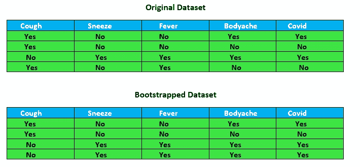
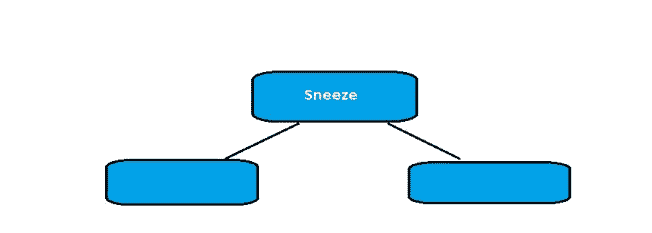
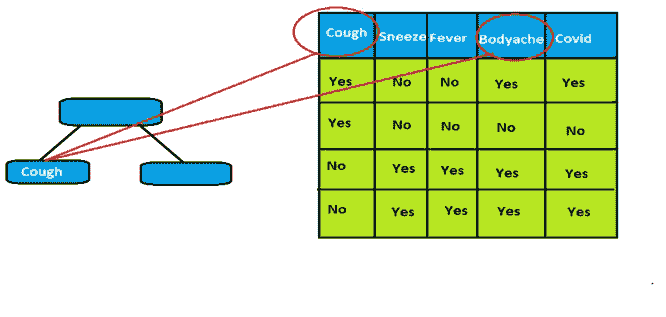
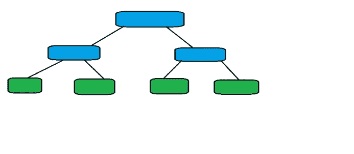
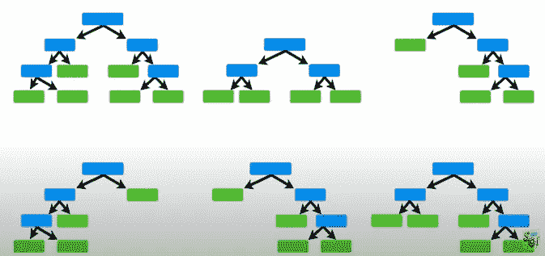
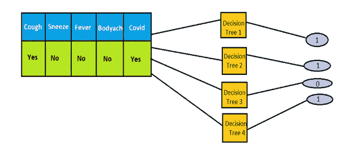

# 分类算法—随机森林分类器

> 原文：<https://pub.towardsai.net/classification-algorithms-random-forest-classifier-a7276d713b6a?source=collection_archive---------4----------------------->

## [机器学习](https://towardsai.net/p/category/machine-learning)

在 [Unsplash](https://unsplash.com/s/photos/forest?utm_source=unsplash&utm_medium=referral&utm_content=creditCopyText) 上 [veeterzy](https://unsplash.com/@veeterzy?utm_source=unsplash&utm_medium=referral&utm_content=creditCopyText) 拍摄的照片

随机森林算法是一种监督学习模型。它使用已标记的数据来学习如何对未标记的数据进行分类[ [1](https://medium.com/capital-one-tech/random-forest-algorithm-for-machine-learning-c4b2c8cc9feb) ]。这是决策树的一种扩展。随机森林与决策树或 bagging 分类器具有几乎相同的超参数。随机森林增加了模型的随机性。它不是在分割节点时搜索最重要的特征，而是在随机特征子集[ [2](https://builtin.com/data-science/random-forest-algorithm) ]中搜索最佳特征。

我们使用相同的原始数据集构建多个数据集，但是使用允许重复记录条目的记录组合。这个新创建的数据集允许重复来自原始集合的元组，被称为自举数据集。

**随机森林算法的步骤:**

1.创建引导数据集

2.使用自举数据集创建决策树，每一步都使用变量的随机子集

3.构建多重决策树

4.通过所有的树传递测试记录

**创建引导数据集**

考虑下面的例子，其中表中显示的四个属性，即喷嚏、咳嗽、发烧和身体疼痛，有助于确定其 COVID 是否为阳性。原始数据集中总共包含 4 名患者的详细信息。我们创建了一个引导数据集，由原始数据集中相似的记录总数组成，但是我们复制了引导数据集中的第 3 条记录。

**使用自举数据集创建决策树，每一步都使用随机变量子集**

在决策节点的创建过程中，我们计算所有属性的基尼系数，并得出结论，具有最低基尼系数的属性将成为决策节点。然而，在随机森林中，我们考虑属性的子集并形成决策节点。

在下面的例子中，让我们假设根节点或决策节点选择喷嚏作为节点，因为与其他节点相比，它具有较少的基尼系数。

现在，我们把重点放在寻找喷嚏决策节点的左侧节点的属性上。在这种情况下，我们只考虑两个变量而不是三个变量的基尼系数。因此，我们考虑咳嗽和身体疼痛的任何属性的最小基尼系数。在这种情况下，观察到咳嗽的杂质最小，因此咳嗽属性与决策节点喷嚏的左节点相关联。

这样，通过在每个阶段采用不同的变量集，我们构建了决策树。

**构建多棵决策树**

现在，通过使用原始数据集中的不同记录，我们构建了不同的自举数据集。随后，通过在各个决策树的构建过程中的每一步采用不同的属性，这些自举数据集被转换成各种决策树。

**通过所有树的测试记录**

现在获取下图所示的测试记录，并遍历之前构建的所有决策树。计算树的结果，无论它是 COVID (1)还是非 Covid (0)。考虑所有树的输出，并选择具有最大频率的输出值。在下面的例子中，测试记录通过所有的决策树，大多数决策树给出的输出是 1，因此我们得出结论，对于给定的测试记录，输出是 1。

希望这对大家有帮助！

感谢阅读！

## 参考

[1]用于机器学习的随机森林算法，[https://medium . com/capital-one-tech/Random-Forest-Algorithm-for-Machine-Learning-C4 B2 c8 cc 9 feb](https://medium.com/capital-one-tech/random-forest-algorithm-for-machine-learning-c4b2c8cc9feb)

[2]随机森林算法完全指南，内置，[https://builtin.com/data-science/random-forest-algorithm](https://builtin.com/data-science/random-forest-algorithm)