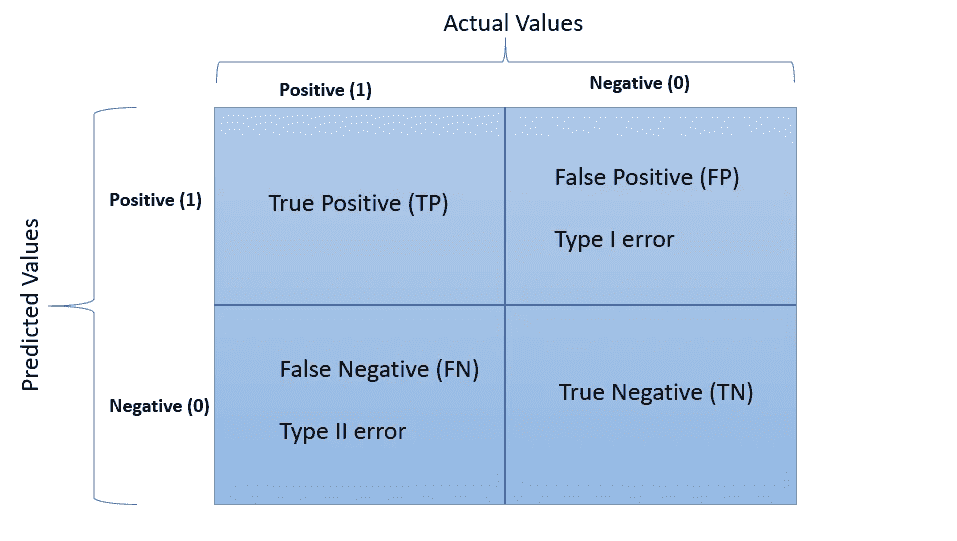
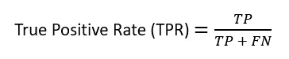
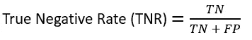
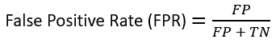
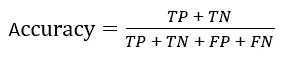
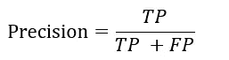
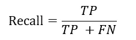
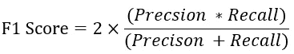

# 分类评估指标解释清楚

> 原文：<https://pub.towardsai.net/classification-evaluation-metrics-explained-clearly-e74756dd2a0f?source=collection_archive---------2----------------------->

## [数据科学](https://towardsai.net/p/category/data-science)，[机器学习](https://towardsai.net/p/category/machine-learning)

## 理解混淆矩阵、精确度、回忆、F1 分数等。

照片由[艾萨克·史密斯](https://unsplash.com/@isaacmsmith?utm_source=medium&utm_medium=referral)在 [Unsplash](https://unsplash.com/?utm_source=medium&utm_medium=referral) 拍摄

即使是有经验的人也会对分类评估指标中使用的术语感到困惑，如精确度、召回率、F1 分数等。对这些指标的良好理解对于数据科学家做出明智的决策至关重要。在这篇文章中，我将尝试直观地解释，以便您不必再次重温这些。那么，我们开始吧。

# 混淆矩阵

我们将从理解混淆矩阵开始讨论，因为这是本文其余部分的基础。理解以下术语非常重要。

我们将考虑一个二元分类的例子来理解这些概念。让我们假设我们正在预测一个病人是否患有癌症。阳性标记(1)表示患者患有癌症，而阴性标记(0)表示该人未患癌症。

> 注意:你可能会想，为什么我为癌症患者选择阳性标签，而不是相反。在统计学或数据科学的行话中，某物的存在被认为是积极的，而某物的缺乏被认为是消极的。因此，在这种情况下，癌症的存在可以被标记为阳性标记，而癌症的不存在是阴性标记。

作者图片

## **TP(真阳性)**

它是模型正确预测的阳性标签的数量。

## **TN(真否定)**

它是模型正确预测的阳性标签的数量。

## **FP(假阳性)**

它是不正确预测的阳性标签的数量，即实际上是阴性但被模型预测为阳性的标签。这也称为 I 类错误。如果你的模型预测这个人是癌症患者，而实际上这个人不是癌症患者，你就犯了第一类错误。

## **FN(假阴性)**

它是错误预测的阴性标签的数量，即实际上是阳性但被模型预测为阴性的标签。这也称为第二类错误。如果你的模型预测病人不是癌症，而实际上病人是癌症，你就犯了第二类错误。

尽可能减少第二类错误是至关重要的。想象一下当你不能正确预测癌症患者时的后果。

## **真阳性率(TPR)**

TPR 指所有阳性标记中正确预测的阳性标记的比率。

## 真实负利率(TNR)

TNR 指的是所有错误标签中正确预测的阴性标签的比率。

## 假阳性率(FPR)

FPR 是指所有阴性标签中预测错误的阳性标签的比率。

## 假阴性率

FNR 指所有阳性标记中错误预测的阴性标记的比率。

# 准确(性)

准确性是最常用的分类评估指标。在模型预测的所有标签中，有多少标签实际上是正确预测的。它是正确预测的标签与标签总数的比率。

## **当准确度不是一个好的评价指标**？

当数据集不平衡时，精确度不是一个好的指标。我们借助一个例子来了解一下。假设您正在为信用卡欺诈检测构建一个分类模型。在数以百万计的信用卡交易中，几乎不会有几笔欺诈交易，比如 10-15 笔。在这样的情况下，你的正面标签(欺诈)和负面标签(非欺诈)是高度不平衡的。这意味着您不必构建模型，而只需预测所有标签不是欺诈，并且您仍然能够实现 99%的准确性。现在，您明白了为什么当数据集不平衡时，准确性不是一个好的指标。

使用精度的另一个缺点是只能使用 1 或 0 等类标签。它不能考虑预测的概率。

# 精确

在所有积极预测的标签中，有多少百分比实际上是积极的标签。

## 精确比回忆更重要。

考虑垃圾邮件(正标签)或非垃圾邮件(负标签)电子邮件检测的示例。在这种情况下，如果模型不能正确预测垃圾邮件，并且没有进入垃圾邮件文件夹，而是出现在您的收件箱中，您应该没有问题。你不希望一封好的邮件(不是垃圾邮件/负面标签)变成垃圾邮件。因此，在这种情况下，如果模型预测某些积极的东西(即垃圾邮件)，它最好是垃圾邮件，否则您可能会错过重要的邮件。正如你已经注意到的，这里精度更重要。

# 回忆(敏感度)

回忆也称为敏感度和真阳性率(TPR)。在所有积极的标签中，有多少百分比被预测为积极的。

## 什么时候回忆比精确更重要？

考虑一个预测癌症患者的例子。在这种情况下，你不希望错误地将一个癌症患者(阳性标签)预测为非癌症(阴性标签)。因此，这里的目标是正确预测所有阳性标记，即正确预测所有癌症患者。如果模型预测很少患者是非癌性的(假阳性)，而不是相反，你是没问题的。正如你已经注意到的，回忆在这里很重要。

# f1-分数

F1 分数是精确度和召回率的调和平均值。结果介于 0 和 1 之间，0 表示最差，1 表示最好。它是模型准确性的度量。计算方法如下-

## 当我们有精确度和召回率的时候，为什么 F1 得分？

对于某些问题，获得高召回率比获得高精确度更重要，例如在预测癌症患者的例子中。对于某些问题，获得高精度比获得高召回率更重要，例如预测电子邮件是否是垃圾邮件。但是在很多情况下，我们需要在精确度和召回率之间取得平衡。这就是 F1 分数变得重要的地方，因为 F1 分数同时考虑了精确度和召回率。如果精度或召回率中的一个非常低，那么 F1 值也非常低，您知道您的模型有问题，以便您可以进一步调查。

# 错误分类率

它是错误预测标签的百分比。

# 结论

希望你已经理解了大部分的分类评价指标。还有一个更重要的指标叫做 AUC ROC，我打算在另一篇文章中单独讨论。

*阅读更多关于 Python 和数据科学的此类有趣文章，* [***订阅***](https://pythonsimplified.com/) *到我的博客*[***【www.pythonsimplified.com】***](http://www.pythonsimplified.com/)***。*** 你也可以通过 [**LinkedIn**](https://www.linkedin.com/in/chetanambi/) 联系我。