# 使用 Monk AI 通过使用数据集的切片进行分类

> 原文：<https://pub.towardsai.net/classification-using-monk-ai-while-using-some-part-of-dataset-48606f4d35e7?source=collection_archive---------1----------------------->

在机器学习中，分类是将给定的一组数据归类到类中的过程。它可以在结构化或非结构化数据上执行。

在这里，我预测了一类给定的数据点。这些类通常被称为目标、标签或类别。主要目标是确定新数据将属于哪个类或类别。

首先，我尝试在我获取的数据集上训练模型，但是由于数据集非常大，这是一个非常耗时的过程。因此，我使用了不同的方法。我用 Monk AI 在数据集的某些部分上对它进行了训练。

人们还可以知道他们的超参数是否允许网络收敛。

有多种架构可供分类，但我使用的是 Densenet-121，其架构如下图所示:

Densenet-121 架构来自原始论文

对于这个任务，我使用了 [iWildCam 2020 — FGVC7 数据集](https://www.kaggle.com/c/iwildcam-2020-fgvc7)，它可以在 Kaggle 上的给定链接上下载。该数据集包含从全球各地的相机陷阱中拍摄的动物图像，主要目的是对这些图像进行分类。

在开始之前，我们需要安装 MONK 库和 densenet-121 模型的需求。

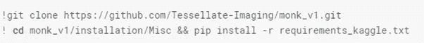

如果您使用的是 Colab，请使用以下命令进行安装:

！CD monk _ v1/installation/Misc & & pip install-r 要求 _colab.txt

如果您使用 Kaggle，请使用以下命令进行安装:

！CD monk _ v1/installation/Misc & & pip install-r 要求 _kaggle.txt

使用本地系统或云时，根据 OS 和 CUDA 版本选择需求文件

！CD monk _ v1/installation/Linux & & pip install-r 需求 _cu9.txt

这是来自数据集的样本图像:-

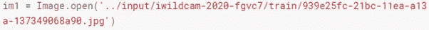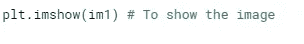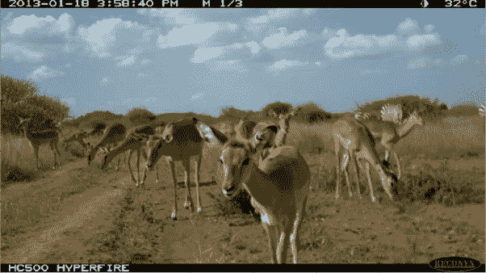

看起来很可爱！

现在我们将导入原型来使用胶子后端

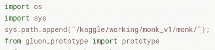

下一步是创建和管理实验。

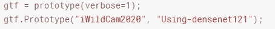

在下一步中，我们将加载数据和模型。

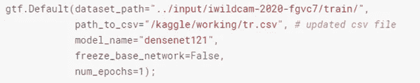

在加载数据和模型之后，使用下面的命令从数据集中获取样本，例如，我取了整个数据集的 3%。

样本数据集将以 CSV 格式保存，文件名为**sampled _ dataset _ train . CSV**。

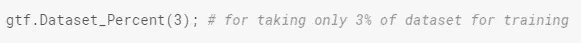

现在创建和管理实验，并加载数据和模型。

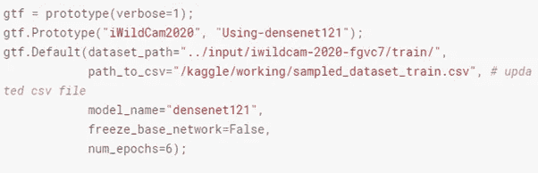

该模型将运行 6 次，在每次迭代中，我们将看到模型的准确性如何提高。

对于损坏的图像，请使用以下命令:

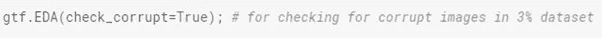

该命令将有助于在 3%的数据集中找到损坏的图像。

我们可以看到，在 3%的数据集中没有损坏的图像。

在下一步中，我们将在训练数据集上训练模型。

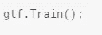

将在训练数据集上训练该模型。

训练完成后，我们可以对测试图像进行推理。

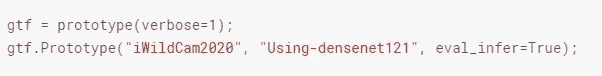

运行推理后，选择任意图像并对该图像运行推理。

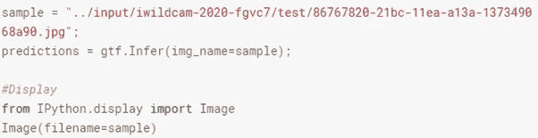

我们将得到该图像的预测，这将给出该图像中动物的类别。

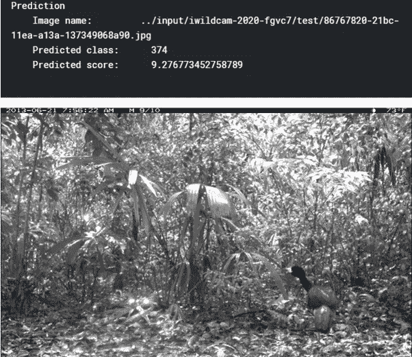

这个模型在 3%的数据集上给出了相当不错的准确度。

本文中的所有代码都位于这个 Github 链接上

 [## shubham7169/MonkAI

### 导入 NumPy 为 np #线性代数导入熊猫为 PD #数据处理，CSV 文件 I/O(如 PD.read_csv)导入…

github.com](https://github.com/shubham7169/MonkAI/blob/master/WildCam) 

**参考文献**

和尚艾 GitHub 回购*——*