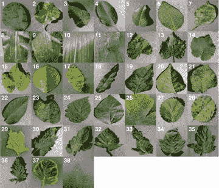
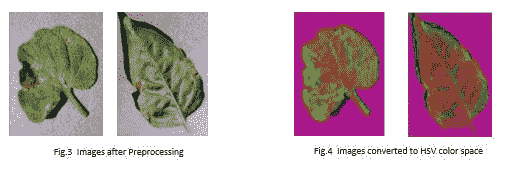
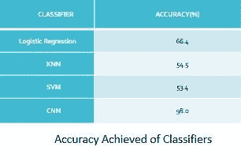
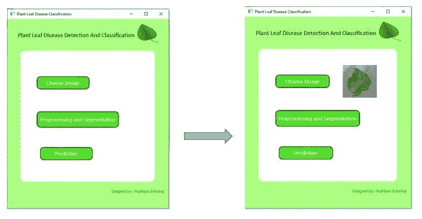
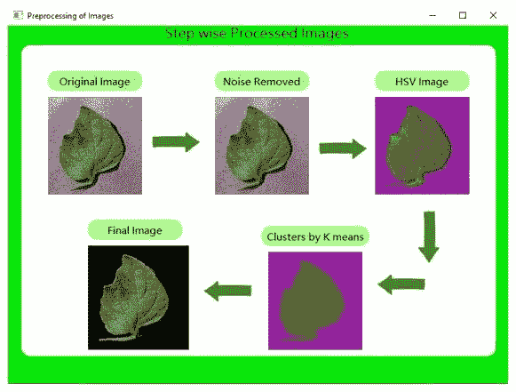
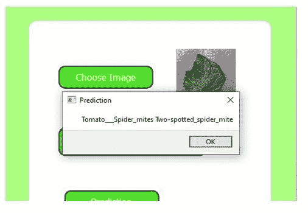

# 利用机器学习对植物叶部病害进行分类

> 原文：<https://pub.towardsai.net/classify-plant-leaf-diseases-using-machine-learning-4747dc1eb43d?source=collection_archive---------6----------------------->

## [机器学习](https://towardsai.net/p/category/machine-learning)

> 在本文中，我们将开发一个机器学习模型来预测植物正在遭受的疾病。

农业在任何国家的经济增长中都起着非常重要的作用。它是高度影响各国 **GDP** 的领域。农业部门贡献了印度国内生产总值的 16%左右(T4)。有各种各样的因素影响种植的作物的质量和数量。由于不同的天气和当地条件，这些植物容易感染各种疾病。如果这些疾病没有被发现，可能会造成严重的损失。在印度，大约 15-25%的农作物因疾病、害虫和杂草而损失。此外，我们还可以参考 2007 年发生在美国佐治亚州的事件，该事件因植物病害造成了大约 **540 美元**的损失。

**注意** :-在这篇文章中，我将只解释我使用的方法和我得到的结果。**此处无代码解释！！！**。代码我已经给了 [**GitHub**](https://github.com/PushkaraSharma/Plant_Leaf_Disease_Classification#gui-development) 的链接。

## 实际问题是什么？

由于耕地相当大并且有非常多的植物，因此人眼很难正确地检测和分类每一种植物。此外，大多数农民对这些疾病没有适当的了解，也不知道如何治疗这些疾病。雇佣专家可能会让他们付出沉重的代价，而且在不知情的情况下使用杀虫剂会损害土地。因此，为了解决这个问题，我们开发了一种基于人工智能的解决方案。

**精度**和**速度**是决定我们模型成功的两个主要因素。

## 拟议方法

我们提出的检测和分类受感染植物叶片的模型由 **4** 阶段组成。

数据集收集

图像预处理

细分

分类器的选择

## *数据集收集*

首先，从 GitHub、Kaggle 等网上资源收集树叶的图像。数据集由 **20，000 张**图像组成，分为 **19** 不同的类别。该数据集由健康和感染的叶子组成，其覆盖不同作物如苹果、马铃薯、番茄等的疾病，如黑腐病、锈病、细菌性斑点病、早疫病、晚疫病。

## *图像预处理*

在这个步骤中，图像被调整到更小的像素尺寸，以便加速计算。获得的图像包含一些噪声。这种噪声是用一些过滤技术去除的，比如高斯 **模糊**。之后，图像以 **RGB** 格式呈现，这不适合进一步的工作，因为 **RGB** 格式无法分离图像强度。因此，它被转换到另一个颜色空间，即 **HSV** ，该空间将颜色与强度分开。另外， **RGB** 色彩空间比 **HSV** 更嘈杂。

## *分割*

在该步骤中，进行图像分割，以便将叶子从背景中分离出来。使用具有两个聚类中心的 **K-means** 聚类进行分割，一个用于背景，一个用于前景。 **K-means** 聚类是一种无监督学习技术，用于根据相似性在预定义数量(K)的聚类或组中分离数据点。

在找到两个聚类(一个具有背景，另一个具有叶子部分)后，聚类图像用于将叶子背景的像素值变为黑色。这样做可以消除图像中的无用信息，从而提高准确性。

## *选择分类器*

这是分类问题，因为我们必须对植物叶子上的疾病类型进行分类。因此，我们有大量的机器学习和深度学习算法可以应用于这个数据集。

我们已经决定从低复杂度算法开始，并且增加复杂度级别，以便增加模型的准确性。我们选择了四个分类器，即**逻辑回归、KNN、SVM、**和 **CNN** 。我不会解释这些算法是如何工作的。

## 结果

在使用图像预处理技术以及 **k 方法**聚类和比较各种可用的分类器之后。考虑到类别的数量，逻辑回归表现得相当好，能够给出 66.4%的准确度。由于计算量大，KNN 需要相当长的时间来进行预测，并且只给出了 **54.5** %的准确度。SVM 也表现不佳，其精度为 **53.4** %。CNN 优于所有其他公司，给出了非常好的结果，因为它的准确度分数是 **98** %。

## CNN 模型的改进

*   数据集已经增加到 **52，000 张**图像，以便捕捉更多的植物叶部疾病。
*   由于数据集的增加，现在总共有 **38** 个类别需要分类。
*   CNN 模型必须足够好，能够捕捉所有复杂的模式。卷积层增加到 **6** ，最后一个密集层中的单元现在是 **38**

## GUI 开发

我们已经使用了 **Qt designer** 工具来首先设计 GUI 的基本结构，然后我们将我们的功能合并到各自的按钮上。

下面的屏幕截图显示了 GUI 的主屏幕，其中包含所有按钮，如选择图像、预处理图像和预测。

当我们选择图像并点击预处理按钮时，它给出了所有执行步骤的一瞥，如下图所示。

最后，在点击预测按钮时，它显示给定植物图像的预测疾病。

## 未来的工作

*   可以通过使用具有更多疾病类别的更大数据集来扩展以下模型，并且还可以通过调整超参数来提高精确度。
*   对分类疾病的治疗也可以包括在模型中。
*   然后，该模型可以部署在 android 和 iOS 平台上，以接触到能够实际使用拟议系统的农民。

在本文中，我尝试了一种不同的方法来解释这个项目。如果我包含了代码，那么这篇文章就太长了。请让我知道，如果你们这些家伙还是不这样做。

谢谢你宝贵的时间😊。该项目的完整代码在 [**GitHub**](https://github.com/PushkaraSharma/Plant_Leaf_Disease_Classification#gui-development) 上。

此外，请查看我关于[**stack overflow 问题自动版主**](https://medium.com/towards-artificial-intelligence/automatic-moderator-for-stackoverflow-questions-707cef5fe656) 的文章