# 信用贷款客户分类

> 原文：<https://pub.towardsai.net/classifying-credit-loan-customers-35e4a18dd24?source=collection_archive---------1----------------------->

## 应用特征工程和二元分类模型。

# 目录:

*   [介绍](#c5b0)。
*   [探索性数据分析。](#bebe)
*   [特色工程。](#3e36)
*   [建模和评估。](#97e9)
*   [结论。](#601c)

# 第 1 部分:简介


**分类决策应该基于一些科学…**

2018 年 8 月， [*纽约邮报*](https://nypost.com/2018/08/11/more-americans-are-defaulting-on-their-credit-cards-analyst/) 的一篇文章显示，尽管“经济蓬勃发展”，但更多的美国人正在拖欠信用卡账单。另一位观察家 LendingTree.com 指出，同年 5 月，循环债务增加了 162.5 亿美元。

> 循环债务是按月结转的信用卡债务，通常利率很高，因为与房子不同，信用卡是一种无担保债务。

文章进一步预测，到 2018 年底，循环和非循环债务都将超过 4 万亿美元大关。

今天(2020 年 5 月)，我们都知道新冠肺炎对全球经济的毁灭性影响。据预测，情况在好转之前会变得更糟。


为所有因病毒而去世或生病的人祈祷…

作为数据科学专业人员，我们通过分析和编程手段(包括机器学习)从数据中推断见解，并交流这些见解以做出更好的决策。

我先引用历史上最伟大的统计学家之一的一句名言:- **乔治·爱德华·佩勒姆** …

> “所有模型都是错的，但有些是有用的”

也就是说，我们将探索一个来自 *CreditOne* 银行的数据集，其中包含大约 5000 个客户的信用数据。基于这些数据，我们将建立机器学习模型，将客户分类为可能的*或 ***非违约*** 。*

# *第 2 部分:EDA*

*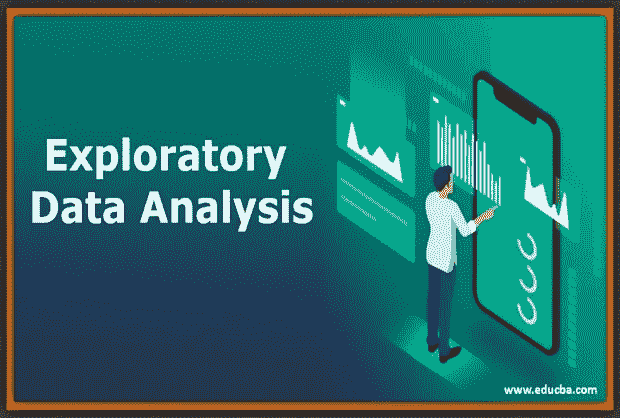*

*Img| [信用](https://www.google.com/url?sa=i&url=https%3A%2F%2Fwww.educba.com%2Fexploratory-data-analysis%2F&psig=AOvVaw1fdDK8L3_980C9n2oHjXcR&ust=1586093559177000&source=images&cd=vfe&ved=0CAIQjRxqFwoTCIDvjY7xzugCFQAAAAAdAAAAABAJ)*

*我们将使用的数据集来自 *CreditOne Bank* 。它在 *Kaggle* 中，通过这个 [***链接***](https://www.kaggle.com/dataforyou/bankloan) ***可以在它的数据字典旁边看到。*** 下面是[*数据字典*](https://www.kaggle.com/dataforyou/bankloan) 。*

*除了数字数据之外，这个数据集还有包含一些编码变量基数的分类列，如果没有 [*数据字典，这些分类列是没有意义的。*](https://www.kaggle.com/dataforyou/bankloan)*

*excel 文件可以从[***GitHub***](https://github.com/Blackman9t/Machine_Learning/blob/master/Loan_Data%20for%20Classification.xlsx?raw=true%27)下载。*

*正在为 EDA 导入库…*

```
***import** **itertools**
**import** **numpy** **as** **np**
**import** **matplotlib.pyplot** **as** **plt**
**from** **matplotlib.ticker** **import** *NullFormatter*
**import** **pandas** **as** **pd**
**import** **numpy** **as** **np**
**import** **matplotlib.ticker** **as** **ticker**
**import** **seaborn** **as** **sns**
**from** **sklearn** **import** *preprocessing**
```

*让我们导入库来评估我们将要构建的模型。*

```
***from** **sklearn.metrics** **import** *f1_score, confusion_matrix, log_loss, roc_auc_score, accuracy_score, classification_report**
```

*让我们为熊猫定义额外的 NaN 值，并读入我们的数据集。*

```
***additional_nan_values = ['n/a', '--','?','None','Non','non','none']****data = '**[https://medium.com/r/?url=https%3A%2F%2Fgithub.com%2FBlackman9t%2FMachine_Learning%2Fblob%2Fmaster%2FLoan_Data%2520for%2520Classification.xlsx%3Fraw%3Dtrue%2527](https://github.com/Blackman9t/Machine_Learning/blob/master/Loan_Data%20for%20Classification.xlsx?raw=true%27)'**loan_df = pd.read_excel(data, header=2, na_values=additional_nan_values)****loan_df.head()***
```

*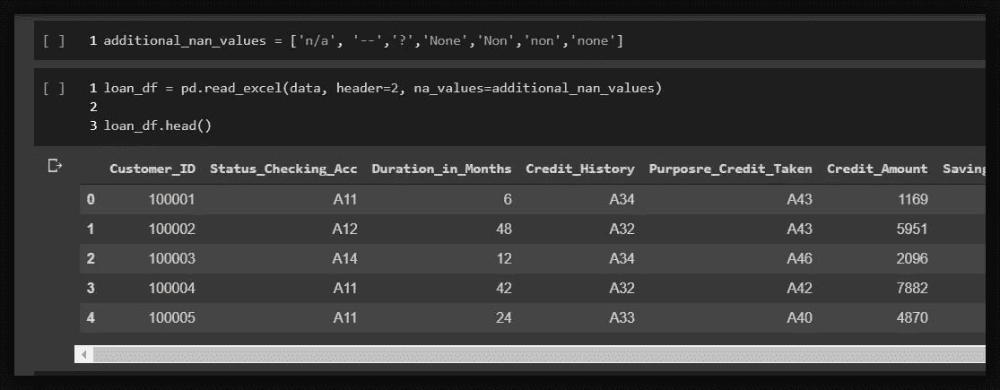*

*查看标题，我们可以看到分类列，如 *Status_Checking_Acc* 、 *Credit_History、*具有代表某些值的*、*代码。例如在*信用 _ 历史*栏中，代码 **A34** 代表*关键账户/其他信用，*代码 **A32** 代表*到目前为止已到期归还的现有信用。**

*所以，要理解数据，就必须理解[***——数据字典***](https://www.kaggle.com/dataforyou/bankloan) 。*

*让我们检查形状、信息和缺少的值。*

```
***loan_df.shape** >>*(5000,23)***loan_df.isna().any().all()** >> *False**
```

> *我们有 5000 个观察值，23 个维度，没有缺失值。观察是信用贷款客户。尺寸是这些客户的特征。*

```
*# Let's see the summary info for the numerical columns 
**loan_df.describe().T***
```

*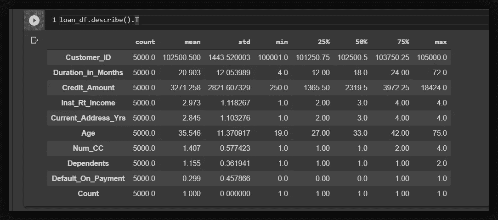*

*数字列的描述性统计。*

```
*# Let's check summary for columns of object/categorical dtype.
**loan_df.describe(include=['object','category']).T***
```

*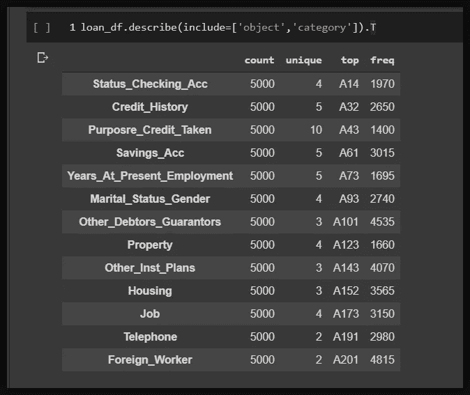*

*分类列的汇总数据…*

*从总结中，我们可以了解很多关于我们的数据。例如，最年轻的贷款客户是 19 岁，最老的是 75 岁。平均有 29.9%的人拖欠付款。此外，每个分类列都有 2 到 10 个唯一编码的变量，代表数据字典中的一些定性值。*

> *将 ***特征工程*** 应用于数据集时，理解[数据字典](https://www.kaggle.com/dataforyou/bankloan)中的这些分类变量至关重要。*

> *因此，本练习的目的是建立统计模型，帮助金融机构识别可能拖欠付款的客户。这可能有助于进一步降低违约率，目前的平均违约率为 29.9%。*

****组织数据集:****

*让我们再来看一下数据，最好检查一下这些列，看看是否有任何可见的模式、关系或命名错误。*

```
*# Let's see the total columns in the data set
**loan_df.columns** >>
*Index(['Customer_ID', 'Status_Checking_Acc', 'Duration_in_Months',        'Credit_History', 'Purposre_Credit_Taken', 'Credit_Amount',        'Savings_Acc', 'Years_At_Present_Employment', 'Inst_Rt_Income',        'Marital_Status_Gender', 'Other_Debtors_Guarantors',        'Current_Address_Yrs', 'Property', 'Age', 'Other_Inst_Plans ',        'Housing', 'Num_CC', 'Job', 'Dependents', 'Telephone', 'Foreign_Worker',        'Default_On_Payment', 'Count'],       dtype='object')**
```

*我们需要清除一些带有空格或拼写错误的单词的列名。其他人可能只是需要一个更好的名字。让我们现在就这样做吧。*

```
***loan_df.rename(columns={'Purposre_Credit_Taken':'Credit_Purpose',
'Other_Inst_Plans ':'Other_Inst_Plans',
'Years_At_Present_Employment': 'Present_Employment_Years',
'Inst_Rt_Income':'Inst_Rate_Income',
'Num_CC':'Num_Curr_Credits'}, inplace=True)***
```

*接下来，让我们试着把他们分成小组。理想情况下，数据应该告诉我们一个故事…这意味着相似的列应该在一起。优选地，在数字列之前分类。*

*我可以从数据集中识别出三(3)大组列。让我们把它们分成 python 列列表…*

```
***customer_data =** *['Customer_ID', 'Marital_Status_Gender', 'Age', 'Dependents', 'Housing','Telephone', 'Property','Current_Address_Yrs']***job_and_personal_finance =** *['Job', 'Foreign_Worker', 'Present_Employment_Years', 'Savings_Acc','Status_Checking_Acc', 'Credit_History']***loan_credit_data =** *['Credit_Amount', 'Credit_Purpose', 'Duration_in_Months','Inst_Rate_Income','Other_Debtors_Guarantors','Other_Inst_Plans','Num_Curr_Credits','Default_On_Payment', "Count"]**
```

*让我们将上面的 3 个列表连接起来，确保没有因为错误而留下空格，因为分组是手动完成的。*

```
***new_columns = customer_data + job_and_personal_finance + loan_credit_data**# Lets strip off any whitespaces just incase...
**stripped_columns = [str.strip(x, ' ') for x in new_columns if x[0] or x[-1] == ' ']***
```

*现在让我们确认 stripped_column 中的所有列名都与 loan_df 列相同。*

```
***set(loan_df.columns).difference(set(stripped_columns))**
>>
***set()***# The empty set returned, indicates we're all good.*
```

*现在，我们可以将新的有序和剥离的列分配给 loan_df，作为我们的新列集。*

```
***loan_df = loan_df[stripped_columns]**# let's see the first few rows**loan_df.head(3)** >>*
```

*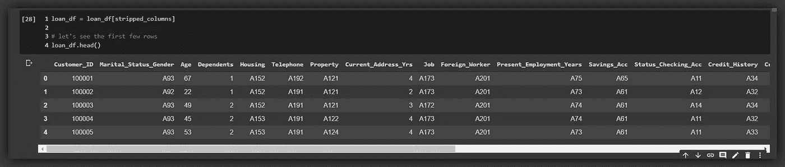*

*显示客户数据、工作数据、信用数据和每个客户的默认状态的有序列…*

*现在，我们的数据集是用列组织起来的，这些列讲述了 5000 名信用客户中每一个人的精彩故事…太棒了！*

**

*Img| [信用](https://media.makeameme.org/created/cheers-to-you-c3b129e042.jpg)*

# *第 3 部分:特征工程*

*好了，这是我们应用可视化库来获得更多关于变量的见解的部分。我们将目标变量 *(Default_On_Payment)* 评估为独立变量的函数，然后我们应用*特征选择*、*二值化*、*归一化*，为建立模型做准备。*

**

*Img| [信用](https://thedigizones.com/blog/wp-content/uploads/2020/03/1_K6ctE0RZme0cqMtknrxq8A.png)*

*让我们形象化分类变量和目标变量之间的关系。*

```
*# First we select the categorical columns
**categorical_cols = loan_df.select_dtypes(['object']).columns
print(categorical_cols)** >>
*Index(['Marital_Status_Gender', 'Housing', 'Telephone', 'Property', 'Job', 'Foreign_Worker', 'Present_Employment_Years', 'Savings_Acc',        'Status_Checking_Acc', 'Credit_History', 'Credit_Purpose',        'Other_Debtors_Guarantors', 'Other_Inst_Plans'],       dtype='object')**
```

*我们将使用 *violin* 图来显示每个分类变量的违约百分比。这在*特征选择中会很方便。**

*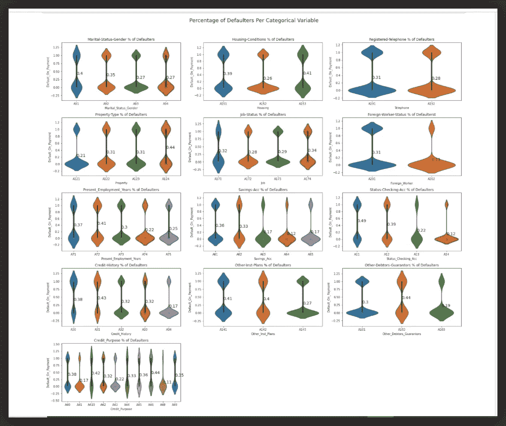*

*violin 图网格显示了每个分类变量中拖欠付款者的百分比。*

*网格图是用 *seaborn* 和 *matplotlib* 库完成的。它只是显示了每个分类变量的违约百分比。回想一下，像 *Credit_History、*这样的每个分类变量都有一些子变量，用代码表示，如 *{* **A30** 、 **A31** 、… **A34** *}。**

*现在，这些代码代表 [***数据字典***](https://www.kaggle.com/dataforyou/bankloan) 中的某些定性值。我们只选择那些影响违约或非违约行为的变量来训练我们的模型。*

*为了更清楚，让我们检查一下*属性*分类变量…*

*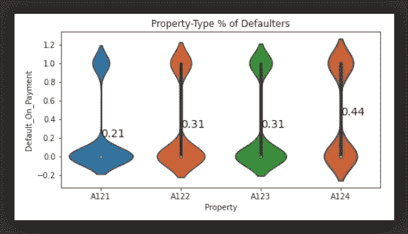*

*Violin 图显示属性变量的违约百分比。*

**属性*有四个子变量，分别编码为{ **A121** 、 **A122** 、 **A123** 、 **A124** }。很明显，我们可以看到对于 **A121** ，只有 *21%* 的客户违约， **A122** 和 **A123** 分别有 *31%* 。而 **A124** 有 *44%* 的违约者。*

*所以 **A124** 不是训练我们模型的好的子变量。简单来说，几乎 *50%* 的客户都默认有这个功能。反之，约 *50%* 不违约。没有明确的区分阈值。相反，我们需要显示违约或非违约客户的不同百分比的分类变量。像 **A121** ，只有 *21%* 的违约者，相反，79%的非违约者。*

****阈值* :***

> *我的阈值是 **( *默认< =0.4 |默认> =0.6)。*** 因此，我将只包括违约率小于或等于 40%或大于或等于 60%的类别。这将确保我的模型学习不同的属性。*

****特征-二值化****

*二进制化帮助我们将每个分类变量扩展成只包含零和一的新变量 *(0，1)* … *假* *或真*。它通常是*特征选择*的前身。*

*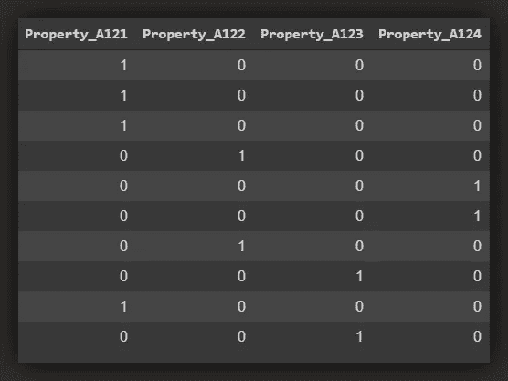*

*将属性变量二进制化为 4 个新的 0 和 1 变量…*

*例如，*属性*变量有 4 个子变量或代码:- { **A121** ，…， **A124** }。通过应用二进制化，*属性*被 4 个新变量取代{ **A121** 、 **A122** 、 **A123** 、 **A124** }，这些变量现在成为我们数据集中的不同变量，默认情况下包含 0，并且仅在*属性*变量中各自之前占据的位置包含 1……参见 [***链接***](https://deepai.org/machine-learning-glossary-and-terms/binarization)*

```
*# Let's binarize categorical variables and save in a new dataframe.
**loan_df_dummies = pd.get_dummies(loan_df)**# *we use the pd.get_dummies func to binarize variables.**
```

*好了，让我们从二值化数据框中选择理想的分类变量。记住我们想要满足这个条件的变量:- **( *默认< =0.4 |默认> =0.6)。****

```
*# First we make a list of all categorical columns.
**categorical_cols = loan_df.select_dtypes(['object']).columns**# Next we define a simple method to sort out the features to delete
**def delete_categorical_feature(categorical_cols):
    """ This method takes a list of categorical columns,and returns a list of feature attributes to delete based on set threshold """** *delete_list = []
    for x in categorical_cols:
    default_df = loan_df.groupby(x)
    ['Default_On_Payment'].value_counts(normalize=True).
     to_frame()[1::2]
    delete_feature = default_df[(default_df.Default_On_Payment >=          0.4) & (default_df.Default_On_Payment <= 0.6)]
    delete = [delete_feature.index[i][0] for i in            range(len(delete_feature))]
    for i in range(len(delete)):
        delete[i] = x + '_' + delete[i]
    delete_list += delete***return delete_list**# Next, we call the method with the list of categorical columns
**delete_list = delete_categorical_feature(categorical_cols)**# Finally, let's see the columns to be deleted. **print('Total cols to be deleted-', len(delete_list))
print(delete_list)** >>
Total cols to be deleted- 11*['Marital_Status_Gender_A91',
 'Housing_A153',
 'Property_A124',
 'Present_Employment_Years_A72',
 'Status_Checking_Acc_A11',
 'Credit_History_A31',
 'Credit_Purpose_A410',
 'Credit_Purpose_A46',
 'Other_Debtors_Guarantors_A102',
 'Other_Inst_Plans_A141',
 'Other_Inst_Plans_A142']**
```

*既然我们已经确定了不合格的变量，让我们排除它们…*

```
***loan_df_dummies = loan_df_dummies.drop(delete_list, axis=1)
loan_df_dummies.shape**
>>
*(5000, 53)**
```

> *我们的二值化数据框现在有 53 列，包括目标变量，从 23 列增加到 53 列。这是由于来自二进制化的附加变量。*

****检查数值变量:****

*我们来看看原始数据集的数值特征， *loan_df。**

```
*# first let's make a list of numerical columns
**numerical_columns = loan_df.select_dtypes(['number']).columns**# Next, let's see the list
**print(numerical_columns)** >>*Index(['Customer_ID', 'Age', 'Dependents', 'Current_Address_Yrs',        'Credit_Amount', 'Duration_in_Months', 'Inst_Rate_Income',        'Num_Curr_Credits', 'Default_On_Payment', 'Count'],       dtype='object')**
```

*让我们看看数字特征的历史图*

```
***loan_df[numerical_columns].hist(figsize=(16,12))
plt.suptitle('Histogram of Numerical Features', fontsize=18, y=0.95)
plt.show()***
```

*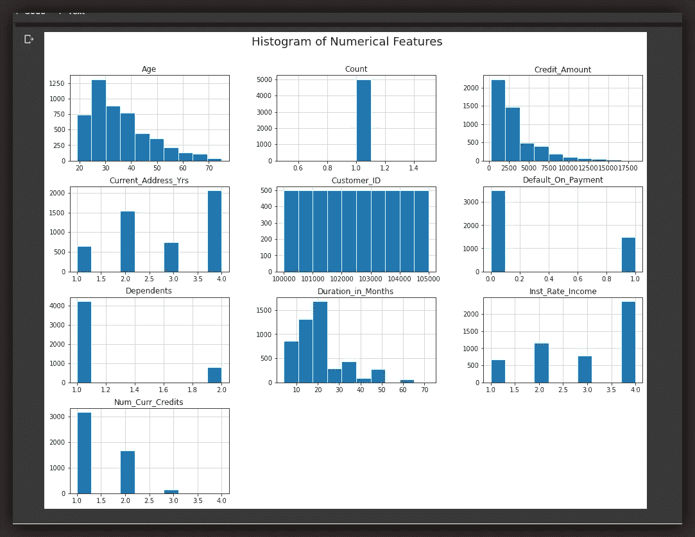*

*数字特征的直方图。*

**Customer_ID* 和 *Count* 变量不会给我们的模型添加任何值，它们只是帮助索引每个客户，应该被删除。*

**年龄*特征具有大量 36 岁以下的年轻人，较少的老年人导致直方图向右倾斜。而*信用 _ 金额*列显示大多数信用低于 2500 美元，一些高达约 5000 美元*

*其余的变量，如*【客户年龄】**【家属人数】**【信贷金额】*等，在训练我们的模型时都很重要。*

*但是让我们来看看数字特征的相关数据*

```
***corr_data = loan_df[numerical_columns].corr()
plt.figure(figsize=(12, 8))
sns.set_style('ticks')
sns.heatmap(corr_data, annot=True)
plt.show()***
```

*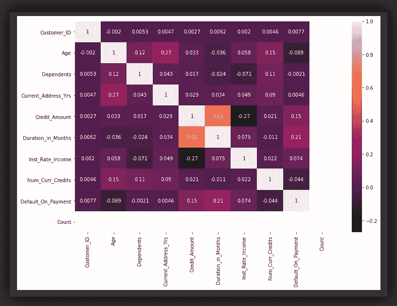*

*数字特征的相关矩阵*

*目标变量( *Default_On_Payment)* 与任何特性都没有实质性的相关性。*信用 _ 金额*和*持续 _ 月数*是与0.62 最相关的特征。*

*那么这些显著的低相关性数字告诉了我们什么呢？嗯……首先，我们的独立变量相对不同，我们的数据集被认为没有多重共线性问题。*

*特征与目标不相关的事实对于*线性回归模型*来说是一个问题，对于*逻辑回归(LR)* 来说也可能是一个问题，但是通过一些微调，*逻辑回归*模型可能会做得很好。*

*很明显，这是一个*二元分类*问题，不是线性回归。*

*好的，让我们从二进制数据帧中去掉不需要的变量。*

```
***loan_df_dummies.drop(['Count', 'Customer_ID'], axis=1, inplace=True)**# Next let's send the target variable to the extreme right position
**temp = loan_df_dummies.Default_On_Payment
loan_df_dummies = loan_df_dummies.drop('Default_On_Payment', axis=1)
loan_df_dummies['Default_On_Payment'] = temp**# next let's inspect few rows of our binarized data frame
**loan_df_dummies.head()***
```

*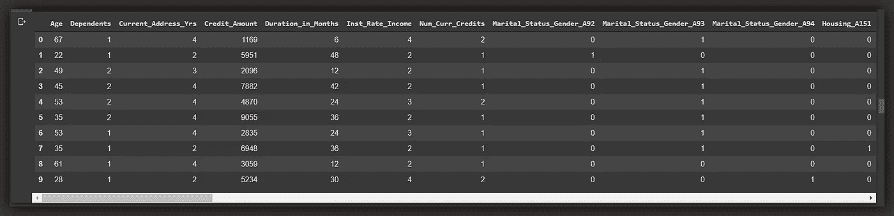*

*一切都好……让我们进入下一个紧迫的问题。*

****我们的数据集有多均衡？****

> *我们的课堂观察分布不均匀吗？如果数据有偏差…模型可能有偏差。*

*让我们检查数据集中违约者与非违约者的比率。*

```
***loan_df.Default_On_Payment.value_counts(normalize=True)**
>>
*0    0.701 
1    0.299**
```

*数据集中 70%的信用客户没有违约，只有 30%违约…*

> *不平衡数据集是指类元素排列不均匀或不公平的数据集。*

```
***plt.figure(figsize=(8, 8))****x = loan_df_dummies.Default_On_Payment.replace(to_replace=[0, 1], value=['Non-Defaulters','Defaulters'])****sns.countplot(x)
plt.title('Count of Defaulters and Non-Defaulters')
plt.show()***
```

*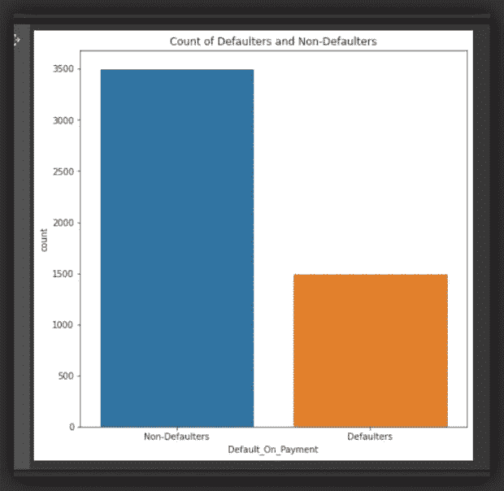*

*显示不平衡等级分布的计数图*

****平衡数据集:****

*不平衡的数据集使得模型对于优势类具有高识别率 **( *灵敏度* )** 。在不平衡的数据集中，模型的 *F1* 分数可能不可靠。 [***链接***](https://sebastianraschka.com/faq/docs/computing-the-f1-score.html)*

*让我们继续使用 SMOTE ***(合成少数过采样*** [***技术***](https://imbalanced-learn.readthedocs.io/en/stable/generated/imblearn.over_sampling.SMOTE.html) ***)来平衡数据集。*** 注意其他技术也可用于处理不平衡数据。详见本 [***丰富文章***](https://towardsdatascience.com/handling-imbalanced-datasets-in-machine-learning-7a0e84220f28) 。*

****SMOTE*** 将通过综合创建少数类的更多观察值来平衡数据集，以等同于优势类。在这种情况下，将创建额外的 2，000 个观察值并添加到 defaulters 类，这样每个类就有 3，500 个观察值，总共有 7，000 个观察值。*

```
***from imblearn.over_sampling import SMOTE****sm = SMOTE(sampling_strategy='minority', random_state=19, k_neighbors=5)****over_sampled_features, over_sampled_target = sm.fit_resample(loan_df_dummies.drop('Default_On_Payment', axis=1), loan_df_dummies.Default_On_Payment)***
```

*让我们看看新的重采样数据集*

```
***plt.figure(figsize=(8, 8))
yy = pd.Series(over_sampled_target).replace(to_replace=[0, 1], value=['Non-Defaulters','Defaulters'])****sns.countplot(yy)
plt.title('Count of Defaulters and Non-Defaulters')
plt.show()***
```

**

*违约者和非违约者的平衡数据。*

*在过采样练习之后，让我们适当地重新排列我们的数据集。*

```
*# First we concat the features and target back into one data frame
**over_sampled_features = pd.DataFrame(over_sampled_features)
over_sampled_features['x'] = over_sampled_target
resampled_data = over_sampled_features
resampled_data.head(2)**# Next, let's add the column headers
**resampled_data.columns = loan_df_dummies.columns***
```

*好了，下一步是*规范化*我们的数据集。*

****特征归一化:****

*这个过程确保我们的模型不会受到任何特定特性的过度影响，因为它将所有特性限制在特定的值范围内。*

*我们将使用*最小-最大*归一化器*。**

> *也就是说，对于每个特征，我们从所有值中减去最小值，然后除以值的范围。最小-最大确保所有特征值都在 0 和 1 之间。*

*让我们在一行代码中使用 python *apply* 和 *lambda* 函数来应用 *min-max* 规格化器。*

```
*# We apply min-max to all relevant features excluding the target feature. **resampled_data.iloc[:,:-1] = resampled_data.iloc[:,:-1].apply(lambda x: (x - min(x)) / (max(x) - min(x)))***
```

*让我们再看看我们的数据集，只是为了确保它都是好的…*

```
***resampled_data.head()
>>***
```

*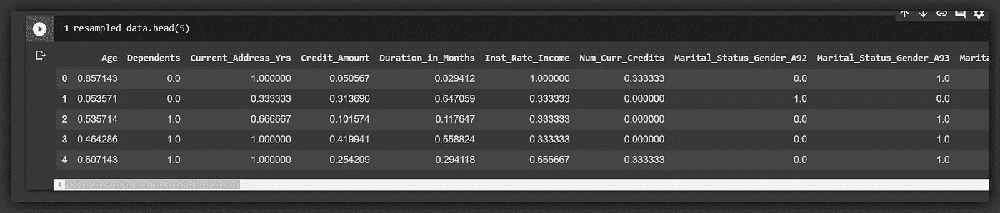*

*好的，一切都检查过了…*

****特征分割:****

*作为构建模型之前的最后一步，让我们将数据分成训练集、验证集和测试集，并为每个子集添加标签。我们用训练集训练，用验证集验证每个模型的性能，只有当我们对模型满意时，我们才接近测试集。*

*我们把数据按照 70%和 30%的比例拆分成训练和测试。*

```
***from sklearn.model_selection import train_test_split****X = resampled_data.iloc[:,:-1]****Y = resampled_data.Default_On_Payment****x_train, x_test, y_train, y_test = train_test_split(X, Y, test_size = 0.3, stratify=Y)***
```

*现在让我们通过将测试集分成两半来定义验证集…*

```
***X = x_test****Y = y_test****x_val, x_test, y_val, y_test = train_test_split(X, Y, test_size = 0.5, stratify=Y)***
```

*因此，我们有一个包含 70%*数据的训练集，以及各包含 15%*数据的验证和测试集。总计= *100%。****

让我们看看我们分叉的形状…

```
**print('x_train shape is:', x_train.shape)
print('y_train shape is:', y_train.shape)
print('x_val shape is:', x_val.shape)
print('y_val shape is:', y_val.shape)
print('x_test shape is:', x_test.shape)
print('y_test shape is:', y_test.shape)**>>*x_train shape is: (4907, 50) 
y_train shape is: (4907,) 
x_val shape is: (1051, 50) 
y_val shape is: (1051,) 
x_test shape is: (1052, 50) 
y_test shape is: (1052,)*
```

所有统一的形状和正确的尺寸…让我们开始建模。

# 第 4 部分:建模和评估

模型和超参数优化的选择与现有 ***现金*** 工具*(组合算法选择和超参数优化)*的参数一样多种多样。

> 一些常见的现金工具包括 GridSearchCV、RandomizedSearchCV、auto-sklearn(SMAC:基于序列模型的算法配置)、Hyperopt、TPOT 和 LALE

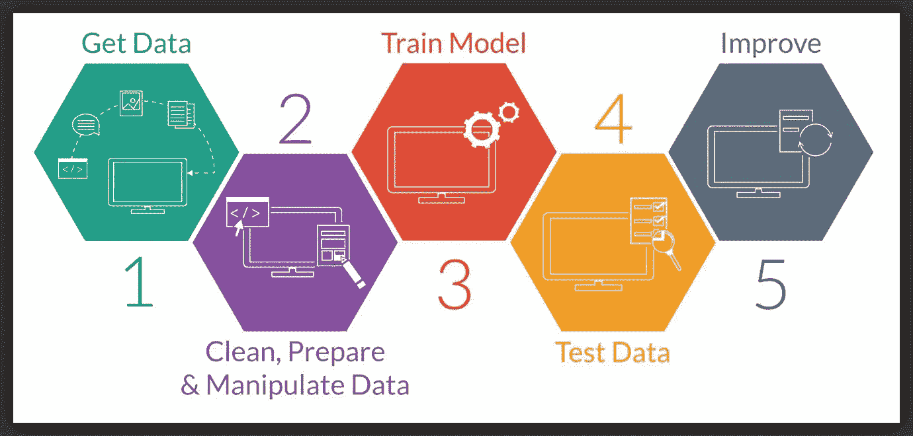

这里，我们将使用四个分类模型的选择，并使用 *GridSearchCV* 调整超参数。然后我们将选择最好的模型。

首先，让我们为每个模型定义一个绘制混淆矩阵的方法。

> 混淆矩阵提供了一套用于评估分类模型的度量标准。看到一个 [**链接**](https://medium.com/towards-artificial-intelligence/the-confusion-matrix-for-classification-eb3bcf3064c7?source=---------7------------------) 到我的关于困惑矩阵的文章。

## 4a。k 最近邻分类器(KNN):

KNN 相对来说比较容易理解…

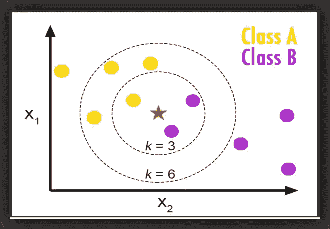

**红星分类为 k = 3 的紫色，k = 6 的黄色。**

给定一个正整数 ***K*** 和一个测试观测值***x0*****KNN**分类器首先识别训练数据中最接近 ***x0*** 的 *K* 点，用 ***N0*** 表示。然后，它将类别 ***j*** 的条件概率估计为 ***N0*** 中响应值等于 ***j*** 的点的分数:

***Pr(Y = j|X = x0)***

最后， **KNN** 应用贝叶斯法则，将观测值 ***x0*** 归入概率最大的类别。所以在 **KNN** 中真正的挑战是为模型估计正确的 ***K*** 。

因此，让我们定义一个 **KNN** 方法，它接受训练集和验证集并返回最佳模型。我们使用 *GridSearchCV* 为我们的模型选择最佳的 ***K*** 和超参数。

来看看它的性能和混淆矩阵。

```
**KNN_Model = knn_classifier(x_train, y_train, x_val, y_val)
KNN_Model** >>*Best leaf_size: 1 
Best p: 2 
Best n_neighbors: 1* 
**{‘AUC’: 1.0, ‘F1_Score’: 1.0, ‘Log_loss’: 0.0}**
```

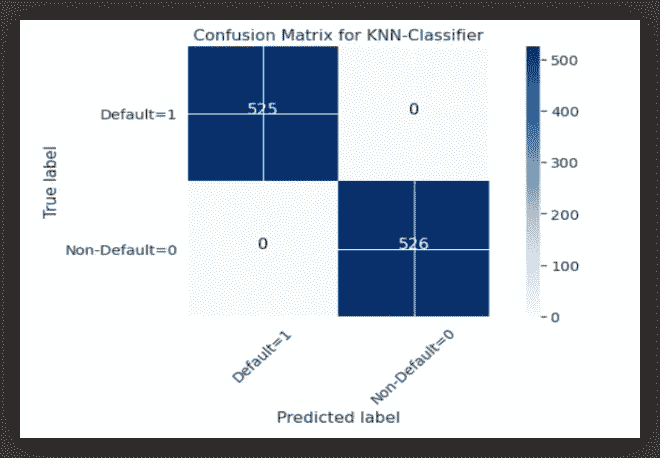

**{'AUC': 1.0，' F1_Score': 1.0，' Log_loss': 0.0}**

**KNN** 分类器在验证数据集上表现出色。在 *AUC* 和 *F1* 分数为 100%的情况下。

## 4b。逻辑回归分类器(LR):

一个 **LR** 模型只是*线性回归*模型的延伸。

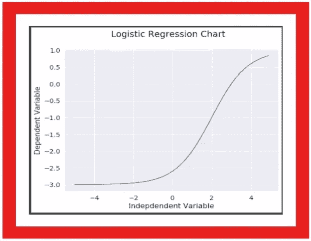

事实上，一个 **LR** 模型是一个*线性回归*模型，它配备了一个 *Sigmoid* 激活函数。我这里有一篇关于非线性回归的文章[](https://medium.com/towards-artificial-intelligence/understanding-non-linear-regression-fbef9a396b71)**。**

```
*# Let's define a linear regression model
***y_hat = b0 + b1x1 + b2x2 + b3x3 + … bnxn***# let's extend y_hat to a logistic regression model
***log_reg = sigmoid(y_hat)
log_reg = 1/1 + e^ -(y_hat)****
```

*因此，我们再一次定义了一个 **LR** 方法，它接受训练和验证数据集并返回最佳模型。我们创建超参数，如*惩罚*、*最大迭代*、*参数网格*。然后，我们将这些数据传递给 *GridSearchCV* ，为我们的模型找到理想的参数。*

*来看看它的性能和混淆矩阵。*

```
***Log_Reg_Model = log_reg_classifier(x_train, y_train, x_val, y_val)
Log_Reg_Model** >>
**{'AUC': 0.7554861488321565, 'F1_Score': 0.7554, 'Log_loss': 8.4458}***
```

*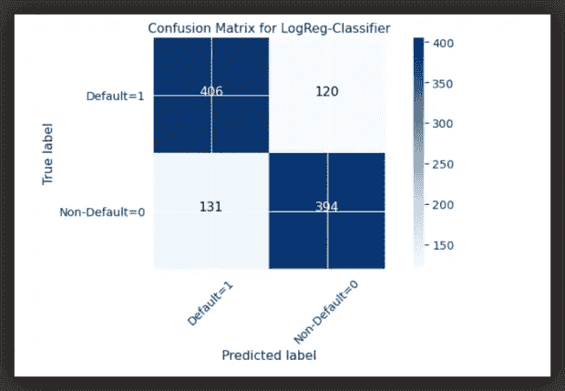*

***{'AUC': 0.7554861488321565，' F1_Score': 0.7554，' Log_loss': 8.4458}***

***Log_Reg** 模型不够灵活，无法学习数据属性，并且在 *AUC* 和 *F1* 指标中均以 76%的阈值执行。*

## *4c。支持向量机(SVM):*

*SVM 的工作原理是将数据映射到一个高维特征空间，这样数据点就可以被分类。*

**

*即使数据不是线性可分的，也可以找到类别之间的分隔符。然后对数据进行转换，使得分隔符可以绘制为超平面。因此，新数据的特征可以用来预测新记录应该属于哪个组。*

*支持向量机支持大约四种核类型:- *['RBF '，' sigmoid '，' Linear '，' Poly']* 。因此，我们将定义一个 **SVM** 方法，并将*内核列表*和 *param_grid* 作为超参数传递给 *GridSearchCV* 。我们会让它施展魔法，返回模型的最佳参数。*

*让我们看看它的表现*

```
***SVM_Model = svm_classifier(x_train, y_train, x_val, y_val)
SVM_Model**
>>
**{'Kernel': 'poly', 'AUC': 1.0, 'F1_Score': 1.0, 'Log_Loss': 0.0}***
```

*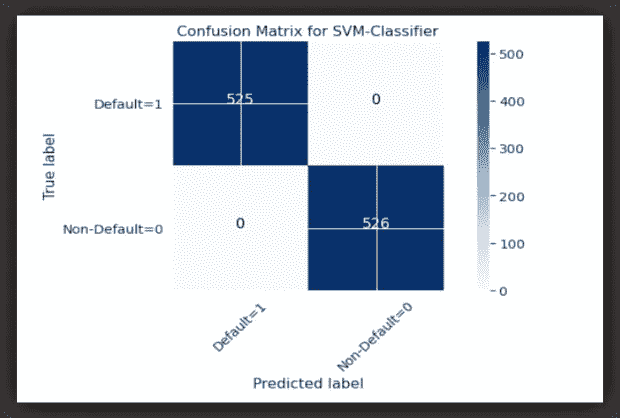*

***{'Kernel': 'poly '，' AUC': 1.0，' F1_Score': 1.0，' Log_Loss': 0.0}***

*所以我们在 SVM 有了另一个完美的表现，100%。让我们试试决策树模型。*

## *4d。决策树分类器(DTree):*

*一般来说， **DTrees** 由三个基本部分组成:-一个根节点、几个隐藏节点和许多终端节点(称为叶子)。*

*它们是非参数算法。也就是说，他们不会对特征和相应目标之间的关系***【f(x)】***的形状做出假设。相反，他们寻求尽可能接近数据点而不会太粗糙或波动的估计值 ***f(x)*** 。*

*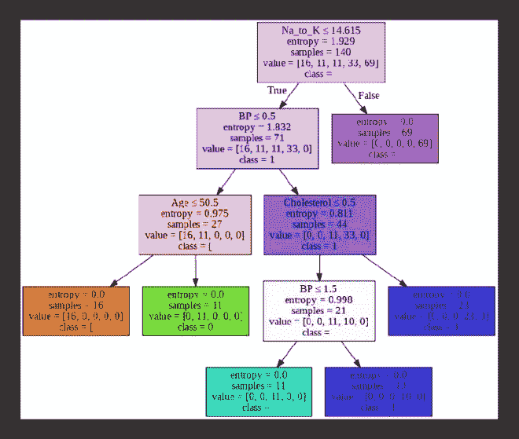*

*决策树结构…*

*使用**dtree**，我们简单地估计叶子的最大深度，并在该范围内迭代以找到我们的理想参数。不需要 *GridSearchCV* 。*

*让我们看表演吧…*

```
***Decision_Tree_Model = decision_tree_classifier(max_depth, x_train, y_train, x_val, y_val)****Decision_Tree_Model**
>> **{'Max_Depth': 27, 'AUC': 0.997148288973384, 'F1_Score': 0.9971, 'Log_Loss': 0.0986}***
```

*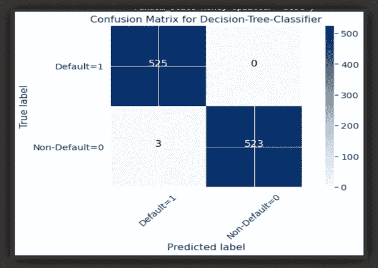*

***{'Max_Depth': 27，' AUC': 0.997148288973384，' F1_Score': 0.9971，' Log_Loss': 0.0986}***

*在我们关心的指标上，**dtree**获得了 99%的分数，是一股不可忽视的力量。所以我们有四分之三的模型在验证集上表现很好。*

*让我们在测试设备上试试我们的模型。这一次，我们定义了一种方法，它获取测试集并返回一个数据帧，显示各个分类模型各自的分数。*

*让我们调用 best_model 方法。*

```
***test_evaluation_dict = best_model(x_test , y_test)
test_evaluation_dict
>>***
```

*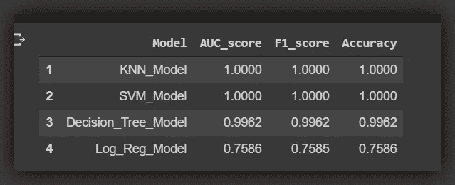*

***很明显，KNN 和 SVM 名列前茅，两者非常接近……***

*测试集上的性能也令人印象深刻。这可能意味着我们的模型在训练集和验证集上没有过度拟合。这也可能意味着我们需要更多的数据…但是我们仍然需要为这个练习选择一个。*

> *那么模型的选择应该考虑哪些因素呢？我们应该考虑哪些价值观？*

# *第五部分:结论*

**

*IMG| [Crdt](https://pixabay.com/users/Peggy_Marco-1553824/?utm_source=link-attribution&utm_medium=referral&utm_campaign=image&utm_content=1020145)*

*机器学习没有一刀切的解决方案，没有*一刀切的*算法。模型选择和优化是一个迭代过程，需要数据科学家的经验。*

> *即使我们使用*现金工具，某些决定还是取决于我们……**

*也就是说，让我们比较一下我们的两个顶级算法。它们的属性是什么？*

## *5a。KNN 对 SVM:*

***KNNs** 非常容易理解和实现，我们基本上只需要调整两个参数，即 ***k、*** 和 ***距离*** 参数。此外，它们训练速度快，是推理的理想选择。*

*另一方面， **KNNs** 不能很好地处理大型数据集。随着维度和观察值的增加，训练变得更加困难。它们不能抵抗异常值，并且对噪声和缺失值很敏感。*

*支持向量机对离群值有抵抗力，这意味着即使数据集中有离群值，我们也能得到一个清晰的边界。SVM 的优化目标是凸的。这很好，因为我们保证通过优化成本函数，我们将总是以全局最小值结束。支持向量机是稳定的，它们具有 L2 正则化，并且通过使用核，支持向量机可以有效地执行分类任务。*

*另一方面，**支持向量机**是默认的二元线性分类器，这意味着多类分类是不可能的，除非我们使用一对一的方法。它们在训练中需要大量的记忆，随着训练集的增加，情况会变得更糟。最后，它们是复杂、灵活的算法，很难解释为推理，但对预测来说很棒。*

## *5b。排列重要性(PI):*

> *那么，每个模型的预测中最重要的特征是什么？*

*让我们应用排列重要性指标来看看对每个模型的决策影响最大的特性。*

*现在，我们可以看到每个型号的主要决定性特征…*

*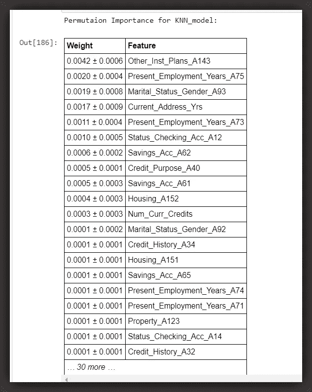*

***以降序显示 KNN 模式决策的排列重要性。***

**

***以降序显示 SVM 模型决策的排列重要性。***

# *最后…*

*我选择 **SVM** 型号是基于它的' **PI** 分数和内在品质。最后一步是用整个训练、验证和测试集来重新训练所选择的模型。*

*同样，我们可以通过应用可解释库，如[***AIX 360****和 ***LIME****](https://aix360.mybluemix.net/resources#overview) *来了解每个模型的预测**

**这些练习简单地训练模型，根据信用历史将客户分类为 ***违约者*** 或 ***非违约者*** 。这些模型绝不是完美的，相关当局应该采取必要的激励措施来抑制信贷支付违约。**

****干杯，感谢！！****

## **关于我:**

**劳伦斯是技术层的数据专家，对公平和可解释的人工智能和数据科学充满热情。我持有 IBM 的 ***数据科学专业*** *和* ***高级数据科学专业*** *证书。我已经使用 ML 和 DL 库进行了几个项目，我喜欢尽可能多地编写函数代码，即使现有的库比比皆是。最后，我从未停止学习和实验，是的，我拥有几个数据科学和人工智能认证，并且我已经写了几篇强烈推荐的文章。***

**请随时在以下网址找到我**

**[Github](https://github.com/Lawrence-Krukrubo)**

**[**领英**](https://www.linkedin.com/in/lawrencekrukrubo/)**

**[**推特**](https://twitter.com/LKrukrubo)**