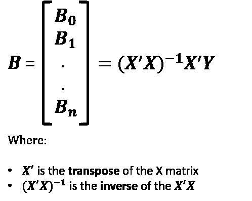
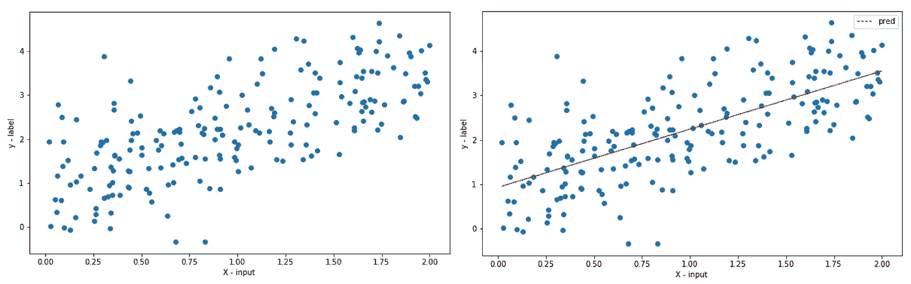
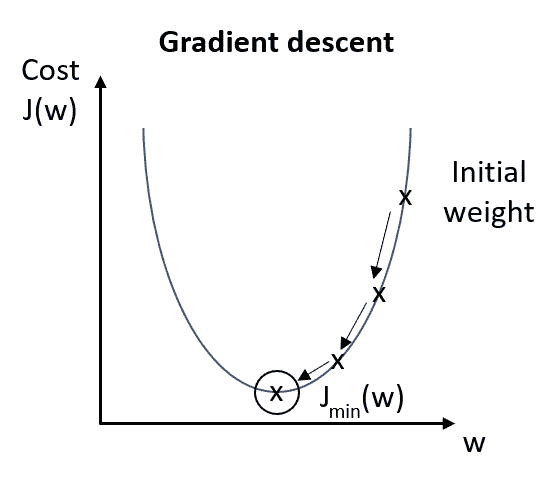
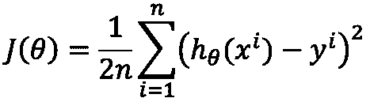
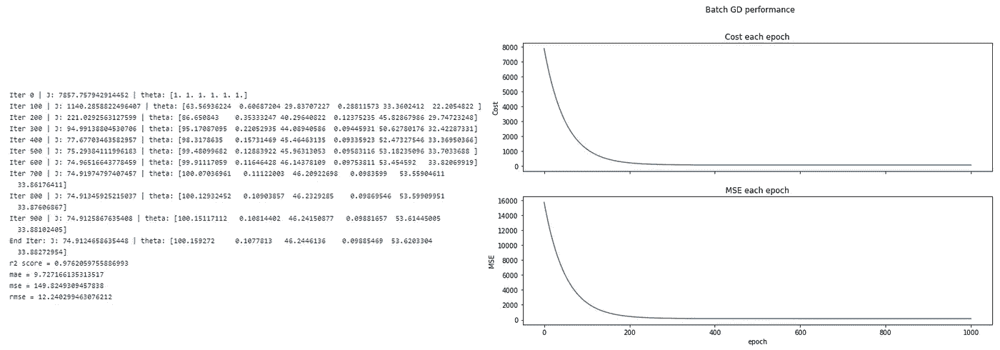
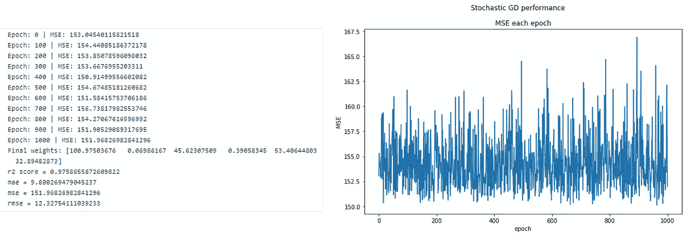
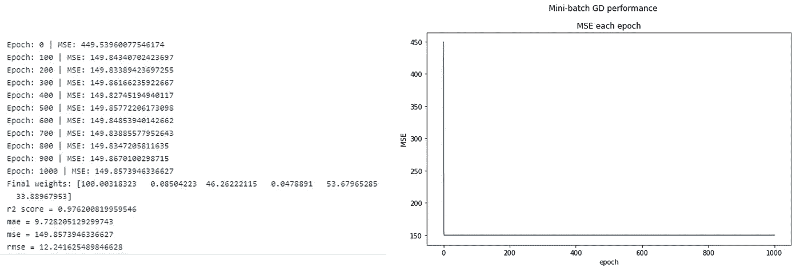
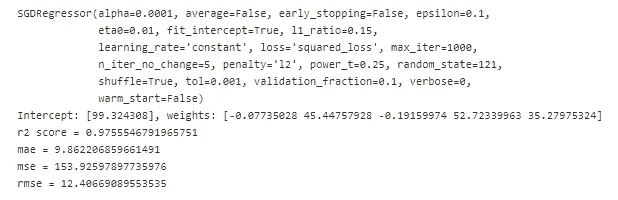
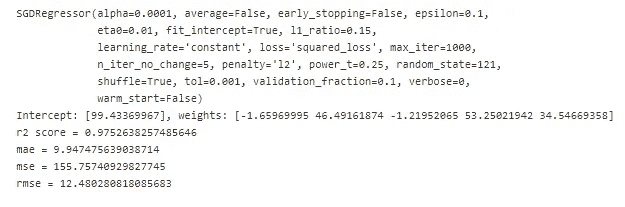

# 用 Python 解释封闭形式和梯度下降回归

> 原文：<https://pub.towardsai.net/closed-form-and-gradient-descent-regression-explained-with-python-1627c9eeb60e?source=collection_archive---------2----------------------->

## [机器学习](https://towardsai.net/p/category/machine-learning)，[编程](https://towardsai.net/p/category/programming)

## 回归问题的简化及其在 Python 中的实现

照片由[杰森·布里斯科](https://unsplash.com/@jsnbrsc?utm_source=unsplash&utm_medium=referral&utm_content=creditCopyText)在 [Unsplash](https://unsplash.com/s/photos/stock?utm_source=unsplash&utm_medium=referral&utm_content=creditCopyText) 上拍摄

# 介绍

回归是机器学习中的一种监督学习算法。这是一种对因变量(或目标、响应)、*和解释变量(或输入、预测值)、***【X】***之间的关系**建模的方法。例如，它的目标是预测目标变量的数量；预测股票价格，这不同于分类问题，例如，我们要预测目标的标签；预测股票的方向(上涨或下跌)。***

*而且，一个回归可以用来回答几个变量是否和**如何相关**，或者相互影响，例如；确定 ***如果*** 和*工作经历或年龄在多大程度上影响薪水。**

**在本文中，我将主要关注线性回归及其方法。**

# **线性回归的不同方法**

**OLS(普通最小二乘法)的目标是找到使垂直偏移最小化的最佳拟合线(超平面)，垂直偏移可以是目标变量和预测输出之间的均方误差(MSE)或其他误差度量(MAE，RMSE)。**

**我们可以使用以下方法实现线性回归模型:**

1.  **求解模型参数(封闭型方程)**
2.  **使用优化算法(梯度下降、随机梯度等。)**

**请注意，OLS 回归估计量是 ***最佳线性无偏估计量*** (简称蓝色)。在其他形式的回归中，参数估计可能有偏差，例如；当数据中存在共线性时，岭回归有时用于减少估计值的方差。但偏倚和方差的讨论不在本文讨论范围内(请参考这篇[有关偏倚和方差的大文章](http://scott.fortmann-roe.com/docs/BiasVariance.html))。**

## **封闭型方程**

**假设我们有 X 大小 n 的输入和一个目标变量，我们可以写出下面的等式来表示线性回归模型。**

****

**线性回归的简单形式(其中 i = 1，2，…，n)**

**该等式假设截距 X0 = 1。还有一个没有截距的模型，其中 B0 = 0，但这是基于一些假设，即它将始终通过原点(有很多关于这个主题的讨论，你可以在这里阅读更多和[这里](http://web.ist.utl.pt/~mcasquilho/compute/errtheory/,regression/regrthroughorigin.pdf))。**

**根据上面的等式，我们可以基于下面的计算来计算回归参数。**

****

**多元回归模型的矩阵公式**

**现在，让我们用 Python 来实现它，有三种方法可以做到这一点；手动矩阵乘法， ***statsmodels*** 库，以及 ***sklearn*** 库。**

****

**模型权重**

****

**单一线性模型示例，一个输入(左)和模型预测(右)**

**您可以看到，所有三种解决方案给出了相同的结果，然后我们可以使用输出来编写模型方程(Y =0.7914715+1.38594198X **)。****

**这种方法为较小的数据提供了一个更好的解决方案，简单，快速的解释模型。**

## **梯度下降**

**如果闭型方程可以解决回归问题，我们为什么需要梯度下降。有些情况下。**

*   **大多数非线性回归问题没有封闭解。**
*   **即使在线性回归中，在某些情况下使用该公式也是不切实际的。一个例子是当 X 是一个非常大的稀疏矩阵时。该解决方案的计算成本太高。**

**梯度下降是一种计算成本更低(更快)的解决方案。**

**梯度下降是一种优化算法，用于通过沿最陡下降方向重复移动来最小化某个成本函数。因此，在每个时期之后更新模型权重。**

****

**梯度下降的基本可视化-理想情况下，梯度下降试图向全局最小值收敛**

**在机器学习算法中使用的梯度下降有三种主要类型；**

1.  **批量梯度下降**
2.  **随机梯度下降**
3.  **小批量梯度下降**

**让我们更详细地了解每种类型及其实现。**

## **批量梯度下降**

**这种方法是最直接的。它计算训练集中每个观察值的误差。**评估完所有训练观察值后，它将更新模型参数**。这个过程可以被称为*训练时期*。**

**这种方法的主要优点是计算效率高，并且产生稳定的误差梯度和稳定的收敛，然而，它需要存储器中的整个训练集，并且稳定的误差梯度有时会导致不是最佳的模型(收敛到局部最小值陷阱，而不是试图找到最佳的全局最小值)。**

**让我们观察一下回归问题的 python 实现。**

****

**线性回归的成本函数**

****

**批量梯度下降—每个时期的成本和 MSE**

**正如我们所看到的，成本正在稳步下降，并达到大约 150-200 个纪元的最小值。**

**在计算过程中，我们还使用了矢量化以获得更好的性能。但是，如果训练集非常大，性能会比较慢。**

## **随机梯度下降**

**在随机梯度下降中，SGD(或有时称为*迭代*或*在线* GD)。“随机”和“在线 GD”的名称来自于这样一个事实，即基于梯度的*单次训练观察*是真实成本梯度的“随机近似”。然而，由于这个原因，通向全局成本最小化的路径不是直接的，并且在收敛到全局成本最小化之前可能上下起伏。**

**因此；**

*   **这使得 SGD 比批处理 GD 更快(在大多数情况下)。**
*   **我们可以实时查看模型的洞察力和改进率。**
*   **增加模型更新频率可以导致更快的学习。**
*   **随机性质的噪声更新有助于避免局部最小值。**

**然而，一些缺点是:**

*   **由于更新频率，这可能是更昂贵的计算，这可能需要比另一种方法更长的时间来完成。**
*   **频繁的更新将导致有噪声的梯度信号，这导致模型参数和误差跳跃，在训练时期上有较高的方差。**

**让我们看看如何用 Python 实现这一点。**

****

**随机梯度下降—每个时期的性能**

## **小批量梯度下降**

**小批量梯度下降(MB-GD)是更优选的方法，因为它折衷了批量梯度下降和随机梯度下降。它将训练集分成小批，并提供给算法。该模型将基于这些批次获得更新。该模型将比批量 GD 收敛得更快，因为权重更新得更频繁。**

**该方法结合了批量遗传算法的高效性和随机遗传算法的鲁棒性。一个(小的)缺点是这种方法引入了一个新的参数“批量”，这可能需要作为模型调整/优化的一部分进行微调。**

**我们可以把批量想象成学习过程中的一个滑块。**

*   **小的值使学习过程以训练过程中的噪声为代价快速收敛**
*   **较大的值给出了学习过程收敛较慢的误差梯度的精确估计**

**我们可以重用上面的函数，但是需要指定批量大小为 ***len(训练集)> batch_size > 1。*****

**`theta, _, mse_ = _sgd_regressor(X_, y, learning_rate=learning_rate, n_epochs=n_epochs, batch_size=50)`**

****

**小批量梯度下降—一个时期内的性能**

**我们可以看到，只有前几个历元，模型能够立即收敛。**

## **新加坡元回归(scikit-learn)**

**在 python 中，我们可以通过使用`sklearn.linear_model.SGDRegressor`在回归问题上实现梯度下降方法。更多详情请参考[文档](https://scikit-learn.org/stable/modules/sgd.html)。**

**下面是我们如何实现随机和小批量梯度下降法。**

****

**sci kit-了解 SGD 型号的详细信息和性能**

****

**sci kit-了解 SGD 小批量模型的详细信息和性能**

# **尾注**

**在这篇文章中，我解释了线性回归的封闭形式方程和优化算法，梯度下降，从头实现它们，并使用内置的库。**

## **附加阅读和 Github 库:**

** [## 5.4-多元回归模型的矩阵公式

### 注意:这节课对那些在毕业后继续学习统计学的学生来说是最重要的

online.stat.psu.edu](https://online.stat.psu.edu/stat462/node/132/)  [## 深度架构基于梯度训练的实用建议

### 与人工神经网络相关的学习算法，尤其是深度学习算法，可能会涉及许多…

arxiv.org](https://arxiv.org/abs/1206.5533)  [## netsatsawat/闭合形式和梯度下降回归-解释

### permalink dissolve GitHub 是超过 5000 万开发人员的家园，他们一起工作来托管和审查代码，管理…

github.com](https://github.com/netsatsawat/close-form-and-gradient-descent-regression-explained/blob/master/code/linear%20regression%20explained.ipynb)**