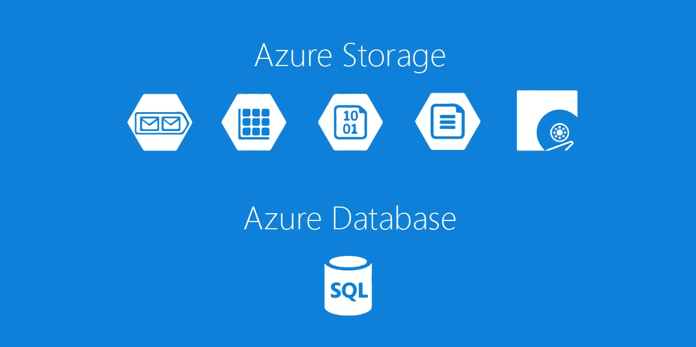
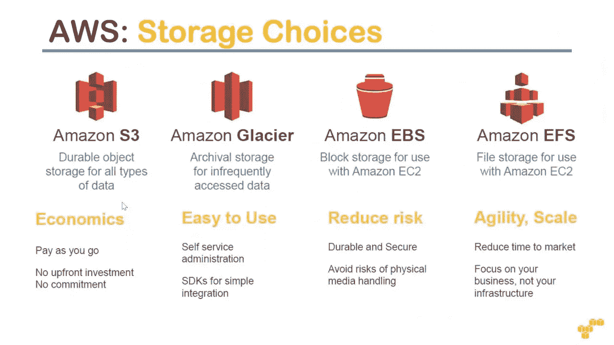
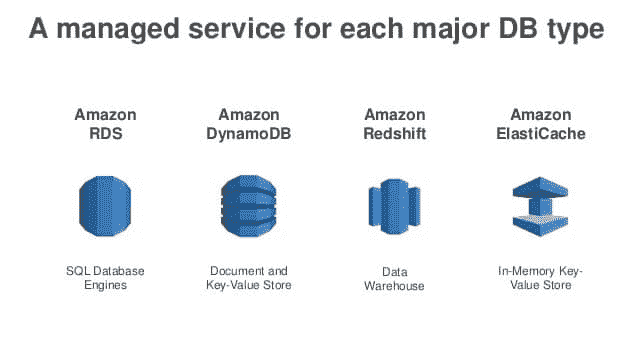
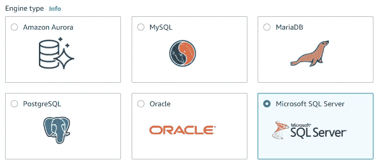
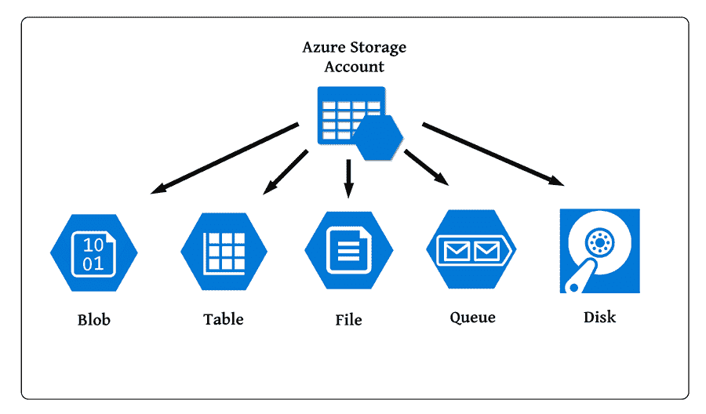
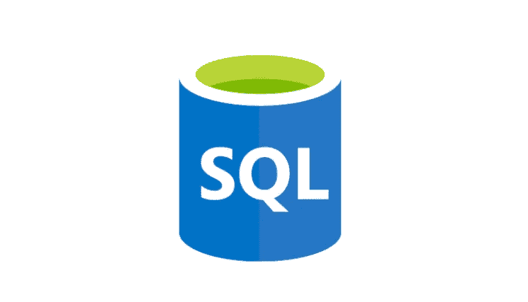

# 云存储与数据库，云如何组织其服务

> 原文：<https://pub.towardsai.net/cloud-storage-vs-database-how-the-cloud-organizes-its-services-175d3a1cbdf3?source=collection_archive---------2----------------------->

## [云计算](https://towardsai.net/p/category/cloud-computing)

## 比较 AWS 和 Azure 如何组织它们的数据库和存储服务

我目前正在学习 AWS 认证，这似乎比我想象的更令人愉快。云比你想象的要复杂得多，它由数以千计的独立服务组成，因此可以以多种方式进行组织。云提供商最常用的配置是按照基础设施级别对所有内容进行分组。使用这种默认配置，更容易理解您对从云中存储服务的承诺程度。

不同的云基础设施组被称为服务模型，它们是 IAAS、PAAS、SAAS(你可能会在本文中找到关于服务模型[使用的丰富解释)。其中一种服务模型叫做存储，这是初学者在接触云时最容易混淆的事情之一。](/what-are-cloud-iaas-paas-saas-faas-and-why-we-use-them-8af979dad141?source=rss----98111c9905da---4?source=social.tw&_gl=1*162zexg*_ga*Mjc4ODM1MDQ0LjE2MjYyNDM1ODY.*_ga_9D3HKKFV1Q*MTYyODU0MjI5Ny44LjAuMTYyODU0MjI5Ny4w)

Azure 存储与 Azure 数据库的对比示例

我们习惯于认为存储是可以放在一个物理位置的所有东西，包括数据。云提供商准确地将专门存储非结构化和/或半结构化数据的服务 a(or 取决于云提供商，例如 AWS 和 Azure 对此有不同的看法)与只能处理结构化数据的服务(例如关系数据库)区分开来。我们将第一组归类为存储，第二组归类为数据库。

# AWS 服务

## AWS 存储

我花了几个小时的研究，最终理解这种分离，但非常一致。事实上，在 Azure 和 AWS 上，如果我搜索存储服务，我会得到:

AWS 存储服务

AWS 允许我们以以下形式存储非结构化数据:

*   文件

文件是分层结构的数据。我们的个人电脑遵循同样的逻辑，因为它的数据被可视化为嵌套文件夹的迷宫。

*   目标

对象是包含元数据的任何类型的信息。

*   阻碍

块是将数据分割成相等区块的方法，每个区块都有其唯一的标识符。当我们想要检索数据时，标识符为软件提供了如何重建块的必要指令。

## AWS 数据库

另一方面，搜索数据库服务会得到准确的结果:搜索只过滤处理结构化或半结构化数据的服务。与 Azure 不同，AWS 认为 NoSQL 更接近结构化数据，是数据库服务的一部分。

亚马逊数据库服务

为了直接管理结构化数据的存储，AWS 使用 RDS，即关系数据库服务，这种服务为我们提供了各种不同的数据库管理系统:

创建新数据库时的 AWS 控制台示例

如您所见，甚至有可能租用 MS SQL 服务器(带有连接的数据库)。

# Azure 服务

## Azure 存储

在 Azure 上的搜索也显示了一致的结果:当搜索存储服务时，结果向我显示了相当于存储非结构化(在这种情况下也是半结构化)数据的 AWS 服务。Azure 使用一个服务来管理我们存储非结构化数据的所有方式，这个服务叫做 Azure Storage Account。

基础服务如下:

*   Blob 存储

Blob 存储将大块数据转换成二进制对象，然后存储在专用空间中。因为它不受结构化数据的限制，我们可以存储任何类型的数据，独立于其格式或结构，如图像甚至视频。

*   表格存储

相当于 DynamoDB，将 NoSQL 数据存储到多个表中。NoSQL 使用 javascript 对象来存储数据。当我们需要存储文本数据时，半结构化数据非常有用，但与关系数据库相比，半结构化数据具有更大的灵活性，因为没有固定数量的列，但每个对象都有灵活数量的对象属性。如果您不希望使用任何云提供商，另一个常见的选择是 MongoDB。

*   文件存储器

这项服务应该完全等同于 AWS 中的 S3。数据以分层文件的形式存储。

*   队列存储

这是一项专门用于存储电子邮件的服务。因为微软提供庞大的企业解决方案，包括像 Outlook 这样的电子邮件管理系统，它可以将这个 Azure 服务与其他微软 365 工具集成在一起。

*   磁盘存储器

该服务专门用于存储虚拟机的实例。当我们必须根据我们的计算需求创建数千个不同的虚拟机时，尤其是在扩展我们的底层软件的情况下，收集每个实例以备后用是非常重要的。

## Azure 数据库

相反，通过搜索数据库，与 AWS 上执行的相同研究保持一致，我们可以找到 Azure SQL，Azure 生态系统中使用的关系数据库解决方案。

Azure SQL 徽标