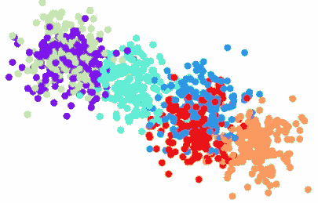
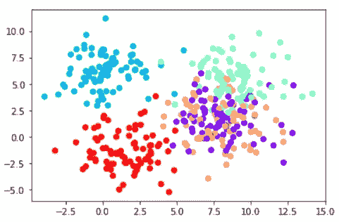
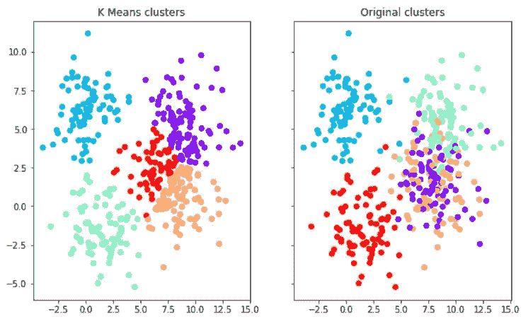

# 使用 K-Means 算法对自定义数据进行聚类 Python

> 原文：<https://pub.towardsai.net/clustering-custom-data-using-the-k-means-algorithm-python-6a243308034a?source=collection_archive---------0----------------------->

## [机器学习](https://towardsai.net/p/category/machine-learning)

## 使用 Python 理解和实现 K-means 算法的指南。



来源:作者

# 什么是 K-Means 聚类算法？

K-Means 聚类算法是一种无监督学习算法，这意味着它没有目标标签。该算法将相似的聚类分组在一起。

# 集群在现实世界中的应用是什么？

聚类算法的各种应用包括:

1.  市场分割
2.  基于特征的客户分组
3.  相似文档的聚类

# 算法是如何工作的？

该算法遵循给定的步骤:

1.  选择若干个集群“K”。
2.  然后将数据中的每个点随机分配给一个聚类。
3.  重复以下步骤，直到集群停止变化:

a)对于每个聚类，通过计算聚类中点的平均向量来计算聚类的质心。

b)将每个数据点分配给质心最近的聚类。

# 如何选择「K」的值？

选择最佳的“K”值是非常棘手的。但是有一种方法是肘法。根据该方法，对于“K”的一些值，计算误差平方和(SSE)。SSE 是聚类的每个数据点与其质心之间的平方距离之和。当“K”对 SSE 作图时，误差随着“K”变大而减小。原因是当簇数量增加时，它们的大小减小，因此失真也更小。所以肘法规定“K”的值将是上证指数突然下降的值。它会产生“肘效应”。

# 如何用 Python 实现？

将创建用于聚类的数据集。使用 sci-kt 学习包将形成一个随机数据集，算法将在该数据集上运行。

**→进口包装**

导入 numpy 库是为了与 matplotlib 一起处理数据，以帮助实现数据可视化。

```
**>>> import** numpy **as** np
**>>> import** matplotlib.pyplot **as** plt
**>>> %**matplotlib inline
```

**→创建数据**

将使用 sklearn 包的“make_blobs”方法。样本数量、特征、中心和聚类标准偏差将被设置为参数。

```
**>>> from** sklearn.datasets **import** make_blobs>>> data **=** make_blobs(n_samples**=**400, n_features**=**2, centers**=**5, cluster_std**=**1.8)>>> data[0].shape
(400, 2)
```

**→绘制斑点**

第一列的所有行的散点图是相对于第二列的所有行绘制的。然后提供分类编号标签以查看不同的分类。

```
>>> plt.scatter(data[0][:,0],data[0][:,1],c**=**data[1],cmap**=**'rainbow')
```



因此，这里的集群是扭曲和重叠的。使用 K-means 算法，将执行聚类以正确地对数据进行分组。

**→构建模型**

从 sklearn 导入 KMeans 模块来构建模型。创建 KMeans 对象，并将参数“k”传递给该对象。这里有 5 个集群。那么它就符合数据。

```
**>>> from** sklearn.cluster **import** KMeans>>> model **=** KMeans(n_clusters**=**5)>>> model.fit(data[0])
KMeans(n_clusters=5)
```

可以获得聚类中心和预测标签。

```
>>> model.cluster_centers_
array([[ 9.07898265,  5.31380282],
       [ 0.09832752,  6.25299731],
       [ 1.47946328, -1.483289  ],
       [ 8.66272519,  0.43529401],
       [ 6.1742668 ,  2.5718236 ]])>>> model.labels_
array([1, 3, 2, 1, 1, 2, 4, 4, 3, 1, 4, 2, 1, 2, 3, 0, 0, 0, 3, 0, 3, 0,
       0, 3, 3, 4, 0, 0, 3, 0, 2, 4, 3, 2, 1, 1, 2, 4, 4, 0, 3, 4, 4, 2,
       3, 1, 4, 3, 0, 0, 3, 0, 0, 3, 1, 0, 0, 0, 0, 0, 4, 3, 2, 1, 0, 3,
       2, 1, 2, 1, 3, 1, 4, 1, 4, 0, 2, 4, 2, 2, 3, 3, 1, 3, 1, 2, 0, 3,
       0, 3, 2, 0, 0, 1, 1, 0, 2, 2, 1, 4, 4, 1, 3, 1, 2, 2, 0, 1, 1, 1,
       0, 4, 3, 1, 3, 3, 2, 4, 1, 0, 3, 0, 4, 2, 1, 0, 2, 1, 3, 3, 3, 2,
       3, 3, 1, 1, 1, 3, 2, 0, 0, 2, 4, 1, 1, 0, 1, 0, 0, 0, 4, 1, 0, 0,
       4, 2, 2, 0, 0, 2, 2, 3, 0, 4, 1, 1, 2, 4, 3, 0, 0, 0, 1, 0, 0, 1,
       2, 1, 3, 2, 1, 0, 1, 3, 4, 4, 1, 1, 3, 3, 1, 3, 3, 4, 2, 3, 3, 2,
       4, 0, 2, 2, 3, 3, 4, 2, 1, 1, 3, 0, 0, 3, 2, 3, 3, 2, 2, 0, 3, 2,
       0, 3, 2, 4, 3, 0, 4, 4, 0, 3, 3, 1, 0, 0, 1, 0, 3, 1, 2, 2, 2, 2,
       0, 3, 2, 4, 0, 4, 4, 4, 2, 0, 4, 1, 0, 3, 2, 3, 2, 2, 3, 1, 4, 0,
       2, 3, 3, 4, 3, 1, 4, 2, 1, 0, 3, 2, 0, 4, 0, 3, 2, 2, 2, 4, 2, 2,
       2, 1, 1, 0, 4, 1, 0, 2, 0, 4, 0, 1, 0, 1, 0, 3, 3, 1, 0, 2, 3, 0,
       0, 4, 2, 3, 0, 1, 3, 4, 3, 3, 0, 1, 4, 2, 4, 4, 0, 0, 0, 1, 2, 1,
       2, 4, 3, 0, 0, 4, 4, 1, 0, 3, 4, 2, 1, 3, 0, 0, 4, 1, 0, 4, 1, 4,
       3, 0, 0, 2, 1, 3, 2, 2, 2, 3, 1, 1, 0, 1, 0, 4, 0, 0, 3, 3, 0, 3,
       4, 1, 0, 3, 2, 3, 0, 0, 3, 1, 1, 2, 1, 4, 1, 3, 4, 4, 3, 3, 2, 2,
       2, 0, 1, 3])
```

这里，模型已经预测了标签，并且由于是无监督的学习算法，如果采用真实世界的数据，将没有目标标签可以比较。由于数据是在这里创建的，因此可以将目标标签与预测标签进行比较，以了解 K-Means 算法的工作情况。

```
>>> f, (ax1, ax2) **=** plt.subplots(1, 2, sharey**=True**,figsize**=**(10,6))>>> ax1.set_title('K Means clusters')
>>> ax1.scatter(data[0][:,0],data[0[:,1],c**=**model.labels_,cmap**=**'rainbow')>>> ax2.set_title("Original clusters")
>>> ax2.scatter(data[0][:,0],data[0][:,1],c**=**data[1],cmap**=**'rainbow')
```



可以观察到，K-Means 算法创建了更多定义的聚类。

> *这里指笔记本*[](https://github.com/jayashree8/Machine_learning_unsupervised_models/blob/master/K-Means.ipynb)**。**

## *初级机器学习书籍可以参考:*

*[](https://amzn.to/3i3XU1A) [## Python 机器学习:机器学习和深度学习的 Python 编程初学者指南](https://amzn.to/3i3XU1A) [](https://amzn.to/3fQc6IW) [## 一百页的机器学习书](https://amzn.to/3fQc6IW) 

## 可以参考的高级机器学习书籍:

[](https://amzn.to/2SxwQNw) [## 用 Scikit-Learn、Keras 和张量流进行机器学习:概念、工具和技术…](https://amzn.to/2SxwQNw) [](https://amzn.to/3wz62eE) [## 模式识别和机器学习(信息科学和统计学)](https://amzn.to/3wz62eE) 

> *联系我:* [*LinkedIn*](https://www.linkedin.com/in/jayashree-domala8/)
> 
> *查看我的其他作品:* [*GitHub*](https://github.com/jayashree8)*