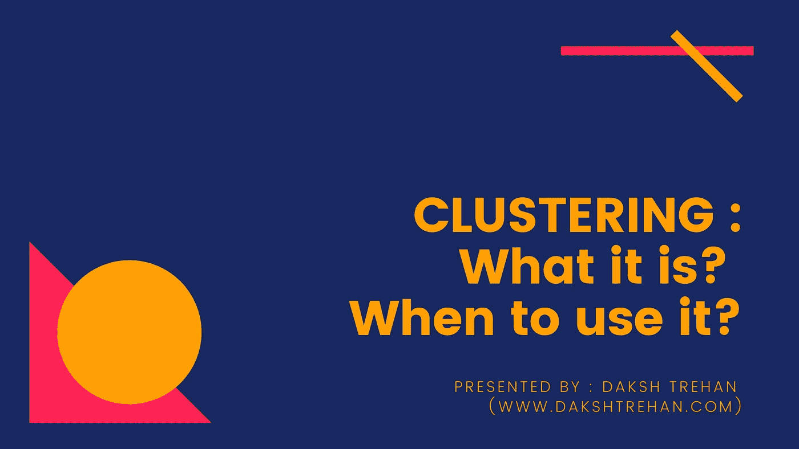
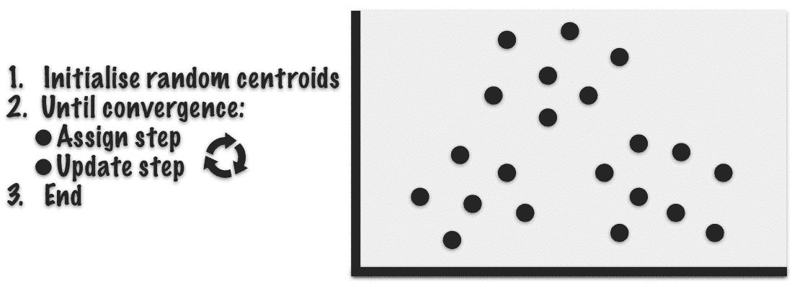
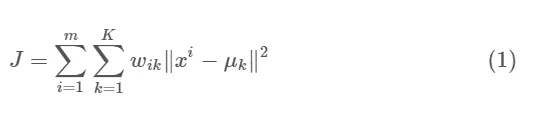
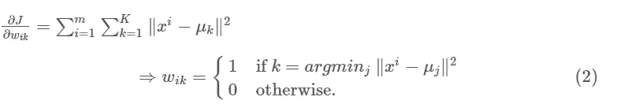
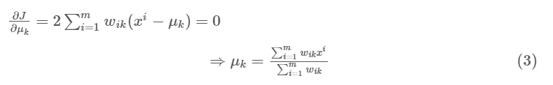
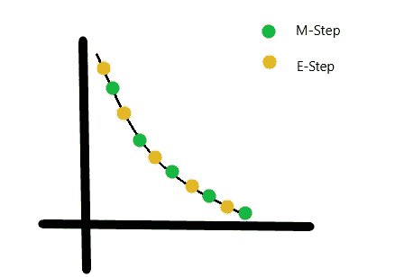
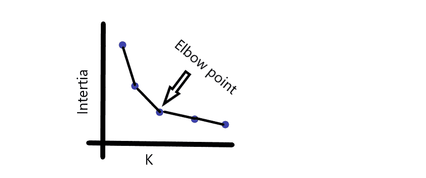
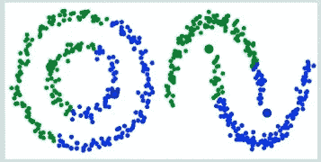
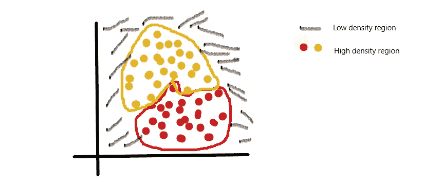

# 集群:什么是集群，何时使用集群？

> 原文：<https://pub.towardsai.net/clustering-what-it-is-when-to-use-it-a612bbe95881?source=collection_archive---------0----------------------->

## [机器学习](https://towardsai.net/p/category/machine-learning)，数据科学

## K-Means、K-Means++和 DBSCAN 综合指南。

聚类是一种机器学习技术，其目的是将具有**相似属性和/或特征**的数据点分组，而不同组中的数据点应该具有非常不同的属性和/或特征。

# 目录

1.**K-表示**

⦁*k-means 简介*

*⦁如何 K-means 工作？*

*⦁ Sci-kit 实现 K-means*

*⦁k-means 的利弊*

2. **K-means ++**

*⦁k-means ++是如何工作的？*

*k-means ++的⦁ Sci-kit 实现*

3.DBSCAN

*   *DBS can 如何工作？*
*   DBSCAN 的伪代码
*   *数据库扫描的 Sci-kit 实现*
*   *DBS can 的利弊*

# k 均值

## K-means 简介

K-means 来自一个**无监督学习**算法家族，其中输入是无标签的，这与监督学习算法不同。

K-means 的最终目标是**聚类**，让我们深入研究聚类。

有时我们只想组织数据，这就是集群发挥作用的地方。它既可用于标记数据，也可用于未标记数据。

照片由 [Thibault Penin](https://unsplash.com/@thibaultpenin?utm_source=medium&utm_medium=referral) 在 [Unsplash](https://unsplash.com?utm_source=medium&utm_medium=referral) 上拍摄

每个人都听说过网飞和它永无止境的内容汇编。

内容按照不同的类型组织得很好，如喜剧、戏剧、惊悚片等。

现在假设有一天你登录到网飞，档案是杂乱和模糊的。那会有多麻烦。

这就是聚类的概念，将所有的并行数据点分组到一个聚类中，以获得更好的编目体验。

这正是 K-means 的工作原理。

聚类经常出现在*数据分析、客户细分、推荐系统、搜索引擎、半监督学习、维度缩减等领域。*

K-means 算法是**硬聚类**的一部分，对应每个点只属于一个聚类。

## K-如何意味着工作？

K-Means 中的*“K”*表示簇的**数。这个算法在一些迭代之后必定会**收敛**到一个解。**

**目标**:在“K”个簇中划分数据。

1.  初始化 K 点。
2.  将每一项按其最接近含义分类。
3.  更新平均值的坐标，这是迄今为止按平均值分类的项目的平均值。
4.  重复以上步骤，直到我们的算法收敛。

成本函数是:

> 其中 m =所有点
> 
> K =所有集群
> 
> 如果第 I 个属于聚类 *k* ，则数据点的 wik = 1；
> 
> 否则，wik=0。

为了减少损失，我们实施**坐标下降**。在 K-means **中遇到的损失不是凸函数**，因此可能存在多个局部最小值。

这是两部分的最小化问题:

我们首先最小化 J . w . r . t . wik，并处理μk 固定。然后我们最小化 J . w . r . t .μk 并处理 wik 固定。

1.  **E-step** :我们首先区分 J w r t wik 并更新集群分配( *E-step* )。

我们将数据点 xi 分配给最近的聚类，该聚类通过其与聚类质心的欧几里德距离来评估。

**2。m-步骤**:然后我们对 J . w . r . t .μk 进行微分，并根据上一步的聚类分配重新计算质心。

简而言之，首先，我们将使用 E-step 获取 wik，它会将该点分类为 0 或 1。如果 wik =1，那么我们将转移到 M 步，并且使用μk，我们得到所有点的平均值，以得到更新的聚类中心。

## ***Sci-kit 实现的 K-means***

要指定簇的数量，有两种方法:

1.  **直接法:**只要把数据点标出来，看有没有给你提示。
2.  **惯性值:**好的聚类背后的思想是具有小的惯性值和少量的聚类。

惯性的值与簇的数量成反比。所以，这是一个权衡。经验法则:惯性图中的肘点是最佳选择，因为在此之后，惯性值的变化是不相关的。

## K 均值的利与弊

**优点**:

1.  容易实现。
2.  可扩展用于大数据
3.  确保趋同。

**缺点**:

1.  对异常值敏感。
2.  挑选集群的数量是一项单调乏味的工作。
3.  初始化是随机的。
4.  不适用于非线性数据。

# k-表示++的意思

## K-means++简介

K-means++是 K-means 的**扩展变体**。K-means 的缺点是，它使用了**随机初始化技术**，这通常会导致算法功能失调，因为一旦随机选择质心，就有陷入**局部最小值的高风险。**

K-means++通过选择统计上**接近**真实中心的质心来避免这种阻碍。

> Sci-kit learn 默认使用 k-means++。

## K-means++的 Sci-kit 实现

> 但是，K-means++仍然不适合非线性数据点。

# 带噪声应用的基于密度的空间聚类

## DBSCAN 简介

DBSCAN 是一种针对**非线性数据点的聚类解决方案。**

它基于这样一个想法，一个星团是一个被 T4 低密度区域包围的 T2 高密度区域 T3。

它从探索小区域开始，如果该区域的密度足够大，它被认为是簇的一部分，并探索邻居以增加簇的空间区域。

它根据一个规则工作:如果邻居的**距离<阈值距离**，那么它被添加到家族中。

## **DBS can 的伪代码**

1.  找到 eps 内的所有邻居点，并为每个核心未分配点创建一个新的集群。
2.  递归地找到其所有密度连接点，并将它们添加到与核心点(质心)相同的簇中。
3.  对未分配的邻居重复该过程。

K-means 与 DBSCAN 聚类

## Sci-kit 实施

**接受的参数:**

***eps*** :决定点之间应该有多近，才能被认为是聚类的一部分。它充当一个阈值。

***minPoints*** :形成密集区域的最小点数，例如，如果我们将 minPoints 参数设置为 8，那么我们至少需要 8 个点来形成密集区域(集群)。

## DBSCAN 的利与弊

DBSCAN 的优点:

*   非常适合在给定的数据集中区分高密度聚类和低密度聚类。
*   对异常值不太敏感。

**DBS can 的缺点:**

*   DBSCAN 与相似密度的集群进行斗争*。*
*   DBSCAN 对于高维数据效率不高。
*   比 K 均值慢。

# 结论

希望这篇文章能帮助您以最佳方式理解集群，并帮助您实际使用它。

一如既往，非常感谢你的阅读，如果你觉得这篇文章有用，请分享！

请随意连接:

> *LinkedIn ~*[*https://www.linkedin.com/in/dakshtrehan/*](https://www.linkedin.com/in/dakshtrehan/)
> 
> *Instagram ~*[*https://www.instagram.com/_daksh_trehan_/*](https://www.instagram.com/_daksh_trehan_/)
> 
> *Github ~*[*https://github.com/dakshtrehan*](https://github.com/dakshtrehan)

关注更多机器学习/深度学习博客。

> *中等~*[*https://medium.com/@dakshtrehan*](https://medium.com/@dakshtrehan)

## 想了解更多？

 [## 无法逃脱的人工智能算法:抖音

### 描述一个抖音用来吸引用户的渐进式推荐系统！

towardsdatascience.com](https://towardsdatascience.com/the-inescapable-ai-algorithm-tiktok-ad4c6fd981b8)  [## 为什么你要为乔治·弗洛伊德的谋杀和德里社区骚乱负责！！

### 一个 ML 爱好者改变世界的方法。

medium.com](https://medium.com/@dakshtrehan/why-are-you-responsible-for-george-floyds-murder-delhi-communal-riots-4c1edb7acbc5)  [## 使用深度学习检测新冠肺炎

### 一个实用的方法来帮助医生帮助我们对抗新冠肺炎

towardsdatascience.com](https://towardsdatascience.com/detecting-covid-19-using-deep-learning-262956b6f981)  [## 从 K 个最近的邻居开始你的 ML 之旅！

### 详细的理论解释和 scikit-用例子学习实现！

medium.com](https://medium.com/@dakshtrehan/start-off-your-ml-journey-with-k-nearest-neighbors-f72a122f428)  [## 关于朴素贝叶斯你不知道的事情！！

### 朴素贝叶斯快速指南，帮助你开发垃圾邮件过滤系统！

medium.com](https://medium.com/swlh/things-you-never-knew-about-naive-bayes-eb84b6ee039a)  [## 解释激活功能

### 阶跃，Sigmoid，双曲正切，Softmax，ReLU，Leaky ReLU 解释

medium.com](https://medium.com/analytics-vidhya/activation-functions-explained-8690ea7bdec9)  [## 解释参数优化

### 梯度下降的简要描述指南，ADAM，ADAGRAD，RMSProp

towardsdatascience.com](https://towardsdatascience.com/parameters-optimization-explained-876561853de0)  [## 梯度下降解释

### 梯度下降综合指南

towardsdatascience.com](https://towardsdatascience.com/gradient-descent-explained-9b953fc0d2c)  [## 逻辑回归解释

### 尽可能简单地解释逻辑回归。

towardsdatascience.com](https://towardsdatascience.com/logistic-regression-explained-ef1d816ea85a)  [## 线性回归解释

### 尽可能简单地解释线性回归。

medium.com](https://medium.com/towards-artificial-intelligence/linear-regression-explained-f5cc85ae2c5c) 

> 干杯！