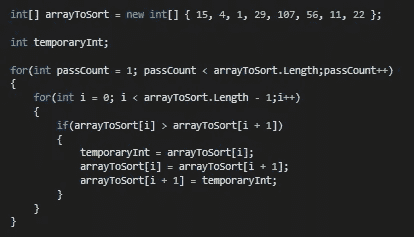

# 代码算法

> 原文：<https://pub.towardsai.net/code-algorithms-5c4d3124219?source=collection_archive---------1----------------------->

## [编程](https://towardsai.net/p/category/programming)

As long as coding and programming are used, algorithms will be at the heart of these technologies, defining what they do and how they do it. Self-learning and self-programming algorithms are emerging, so it is quite possible that in the future many, if not most, algorithms will write algorithms. In this article, I’m going to pick only a small fraction of what Swift algorithms are already capable of, focusing on nine specific algorithms that I find most useful. These three example algorithms are just a surface of the basic algorithms we need to know both to create effective programs and to successfully pass technical interviews.

Fortunately, as a professional developer, you may never need to implement any of these algorithms. But you can speed up this process by checking existing algorithms and implementing them yourself in different languages ​​or different ways. Learning general algorithms in isolation is helpful, but it is better to get used to algorithmic thinking.

You will benefit from it, but the real challenge is not to know the algorithms very well but to invent new algorithms and be able to implement and evaluate them as needed. To start thinking about algorithms, you can start thinking about problems in two ways: decomposing the problem and constructing a solution. Algorithms are used to solve specific problems in the form of clearly defined steps. An algorithm is just a collection of steps used to complete a specific task.

In its simplest form, an algorithm is a set of detailed step-by-step instructions for completing a task. In mathematics and computer science, an algorithm is an efficient method, expressed as a finite list of well-defined instructions for computing a function. Algorithms are used for computation, data processing, and automated reasoning.

It is a series of clearly defined instructions that allow your computer to perform the operations you want it to perform. This is one of the techniques that can be used to express program algorithms. An algorithm is defined as a clearly defined sequence of steps that provide a solution to a given problem, and pseudocode is a method that can be used to represent an algorithm. Therefore, as shown in the figure above, you can clearly see how the algorithm generates pseudo-code, and further expand the generated program code according to the specific syntax of the programming language.

A model consists of a dataset (such as machine learning training data) along with an algorithm. Algorithms are instructions for solving a problem or completing a task. Transferring an algorithm to a machine to perform a variety of tasks is critical.

These general questions about coding, data structure, and algorithms are the questions you need to know in order to successfully interview any company, large or small, for any level of programming. I hope these 20 questions will be enough to get you started preparing for your coding algorithm interview.

This course teaches you everything you need to know about data structures and algorithms so that you can confidently pass your programming interview. A good book to get you ready for your job interview in no time. These courses will also teach you how to calculate the complexity of time and space, which is very important both in terms of coding interviews and for improving the performance of the algorithm.

One of the most common ways to evaluate an algorithm is to check its time complexity using a technique called Big O notation. It is important to understand the possible execution times of different algorithms, especially when dealing with large or growing data sets.

The difference is that computers can use algorithms and compute better, faster, and more efficiently than we do. Algorithms with the persistence and ubiquity of insects automate processes that previously required human manipulation and thinking. Most people in privileged positions will find these new tools convenient, safe, and helpful. You will use them as you learn to program, you will be asked about them in technical interviews, and they will likely become part of your day-to-day development work.

The algorithms and clients in this tutorial, as well as the standard libraries they use. Exercises selected from the book and “Web Exercises” developed since its publication, along with solutions to selected exercises. We motivate every algorithm we do by researching its impact on applications in science, technology, and industry. The Algorithms Tutorial, 4th Edition by Robert Sedgwick and Kevin Wayne [Amazon InformIT] explores the most important algorithms and data structures in use today.

Since I wrote about some of the data structures for Learning to Code With Me a while ago, I’ll focus on algorithms this time. Now that Code 2021 is under development, this is a great time to see how Swift’s algorithms can help you write code faster, easier, and safer. Additionally, Apple said Swift Algorithms offers the opportunity to examine algorithmic problems and solutions before putting them into the main standard library — get better code today and see what the standard library might be like in the future.

Swift Algorithms includes useful functions for finding unique elements in a sequence based on their natural uniqueness (if your type is Hashable compatible) or using the specified function. It’s important that you practice these algorithm-based questions because even if they seem obvious and easy, they sometimes become difficult to solve in a real interview, especially if you’ve never coded them yourself. After all, algorithms are generated by trial and error, testing, observing, and deriving certain mathematical formulas about choices that have been made over and over again — and this can be used for tough choices and problems, especially when intuitively we cannot easily see one. the answer or the way to solve the problem. One of them is that the creators of the algorithms (the authors of the code), even if they strive for inclusiveness, objectivity, and neutrality, build their own views and values ​​in their creations.

Arguing about the nicknames of “algorithm” and “code” is like arguing whether I am sitting on “furniture” or “chair.” In this article, we will discuss the most common misunderstanding that algorithms and pseudocode are the same things. The author reveals the secret of programming: building a good algorithm. Both of these examples show how humans and computers use algorithms to complete daily tasks.

This is one of the main sorting algorithms, and most of us started using this algorithm to learn to sort. Internally, if you try to read more than 10% of the entire sequence, this will sort and prefix, or enough results, but otherwise, it uses a faster algorithm-it just does the right thing automatically, like many Swift algorithms Same. The easiest way to implement a binary search algorithm is to use recursion, which contains a link to the solution, but you have to try it yourself to see the solution. This is difficult to achieve, but you can use the stack to implement DFS or depth-first search.