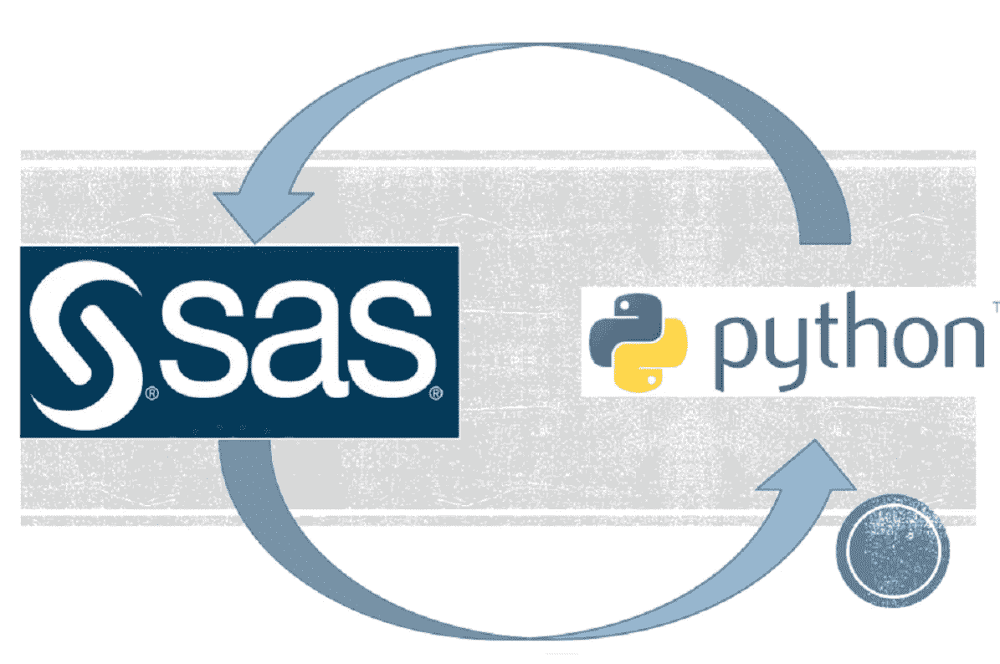
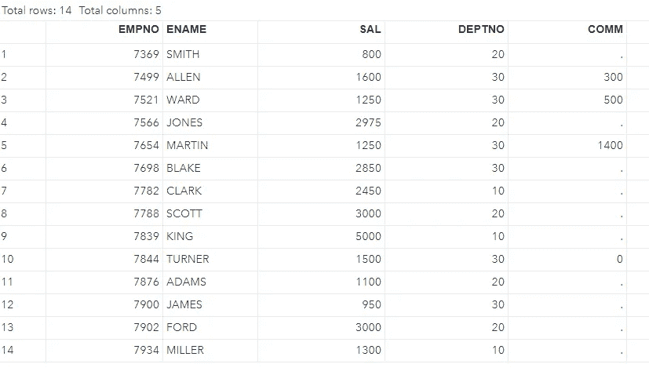
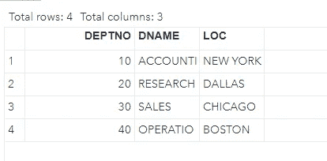
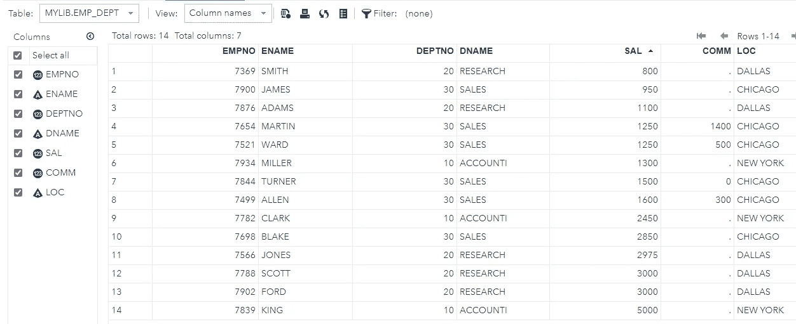
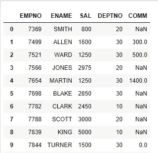
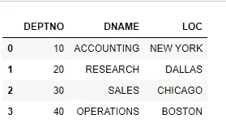
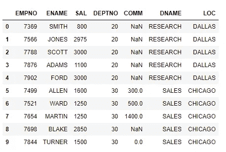

# 代码迁移:SAS 到 Python

> 原文：<https://pub.towardsai.net/code-migration-sas-to-python-2d3a9e5baea8?source=collection_archive---------3----------------------->

## [编程](https://towardsai.net/p/category/programming)

本文的目标是建立对 SAS 编程的基本理解，并用 Python 编程语言重写该特性。作为演示的一部分，我必须用 SAS 构建一个小的 ETL 过程，并用 Python 重新设计。



1.  **创建 SAS 库并导入数据集**

```
--SAS library creation
libname mylib '<path>'; --import emp dataset
DATA mylib.emp;  --> **Data step**
	infile '/folders/myfolders/emp.csv'
	dlm=','
	FIRSTOBS=2 DSD;
	input EMPNO ENAME $ SAL DEPTNO COMM;
run;
```



emp 数据集

```
DATA mylib.dept; --> **Data step**
	infile '/folders/myfolders/dept.csv'
	dlm=','
	FIRSTOBS=2 DSD;
	input DEPTNO DNAME $ LOC $;
run;
```



部门数据集

**2。SAS 编程结构解释**

SAS 编程包括三个基本步骤:-数据步骤、过程步骤和输出步骤。

**数据步骤**包括将数据集加载到 SAS 存储器(RAM)中，变量识别(列在 SAS 中被称为变量)。简而言之，这一步是解析和数据加载的结合。在 SAS 中，数据或记录被称为观察值。

**PROC 步骤**涉及数据分析部分，基本上是调用 SAS 内置程序来分析数据。

**输出步骤:**打印或存储**过程步骤的结果。**

**3。SAS ETL**

下一步是对加载到 SAS 内存中的上述 emp 和 dept 数据集执行连接。但是 SAS 要求在加入之前对数据进行排序。

对 EMP 数据集进行排序，因为 DEPT 数据集已经按照连接键“DEPTNO”进行了排序

```
proc sort data=mylib.emp; --> **Proc step**
 by DEPTNO;
```

上面的步骤是 proc 步骤。

接下来是对员工和部门数据集执行合并操作。

```
DATA mylib.emp_dept; --> equi join
 merge mylib.dept(in=X) mylib.emp(in=Y);
 by DEPTNO;
 if X and Y;
run;
```

SAS 的默认连接策略是完全外部连接，不需要提及任何条件。在我们的例子中，连接是等价连接。

让我们打破连接，试着理解什么是什么？

**Merge:** 在 SAS 中，Merge 是 join 操作的关键字。

**IN: in=val** ，代表只保留匹配值。

**由:**提及加入键。

当业务需要特定格式的输出时，对 SAS 变量(列)进行重新排序。

```
#reorder SAS variables
DATA mylib.emp_dept;
 retain EMPNO ENAME DEPTNO DNAME SAL COMM LOC;
 set mylib.emp_dept;
run;
```



重新排序的输出如下

> **注:**SAS 中的空值用“.”表示

下一步是将表数据写入 CSV 文件。

```
#write data to csv file
proc export data=mylib.emp_dept
 outfile='/folders/myfolders/emp_dept.csv'
    dbms= csv
    replace; --> to overwrite existing file, truncate load
run;
```

我们已经使用 SAS 编程成功地完成了 ETL 过程。下一步是使用 Python 编程复制或重新设计相同的代码。

**4。SAS 程序的 Python 副本**

导入必备库和数据集。

```
import pandas as pd
emp_df= pd.read_csv(r’D:<path>\emp.csv’)
emp_df.head(10)
```



emp 数据集

```
dept_df= pd.read_csv('D:<path>\dept.csv’)
dept_df.head(5)
```



部门数据集

```
#merge the dataset to perform inner join
final_df=pd.merge(emp_df,dept_df[[‘DEPTNO’,’DNAME’,’LOC’]],on=’DEPTNO’,how=’inner’)
final_df.head(10)
```



员工-部门合并数据

下一步是将合并的数据集写入 CSV 文件。

```
#write pandas df to csv file
final_df.to_csv(‘D:<path>\emp_dept.csv’,index=False)
```

我们已经成功地编写了 CSV 格式的输出，并且用 python 复制了 SAS 应用程序代码。

总而言之，首先，我们使用 SAS 编程设计了一个简单的 ETL 应用程序，然后使用 Python 编程重新设计了同一个应用程序。

感谢大家对内容的支持。