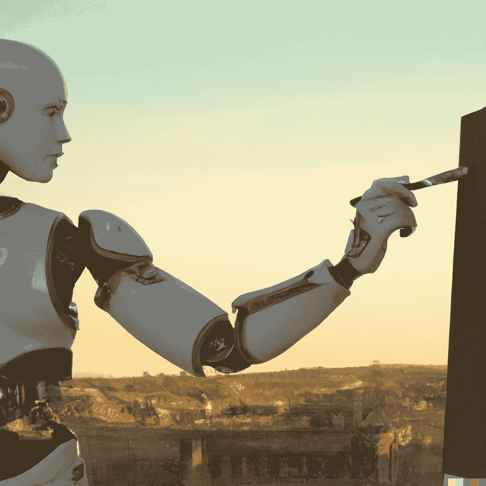
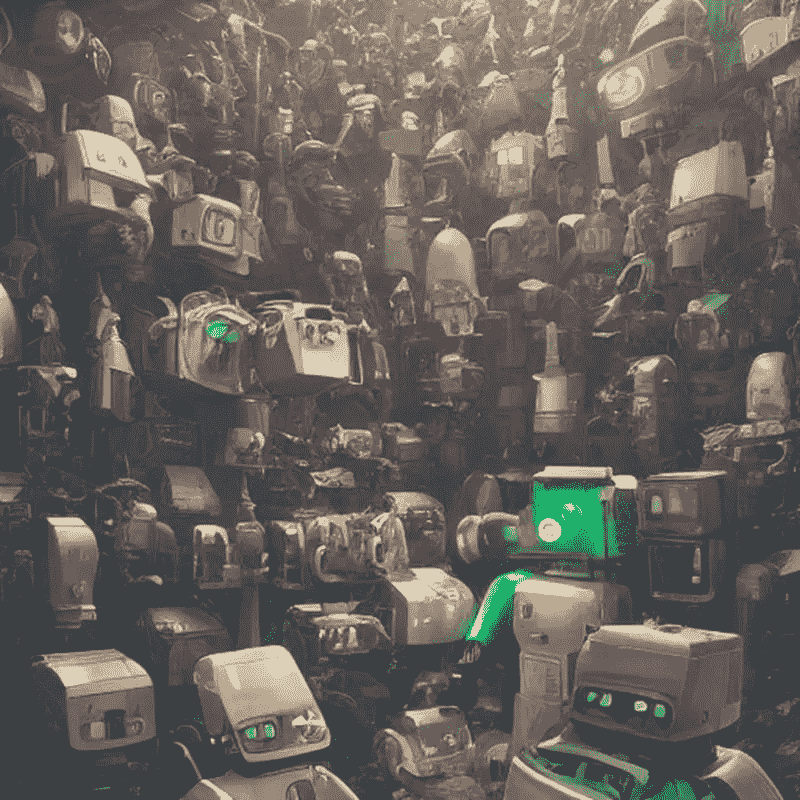
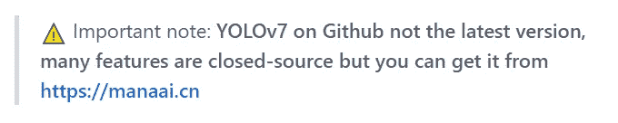
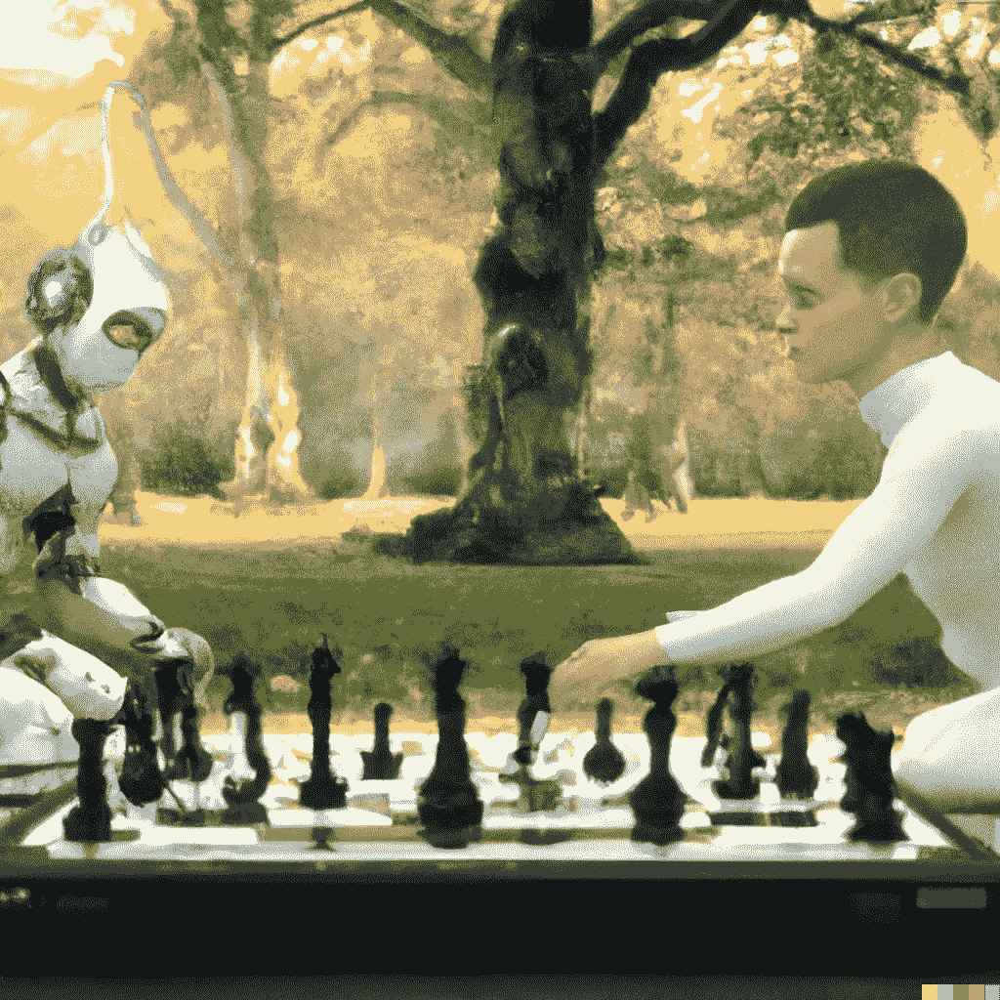
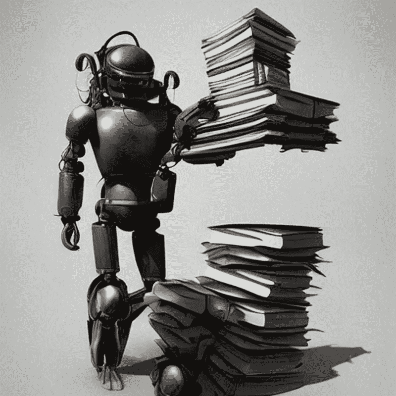
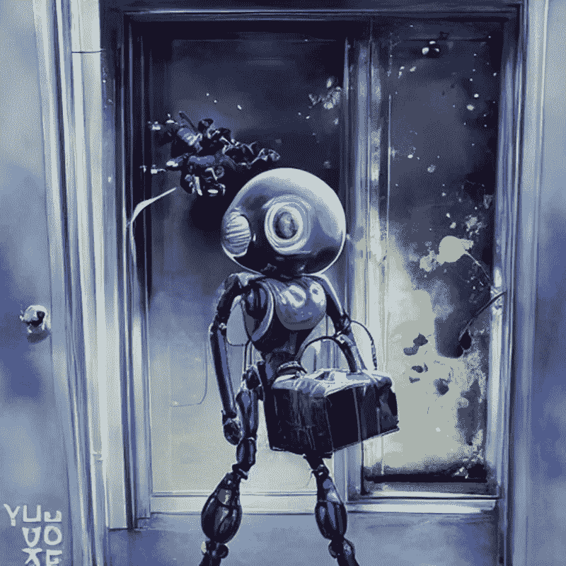

# 科学和人工智能中的代码再现性危机

> 原文：<https://pub.towardsai.net/code-reproducibility-crisis-in-science-and-ai-fa2f2ec955b4?source=collection_archive---------0----------------------->

## 拯救人工智能和科学研究需要我们分享更多

作者使用 OpenAI 的 [DALL-E 2](https://arxiv.org/pdf/2204.06125.pdf) 生成的图像

现代科学面临着再现性问题。通常，一个科学项目的成果是在一个著名的期刊上发表研究。在那之后，一个人开始新的项目。从微生物学到天体物理学，越来越多的论文提出了不可重复的结果。都说迷信和科学的区别在于后者是可复制的，但这种区别越来越微妙。

许多文章都谈到了这个问题，也有许多讨论正在进行。在本文中，重点不是再现结果的困难，而是代码和数据集的可再现性和可重用性问题。**如果你在笔记本的开头导入了 scikit-learn、NumPy 或 Matplotilib，那么这篇文章也是关于你的。**

# **不敢问**

图片由[克里斯蒂娜面粉](https://unsplash.com/@tinaflour)在[unsplash.com](https://unsplash.com/)

近年来，医学、生物学、甚至心理学领域对软件和代码的使用呈爆炸式增长。现在几乎没有一篇科学文章不以代码的使用为特色，或者已经积累了一个数据集。另一方面，生物学和计算机科学已经优雅地融合成一门新的科学，叫做生物信息学。此外，许多科学文章使用机器学习模型(从简单的回归到复杂的卷积神经网络)。

**第一个问题是，即使作者开发了一种新算法，它也不会在任何存储库中发布。更不用说算法的细节经常被故意以模糊的方式描述，这阻碍了任何想要复制它的人。一般来说，只有很少一部分期刊要求数据和代码都要发表(研究表明只有 7%的外科期刊要求这样)。**

> “我们想要一个数据经常被用于发现、推进科学、基于证据和数据驱动的政策的世界。有驱动整个领域的数据集，如果没有这些驱动它的开放数据集，研究领域就不会有今天。”—丹妮拉·洛温伯格([来源](https://arstechnica.com/science/2021/11/keeping-science-reproducible-in-a-world-of-custom-code-and-data/))

凯利·麦克林托克在 unsplash.com 拍摄的照片

通常，结果是读入方法:数据不可用。另一方面，在其指南中要求数据共享的期刊只能用一个模糊的声明，如“根据请求提供”或我最喜欢的“根据合理请求提供数据和代码”。**显然，许多请求是不合理的，因为经常得不到回应。**

[Victoria Stodden 通过给发表在《科学》杂志上的 200 篇文章的作者写信来获得原始数据和代码，从而测试了这个系统](https://www.pnas.org/doi/full/10.1073/pnas.1708290115)。他们只能得到最小程度的回应，我只能在 26%的情况下复制结果。

这些方法也缺乏信息，[梅奥诊所的一项研究显示](https://elifesciences.org/articles/36163)分析了 225 篇文章，指出只有 12 篇文章有足够的细节来重现统计测试是如何进行的。更不用说那些使用更复杂的算法和用简洁的术语描述模型的文章了(通常是像“我们使用卷积神经网络来……”这样的东西)。

> “如果你从 PDF 中重新输入或剪切并粘贴代码，它不会做它应该做的事情。他们发布的几乎是正确的代码，但显然不是他们使用的代码”——Lumley([source](https://arstechnica.com/science/2021/11/keeping-science-reproducible-in-a-world-of-custom-code-and-data/))

此外，研究人员不愿意公布数据集的另一个原因是，他们得不到引用。在一个他们的职业生涯依赖于引用次数的世界里，最好把它留给自己，用在另一篇论文上。

# **遗忘代码库**

图片由 [Gabriel Sollmann](https://unsplash.com/@ccgabon) 在[unsplash.com](https://unsplash.com/)拍摄

**科研基于开源软件**。2019 年，一个黑洞的图像被公布，让世界感到惊讶和着迷。很少有人知道用于该图像的库中的[是 Matplotlib](https://www.nature.com/articles/d41586-019-02046-0) 。

数据科学和其他研究领域依赖于 Python 或 r 中的开源库。这些库的底层是学生、博士生和博士后。通常，代码是由没有接受过足够培训的学生开发的，他们不知道最佳的文档和测试实践。研究人员经常花费大量时间试图修复漏洞或兼容性问题，却找不到足够的文档或问题的答案。

> “他们试图找到它，但没有网站，或者链接断开，或者它不再编译，或者当他们试图在他们的数据上运行它时崩溃。”——[来源](https://www.nature.com/articles/d41586-019-02046-0)

此外，这些代码中有许多是用废弃的库和废弃的函数编写的(称为“[依赖地狱](https://en.wikipedia.org/wiki/Dependency_hell)”)。然后，这些代码由一名博士生或博士后发布，他们的合同即将到期，只能听天由命。

正如 scikit-learn 的共同开发者 Nelle Varoquaux 承认的那样，这个领域正在迅速发展。库的需求在不断发展，数据集变得越来越大，例如，无法放入 RAM。

正如经常提到的，这些代码没有很好的文档记录。许多研究人员更喜欢在他们的个人 GitHub 页面上发布代码，而不是在诸如 R 的 [CRAN](https://cran.r-project.org/) 和 [Bioconductor](https://www.bioconductor.org/) 或 python 的 [PyPi](https://pypi.org/) 等存储库中发布代码。

此外，另一个问题是研究往往缺乏资金。机构通常不重视维护代码的重要性，可用的资金也很少。在资金申请中，研究小组忽略了软件工程师的资金申请，因为他们知道这不太可能被批准。**例如，在黑洞图像发表后不久，就有人申请资金支持使其成为可能的 scipy 生态系统，但拨款被拒绝了。**

# **不能自我复制的人工智能生物**

作者使用[稳定扩散](https://arxiv.org/abs/2112.10752)创建的图像

数据科学的发展会更好吗？有人可能会认为，那些将代码作为自己业务的人应该知道文档的可再现性和最佳实践的重要性。

事实上，数据科学的情况也不乐观。事实上，并不是所有的文章都发表了代码或者他们算法的细节。有时，当开发一种新算法时，很难将其与基准或最先进的算法进行比较。正如蒙特利尔大学的一名博士生所述，他们试图复制另一种算法的代码，以与自己的算法进行比较:[我们尝试了 2 个月，但我们无法接近](https://www.science.org/doi/epdf/10.1126/science.359.6377.725)。"

> “我认为这个领域之外的人可能会认为，因为我们有代码，所以重现性是有保证的。远非如此”——尼古拉斯·罗杰尔([来源](https://www.science.org/doi/epdf/10.1126/science.359.6377.725)

**在主要会议上被接受的文章中有 43%不能被复制。**这是[Open Review](https://openreview.net/submissions?venue=ML_Reproducibility_Challenge/2021/Fall)做的一个调查结果，技术上这些文章都通过了双盲评审。此外，[国家人工智能](https://www.stateof.ai/)报告说，只有 15%的科学文章报告了代码。

有时代码不存在，方法被故意混淆，或者只有伪代码存在。更不用说，如果没有正确选择超参数，原始数据集即使有代码也很难再现模型。已经指出，相同的随机种子有时会相当大地改变模型的性能。

例如，最广泛使用的模型之一是 YOLO，它现在是第七个版本，代码在 GitHub 上，但只需滚动 read.me(主页)即可找到:

作者截图。图片来源:[此处](https://github.com/jinfagang/yolov7_d2)

不共享模型的借口五花八门:代码基于未公开的代码，代码受利益保护，[算法太危险](https://futurism.com/the-byte/openai-released-ai-dangerous-share) (OpenAI 和 Google 最喜欢的借口)。

事实上，谷歌健康在 2020 年发表了一篇文章，声称其人工智能能够检测图像中的乳腺癌病变。这篇文章提供的关于代码的信息如此之少，以至于 31 位愤怒的科学家[在《自然》](https://www.nature.com/articles/s41586-020-2766-y.epdf?sharing_token=Q-mxlR5XQVIgx5dLErVF09RgN0jAjWel9jnR3ZoTv0M3qEeZVaYZS89U0ri_i4YI_lJ0an-lE15Ncv2e1v5F7I2jYVuc7_mR1WrnlDjpWJ6ANzSjO0KJiERmpzE097VzbFgywD7RRHVOYg305JycIUX7UQDWkLlgHtsoU72ppNz371N0ezykZ9PnvbrWyOcFOsTNlfOn7JEEkD77Fn6xH_fiEBZlVRpFercYEYSD6i0%3D&tracking_referrer=www.technologyreview.com)上发表了一封信，他们在信中实际上将谷歌的文章称为产品广告，而不是科学文章。在信中，他们实事求是地表示，人工智能正面临着可复制性危机。

> “当我们看到谷歌的那篇论文时，我们意识到这是一个非常高调的期刊发表一项与科学无关的非常令人兴奋的研究的又一个例子。更多的是酷派科技的广告。我们真的拿它没办法。”-Habe-Kains ( [来源](https://www.technologyreview.com/2020/11/12/1011944/artificial-intelligence-replication-crisis-science-big-tech-google-deepmind-facebook-openai/)

> “那就算是研究了吗？不清楚你是在展示你的模型还是你的预算的优越性。”——安娜·罗杰斯([来源](https://www.wired.com/story/artificial-intelligence-confronts-reproducibility-crisis/))

这不是小事，因为各种人工智能模型具有真正的影响和应用。如果研究人员不能探索代码和模型，就不能评估它们的健壮性、偏倚和安全性。

无论如何，能够复制一个模型不是一个小任务。特别是当涉及到大型模型时，从方法中复制一个模型的计算和知识需求是非常困难的。事实上， [**脸书自己也很难复制 AlphaGO**](https://arxiv.org/pdf/1902.04522.pdf) 的结果。该团队声称，在没有可用代码的情况下取得成功是一项令人筋疲力尽的任务(他们在文章中写道，这项任务“非常难以(如果不是不可能的话)复制、研究、改进和扩展”)。**而如果对于一个预算庞大的跨国公司来说很难，那就想象一下独立实验室吧。**

作者使用 OpenAI 的 [DALL-E 2](https://arxiv.org/pdf/2204.06125.pdf) 生成的图像

**数据科学界也不喜欢共享数据集**。尤其是因为这可能会让他们面临尴尬的错误:例如，用于生成图像的模型是在一个名为 [LAION](https://laion.ai/blog/laion-5b/) 的数据集上训练的，但这远非完美。首先，它是未经许可从网上大量下载获得的。同时，大多数是艺术家和摄影师的图像，他们不会想到他们的作品会被用来训练人工智能模型。在里面，他们甚至发现了不应该在那里的[医学图像](https://arstechnica.com/information-technology/2022/09/artist-finds-private-medical-record-photos-in-popular-ai-training-data-set/)，PS 过的名人色情图片[，偷来的未经同意的色情图片](https://www.vice.com/en/article/93ad75/isis-executions-and-non-consensual-porn-are-powering-ai-art)，甚至还有恐怖分子执行[死刑的图像](https://www.vice.com/en/article/3ad58k/ai-is-probably-using-your-images-and-its-not-easy-to-opt-out)。

# **留给我们的遗产**

作者使用[稳定扩散](https://arxiv.org/abs/2112.10752)创建的图像

一般来说，许多研究人员的想法是，如果你没有充分利用数据集，就不要发布它。然而，如果没有 Iris 数据集，我们当中谁会学会编程呢？出于这个原因，[在数据在](https://science.nasa.gov/science-red/s3fs-public/atoms/files/Scientific%20Information%20policy%20SPD-41.pdf)[公共数据存储库](https://archive.stsci.edu/missions-and-data/hst)发布之前，美国宇航局授予哈勃太空望远镜用户一段独占权，整个社区都可以受益(对于韦伯太空望远镜[来说，这段时间为一年](https://jwst.nasa.gov/content/forScientists/faqSolarsystem.html))。

如今，许多期刊还要求基因组数据在专门的存储库中发布( [dbGAP](https://www.ncbi.nlm.nih.gov/gap/) 、 [GEO Dataset](https://www.ncbi.nlm.nih.gov/gds) 等等)。对数据的访问受到正式程序的保护，因为这是患者的医疗数据，可能会威胁隐私。

**就连融资机构也意识到了数据共享的必要性，以及监管的重要性**。[美国国家卫生研究院(NIH)](https://sharing.nih.gov/) 在 2020 年要求有数据部分的拨款申请必须指定他们的[数据管理和共享计划](https://www.nsf.gov/pubs/policydocs/grantsgovguide1021.pdf)。

然后是戈登和贝蒂·摩尔基金会、阿尔弗雷德·p·斯隆基金会和资助开源软件的[陈·扎克伯格倡议](https://chanzuckerberg.com/rfa/essential-open-source-software-for-science/)(例如，最后一个资助 scikit-image、NumPy、ImageJ 和斐济平台)。此外，最近[施密特期货](https://www.schmidtfutures.com/our-work/for-science/)(由前谷歌首席执行官埃里克·施密特创立的组织)[决定资助一个致力于维护科学软件(包括与全球变暖和生态变化相关的模型)的工程师网络](https://www.nature.com/articles/d41586-022-01901-x)。

**也有专门描述和分享数据集的期刊**(如[科学数据](https://www.nature.com/sdata/principles))。更不用说像 [Zenodo](https://zenodo.org/) 这样的库允许你将 DOI 与代码和数据联系起来，并使它们可引用。

作者使用[稳定扩散](https://arxiv.org/abs/2112.10752)创建的图像

**那代码呢？**与此同时，有一些项目旨在解决数据盲问题。事实上，有一些组织，如[软件木工](https://software-carpentry.org/)和 eScience Institute(华盛顿大学)组织新兵训练营。或者荷兰科学中心，他们制定了[可用指南](https://guide.esciencecenter.nl/#/)。

大学开始意识到学生和博士后写的模型和代码可能有利于发表，但不可维护。直到现在，图书馆通常是在自愿的基础上维护的，但这是不可持续的。因此，英国大学设立了一个[研究软件工程师](https://www.nature.com/articles/d41586-022-01516-2)的职位，他负责开发对学术研究很重要的软件。

此外，我们建议对所有发布的代码使用容器(如 [docker](https://www.docker.com/) )，这样它就可以运行而不会有任何兼容性问题。还有专门针对数据和生物代码的容器的储存库(比如 R 或 python 中的 [bioflow](https://icy.bioimageanalysis.org/plugin/BioFlow/) 、 [RNASeq pipeline](https://github.com/MaayanLab/Zika-RNAseq-Pipeline/blob/master/README.dockerhub.md) 和[pipeline](https://stenci.la/))。像[Nature Machine intelligence](https://www.nature.com/articles/s42256-022-00554-9)这样的论文要求代码可以在 [Code Ocean](https://codeocean.com/) 或 [Google Colab](https://colab.research.google.com/) 上获得，以便在[同行评审](https://help.codeocean.com/en/articles/2644233-peer-review-on-code-ocean)期间你可以运行代码。

领先的科学会议也更加关注代码的存在，以更好地控制方法。许多人鼓励在代码描述中有标签标明使用了哪些数据。NeurIPS 也开始链接代码。更不用说，不仅社区经常试图复制已发布的模型，还有一个名为 [ReScience](http://rescience.github.io/) 的倡议，负责发布已复制的 AI 模型。

# 离别的思绪

作者使用[稳定扩散](https://arxiv.org/abs/2112.10752)创建的图像

科学的基本原则是复制结果的能力。今天，科学越来越多地基于大型数据集、分析软件和机器学习模型的使用。数据科学和科学都需要推进既可用又可重用的数据和模型。此外，您导入到代码中的主要库有(举个例子，scikit-learn、NumPy、matplotilib)。它们由研究人员和志愿者开发和维护，但这并不总是可持续的。

算法已经并将会有越来越多的现实应用和影响，因此由独立实验室对其进行测试至关重要。更不用说[训练数据集对潜在偏差](https://towardsdatascience.com/a-critical-analysis-of-your-dataset-2b388e7ca01e)有着巨大的影响，这也是应该讨论的(而且一旦一个模型被训练[就很难让它忘记它不应该知道的](https://towardsdatascience.com/machine-unlearning-the-duty-of-forgetting-3666e5b9f6e5))。

当一个模型是开源的，它允许它被重用。一个 [lphaFold2 如果没有被开源，它的预测没有被社区所知，就不会有同样的影响](https://towardsdatascience.com/alphafold2-year-1-did-it-change-the-world-499a5a38130a)。出于同样的原因，我们将看到更多基于稳定扩散的应用，而不是基于 DALL-E 的应用。

好消息是研究人员、大学和资助机构已经意识到了这一点。

# 如果你觉得有趣:

你可以寻找我的其他文章，你也可以 [**订阅**](https://salvatore-raieli.medium.com/subscribe) 在我发表文章时获得通知，你也可以在**[**LinkedIn**](https://www.linkedin.com/in/salvatore-raieli/)**上连接或联系我。**感谢您的支持！**

**这是我的 GitHub 知识库的链接，我计划在这里收集代码和许多与机器学习、人工智能等相关的资源。**

** [## GitHub - SalvatoreRa/tutorial:关于机器学习、人工智能、数据科学的教程…

### 关于机器学习、人工智能、数据科学的教程，包括数学解释和可重复使用的代码(python…

github.com](https://github.com/SalvatoreRa/tutorial) 

或者随意查看我在 Medium 上的其他文章:

 [## 人工智能如何帮助保存艺术品

### 艺术杰作随时都是风险；人工智能和新技术可以助一臂之力

towardsdatascience.com](https://towardsdatascience.com/how-ai-could-help-preserve-art-f40c8376781d)  [## 人工智能如何拯救亚马逊雨林

### 亚马逊正处于危险之中，人工智能可以帮助保护它

towardsdatascience.com](https://towardsdatascience.com/how-artificial-intelligence-could-save-the-amazon-rainforest-688fa505c455)  [## 用艾重新想象小王子

### 人工智能如何从《小王子》中的人物描述中重构他们的形象

medium.com](https://medium.com/mlearning-ai/reimagining-the-little-prince-with-ai-7e9f68ed8b3c)  [## 说生命的语言:AlphaFold2 和公司如何改变生物学

### 人工智能正在重塑生物学研究，并开辟治疗的新领域

towardsdatascience.com](https://towardsdatascience.com/speaking-the-language-of-life-how-alphafold2-and-co-are-changing-biology-97cff7496221)**