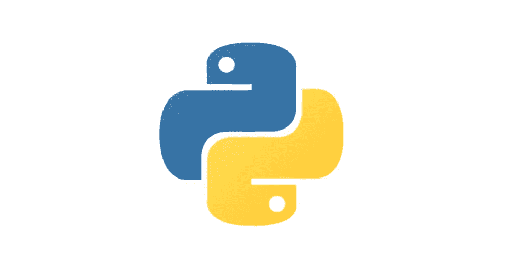
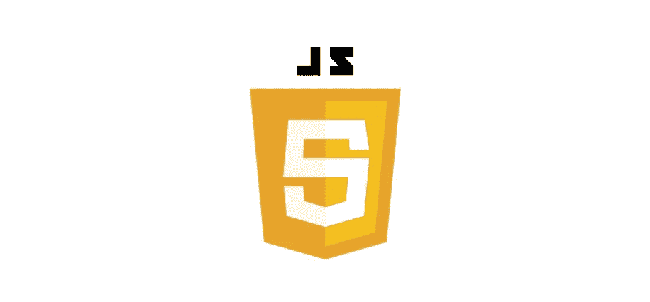
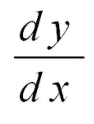
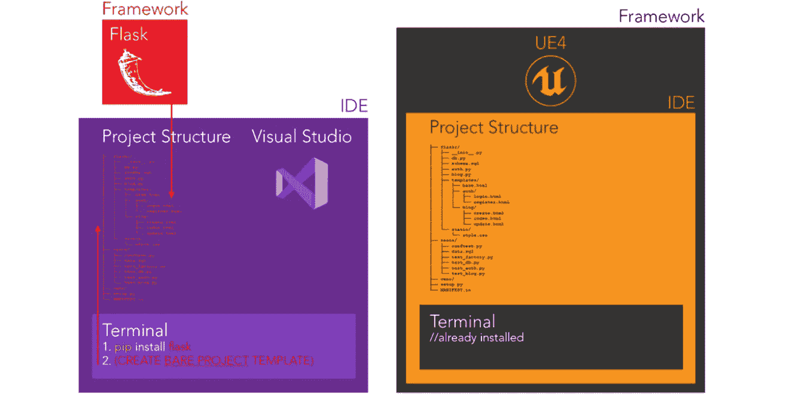
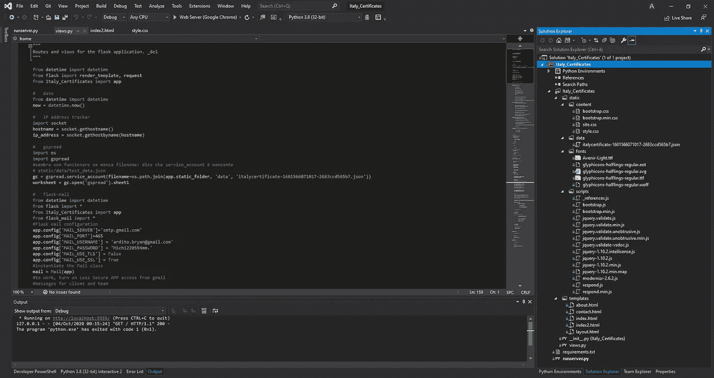

# 编码是一个开始，但这还不够！

> 原文：<https://pub.towardsai.net/coding-is-a-start-but-its-not-enough-78e048e71a19?source=collection_archive---------3----------------------->

## [计算机科学](https://towardsai.net/p/category/computer-science)，[编程](https://towardsai.net/p/category/programming)

## 学习编码值得吗？

学习编码值得吗？简答:肯定有！在我所学的所有东西中，它的实际用途可能排在第一或第二位，与数学竞争第一位

## 学习你的第一门计算机语言需要多长时间？

Python 语言徽标

我会说在 3 到 6 个月之间，这取决于你的努力和你编码的多少。正如你所想象的那样，精通的唯一方法就是整天都编码。

然而，学习计算机语言时，你必须熟悉的最重要的事情不是语法，而是逻辑结构。

计算机语言是一组指令，可以用来创建工具或执行特定的计算。这些指令的序列被称为算法。尽管没有太多的逻辑结构可供选择(不需要几个月就能学会)，但你真的需要集中精力遍历所有的逻辑结构，并详细研究它们。

一旦你掌握了一门计算机语言，那么你手中就有了创造你想要的一切的工具。你知道的越多(语法和逻辑结构)，你能做的事情就越多。

## 学习你的第二种计算机语言需要多长时间？

Javascript 语言徽标

有趣的是，现在我已经知道了 python 和 solidity，我需要一个月的时间来适应一门新的计算机语言。与你学习第一门计算机语言的时间相比，为什么这么少？

如果你学的没错，你已经知道了语言背后的逻辑，数据结构等主要的逻辑结构是什么，函数和类的使用，库，以及主要的编程范式:面向对象编程。

一旦你开始学习你的第二语言，你不需要再学习那些逻辑结构的功能，除非第二语言的逻辑在某些特定的主题上与第一语言的逻辑有显著的不同。更准确地说，一旦你在第二语言中遇到类似的逻辑结构，你只需要学习新的语法。

例如，学习衍生品只是第一次有挑战性。简单地说，你可能会使用洛必达符号:

洛必达符号

然而，在高中你也必须知道如何使用莱布尼茨民族:

莱布尼茨符号

因为逻辑是一样的，你不必从头开始学习导数，只需要学习如何运用语法。这些都是学习你的第二语言时几乎不存在的问题。例如，学习如何正确使用类(顺便说一下，它们非常有用)只有在第一次学习时才具有挑战性。

与原始语言相比，第二语言可能有额外的方法，但它们只是新的副主题，与类本身的相关性更低。

## 光有编码技能能做什么？

不幸的是，这正是事情变得具有挑战性的地方。编码本身是有用的，但非常不实用。事实上，假设你完全知道如何用一种语言编码，仅仅这样并不会让你走得更远。仅用代码，你可能能够解决数学问题，访问算法，并创建模拟，但如果你想让编码有利可图，还有很多事情要做。

## 工具和库

编码人员应该学会的第一件事是扩展他们的问题集，这样他们就可以很容易地找到解决方案。Python 附带了一组包，但它们不足以处理复杂的任务。一些最有用的库的例子，让你了解我的意思:

* * *我精通 Python，这些都是独家 Python 语言

*   用于机器学习的 Sklearn
*   熊猫换数据框
*   深度学习的 Tensorflow
*   pyportfolioopt 用于投资组合优化

问题是你不能指望通过查看语法来学习这些工具。它们中的每一个都需要精确的代码行来执行，但是你需要熟悉背后的理论和数学。比如之前你得掌握统计学，然后你才能明白如何应用 AI。只有这样，你才能开始使用工具，否则，它是没有意义的。这同样适用于金融和所有其他科目。

GOOG 股票回报的蒙特卡洛示例

然而，到目前为止，您可能已经成功构建了前端应用程序。你还不能构建任何用户自己可以与之交互的东西。到目前为止，忘记建设脸书。

## 构建您自己的工具

实际上，您可以开始构建自己的库，为函数命名，以及为自己的目的命名您想要的类。然而，这已经要求对语言有一个相当好的理解，并且对如何组织包有很好的经验。

## 建筑应用

如果你想升级你的游戏，开始做一些你可以卖给用户的东西，那就开始开发应用程序:澄清一下，我指的不仅仅是手机应用程序，这是一个很大的误解。你在 PC 上运行的每一个常用软件，像微软的 Words，或者在线互动网站，这些都是 APP 类别下的。

使用两种不同框架的项目结构示例(Flask，UE4)

一旦你掌握了一门计算机语言，你就可以学习构建应用程序背后的理论。但是，它非常复杂，远比编码本身复杂。应用程序是由更多的计算机语言混合而成的，需要全面了解如何使用 IDE、项目结构，以及如何优化和部署它们。

Visual Studio 2019 截图，构建 Web 应用

## 结论

总之，编码绝对值得学习，但不要指望成为马克·扎克伯格，即使你精通一门语言。有很多隐含的内容需要你去掌握，然后才能盈利。