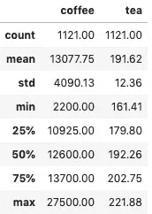
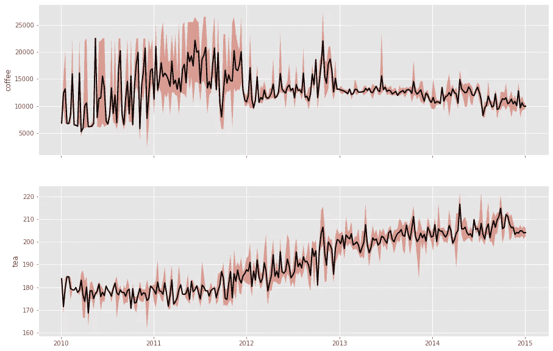
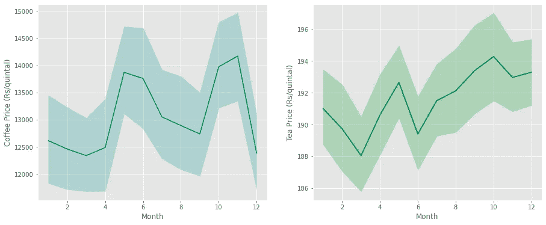
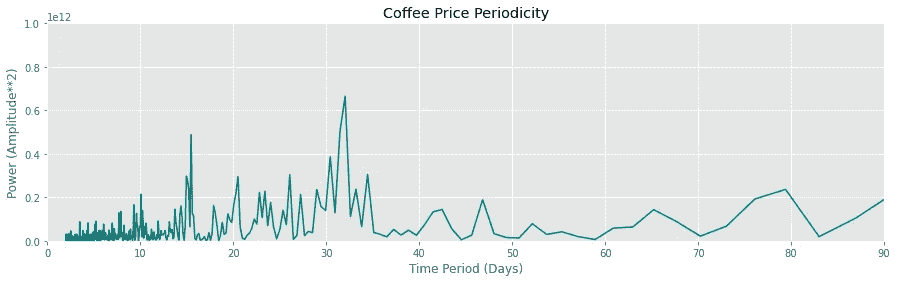
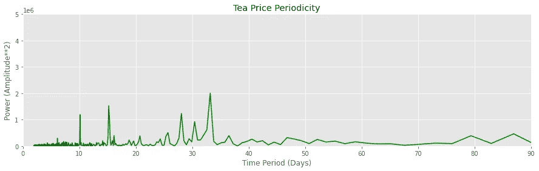
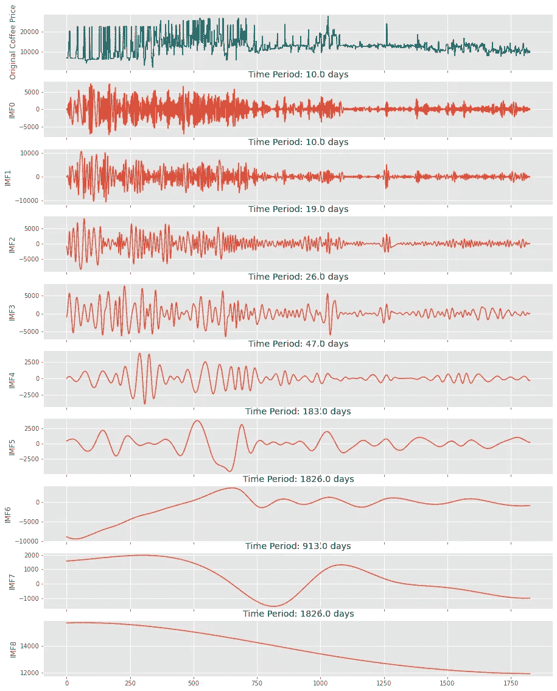
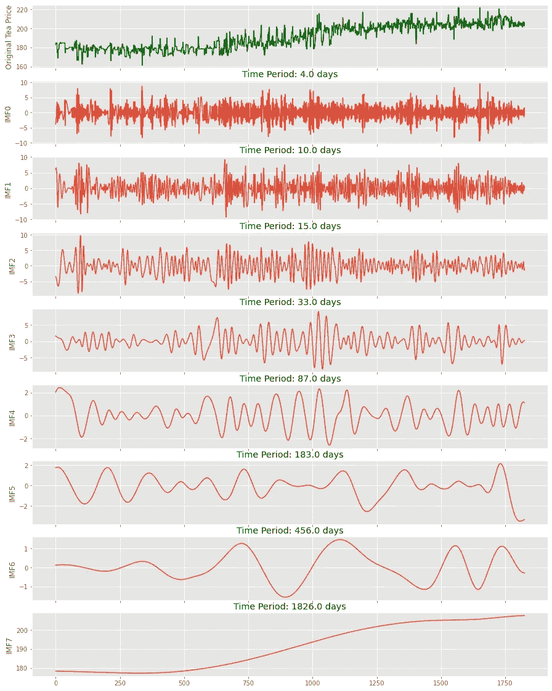

# 咖啡、茶和 EMD

> 原文：<https://pub.towardsai.net/coffee-tea-emd-19d1c387ea5e?source=collection_archive---------4----------------------->


由[迈克·肯尼利](https://unsplash.com/@asthetik?utm_source=medium&utm_medium=referral)在 [Unsplash](https://unsplash.com?utm_source=medium&utm_medium=referral) 上拍摄的照片

## [数据科学](https://towardsai.net/p/category/data-science)

## 使用经验模式分解来了解我喜欢的饮料的批发价格！

# 前言

我的早晨通常从一杯热气腾腾的黑咖啡开始。不，这不是昂贵的美食，而是速溶咖啡粉让我一上午都精力充沛。

我的夜晚通常更醇厚，一杯香浓的印度茶，也许几块饼干。他们提供了适量的咖啡因，可以一直坚持到晚上 10 点。

# 动机

我最近不得不在工作中使用一个漂亮的信号处理工具——`**Empirical Mode Decomposition (EMD)**`——我想这会是一个有趣的帖子！

在这篇文章中，我将使用我最喜欢的饮料的价格来给出 EMD 的一个高层次的概述，同时也涉及到`**Fast Fourier Transform (FFT)**`。

这些技术不限于信号处理领域，可以很容易地用于任何时间序列数据，以获得极其有用的见解！

*一如既往，你可以在我的*[*GitHub*](https://github.com/ani-rudra-chan/Coffee-Tea-EMD-Project.git)*资源库中查看完整的代码。*

# 数据源

印度政府主办的开放数据门户—[www.data.gov.in](http://www.data.gov.in)是一个搜索我的需求的好地方。我发现一些商品数据集似乎足够干净，可以使用。有些数据有点过时了，但是对于我的小练习来说，我认为这些数据已经足够了。所以我最终下载了散茶和咖啡粉的数据集。

# 关于数据

该数据集包含我提到的商品的每日批发价格信息。价格主要是商品在批发市场上的销售价格。

松散茶叶的数据集看起来像这样—

```
<class 'pandas.core.frame.DataFrame'>
DatetimeIndex: 114495 entries, 1997-11-25 to 2015-04-28
Data columns (total 3 columns):
 #   Column          Non-Null Count   Dtype  
---  ------          --------------   -----  
 0   Centre_Name     114495 non-null  object 
 1   Commodity_Name  114495 non-null  object 
 2   Price           114495 non-null  float64
dtypes: float64(1), object(2)
memory usage: 3.5+ MB
```

如你所见，数据集的功能非常有限，但这对我来说很好，因为我想单独查看价格。咖啡粉的数据集看起来像这样—

```
<class 'pandas.core.frame.DataFrame'>
DatetimeIndex: 11515 entries, 2003-01-07 to 2019-12-02
Data columns (total 8 columns):
 #   Column       Non-Null Count  Dtype 
---  ------       --------------  ----- 
 0   state        11515 non-null  object
 1   district     11515 non-null  object
 2   market       11515 non-null  object
 3   commodity    11515 non-null  object
 4   variety      11515 non-null  object
 5   min_price    11515 non-null  int64 
 6   max_price    11515 non-null  int64 
 7   modal_price  11515 non-null  int64 
dtypes: int64(3), object(5)
memory usage: 809.6+ KB
```

虽然这个数据集的特性稍微丰富一些，但是为了简单起见，我只使用了模态价格(*一天中最常见的价格)*。

# 数据预处理

经过一点预处理魔术之后，

```
# We select the modal_price for coffee and aggregate over the whole country
data0 = coffee_df.loc['2010':'2014', 'modal_price'].resample('D').mean()
# We aggregate over the whole country for the loose tea prices
data1 = tea_df.loc['2010':'2014', 'Price'].resample('D').mean() # We concatenate the data and fill in missing values
comm_df = pd.concat([data0, data1],axis=1)
comm_df.columns = ['coffee','tea']
comm_df = comm_df.dropna()
comm_df = comm_df.fillna(method='ffill')
```

数据准备好了！

```
<class 'pandas.core.frame.DataFrame'>
DatetimeIndex: 1121 entries, 2010-01-01 to 2014-12-31
Data columns (total 2 columns):
 #   Column  Non-Null Count  Dtype  
---  ------  --------------  -----  
 0   coffee  1121 non-null   float64
 1   tea     1121 non-null   float64
dtypes: float64(2)
memory usage: 26.3 KB
```

# 汇总统计数据

数据集的常规汇总统计如下所示—



*   咖啡:每公担卢比(1 公担= 100 公斤)
*   散装茶叶:每公担卢比

从汇总统计数据来看，显然**咖啡**是两者中价格较高的商品，也是多年来波动较大的商品。在印度，茶是两种饮料中更稳定也更便宜的选择。

# 时间序列分析

## 时间序列图

首先要做的是将商品价格绘制成一个时间序列，每天的最高价和最低价都包含在内。

```
fig, ax = plt.subplots(2,1, sharex=True, figsize=[15,10])for i in range(0,2):
    c = comm_df.iloc[:,i]
    c_low = c.resample('W').min()
    c_high = c.resample('W').max()
    c_mean = c.resample('W').mean()

    ax[i].plot(c_low.index, c_low.values, linewidth=2, linestyle='')
    ax[i].plot(c_mean.index, c_mean.values, linewidth=2, color='k')
    ax[i].plot(c_high.index, c_high.values, linewidth=2, linestyle='')
    ax[i].fill_between(c_low.index, c_low.values, c_high.values, alpha=0.5)
    ax[i].set_ylabel(comm_df.columns[i])
```



图 1—2010 年至 2015 年咖啡和茶叶价格的时间序列(来源:作者)

`**Observations:**`

*   咖啡价格大幅波动，尤其是在 2011 年至 2012 年；
*   价格中似乎有一些季节性(*或者换句话说，时间序列中的一些振荡或周期性*)；
*   茶叶价格呈现上涨趋势，但咖啡价格的上涨趋势并不明显。

使用`seaborn`的月度变化图将提供额外的洞察力——

```
fig,ax = plt.subplots(1,2,figsize=[15,6])
sns.lineplot(comm_df.index.month, comm_df.coffee, color='teal', ax=ax[0])
ax[0].set_xlabel('Month')
ax[0].set_ylabel('Coffee Price (Rs/quintal)')sns.lineplot(comm_df.index.month, comm_df.tea, color='green', ax=ax[1])
ax[1].set_xlabel('Month')
ax[1].set_ylabel('Tea Price (Rs/quintal)')
```



图 2——95%置信区间的月度价格变化(来源:作者)

`**Observations:**`

*   可以看出，从 12 月到 4 月，咖啡价格较低。这是因为印度的[咖啡收获季节](http://www.agritech.tnau.ac.in/horticulture/horti_plantation%20crops_coffee.html)发生在这几个月，所以自然地，预计这几个月后商品的价格会更高。
*   茶叶价格似乎在年初和年中有所下降。这也许可以用不同茶叶的季节性采摘来解释。

*那么，如何提取这些趋势和季节性信息呢？*

## 快速傅里叶变换

FFT 是离散傅立叶变换方法的算法实现。它是在频域中观察给定时间序列的一种手段。

通过计算序列中存在的功率，可以了解时间序列中的主导频率(*和后续时间段*)。

`scipy`中的`fftpack`允许用几行简短的代码实现这个算法

```
sig = d0.values #Just replace d0: Coffee with d1: tea
time_step = 1 #1 day
sig_fft = fftpack.fft(sig)
sample_freq = fftpack.fftfreq(sig.size, d=time_step)
power = np.abs(sig_fft)**2

pos_mask = np.where(sample_freq>0) #Considering only the positive components
freqs = sample_freq[pos_mask]
power = power[pos_mask]fig = plt.subplots(figsize=[15,4])
plt.title('Coffee Price Periodicity')
plt.plot(1/freqs, power, color='teal')
plt.xlim(0,90)
plt.ylim(0,1E12)
plt.xlabel('Time Period (Days)')
plt.ylabel('Power (Amplitude**2)')
```



图 3-咖啡和茶价格的主要时间段(来源:作者)

`**Observations:**`

*   咖啡和茶叶价格的主要周期约为 30 天。这意味着价格每 30 天周期性地上涨和下跌；
*   在大约 15 天和大约 10 天观察到较小的峰值，这意味着价格中也存在不太为人所知的周期性。

## **警告！**

*DFT 及其扩展 FFT，假设信号(也称为时间序列)可以由不同频率的正弦波的线性和组成。这个模型实际上是一个线性模型，严格适用于平稳信号(统计性质不随时间变化的信号)。然而，这一数据中的商品价格显然不是平稳的，似乎是非线性的。所以必须考虑另一种方法来分解时间序列。*

## 经验模态分解

EMD 是由黄锷在 1996 年首先提出的一种分解非线性和非平稳信号的方法。当时他在美国国家航空航天局工作，是一名流体力学家。


来源:[https://servicetoamericamedals.org/honorees/norden-e-huang/](https://servicetoamericamedals.org/honorees/norden-e-huang/)

*   EMD 本质上是一种**数据驱动** **自适应**信号分解技术。在精神上，它类似于傅立叶变换。
*   傅立叶变换试图将信号分解成不同频率的正弦波的简单线性组合。
*   另一方面，EMD 不做这种假设，但它需要其固有元件具有本地频率。这使得它在处理非线性信号时非常有用。
*   这些固有成分被称为**固有模式函数(IMF)** ，它们代表信号中存在的各种隐藏周期。
*   这些 IMF 必须满足两个合格标准:1) *过零点的数量和局部极值的数量最多相差 1* 和 2) *局部均值必须接近零。*
*   从信号中提取该 IMF 的过程被称为**筛选**，并且递归地进行，直到满足合适的停止标准。

在筛选和合格标准的帮助下，可以将非线性和非平稳信号分解成其固有分量，同时保持时域和频域中的信息。

EMD 可以使用最流行的 Python 库`PyEMD`来实现(*EMD*没有多少)。FFT 算法也可用于提取分解产生的 IMF 中的主频率

```
emd = EMD()
t = np.arange(0,d0.shape[0]) #Just replace d0: Coffee with d1: Tea
imfs = emd(d0.values, t)fig,ax = plt.subplots(imfs.shape[0]+1, 1, sharex=True, figsize=[15,20])
ax[0].plot(t,d0.values, color='teal')
ax[0].set_ylabel('Original Coffee Price')for i in range(0,imfs.shape[0]):
    ax[i+1].plot(t, imfs[i])
    ax[i+1].set_ylabel('IMF'+str(i))

    sig = imfs[i]
    time_step = 1 #1 Day
    sig_fft = fftpack.fft(sig)
    sample_freq = fftpack.fftfreq(sig.size, d=time_step)
    power = np.abs(sig_fft)
    pos = np.where(sample_freq>0)
    power = power[pos]
    sample_period = 1/sample_freq[pos]
    s = sample_period[np.where(power==power.max())][0]
    ax[i+1].set_title('Time Period: {} days'.format(np.round(s)))
```



图 4-咖啡价格的内在模式函数(来源:作者)



图 5 —茶叶价格的内在模式函数(来源:作者)

`**Observations:**`

*   经验模态分解将咖啡价格序列分解成若干个综合模态函数；
*   最后一个 IMF ( *又称最低阶 IMF*)称为残差，代表趋势；
*   残留物显示，咖啡价格似乎呈下降趋势，而茶叶价格似乎在上升；
*   每一个 IMF 都代表了价格中隐藏的周期性；
*   EMD 验证了在初始 FFT 方法中观察到的主要周期，也带来了一些额外的周期。

## **警告！**

*该方法的主要问题是很难将物理意义附加到生成的 IMF 上。由于提取是数据驱动的，并且是从单个信号中递归完成的，因此没有很好的数学框架来理解所提取的函数。*

# 结论

尽管有缺点，EMD 在分解非线性和非平稳信号时非常有用，不会丢失信息(*与 FFT 不同，FFT 仅适用于线性平稳信号，并且仅限于频域*

我希望这篇文章能让你体会到 EMD 在时间序列分析中的作用，尤其是当它与 FFT 结合使用时。

# 进一步阅读

1.  [https://www . clear . rice . edu/elec 301/projects 02/empirical mode/](https://www.clear.rice.edu/elec301/Projects02/empiricalMode/)
2.  A.Moghtaderi 等人/计算统计和数据分析 58(2013)114–126。**doi:10.1016/j . csda . 2011 . 05 . 015**
3.  [https://towards data science . com/decompositing-signal-using-experimental-mode-decomposition-algorithm-explain-for-dummy-93a 93304 c 541](https://towardsdatascience.com/decomposing-signal-using-empirical-mode-decomposition-algorithm-explanation-for-dummy-93a93304c541)
4.  [https://github.com/laszukdawid/PyEMD](https://github.com/laszukdawid/PyEMD)
5.  [https://build media . readthe docs . org/media/pdf/pye MD/latest/pye MD . pdf](https://buildmedia.readthedocs.org/media/pdf/pyemd/latest/pyemd.pdf)

再见！