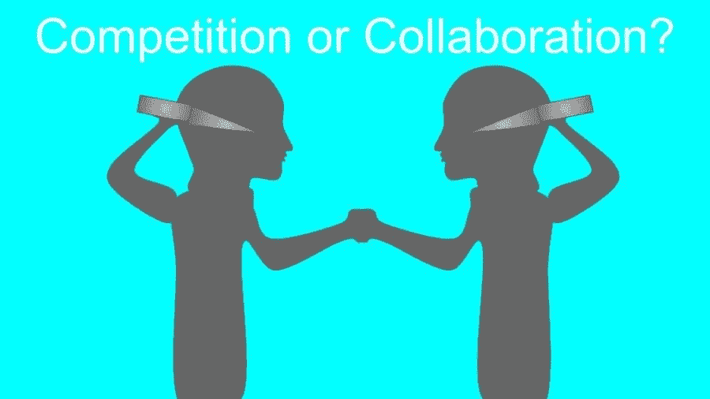
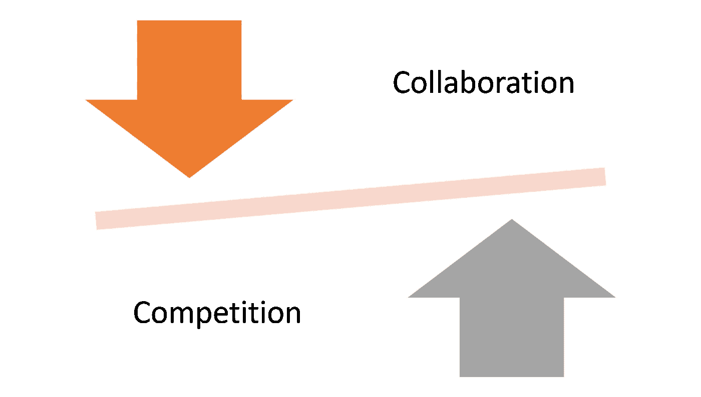
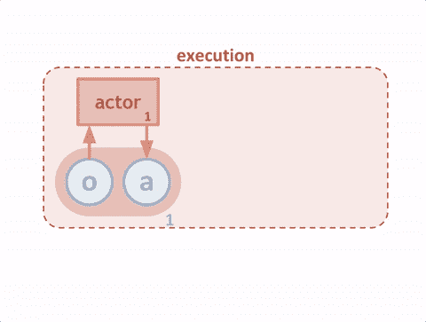
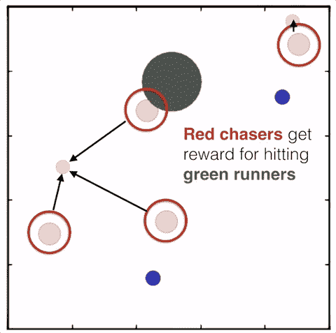
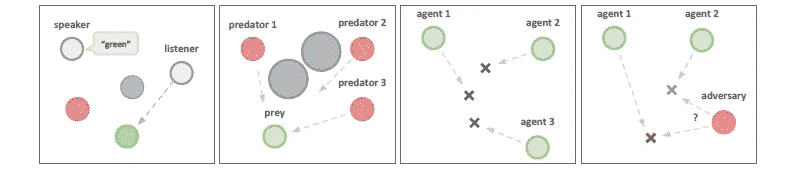
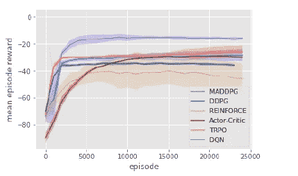

# 强化学习应用中的合作与竞争

> 原文：<https://pub.towardsai.net/collaboration-and-competition-in-reinforcement-learning-applications-9e4e1c29ac66?source=collection_archive---------1----------------------->

## [人工智能](https://towardsai.net/p/category/artificial-intelligence)

## 回顾 OpenAI 的多主体演员-评论家技术。

来源:[https://lafayettetimes . org/2130/opinion/competition-or-collaboration/](https://lafayettetimes.org/2130/opinion/competition-or-collaboration/)

> 我最近创办了一份专注于人工智能的教育时事通讯，已经有超过 10 万名订户。《序列》是一份无废话(意思是没有炒作，没有新闻等)的 ML 导向时事通讯，需要 5 分钟阅读。目标是让你与机器学习项目、研究论文和概念保持同步。请通过订阅以下内容来尝试一下:

 [## 序列|子堆栈

### 订阅人工智能世界中最相关的项目和研究论文。受到 110，000+的信任…

thesequence.ai](http://thesequence.ai/) 

合作竞争是一个新词，通常用来描述合作与竞争之间的平衡关系。竞争是进化的标志之一，也是社会环境中最成熟的动力之一，因为人类走到一起实现一个特定的目标，同时保持对其他目标的竞争力。多代理强化学习(MARL)是深度学习空间的学科，它类似于我们的社会环境，因为代理需要交互来完成特定的任务。学会合作和竞争似乎是 MARL 进化的一个明显步骤。然而，大多数 MARL 方法集中于孤立地训练代理，这限制了协作行为的出现。这一领域最有趣的研究之一来自 OpenAI [在一篇研究论文中提出了一种 MARL 算法，允许代理学习在群体环境中相互合作和竞争](https://arxiv.org/abs/1706.02275)。

# 合作竞争的挑战

MARL 环境对代理之间的竞争策略的创建提出了重大挑战。首先，多智能体环境很少有稳定的纳什均衡，这使得智能体不得不不断调整它们的策略。因此，代理人有一种内在的压力，要求他们总是变得更聪明，而不一定要合作。不足为奇的是，我们看到 MARL 模型专注于激发竞争或合作，但很少两者都有。

在多代理环境中学习的最简单的方法是使用独立的学习代理。这是 Q 学习或策略梯度等流行的强化学习算法所遵循的方法，但它们已被证明不太适合多代理环境。传统的强化学习方法在多主体场景中面临的挑战与集中的训练和政策评估方法有关。在多智能体环境中，每个智能体的策略随着训练的进行而变化，这使得从任何单个智能体的角度来看，环境变得不稳定，这种不稳定是无法用智能体自身策略的变化来解释的。这提出了学习稳定性的挑战，并阻止了直接使用过去的经验重放，这对于稳定深度 Q 学习是至关重要的。另一方面，当需要多个代理的协调时，策略梯度方法通常表现出非常高的方差。

# 多主体演员-评论家

为了克服传统强化学习技术的一些挑战，OpenAI 引入了一种将集中训练与分散执行相结合的方法，允许策略使用额外的信息来简化训练。称为 MADDPG(因为它将另一种称为 [DDPG](https://arxiv.org/abs/1509.02971) 的强化学习算法的原理扩展到多智能体设置)，OpenAI 算法允许智能体从自己的动作以及环境中其他智能体的动作中学习。

在 MADDPG 模型中，每个代理被视为一个“行动者”,它从“评论家”那里获得建议，帮助行动者决定在训练期间加强哪些行动。批评家的目标是试图预测一个行动在特定状态下的*值*(即我们期望在未来得到的回报)，这被代理人*和行动者*用来更新其政策。与传统的强化学习方法相比，通过使用对未来奖励的预测，MADDPG 随着时间的推移注入了一些稳定性，因为实际奖励在多代理环境中可能会有很大不同。为了使训练多个能够以全球协调的方式行动的代理变得可行，MADDPG 允许批评家访问所有代理的观察和行动。下图说明了 MADDPG 模型的基本结构。

图片来源:OpenAI

MADDPG 方法的主要贡献在于，代理不需要在测试时访问中心评论家，而是根据他们的观察并结合他们对其他代理行为的预测来采取行动。由于每个代理独立地学习一个集中的批评家，这种方法也可以用于建模代理之间的任意奖励结构，包括奖励相反的对立情况。

# MADDPG 在运行

要了解 MADDPG 的价值，我们来看一个简单的游戏，在这个游戏中，一些代理(红点)试图在到达水边(蓝点)之前追逐其他代理(绿点)。使用 MADDPG，红色的代理人学会互相合作，追逐一个绿色的代理人，获得更高的奖励。与此同时，绿色特工学会了分头行动，当一个被追赶时，另一个试图靠近水源。

图片来源:OpenAI

OpenAI 团队通过一系列实验测试了 MADDPG，这些实验评估了代理的合作和竞争行为。

a) **合作交流:**这个任务由两个合作的智能体组成，一个说话者和一个听者，他们被放置在一个有三个不同颜色地标的环境中。在每一集，收听者必须导航到特定颜色的地标，并根据其到正确地标的距离获得奖励。

b) **捕食者-被捕食者:**在这个经典的捕食者-被捕食者游戏的变体中，N 个较慢的合作代理人必须在随机生成的环境中追逐较快的对手，其中 L 个大型地标挡住了道路。

c) **协作导航:**在这种环境下，智能体必须通过物理动作协作才能到达一组 L 个地标。代理观察其他代理和地标的相对位置，并且基于任何代理与每个地标的接近度来集体奖励。

d) **物理欺骗:**这里，N 个智能体合作，从总共 N 个地标中到达单个目标地标。他们的奖励基于任何代理到目标的最小距离(因此只需要一个代理到达目标地标)。

图片来源:OpenAI

在所有情况下，MADDPG 都优于传统的强化学习方法，如下图所示。

图片来源:OpenAI

最近，我们看到竞争成为 MARL 场景中更重要的组成部分。OpenAI 和 DeepMind 分别在 Dota2 或 Quake III 等多人游戏中取得的成绩清楚地表明，合作竞争在 MARL 环境中是一个非常可实现的目标。像 MADDPG 这样的技术可以帮助简化竞争性多代理技术的采用。OpenAI 团队在 GitHub[上开源了 MADDPG 的初始版本。](https://github.com/openai/multiagent-particle-envs)