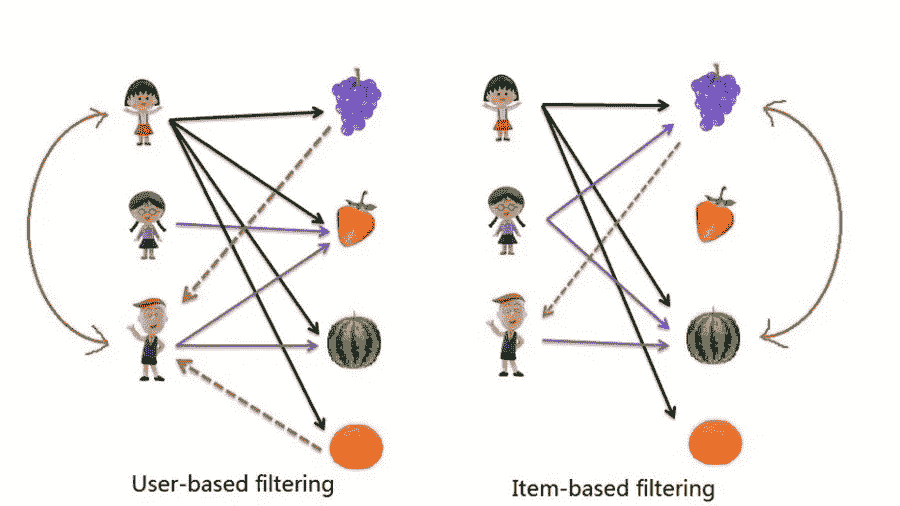
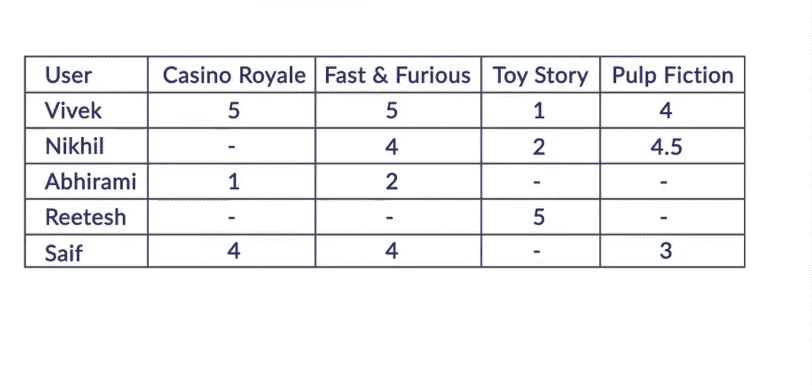
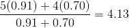
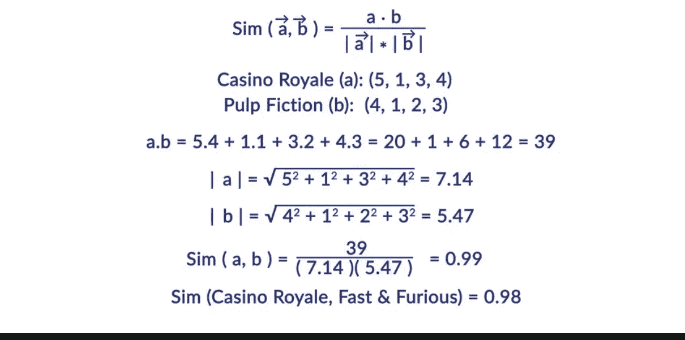
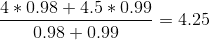

# 协同过滤——一种推荐系统

> 原文：<https://pub.towardsai.net/collaborative-filtering-type-of-recommendation-system-87bef33e701e?source=collection_archive---------0----------------------->

## 面向人工智能的推荐系统第三部分

这是我的推荐系统系列的第 3 部分

第一部分:[https://medium . com/forward-artificial-intelligence/recommendation-systems-104 bdfe 3 f 93 f](https://medium.com/towards-artificial-intelligence/recommendation-systems-104bdfe3f93f)

第二部分:[https://medium . com/forward-artificial-intelligence/content-based-recommender-system-4 db 1b 3 de 03 e 7](https://medium.com/towards-artificial-intelligence/content-based-recommender-system-4db1b3de03e7)

# 协作过滤:

第二种最常用的过滤类型。这被亚马逊和易贝大量用于推荐产品。

基于用户的协同过滤:

如果人们过去有相似的兴趣，他们将来也会有相似的兴趣。让我们考虑两个年轻人 Vivek 和 Nikhil——他们有相似的兴趣。如果 Vivek 没有看过 Nikhil 喜欢的电影，我们会向 Vivek 推荐这部电影。为了理解这种算法的工作原理，我们将回答几个关键问题:

1.  我们如何衡量用户之间的相似度？
2.  我们如何预测这个人会有多喜欢这个产品？

让我们考虑下面的数据集:

任务:

1.  查找类似 Nikhil 的用户
2.  预测 Nikhil 可能提供的评级
3.  向 Nikhil 推荐电影列表

前两行之间的相关性给出了 Vivek 与 Nikhil 相似程度的度量。相关系数范围从-1 到 1。如果相关系数是 1 意味着 Vivek 和 Nikhil 有完全相似的品味，

-1 表示完全相反的口味，0 表示完全没有关系。

Corr(Nikhil，Vivek) = 0.91

Corr(Nikhil，Abhirami) = 0.70

Corr(Nikhil，Reetesh) = 0.00

Corr(Nikhil，Saif) = 0.50

如果有 1000 个用户，我们将有 999 个这样的相似性度量。

现在下一步是预测 Nikhil 会给所有的电影。

要做到这一点，我们需要找到离 Nikhil 最近的邻居，以及我们可以给他们多少权重。

在本例中，让我们考虑两个邻居 Vivek 和 Abhirami。根据他们对电影的评分加权平均值，我们可以计算出 Vivek 对所有电影的评分。

你看到 Nikhil 与两个用户 Vivek 和 Abhirami 相似，相似度分别为 0.91 和 0.70。两个用户与 b 的相似度表示为 sim(a，b)。为简单起见，我们只考虑这两个最近的邻居。

目标是预测 Nikhil 对他没看过但 Vivek 和 Abhirami 看过的电影的评价。例如，假设整个数据集中有 50 部这样的电影。该系统将预测 50 部电影，并向 Nikhil 推荐前 10 部或前 5 部电影。

在这 50 部电影中，我们来考虑两部:《星际穿越》和《盗梦空间》。Vivek 和 Abhirami 对这些电影的评分如下:

星际盗梦空间 Vivek 5 3Abhirami 4 5

要预测 Nikhil 给星际的评级，一种方法是简单地取加权平均值，如下所示:

pred(Nikhil，星际)

同样，你可以预测 Nikhil 会给其余 50 部电影的评分。

预测评级 pred(Nikhil，Inception)会是什么？

1.  3.56
2.  3.87
3.  4.20
4.  4.33

答:3.87

我们使用了皮尔逊系数法来预测收视率。还有其他方法。

**基于项目的协同过滤:**

这是最成功、应用最广泛的推荐算法。它被像亚马逊和其他电影推荐网站这样的公司使用。

让我们考虑同样的例子。假设我们需要找到 Nikhil 将给予《皇家赌场》的评级，我们假设它将类似于 Nikhil 过去给予类似类型的其他电影的评级。

我们将为电影创建一个项目向量。在创建项目向量时，我们不会考虑 Nikhil 的评级。

“皇家赌场”的项目向量是(5，1，0，4)

《速度与激情》的项目向量是(5，2，0，4)

低俗小说的项目向量是(4，0，0，3)

我们需要一种数学方法来衡量电影之间的相似性。

类似地——皇家赌场和速度与激情之间的相似性度量达到 0.98

sim(皇家赌场，速度与激情)= 0.98

为了预测 Nikhil 将给予皇家赌场的评级，我们采用最接近的电影的加权平均值如下:

皇家赌场

因为评级都是正的，所以相似性的值将介于 0 和 1 之间。接近 1 的值表示非常相似。这种相似性度量被称为余弦相似性度量，并且是一种公认的度量。

同样，该算法将计算 Nikhil 可能给所有其他他没有看过的电影的评级，并推荐前 n 名电影的列表，其中“n”的选择取决于算法设计者。

基于用户和项目的协同过滤的 python 实现如下。

https://github.com/BindhuVinodh/Recommendation-System