# 计算机视觉中的颜色理论

> 原文：<https://pub.towardsai.net/color-theory-d7354ef8a471?source=collection_archive---------0----------------------->

## [计算机视觉](https://towardsai.net/p/category/computer-vision)

## 使用 Monk，一个低代码深度学习工具和一个统一的计算机视觉包装器，使计算机视觉变得简单。

由[paweczerwi ski](https://unsplash.com/@pawel_czerwinski?utm_source=unsplash&utm_medium=referral&utm_content=creditCopyText)在 [Unsplash](https://unsplash.com/s/photos/color?utm_source=unsplash&utm_medium=referral&utm_content=creditCopyText) 上拍摄的照片

## 色觉

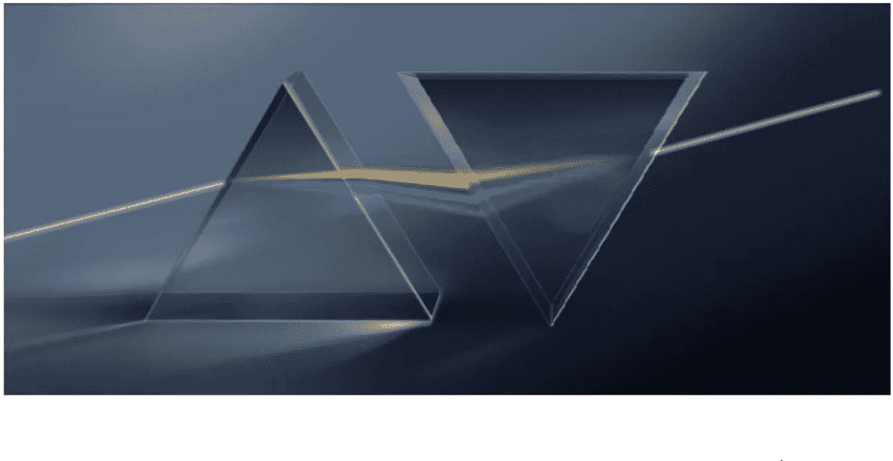

[来源](https://github.com/Tessellate-Imaging/monk_v1/blob/master/study_roadmaps/3_image_processing_deep_learning_roadmap/1_image_processing_basics/imgs/chapter2/slide2.jpg)

## 色彩理论的历史:

约翰·沃尔夫冈的《色彩理论》一书中的色彩模型。

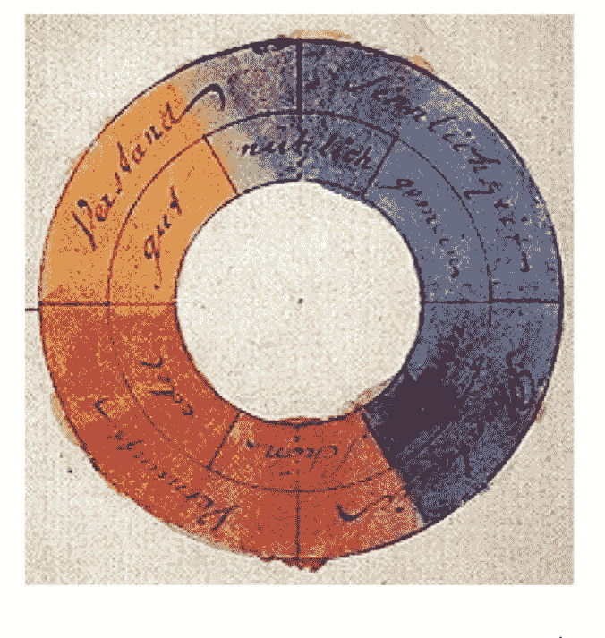

[来源](https://en.wikipedia.org/wiki/Theory_of_Colours#/media/File:Goethe,_Farbenkreis_zur_Symbolisierung_des_menschlichen_Geistes-_und_Seelenlebens,_1809.jpg)

## RYB 颜色

证明为什么 RYB 被认为是原色

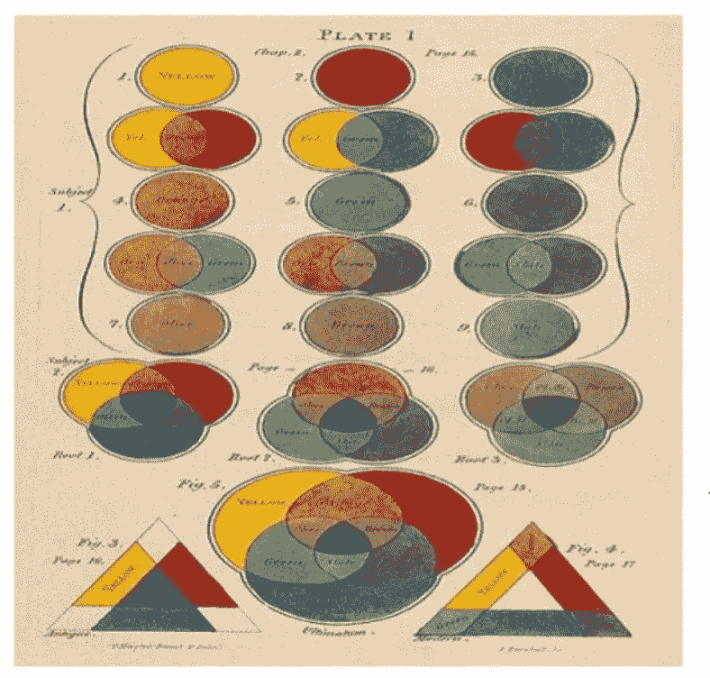

[来源](https://github.com/Tessellate-Imaging/monk_v1/blob/master/study_roadmaps/3_image_processing_deep_learning_roadmap/1_image_processing_basics/imgs/chapter2/slide4.jpg)

## 三色理论

*   也被称为杨-亥姆霍兹理论。

> 三种类型的视锥感光细胞

*   偏好短(蓝色)
*   中等偏好(绿色)
*   长偏好(红色)

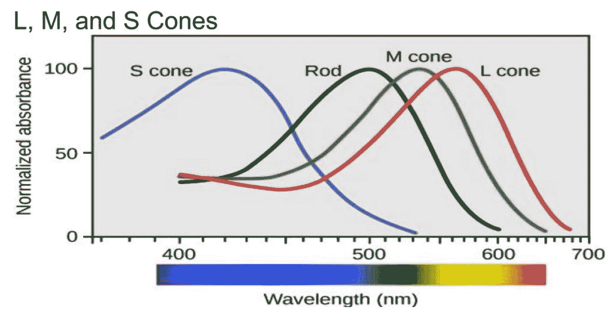

[来源](https://image.slidesharecdn.com/colorvision-160912143723/95/color-vision-27-638.jpg?cb=1473691301)

## RGB 空间跨越

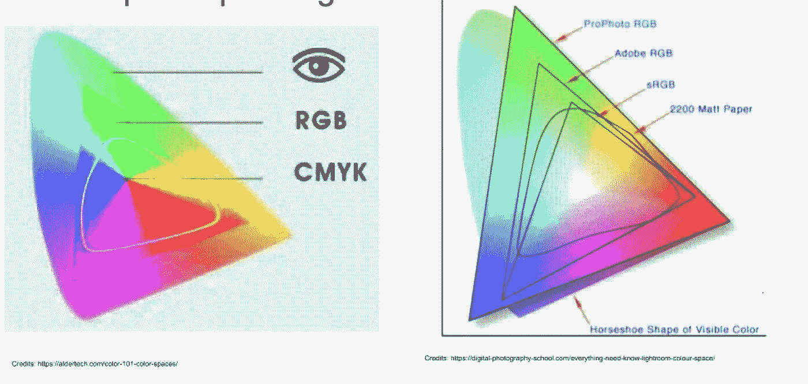

[来源](https://github.com/Tessellate-Imaging/monk_v1/blob/master/study_roadmaps/3_image_processing_deep_learning_roadmap/1_image_processing_basics/imgs/chapter2/slide7.jpg)

## 对手颜色理论

*   有些颜色在正常照明条件下是无法直接感知的。
*   三色理论没有包含这些颜色。
*   对抗过程通过兴奋性和抑制性反应起作用，每种机制的两个组成部分相互对抗。

## **灰度等级**

*   单色单通道
*   像素值从 0(黑色)到 255(白色)
*   灰度图像只包含灰色阴影。

> 用例

*   降低数据复杂性和存储需求
*   许多应用程序可以很好地处理灰度。不需要复杂的通道。
*   提高了计算速度。

## RGB

*   加色空间基于 RGB 颜色模型。
*   红色、绿色和蓝色三个通道。
*   用于许多图像处理和计算机视觉应用。

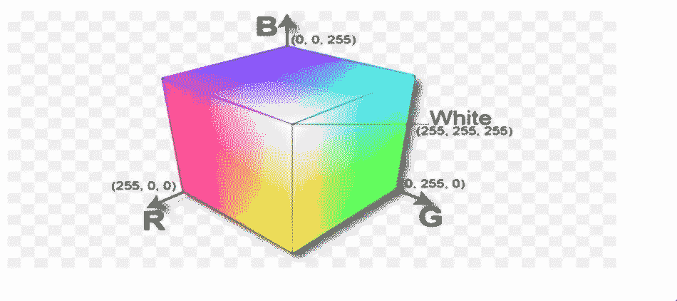

[来源](https://www.cleanpng.com/png-rgb-color-space-rgb-color-model-light-4170880/)

> 利用 OpenCV 访问 RGB 图像的通道

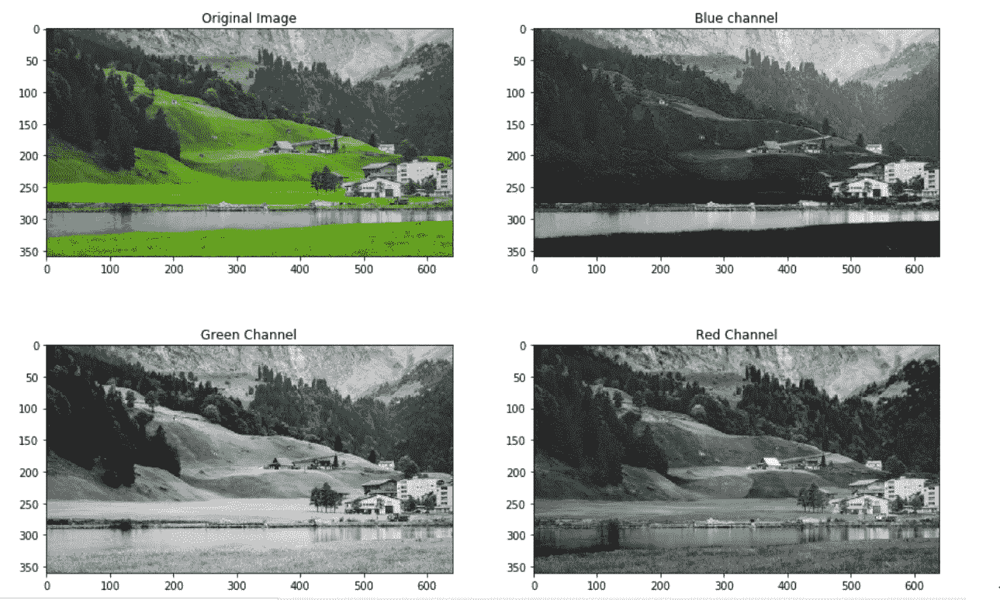

## 加色和减色理论

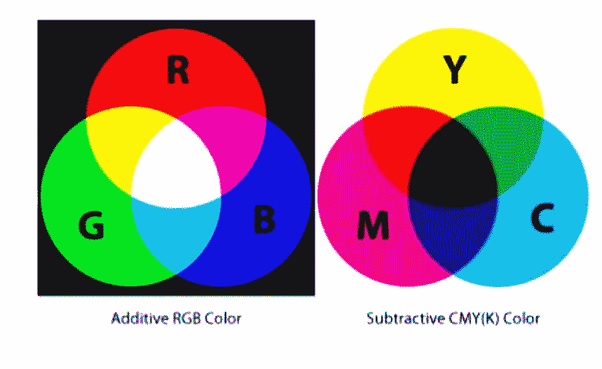

> 使用 PIL 将 RGB 转换为 CMYK

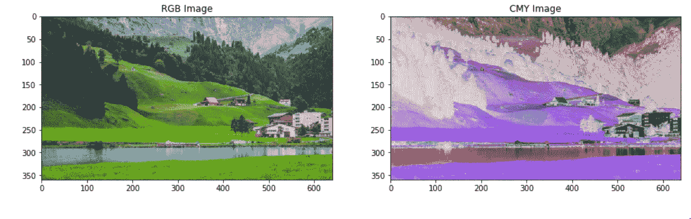

## CIE 实验室

l-亮度(强度)

从绿色到洋红色

b-蓝色到黄色

> 使用浏览将 RGB 转换为 LAB

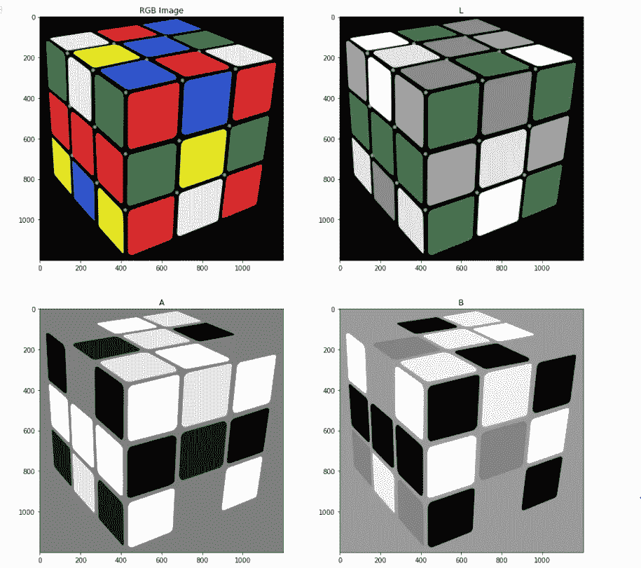

## CIE-YCrCb

y-亮度、铬-红色、铬-蓝色

*   与 YUV 模式相似

> 使用 SkImage 将 RGB 转换为 YCrCb

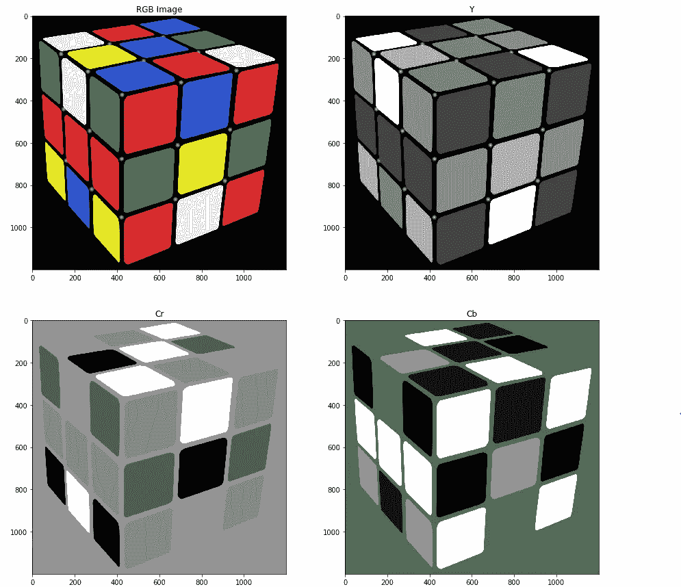

## CIE-XYZ

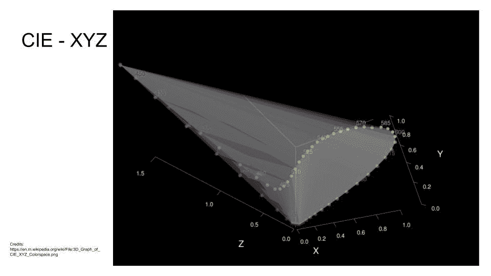

[来源](https://en.wikipedia.org/wiki/File:3D_Graph_of_CIE_XYZ_Colorspace.png)

> 使用浏览将 RGB 转换为 XYZ

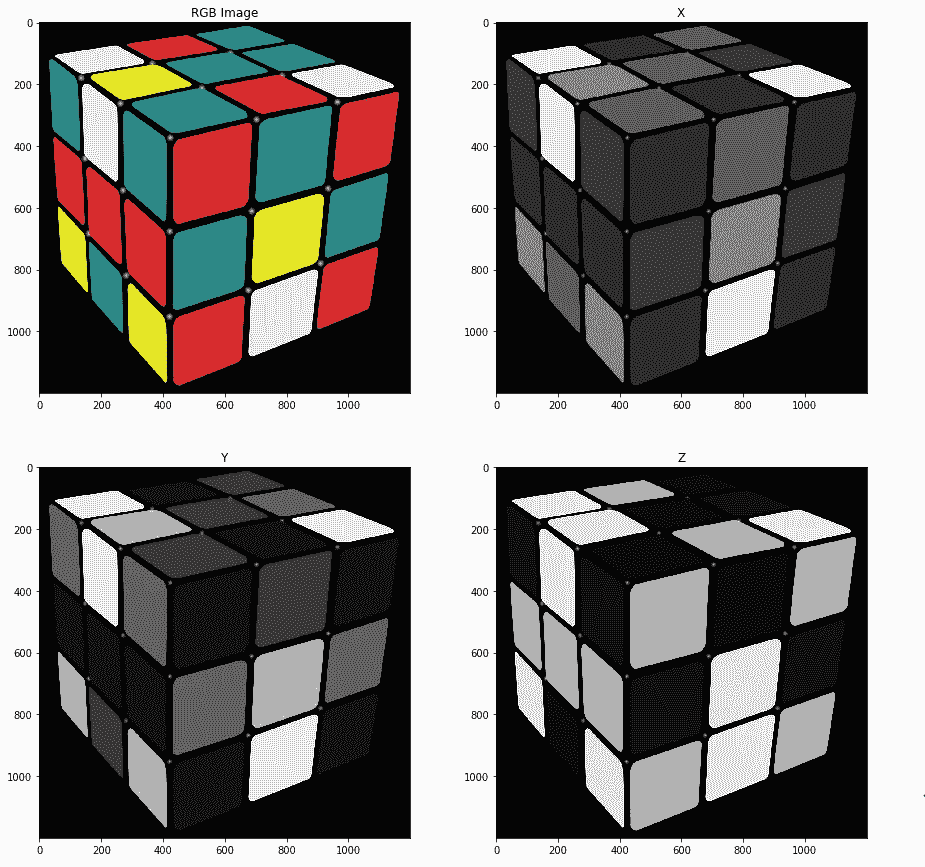

## hsv 色彩模型

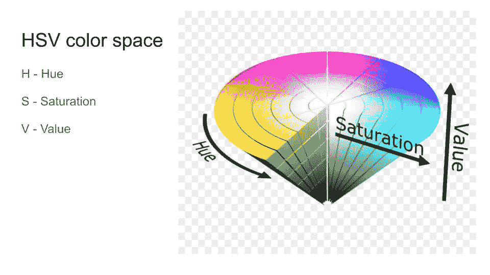

[来源](https://commons.wikimedia.org/wiki/File:HSV_color_solid_cone.png)

> 使用浏览将 RGB 转换为 HSV

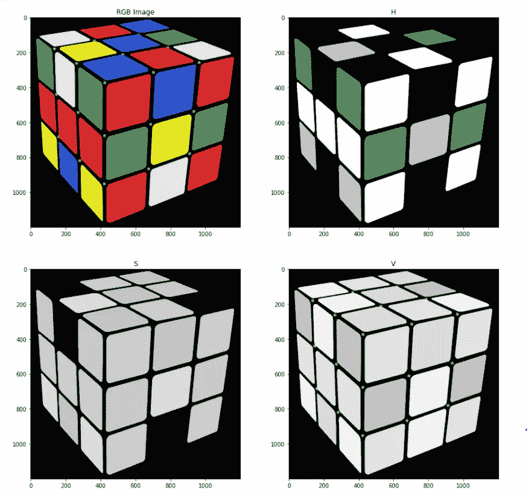

# 其他颜色空间

*   苏木精-伊红-DAB(HED)
*   国际照明委员会-LCH 颜色空间
*   YUV 颜色空间
*   YIQ 颜色空间
*   染色颜色空间
*   HSL 颜色空间

你可以在这里找到完整的 jupyter 笔记本。

如有疑问，可联系 [Abhishek](https://www.linkedin.com/in/abhishek-kumar-annamraju/) 。请随意联系他。

我对计算机视觉和深度学习充满热情。我是 [Monk](https://github.com/Tessellate-Imaging/Monk_Object_Detection) 库的开源贡献者。

你也可以在以下网址看到我的其他作品:

 [## 阿库拉·赫曼思·库马尔培养基

### 阅读阿库拉·赫曼思·库马尔在媒介上的作品。计算机视觉爱好者。每天，阿库拉·赫曼思·库马尔和…

medium.com](https://medium.com/@akulahemanth)