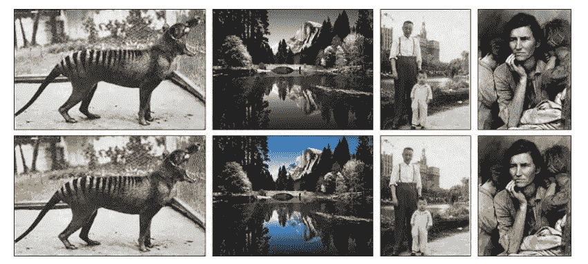
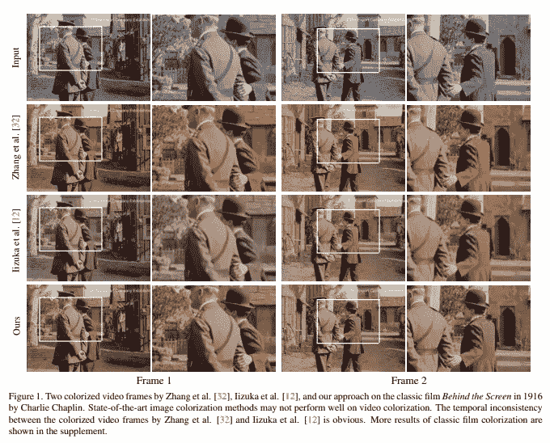
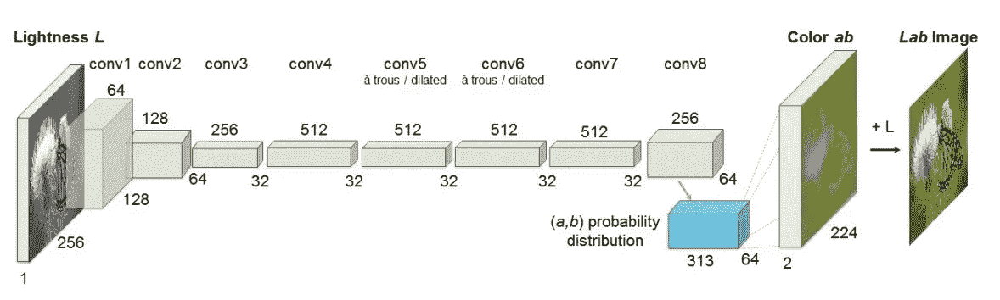
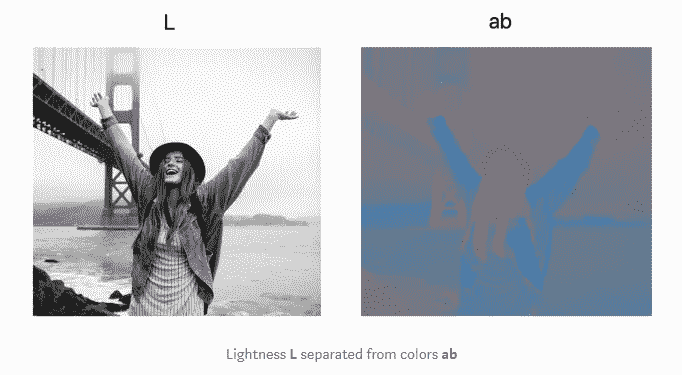
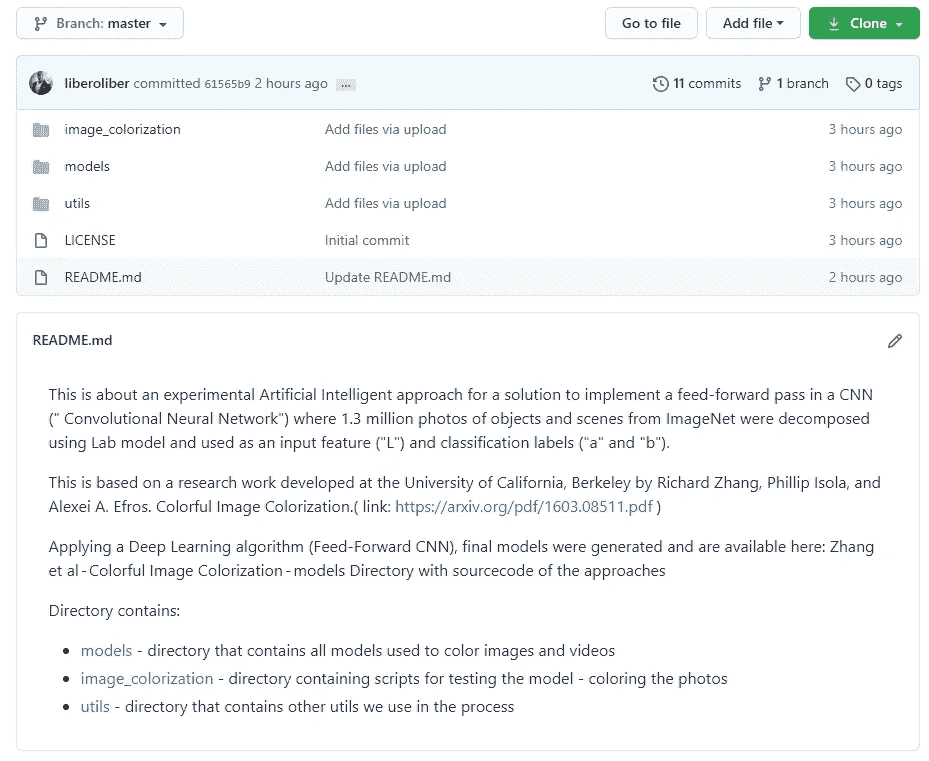

# 利用深度学习为黑白图像着色

> 原文：<https://pub.towardsai.net/colorizing-images-with-deep-learning-a34d11587643?source=collection_archive---------0----------------------->



来源:彩色图像彩色化张曦轲，菲利普·伊索拉，阿列克谢·埃夫罗斯加州大学伯克利分校

## 深度学习

## 使用 CNN 卷积神经网络对超过一百万幅彩色图像进行训练，为 B&W 的照片着色。

从摄影开始，图像彩色化在过去可能是留给有艺术天赋的人的。尽管如此，由于人工智能，有可能以出色的质量彩色化黑白图像和视频。

一个令人兴奋的例子是论文*全自动视频彩色化与自我调整和多样性*(你可以在这里阅读)，它提到了香港科技大学的一项实验，该实验提出了一种全自动的方法来为黑白电影着色，而无需任何人工指导或参考。

典型的图像彩色化方法需要一些标记参考。因此，本文的一个关键创新点是一个新颖的框架，它由一个具有自学习技术的彩色化网络组成。

研究人员使用了在 [CVPR 论文](http://openaccess.thecvf.com/content_cvpr_2018/html/Li_Interactive_Image_Segmentation_CVPR_2018_paper.html)中提出的排序多样性损失函数来区分不同的解决模式。最后，他们将他们的模型与其他两种最先进的全自动图像彩色化进行了比较。



在戴维斯数据集上的百分比比较中，新方法更受青睐。研究人员相信，他们在自我调整和多样性方面的工作可以激励未来的研究。

具有自我调节和多样性的全自动视频彩色化可以用于计算机视觉应用，例如视觉理解和物体跟踪。

这个 R&D 的目标是供我个人使用，这是一种全自动的方法，可以帮助我生成黑白(B&W)照片和视频的真实彩色效果。

从人工智能的角度来看，我已经决定根据张曦轲、菲利普·伊索拉和阿列克谢·a·埃夫罗斯在加州大学伯克利分校开展的研究工作，采用对超过一百万幅彩色图像进行训练的 CNN(“卷积神经网络”)的实现方法。[彩色图像彩色化](https://arxiv.org/pdf/1603.08511.pdf)。

正如在原始论文中解释的那样，作者通过在训练时使用类别再平衡将该问题作为一项分类任务，从而接受了该问题潜在的不确定性。

我想获得所选照片的可信的彩色版本，以便在 CNN 上使用前馈传递。

电影和视频彩色化并不是一项新技术。自上世纪初以来，一些精彩的电影杰作被人类一帧一帧地手工着色。

计算机辅助着色始于 20 世纪 70 年代，并已得到广泛应用。现在，深度学习正在实现全自动图像彩色化。但是在全自动视频彩色化方面还没有相应的突破。本文的一个关键创新是一个新颖的框架与自我正则化技术。



# 深度学习方法。

该解决方案的方法是在 CNN(“卷积神经网络”)中实施前馈传递，其中使用实验室模型分解来自 ImageNet 的 130 万张对象和场景照片，并用作输入特征(“L”)和分类标签(“a”和“b”)。然后应用深度学习算法(前馈 CNN)，生成最终模型，可在此获得:[张等——彩色图像着色——模型](https://github.com/richzhang/colorization/blob/master/models/fetch_release_models.sh)。



来源:[https://becoming human . ai/auto-colorization-of-black-and-white-images-using-machine-learning-auto-encoders-technique-a 213 b47 f 7339](https://becominghuman.ai/auto-colorization-of-black-and-white-images-using-machine-learning-auto-encoders-technique-a213b47f7339)

# 与实验室合作

对于数字图像，我们通常使用众所周知的 RGB 模式。我们经常习惯于使用 [RGB 模型](https://en.wikipedia.org/wiki/RGB_color_model)对彩色照片进行编码，但不幸的是，我在这个项目上使用的深度学习模型是 CIE“实验室”。

CIELAB 颜色空间(有时缩写为“Lab’s color space ”)是一种颜色空间，它的名字来源于三原色，即红、绿和蓝。

***Lab***【又名 CIELAB / L*a*b*】将明度与色彩完全分开。把亮度想象成一些灰度图像。它只有光度，没有颜色。通道 ***L*** 负责那个明度(灰度)，另外两个通道 ***ab*** 负责颜色。正如你在上面的图片中看到的，颜色信息被嵌入到 ***ab*** 通道中。

不看 ***L，*** 你可能会注意到，光看***【ab】，*** 很难知道图中是什么，那是因为一个科学事实，说我们眼睛里 94%的细胞决定明度( ***L*** )。这样，我们的受体中只有 6%充当颜色传感器( ***ab*** )

好消息是，与 RGB 颜色模型不同，Lab 颜色空间旨在近似人类视觉。它渴望感知的一致性，其 L 分量与人类对亮度的感知非常匹配。L 分量正是被用作人工智能模型的输入，该模型被训练来估计房间的剩余亮度。

它还被用来训练人工智能来估计房间的剩余亮度，然后被用来输入人工智能。



我不会在这里一步一步地介绍经典的代码，但是你可以下载并使用你的 [GitHub](https://github.com/gitliber/image-colorization) 照片测试代码。

[](https://github.com/gitliber/image-colorization/tree/master/image_colorization) [## git liber/图像着色

### 这个目录包含给图像上色的脚本。您可以从…的根目录运行 main.py 脚本来给图像着色

github.com](https://github.com/gitliber/image-colorization/tree/master/image_colorization) 

请记住，您的机器上必须安装有 [Python](https://www.python.org/downloads/) (版本 3.6)和 [OpenCV](https://opencv.org/) (4.0)。我将在文章的下一部分描述用 Jupiter Notebook 着色的所有过程。

这个目录包含给图像上色的脚本。

您可以通过从项目的根目录运行`main.py`脚本来给图像着色。

```
python -m src.image_colorization.main --method <name of method>
```

`The parameter--model` 是可选的；如果`reg_full_model`不在场，那就是默认了。可以从以下列表中选择型号:

*   `reg_full_model`
*   `reg_full_vgg_model`
*   `reg_part_model`
*   `class_weights_model`
*   `class_wo_weights_model`

# 结论

由张曦轲、菲利普·伊索拉和阿列克谢·a·埃夫罗斯制作的[原始模型](https://arxiv.org/pdf/1603.08511.pdf)使用“假”灰度图像(现代图片转换成灰度)进行训练。

像我一样在真正的传统黑白照片上运行这种方法(查看本文[此处](https://medium.com/dataseries/colorizing-the-history-of-the-volvo-group-using-ai-a890edfbe148))会因训练性质而遇到一些挑战。然而，该模型仍然可以产生良好的彩色化，即使传统照片的低水平图像质量与现代照片的图像质量大不相同。

该实验表明，使用深度 CNN 和精心选择的目标函数的彩色化可以更接近自然的彩色照片。

人工智能提供了有用的图形输出，也可以被视为图像处理的有用工具，因为它与其他自我监督的预训练方法相比表现强劲。

此外，我刚刚在亚马逊上出版了我的新电子书，今年我已经在着手出版一些其他的书了…保持联系，如果你想的话就关注我，让我们一起努力。

链接和来源:

[](https://github.com/richzhang/colorization) [## rich Zhang/彩色化

### 张曦轲，菲利普·伊索拉，阿列克谢·埃夫罗斯。2016 年在 ECCV。

github.com](https://github.com/richzhang/colorization) [](https://github.com/Mjrovai/Python4DS/tree/master/Photo_Video_Colorization) [## Mjrovai/Python4DS

### 此时您不能执行该操作。您已使用另一个标签页或窗口登录。您已在另一个选项卡中注销，或者…

github.com](https://github.com/Mjrovai/Python4DS/tree/master/Photo_Video_Colorization) [](https://becominghuman.ai/auto-colorization-of-black-and-white-images-using-machine-learning-auto-encoders-technique-a213b47f7339) [## 使用机器学习“自动编码器”技术对黑白图像进行自动着色

### 在这篇文章中，我将向您展示使用机器学习给黑白图像着色的主要步骤。

becominghuman.ai](https://becominghuman.ai/auto-colorization-of-black-and-white-images-using-machine-learning-auto-encoders-technique-a213b47f7339) [](https://github.com/gitliber/image-colorization) [## git liber/图像着色

### 这是一个实验性的人工智能方法的解决方案，以实现前馈通过在 CNN…

github.com](https://github.com/gitliber/image-colorization) [](https://www.pyimagesearch.com/2019/02/25/black-and-white-image-colorization-with-opencv-and-deep-learning/) [## 基于 OpenCV 和深度学习的黑白图像彩色化——PyImageSearch

### 本教程将教授如何使用 OpenCV、深度学习和 Python 为黑白图像着色。图像…

www.pyimagesearch.com](https://www.pyimagesearch.com/2019/02/25/black-and-white-image-colorization-with-opencv-and-deep-learning/) 

# 还有一件事…

如果你想在学习之旅中走得更远，我为你准备了一份很棒的清单，上面有 60 多门关于人工智能、机器学习、深度学习和数据科学的培训课程，你现在就可以免费参加:

*   [**什么是预测分析，你今天如何使用它？**](https://towardsdatascience.com/what-is-predictive-analytics-dc6db9759936)
*   [**如今的 A.I .，ML，数据科学是最好学的免费课程。**](https://jairribeiro.medium.com/my-favorite-free-or-free-to-audit-courses-to-learn-ai-ml-and-data-science-f15f614a84e5)
*   [**60 多门课程，有评分和总结(当然是 A.I .做的)。**](https://jairribeiro.medium.com/my-favorite-free-or-free-to-audit-courses-to-learn-ai-ml-and-data-science-f15f614a84e5)
*   [**是我们所知的作品的终结吗？**](https://medium.com/predict/is-it-the-end-of-the-work-as-we-know-it-bf2f9a64e89a)[**世界经济论坛《2020 年的就业前景》报告简析**](https://medium.com/predict/is-it-the-end-of-the-work-as-we-know-it-bf2f9a64e89a)

假设你想在我的电子书中继续发现新资源和学习人工智能(下面的[链接](https://www.amazon.com/dp/B08WJ59G2V))。在这种情况下，我在网上分享关于人工智能、机器学习、深度学习、数据科学、商业智能、分析和其他方面的最佳文章、网站和免费培训课程，以帮助你开始学习和发展你的职业生涯。

> [***学习 AI 在线:200 多种资源在线开始学习 AI***](https://www.amazon.com/dp/B08WJ59G2V)

此外，我刚刚在亚马逊上发布了其他有趣的[电子书，我相信其中一些可能会让你感兴趣……让我们保持联系，关注我，一起做吧。](https://www.amazon.com/dp/B08RSJRNSN/)

*   [**终结者悖论:神经科学如何帮助我们理解移情和对人工智能的恐惧**](https://www.amazon.com/gp/product/B08STRHZ46)
*   [**从 A 到 Z 的人工智能:揭秘 A.I.**](https://www.amazon.com/gp/product/B08WZ3VDHB) 的本质概念
*   [**2020 年人工智能:写人工智能的一年**](https://www.amazon.com/gp/product/B08RSJRNSN)

# 你愿意支持我吗？

*为了获得无限的故事，你也可以考虑* [*注册*](https://jairribeiro.medium.com/membership) *成为一个中等会员，只需 5 美元。此外，如果您使用我的链接* [*注册*](https://jairribeiro.medium.com/membership) *，我会收到一小笔佣金(无需额外付费)。*

[](https://jairribeiro.medium.com/membership) [## 通过我的推荐链接加入媒体- Jair Ribeiro

### 阅读我分享的每一个故事(以及媒体上成千上万的其他作者)。你的会员费直接支持其他…

jairribeiro.medium.com](https://jairribeiro.medium.com/membership)