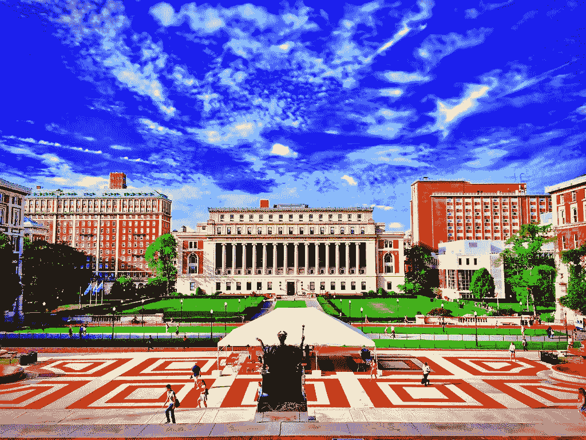

# 哥伦比亚大学新的免费人工智能课程

> 原文：<https://pub.towardsai.net/columbia-universitys-new-free-ai-course-da6ee95c5cea?source=collection_archive---------1----------------------->

## [教育](https://towardsai.net/p/category/editorial)

## 很快开始。

[Andreas Komodromos](https://www.flickr.com/photos/25582125@N04)创作的在 [CC BY-NC 2.0](https://creativecommons.org/licenses/by-nc/2.0/?ref=ccsearch&atype=rich) 下获得许可

哥伦比亚大学是一所著名的常春藤盟校，成立于 1754 年，是美国最古老的教育机构之一。

哥伦比亚大学刚刚宣布了一门名为“人工智能”的新在线课程，尽管第一批学生在 2021 年 2 月 1 日才开始，但已经有超过 20 万名学生注册。

令人难以置信的是，该课程在 edX[上是免费的](https://www.edx.org/course/artificial-intelligence-ai?source=aw&awc=6798_1610558122_5a105f467e3617bb6f9dea023c6c5f08&utm_source=aw&utm_medium=affiliate_partner&utm_content=text-link)没有证书，你只需花 249 美元就能得到一个经过验证的 ColumbiaX 证书。

# 是关于什么的？

本实践课程教授五个主要概念:

*   人工智能的介绍和历史
*   构建智能代理
*   人工智能算法
*   人工智能的应用
*   用 Python 解决真实的人工智能问题

为期 12 周的课程预计每周需要 8-10 个小时。

对在线人工智能课程的一个普遍抱怨是，它们不处理真实世界的用例，但这在这里不是一个问题，因为整整两个星期都致力于人工智能应用。

许多在线人工智能课程的另一个常见挑战是缺乏合格的讲师。这在这里显然不是问题，因为你将由这个星球上最负盛名的技术讲师之一——哥伦比亚大学教授来教授。

请注意，本课程是针对商业受众的*而不是*，因为您将使用技术工具。如果你不是技术人员，想要构建和部署人工智能，显然你可以用像[这样的无代码人工智能工具轻松完成。AI](http://obviously.ai) 。

# 先决条件

参加本课程之前，学生应基本熟悉以下内容:

*   线性代数(向量、矩阵、导数)
*   结石
*   基础概率论
*   Python 编程

这意味着你不需要成为上述领域的专家，但每个领域的短期速成课程都会派上用场。

# 谁来教你？

根据 edX 页面，你将由哥伦比亚大学教授 Ansaf Salleb-Aouissi 教授，他也教授 edX 课程*数据科学和分析的机器学习*。

根据教授关于 Columbia.edu 的第[页](https://www.engineering.columbia.edu/faculty/ansaf-salleb-aouissi)，她已经在 JMLR、TPAMI、ECML、PKDD、COLT、IJCAI、ECAI 和 AISTAT 等领先机构发表了同行评审论文。

老实说，这是令人难以置信的，任何地方的任何人都可以获得这种质量的教育，免费在线。

# 证书选项

如上所述，该课程附带一个“认证证书”选项，价格为 249 美元。

虽然证书可以作为简历的助推器和在 LinkedIn 等专业网络上分享的东西，但这真的没有必要，我能想到的获得证书的最好理由是它让你“置身于游戏中”

支付 249 美元，你会觉得有动力真正完成课程——大多数 MOOC 学生不会这样做。

# 结论

人工智能将会一直存在——一些人预测我们将在 2030 年达到[超级智能。无论如何，人工智能正迅速成为必备技能，对每个行业都有重要影响。这个免费的在线常春藤联盟课程是提高你人工智能技能的好方法。](https://medium.com/datadriveninvestor/the-case-for-agi-by-2030-4bd10db8029d)