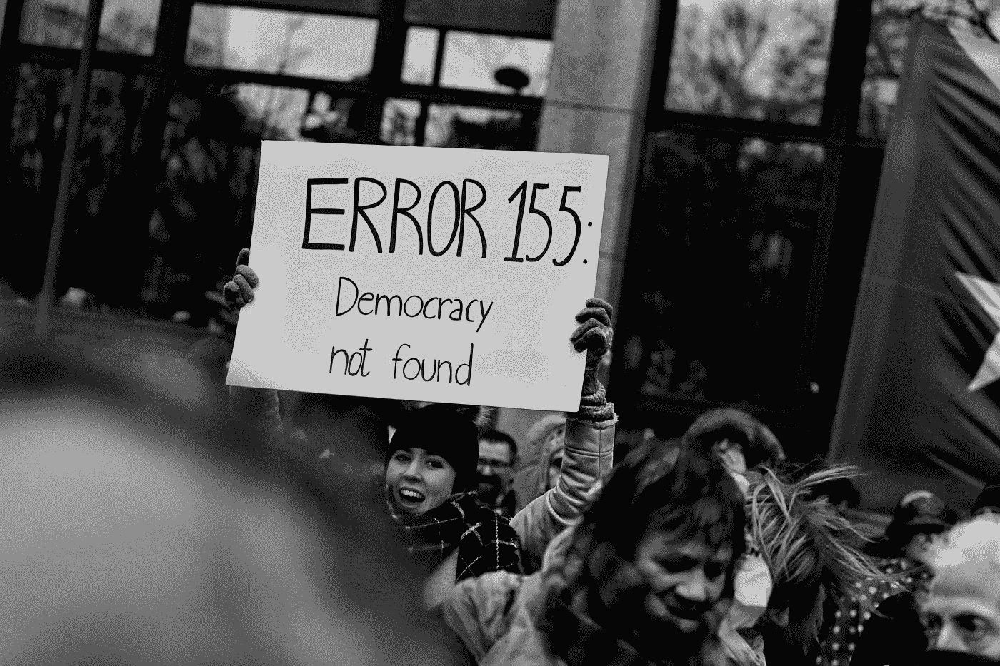
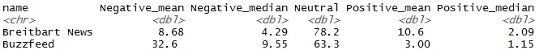
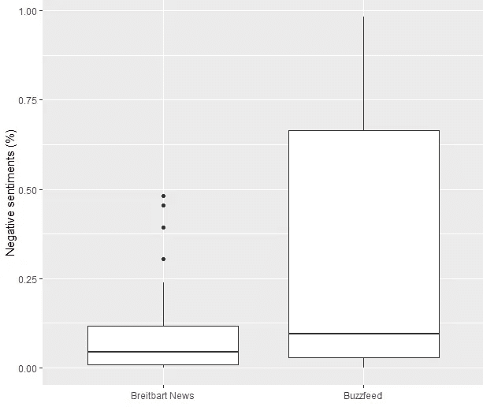

# 用 AWS Amazon understand 对抗媒体偏见

> 原文：<https://pub.towardsai.net/combating-media-bias-with-aws-comprehend-e4f5e1bfe352?source=collection_archive---------2----------------------->

## 用 NLP | [对抗媒体对 AI 的偏见](https://towardsai.net)

由[兰迪·科拉斯](https://unsplash.com/@randycolasbe?utm_source=medium&utm_medium=referral)在 [Unsplash](https://unsplash.com?utm_source=medium&utm_medium=referral) 上拍摄的照片

在假新闻和意识形态驱动的主观媒体报道的世界里，哪些新闻来源可以被认为是“可靠的”是值得怀疑的。两个不同的新闻机构对同一个故事分享两种完全不同的观点，这种情况经常发生。“专家”指出了整个范围内事件的不同后果，其中大部分符合他们自己的议程。

在这些时候，重要的是要找出不同的新闻机构对某些话题的偏见。

**机器学习**能帮助发现这些偏见吗？

# 自动警报系统

> **亚马逊理解**是一种自然语言处理(NLP)服务，它使用机器学习来寻找文本中的见解和关系。*(来源:aws.amazon.com)。*

将 AWS 理解与 R 语言的网络抓取功能结合起来，可以对两篇关于同一主题的文章进行分析，这两篇文章来自两个背景意识形态可能不同的新闻网站。

# 特朗普的报道

话题是对唐纳德**特朗普就任美国总统第一个 100 天**的评价。在美国政治中，选举后第一个百日内发生的行动通常很好地逼近现任总统在其任期内愿意采取的总体路线，因此是左翼和右翼高度关注的话题。

关于川普第一个 100 天的第一篇文章来自布莱巴特新闻，这是一家被认为是另类右翼的新闻机构，其专栏作家包括米洛·伊安诺普卢斯(Milo Yiannopoulous)和前布莱巴特主席兼白宫首席策略师史蒂夫·班农。

第二篇文章来自 Buzzfeed ，这是一家相当左翼的互联网媒体公司，由《赫芬顿邮报》的联合创始人乔纳·佩雷蒂资助。

使用 web 抓取和 CSS 选择器解析这些文章的 HTML 内容，可以获得原始文本。在轻微的数据清理之后，可以对文章的每一段运行亚马逊的情感分析。每一项都被赋予了“积极”、“中性”或“消极”的总体情绪，以及关于自信百分比的额外数据。一个段落 0.78 的积极评价意味着理解 78%肯定这个段落有积极的情感。

两篇文章的摘要可以在下面看到:

用于情感分析的统计

我们可以看到，布莱巴特比 Buzzfeed 有更多中性言论，积极情绪的平均水平更高。另一方面，它几乎有相同的负面情绪，而 Buzzfeed 的负面价值比布莱巴特大 3 倍以上。

下面的箱线图说明了消极情绪之间的区别:

负面情绪的分布

Buzzfeed 段落中负面情绪的中值略高，但不是很高。似乎文本的某些部分有更高的确定性的否定语气，这使得他们文章中的意思变得更大。这可能意味着，布莱巴特对特朗普头 100 天最糟糕的部分的描述没有那么严厉，而 Buzzfeed 则使用强烈的措辞来强调他们对某些立法的负面评估。

# 编后记

这种分析不一定证明任何一方对该主题的宽容，因为 AWS 的情感分析可能会对更复杂的句子关闭，不能理解讽刺，此外，比较同一主题的两篇随机文章并不能推断整个通讯社的偏见。然而，可以对各种主题和更多类似的文章进行进一步的分析，以潜在地推断某些网站在更广泛的意识形态上的立场。