# 用于深度强化学习的组合 PurgedKFold 交叉验证

> 原文：<https://pub.towardsai.net/combinatorial-purgedkfold-cross-validation-for-deep-reinforcement-learning-f8df689ca874?source=collection_archive---------0----------------------->

图片作者。

本文由开源项目 AI4Finance 的核心团队成员 Berend Gort & [Bruce Yang](https://ai4finance.medium.com/) 撰写。这个项目是一个**开源**社区，共享人工智能金融工具，也是纽约哥伦比亚大学的一部分。GitHub 链接:

 [## ai4 金融基金会

### 一个共享金融 AI 工具的开源社区。FinRL:第一个用于财务强化的开源项目…

github.com](https://github.com/AI4Finance-Foundation) 

# 介绍

我们的前一篇文章详细描述了具有常规预测的分类器(或回归器)的组合 PurgedKFold 交叉验证方法。这种策略允许多条回溯测试路径，而不是单一的历史路径。

什么是有效的经验发现？在多次试验后，研究人员几乎总是会发现一种误导性的有利可图的技术，即假阳性。随机样本包括模式，在广阔的方法空间中进行系统的搜索，最终会发现一个从随机数据的机会配置中获益的方法。一个投资策略可能适合这样的运气。原因是一组参数被调整以最大化回测的性能。“回测过度拟合”是这种现象的术语。

可以在多个回溯测试路径上执行统计上正确的改进分析，从而降低可忽略的错误发现的风险。我们之前的文章描述了传统的组合清除交叉验证可以为常规的机器学习回测做些什么。上一篇文章:

 [## 组合清除交叉验证法

### 本文由开源项目 AI4Finance 的核心团队成员 Berend Gort & Bruce Yang 撰写。这个…

pub.towardsai.net](/the-combinatorial-purged-cross-validation-method-363eb378a9c5) 

在这篇文章中，我们写的是一个想法，而不是它的执行。我们需要对构思过程的反馈，并展开讨论。

**新颖的想法**是组合 PurgedKFold 交叉验证(CPCV)深度强化学习(DRL)；CPCV DRL 。对于这个想法的可行性有一些真正的担忧，解决方案可能会有问题。

在 DRL 领域应用这些想法是可取的，因为该方法在回测方面是样本有效的。具体来说，从~ 2018 年开始，许多硬币只在密码领域上市。因此，用于训练和测试模型的数据有限。其余的基本原理在我们之前的文章中已经介绍过了。

# 简短介绍:交易的 DRL

成功的交易者有自己的交易系统，能够根据基本面和技术面的分析做出合理的判断。然而，由于:密码市场的信息不对称，缺乏交易专业知识，以及人类的脆弱性，这些分析方法对于普通投资者来说很难付诸实践。强化学习代理可以学习到针对**顺序**选择问题的有效策略，并且已经在各种任务中超越人类，例如 2019(！)Dota 2 世界冠军。想象一下现在已经是 2022 年了。

那么，一个 RL 代理可以训练，学习交易经验，并自动做出好的交易决策吗？如果有，这样的代理商交易业绩如何？

DRL 需要一个完全代表实际交易所的加密交易空间环境。该环境用于训练/测试 DRL 代理。例如，在 Atari gaming 中，域的状态被定义为活动中最后 X 个连续的游戏屏幕，它是对环境的完整描绘。与上述确定性和无噪声的环境不同，加密价格是不稳定的，交易环境随时间变化。

在加密交易中，状态向量可以是来自数据集的所有特征和关于交易账户的信息。例如:账户里有多少现金，[技术指标](https://medium.com/coinmonks/best-technical-indicators-for-bitcoin-fromta-lib-fa5518560e)，账户持有的可交易对的密码数量。图 1 显示了 DRL 如何在加密货币交易中盈利。有一个状态(交易者),可以对其执行操作(购买/出售/持有)。环境，在这种情况下，是贸易市场，奖励制度是利润。

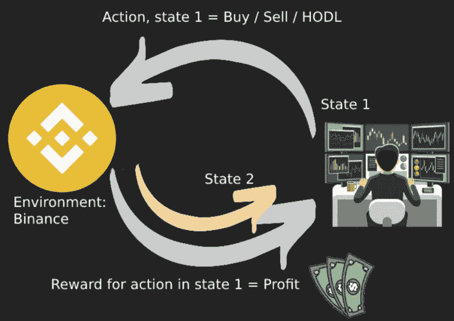

图 1:加密货币交易的 DRL 结构:交易者(代理人)，可以在 CFD 交易所(环境)购买、持有或出售(行为)，以获得利润(回报)。图片作者。

好了，这就是快速总结。从这里，我们假设读者知道 DRL(交易)算法，并想回测一个策略。在下一节中，我们将简要描述如何执行“单一”回溯测试。

# 传统 DRL 回溯测试

**基准**

交易机器人的目标是最大化投资组合价值，同时对冲市场崩溃等风险。因此，需要对 bot 进行基准测试；与其他交易策略的有价值的比较。

等权重(EQW)是一种比例测量技术，为投资组合、指数或指数基金中的每种加密货币分配相等的权重。简单来说:如果交易账户有 100 万美元，有 4 种感兴趣的加密货币，给每种货币分配 25 万，这称为 EQW 投资组合。

因此，当从整体上衡量集团的表现时，最小公司的加密钱包被赋予了与最大加密钱包相同的统计重要性或权重。初始投资组合价值的分配如下:

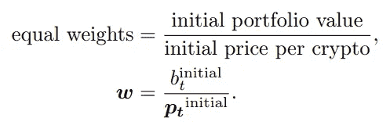

此后，投资组合的现值计算如下:

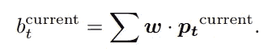

这种策略的回报是最终投资组合价值除以初始投资组合价值。因此，等权投资策略相当于将现金平均分配给每个加密交易对，并留在那里。

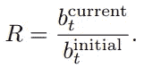

**夏普比率**

夏普比率是一种金融统计数据，它将投资(如加密投资)的绩效与考虑风险后的无风险资产的绩效进行比较。它被定义为投资回报和无风险回报率之间的差异，除以其标准差(即其波动性)。它是投资者因风险增加而获得的增加的回报。夏普比率是计算风险调整回报率最广泛使用的方法之一。夏普比率的公式如下:

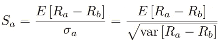

R(a)是资产收益，R(b)是无风险收益。e[R(a)-R(b)]是资产收益超过基准收益的预期值，σ(a)是资产超额收益的标准差。DRL 代理的目标是最大化回报，同时最小化风险。因此，夏普比率将被用作超参数优化的目标。

**型号选择**

历史数据集存在于三个不同的时期:

*   训练数据(样本内，IS)
*   验证数据(样本内，是)
*   贸易数据(样本外，OOS)

图 2 是由训练和验证阶段的数据组成的周期。在超参数优化过程中，训练集和验证集用于获得训练有素的模型。**在例如 100 次试验之后，选择具有最高夏普比率的模型。**在图 2 中，黄色的“评估”检查点显示了对该选择流程的评估。

如果在该特定优化期间，训练模型的夏普比率是迄今为止最高的，则该模型被保存用于下一阶段(模型模拟)。

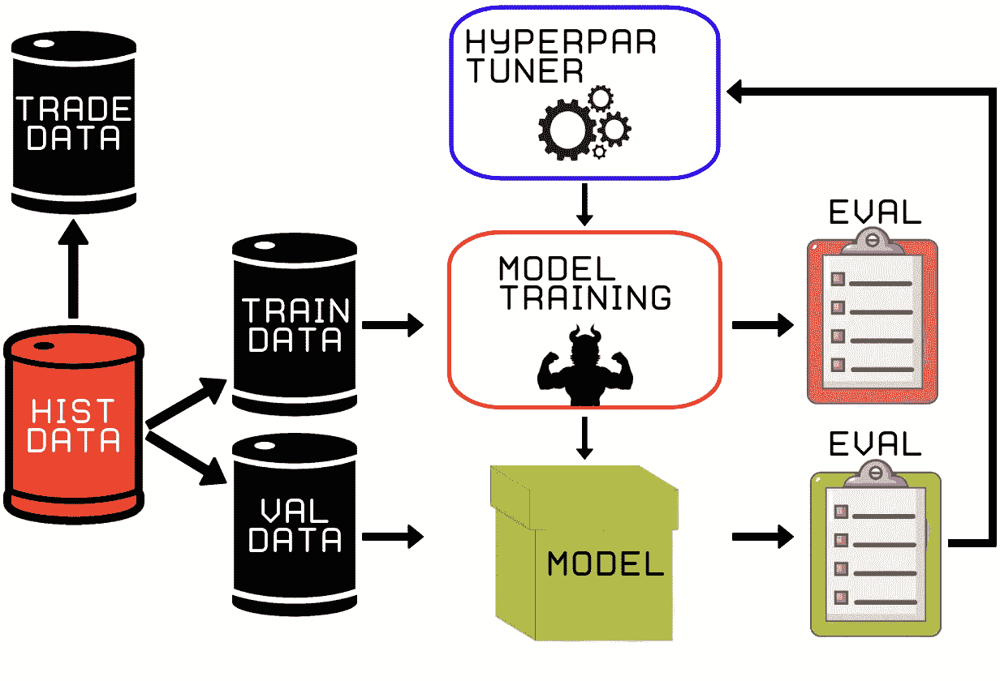

图 2:在**模型选择阶段的数据分割、训练和验证。**来自验证评估结果的最佳模型保存在磁盘上，用于实时部署。图片作者。

**模型模拟示例**

之后，样本外交易数据用于回测“最佳”代理的实时交易表现(图 3)。因此，DRL 代理人没有经过 OOS 数据的训练或验证，无法产生假设为实时交易表现的结果。

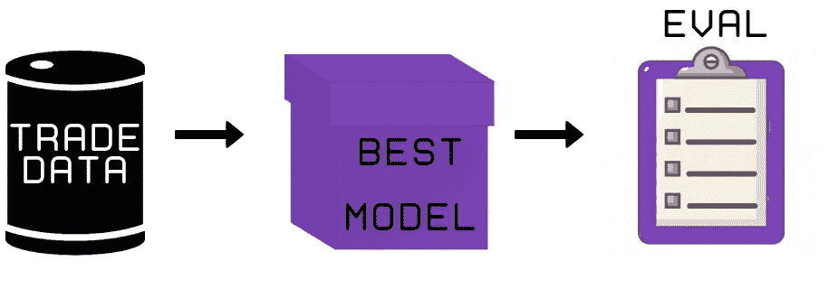

图 3: **在模型选择阶段**产生最佳模型后，剩余的样本外交易数据用于评估 DRL 代理的实时性能。图片作者。

在这一阶段，计算代理的实际盈利能力。有五个主要指标来评估结果。

*   累积回报:从投资组合的起始值中减去最终值，然后除以初始值。
*   年化收益:它们是该策略年收益的几何平均值。
*   年化波动率:投资组合回报的年化标准差。
*   夏普比率:用年化收益减去年化无风险利率，然后除以年化波动率。
*   最大下降:时间范围内的最低点减去最高点的值。

**解释性分析及结果**

结果如图 4 所示。1m、5m、…、2h、4h 是加密数据的烛光宽度。这些精确的结果是通过在每个时间段运行 100 次超参数调谐器，然后运行**模型模拟**过程获得的。

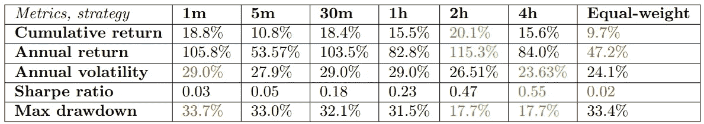

图 4:表格显示了不同时间段的交易指标。图片作者。

图 4 展示了 DRL 代理在多个方面优于等权基准。从图 4 中可以看出，就夏普比率而言，每一家 DRL 代理都优于基准。等重策略的夏普比率为 0.02，而 2h 和 4h 的夏普比率分别为 0.47 和 0.55。代理的年化回报率也明显更高。等权重策略管理 47.2%，在这个特定的时间框架内比其他策略差。因此，这些发现表明，拟议的 DRL 代理人可以有效地制定一个交易策略，跑赢了基线。

根据图 4，2h 或 4h 时间框架似乎是最好的。2h 时间框架的超额收益足够显著，可以忽略年度波动性的下降。因此，选择了 2h 模型，并将在 OOS 交易数据上部署**。图 5 显示了所选的部署模型与基准的对比，直观地显示了它的不稳定性更小、消耗更少、风险更小、回报更高。**

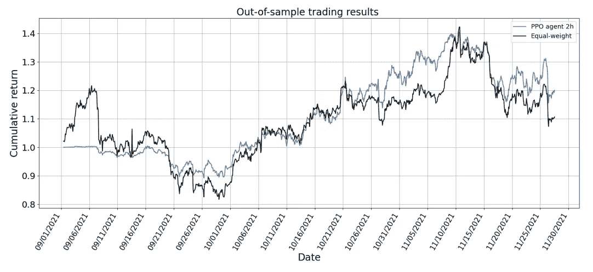

图 5: **所有 2h 时间段 DRL 代理(PPO)的样本外**交易结果与等权策略的比较。图片由作者提供。

**回测侥幸**

*   *我们重复:*

在多次试验后，研究人员几乎总是会发现一种误导性的有利可图的技术，即假阳性。随机样本包括模式，在广阔的方法空间中进行系统的搜索最终会发现一个从随机数据的机会配置中获益的方法。一个投资策略可能适合这样的运气。尤其是当调整一组参数以最大化回测性能时。“回测过度拟合”是这种现象的术语。

*   *关于上一节:*

我们怀疑提议的回溯测试策略中的**模型选择**部分存在问题。如上所述，我们已经对验证结果进行了 100 次超参数试验，并选择了在该时间段内提供最高夏普比率的模型。我们做的试验越多，我们在验证集上“走运”的可能性就越大。

让我们转到新的想法，它降低了超参数优化器找到“幸运”结果的风险。我们不想走运；我们希望被算计。

# 新颖的想法:CPCV DRL

如果读者还没有读过我们之前的文章，我们建议你先读一下。在那篇文章中，我们描述了传统机器学习的组合 PurgedKFold 交叉验证方法。文章:

 [## 组合清除交叉验证法

### 本文由开源项目 AI4Finance 的核心团队成员 Berend Gort & Bruce Yang 撰写。这个…

pub.towardsai.net](/the-combinatorial-purged-cross-validation-method-363eb378a9c5) 

我们展示了 CombPurgedKFoldCV 方法的主要结果(图 6)。

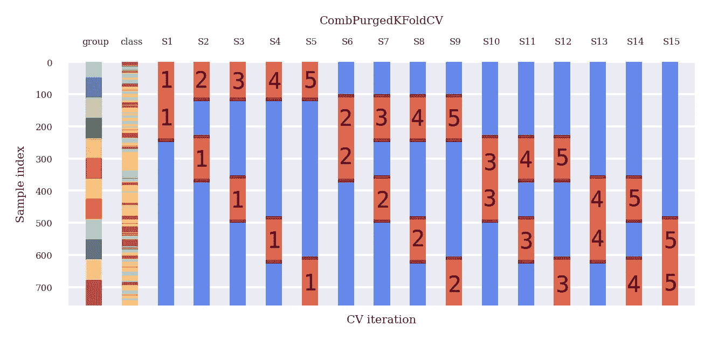

图 6:组合 PurgedKFoldCV。数据可以以 15 种可能的方式(S1-S15)分割，N=6 组，其中 k=2 个验证组。图片作者。

对于每个数据分割，这与传统的交叉验证是一样的:我们对蓝色数据进行训练，对读取的数据进行测试。**然而，在下一节中，我们将介绍如何将组合清除 K-fold 交叉验证应用于 DRL。**

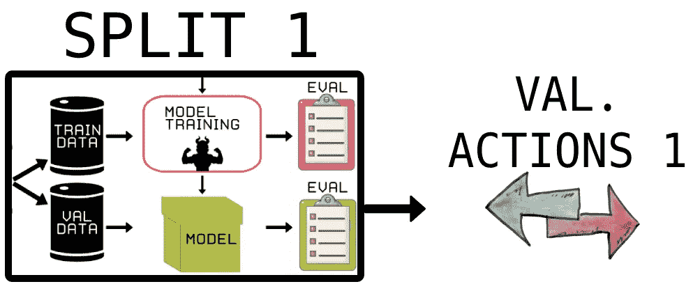

图 7:验证期间预测的单个分割和动作的例子。图片作者。

参见图 7；我们在验证阶段保存所有操作，而不是只查看一次分割的夏普比率。因此，我们像往常一样训练和验证，除了我们看 DRL 代理的最佳预测行为，它代表了基本的交易策略。

请注意，我们现在已经突出显示了验证组(图 2，图 6)。

*   Split 1 || **train** : (G3，S1)，(G4，S1)，(G5，S1)，(G6，S1) || **验证** : (G1，S1)，(G2，S1) || → **DRL 代理 1** →动作 y(1，1)，y(1，2) on (G1，S1)，(G2，S1)
*   Split 2|| **train** : (G2，S2)，(G4，S2)，(G5，S2)，(G6，S2) || **验证** : (G1，S2)，(G3，S1)| |→**DRL agent 2**→actions y(1，2)，y(3，2) on (G1，S2)，(G3，S2)
*   …….
*   拆分 15|| **列车** : (G1，S15)，(G2，S15)，(G3，S15)，(G4，S15) || **验证** : (G5，S15)，(G6，S15) || → **DRL 代理 15** →动作 y(5，15)，y(6，15) on (G5，S15)，(G6，S15)

DRL 本身就是一个向前行走的算法；这是一种顺序算法。因此，对于每一个分割，DRL 代理将通过验证数据执行一个向前遍历的路径来获得动作。我们将这些动作保存在一个矩阵中，该矩阵对应于图 6 所示的组和分割。

新型号选择流程见图 8。首先，我们选择哪个部分用于样本内部分(训练和验证数据)以及我们想要对哪个数据进行最终回测(交易数据)。之后，我们在每次分割的训练数据上训练 DRL 代理(图 6 ),并在验证数据上以一种向前推进的方式评估每个代理，在每个数据点产生动作。

根据图 6 存储每个数据点的这些动作。因此，我们可以将 DRL 代理在验证阶段产生的动作视为“预测”(如前一篇文章)。这些“行动/预测”代表了该时间段的基本交易策略。最后，就像在上一篇文章中一样，我们可以形成 5 条独特的路径来对我们的策略进行回溯测试。

在我们的超参数优化器中，我们使用所有 5 条回溯测试路径的平均夏普比率作为优化循环的最终评估器。**即使经过多次试验，我们也显著降低了单个验证路径过度拟合的风险！**

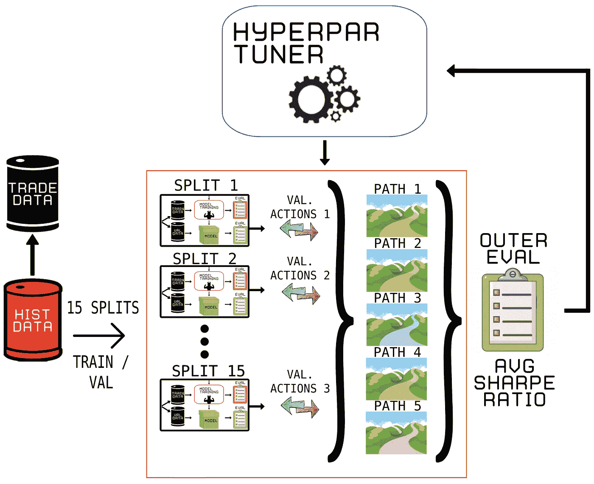

图 8:在 DRL 模型选择阶段组合采购折叠的新想法。图片作者。

因为研究人员会选择估计夏普比率最高的回溯测试，即使夏普比率为零，WF 的高方差也会导致错误的发现。这就是为什么在进行 WF 回测时，考虑试验的数量是至关重要的。

由于 CPCV DRL，现在可以计算家族错误率(FWER)、错误发现率(FDR)或回测过度拟合概率(PBO)。相比之下，CPCV 从大量路径(j = 1，…，𝜑.)中导出夏普比率的分布分布的平均夏普比率是平均值 E[{y i，j } (j=1,…,𝜑 )] = 𝜇和方差𝜎 [{y i，j } (j=1,…,𝜑 )] = 𝜎 (i)。

另一方面，CPCV 从大量路径计算夏普比率分布，j = 1，…，𝜑.平均值 E[{y i，j} j=(1，…，𝜑)] =𝜇和方差𝜎 [{y i，j }(j=1，…，𝜑)] = 𝜎 (i)是分布的平均夏普比率。CPCV 途径的样本均值方差为:

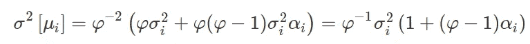

其中，𝜎 (i)是策略 I 的路径上的夏普比率的方差，α(i)是{y，I，j } (j=1,…,𝜑).)之间的平均非对角相关 CPCV 导致比 CV 和 WF 更少的错误，因为α(i) < 1 implies that the variance of the sample means is lower than the variance of the sample. Imagine we have (almost) no correlation between the backtest paths to put matters into perspective. If no correlation is assumed, then α(i) ≪ 1\. The Equation above will reduce to:

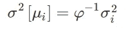

As a result, the lower the variance of CPCV, the**统计上有效的夏普比率**E【y(I)I】将被报告为在 *φ* →∞的极限内具有零方差(通向无穷大的路径的数量)。因为策略是从 i = 1，…中选择的，我将拥有最高的统计有效夏普比率，所以不会有选择偏差。

最后，路径越多，方差就越小，我们就越接近**统计上有效的夏普比率**。但是，路径的数量上限是可用数据的数量。尽管如此，对于足够多的𝜑路径，CPCV 可以使回溯测试的方差小到可以忽略错误发现的概率。

# 结论

在前一篇文章中，探讨了组合清除交叉验证方法。然后，本文建议将这种方法推广到 DRL 域。总结了传统 WF 方法存在的问题。之后，介绍了 DRL 的交易。随后，概述了传统的 DRL 回测，这是一个完整的回测分析。最后，以可能可行的方式提出了用 DRL 进行组合净化交叉验证的新颖想法。该方法可以使模型选择过程更接近统计上有效的夏普比率。

*感谢您深入了解“深度强化学习的组合 PurgedKFold 交叉验证”！*

*~贝伦德&布鲁斯*

# 参考

1.  贝利博士和洛佩兹·普拉多博士，2014 年。缩小的夏普比率:校正选择偏差，回测过度拟合和非正态性。 *SSRN 电子杂志*。

2.普拉多医学博士。(2018).*金融机器学习的进展*。