# 使用 Pandas merge()、join()、concat()和 append()合并数据集

> 原文：<https://pub.towardsai.net/combine-datasets-using-pandas-merge-join-concat-and-append-442f839ba854?source=collection_archive---------0----------------------->

在数据库世界中，**连接**和**联合**是最关键和最频繁执行的操作。几乎所有其他查询都是连接或联合的结合。使用 Pandas，我们可以在处理数据科学算法或任何 ETL(提取、转换和加载)项目时执行类似的任务，连接和联合在这里也很重要。

在讨论 join 和 unions 的用例之前，这两者之间还有一点区别。连接和联合都用于组合数据集，然而连接结果集是数据集的水平组合，而联合的结果集是数据集的垂直组合。

在 Pandas 中，对于水平组合，我们有 **merge()** 和 **join()** ，而对于垂直组合，我们可以使用 **concat()** 和 **append()。** Merge 和 join 执行类似的任务，但在内部它们有一些不同，类似于 concat 和 append。在这篇博客中，我试图列出这些方法本质上的区别。

1.  **merge()用于合并公共列或索引上的数据。**

创建两个数据框，了解合并的工作原理。

```
import pandas as pdd1 = {‘Id’: [‘A1’, ‘A2’, ‘A3’, ‘A4’,’A5'],
 ‘Name’:[‘Vivek’, ‘Rahul’, ‘Gaurav’, ‘Ankit’,’Vishakha’], 
 ‘Age’:[27, 24, 22, 32, 28],} 

d2 = {‘Id’: [‘A1’, ‘A2’, ‘A3’, ‘A4’],
 ‘Address’:[‘Delhi’, ‘Gurgaon’, ‘Noida’, ‘Pune’], 
 ‘Qualification’:[‘Btech’, ‘B.A’, ‘Bcom’, ‘B.hons’]}df1=pd.DataFrame(d1)
df2=pd.DataFrame(d2)
```

**案例 1。合并公共列' Id '上的数据**

```
**#Inner Join**
pd.merge(df1,df2)
#simple merge with no additional arguments performs an inner/equi join equivalent to data base join operationpd.merge(df1,df2, how='inner)
#produces output similar as above, as pandas merge by default is an equi join
```

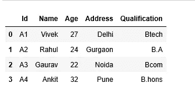

合并内部

```
**#Left Join**
pd.merge(df1,df2,how=’left’)#matching and non matching records from left DF which is df1 is present in result data frame
```

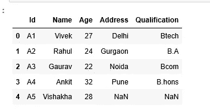

向左合并

```
**#Right Join**
pd.merge(df1,df2,how=’right’)#matching and non matching records from right DF, df2 will come in result df
#as of now we dont have any non matching record in right df
```

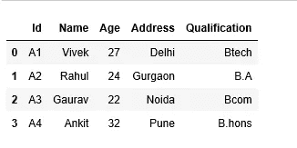

向右合并

```
**#outer join**
pd.merge(df1,df2,how=’outer’)#all the matching and non matching records are available in resultant dataset from both data frames
```

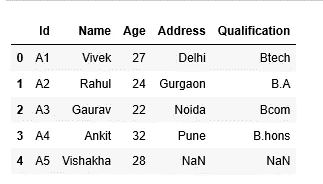

合并全外部

**情况 2:合并没有公共列的数据帧**

```
#changed the merging key in data frame d2import pandas as pdd1 = {‘Id’: [‘A1’, ‘A2’, ‘A3’, ‘A4’,’A5'],
 ‘Name’:[‘Vivek’, ‘Rahul’, ‘Gaurav’, ‘Ankit’,’Vishakha’], 
 ‘Age’:[27, 24, 22, 32, 28],} 

d2 = {‘ID’: [‘A1’, ‘A2’, ‘A3’, ‘A4’],
 ‘Address’:[‘Delhi’, ‘Gurgaon’, ‘Noida’, ‘Pune’], 
 ‘Qualification’:[‘Btech’, ‘B.A’, ‘Bcom’, ‘B.hons’]}df1=pd.DataFrame(d1)
df2=pd.DataFrame(d2)#lets check when merging keys are different ('Id' and 'ID')
pd.merge(df1,df2)
```

合并导致以下错误:

> **合并错误**:没有要执行合并的公共列。

为了克服合并错误，我们可以使用 pandas 参数' left_on '和' right_on '来明确指示 pandas 要在哪些键列上合并数据帧，其余一切保持类似。

```
#df1 key column 'Id'
#df2 key column 'ID'pd.merge(df1,df2,left_on=’Id’,right_on=’Id’,how=’left’)
```

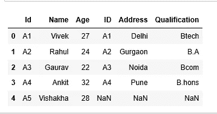

合并不常用键

**2。join()用于组合键列或索引上的数据。**

创建两个数据框并了解连接的工作原理。

```
import pandas as pd
df1 = pd.DataFrame({‘key’: [‘K0’, ‘K1’, ‘K5’, ‘K3’, ‘K4’, ‘K2’],
 ‘A’: [‘A0’, ‘A1’, ‘A5’, ‘A3’, ‘A4’, ‘A2’]})
df2 = pd.DataFrame({‘key’: [‘K0’, ‘K1’, ‘K2’],
 ‘B’: [‘B0’, ‘B1’, ‘B2’]})
```

**案例 1。加入索引**

默认情况下，对索引执行 pandas 连接操作。两个数据框都有默认的索引值，因此无需指定任何连接键，连接将隐式地对索引执行。

```
#default nature of pandas join is left outer join
df1.join(df2, lsuffix=’_l’, rsuffix=’_r’)
```

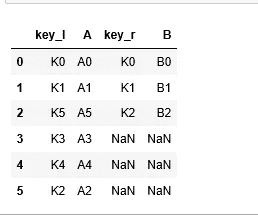

向左加入

如果 pandas join 中有重叠的列，它将抛出错误:

> **值错误**:列重叠，但没有指定后缀:Index(['key']，dtype='object ')

借助下面的用例，尝试理解 pandas 连接的默认性质，即左外连接。

创建两个具有不同索引值的数据框

```
df1 = pd.DataFrame({‘key’: [‘K0’, ‘K1’, ‘K5’, ‘K3’, ‘K4’, ‘K2’],
 ‘A’: [‘A0’, ‘A1’, ‘A5’, ‘A3’, ‘A4’, ‘A2’]},
 index=[0,1,2,3,4,5])df2 = pd.DataFrame({‘key’: [‘K0’, ‘K1’, ‘K2’],
 ‘B’: [‘B0’, ‘B1’, ‘B2’]},
 index=[6,7,8])df1.join(df2,lsuffix=’_l’,rsuffix=’_r’)#df1 is left DF and df2 is right DF
```

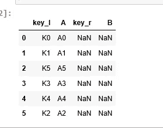

非匹配索引

两个数据框中的索引值不同，如果内部/相等连接，结果数据集将为空，但数据从左侧 DF (df1)出现。

```
**#inner join**
df1.join(df2,lsuffix=’_l’,rsuffix=’_r’,how=’inner’)
```

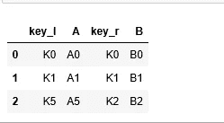

加入内部

```
**#outer join**
df1.join(df2,lsuffix=’_l’,rsuffix=’_r’,how=’outer’)
```

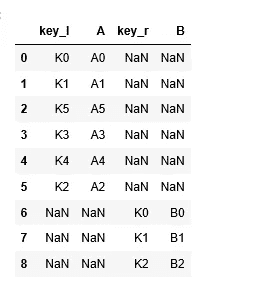

连接外部

**案例二。连接列**

数据框也可以在列上连接，但是由于连接在索引上工作，我们需要将连接键转换成索引，然后执行连接，其余都是类似的。

```
#join on data frame column
df1.set_index(‘key1’).join(df2.set_index(‘key2’))
```

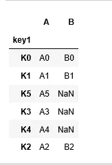

**3。concat()用于组合跨行或列的数据帧。**

创建两个数据框以了解 concat 的工作原理。concat 是一种垂直操作。

**案例一。串联轴上的数据帧=0，默认操作**

```
import pandas as pd
m1 = pd.DataFrame({
 ‘Name’: [‘Alex’, ‘Amy’, ‘Allen’, ‘Alice’, ‘Ayoung’],
 ‘subject_id’:[‘sub1’,’sub2',’sub4',’sub6',’sub5'],
 ‘Marks_scored’:[98,90,87,69,78]},
 index=[1,2,3,4,5])m2 = pd.DataFrame({
 ‘Name’: [‘Billy’, ‘Brian’, ‘Bran’, ‘Bryce’, ‘Betty’],
 ‘subject_id’:[‘sub2’,’sub4',’sub3',’sub6',’sub5'],
 ‘Marks_scored’:[89,80,79,97,88]},
 index=[4,5,6,7,8])pd.concat([m1,m2])
```

两个数据帧的索引都保留在 concat 操作中。


串联

```
#ignore indexes from original data frames
pd.concat([m1,m2],ignore_index=True)
```

与以前的输出不同，索引值被赋予了序列号


忽略索引

**案例二。轴上的串联操作=1，水平操作**

```
#axis=1 works as join operation
pd.concat([m1,m2],axis=1)
```

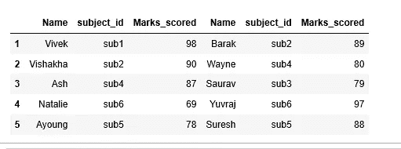

连接为连接

**案例三。连接不同形状的数据帧**

```
df1 = pd.DataFrame({‘A’:[1,2,3], ‘B’:[1,2,3]})
df2 = pd.DataFrame({‘A’:[4,5]})
```

如果我们试图对具有不同列或不同形状的数据帧的 df1 和 df2 执行 concat 操作。对不相等形状的数据帧执行串联操作时，pandas 会将缺失值更新为 NaN。

> 熊猫 NaN 本质上是浮点型的，因此 B 系列的值更改为浮点型。

```
df = pd.concat([df1,df2],ignore_index=True)
```

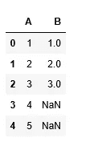

连接不等形状 DF

**4。append()垂直组合数据帧**

创建两个数据框以了解追加的工作原理。

**案例一。追加数据帧，重复索引问题**

```
m1 = pd.DataFrame({
 ‘Name’: [‘Alex’, ‘Amy’, ‘Allen’, ‘Alice’, ‘Ayoung’],
 ‘subject_id’:[‘sub1’,’sub2',’sub4',’sub6',’sub5'],
 ‘Marks_scored’:[98,90,87,69,78]},
 index=[1,2,3,4,5])m2 = pd.DataFrame({
 ‘Name’: [‘Billy’, ‘Brian’, ‘Bran’, ‘Bryce’, ‘Betty’],
 ‘subject_id’:[‘sub2’,’sub4',’sub3',’sub6',’sub5'],
 ‘Marks_scored’:[89,80,79,97,88]},
 index=[1,2,3,4,5])
```

带有重叠索引的追加函数抛出错误:

> **值错误**:索引有重叠值:

```
m1.append(m2,verify_integrity=False)
#verify_integrity=False is default argument
m1.append(m2)#output will be similar for both above lines of code
```


附加

**案例二。附加形状不等的数据帧**

创建两个具有不同形状的新数据框

```
m1 = pd.DataFrame({
 ‘Name’: [‘Vivek’, ‘Vishakha’, ‘Ash’, ‘Natalie’, ‘Ayoung’],
 ‘subject_id’:[‘sub1’,’sub2',’sub4',’sub6',’sub5'],
 ‘Marks_scored’:[98,90,87,69,78],
 ‘Rank’:[1,3,6,20,13]},
 index=[1,2,3,4,5])m2 = pd.DataFrame({
 ‘Name’: [‘Barak’, ‘Wayne’, ‘Saurav’, ‘Yuvraj’, ‘Suresh’],
 ‘subject_id’:[‘sub2’,’sub4',’sub3',’sub6',’sub5'],
 ‘Marks_scored’:[89,80,79,97,88],},
 index=[1,2,3,4,5])m1.append(m2)
```


# 总结:

熊猫数据集组合操作用例

每种组合操作的性质

熊猫合并()，加入()的工作方式和差异

熊猫 concat()、append()的工作方式和区别

感谢所有人阅读我的博客，如果你喜欢我的内容和解释，请在媒体上关注我，你的反馈将永远帮助我们成长。

谢谢

Vivek Chaudhary