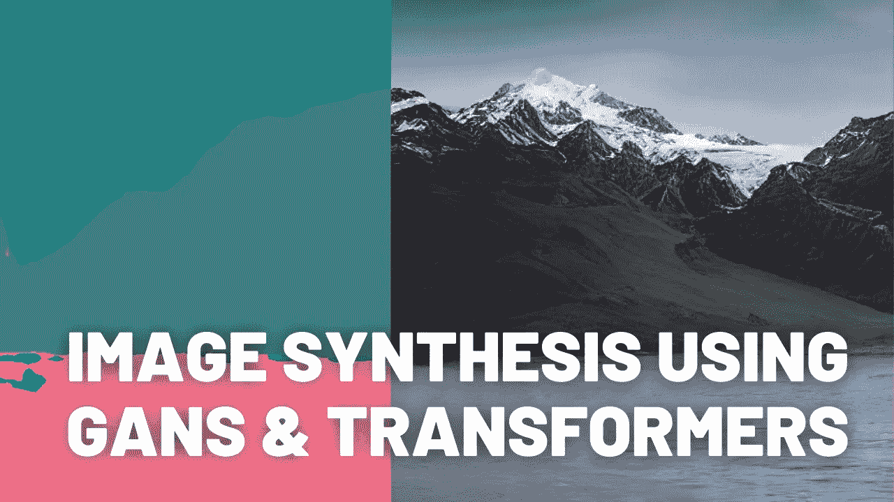
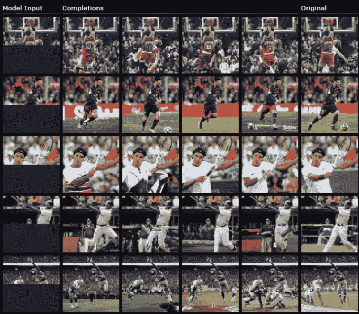
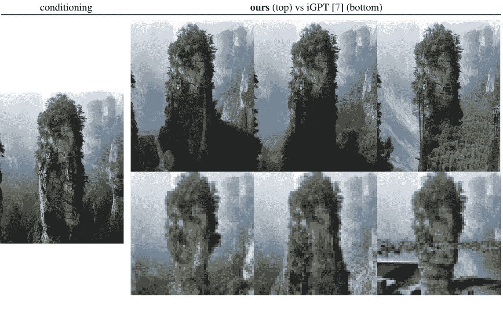
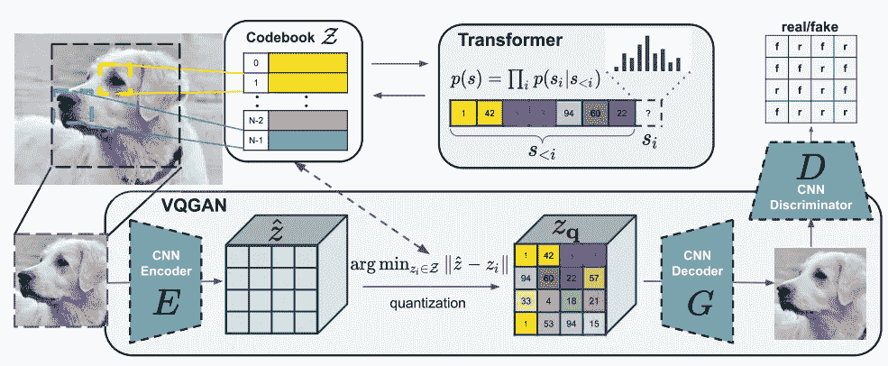
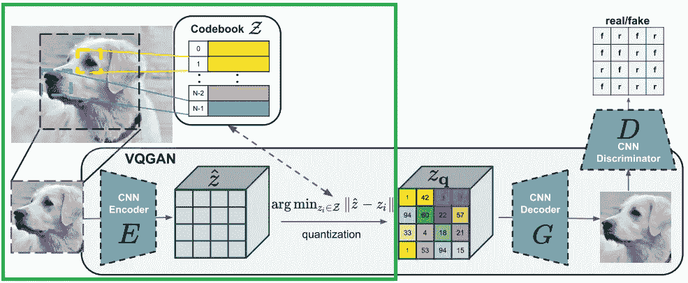
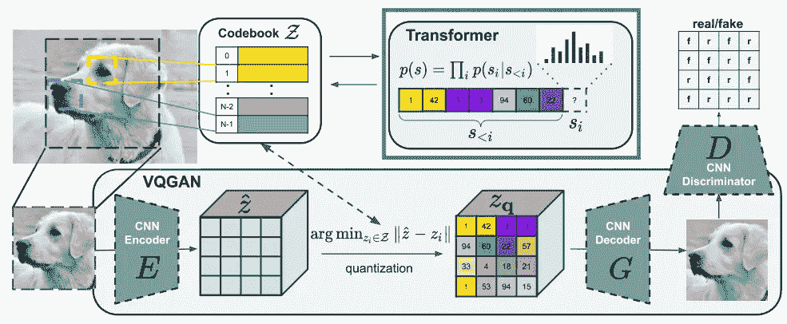

# 结合变形金刚的表现力和细胞神经网络的高分辨率图像合成效率

> 原文：<https://pub.towardsai.net/combining-the-transformers-expressivity-with-the-cnns-efficiency-for-high-resolution-image-synthesis-31c6767547da?source=collection_archive---------2----------------------->

## [计算机视觉](https://towardsai.net/p/category/computer-vision)

## TL；DR:他们将 GANs 和卷积方法的效率与 transformers 的表达能力结合起来，为语义指导的高质量图像合成提供了一种强大而省时的方法。

如果标题和副标题听起来像是另一种语言，那么这篇文章就是为你而写的！

## 图像-GPT

你可能听说过最近由 OpenAI 发布的 iGPT，或图像-GPT，我在我的频道上报道过。这是最先进的生成变压器模型。OpenAI 在图像的像素表示上使用 transformer 架构来执行图像合成。简而言之，他们使用一幅图像的一半像素作为输入的变压器来生成另一半图像。正如你在这里看到的，它非常强大。

陈等，【生成式像素预处理】，(2020)

但是，你也知道，有 4k 高分辨率的图像和视频。你知道一张 4k 图像有多少像素吗？
以百万甚至千万计。与自然语言处理应用程序的简单短语或段落相比，这是一个相当长的序列。因为转换器被设计为学习顺序数据上的远程交互，在这种情况下将顺序使用所有像素，所以它们的方法在计算上要求过高，并且不能缩放超过 192 x 192 图像分辨率。

所以变形金刚不能用于图像，因为没有人想生成超低清晰度的图像，对不对？嗯，不尽然。

## [驯服高分辨率图像合成的变压器](https://compvis.github.io/taming-transformers/)

[驯服用于高分辨率图像合成的变压器](https://compvis.github.io/taming-transformers/)，Esser 等人，2020 年

德国海德堡大学的研究人员最近发表了一篇新论文，将卷积方法的效率与变形金刚的表达能力相结合，以产生高质量图像的语义指导合成。这意味着他们使用卷积神经网络来获得图像的上下文丰富的表示，然后使用该表示代替实际图像来训练转换器模型，以从其合成实际图像，从而允许比 iGPT 高得多的图像分辨率，同时保持最终图像的质量。但是我们一会儿会回到这个话题，并给出更好的解释。

如果你不熟悉 CNN 或变形金刚，我强烈建议你看我做的解释它们的视频，以便更好地理解这种方法。

这篇论文被称为“驯服高分辨率图像合成的变形金刚”，正如我所说，它使变形金刚能够从语义图像合成高分辨率图像，就像你在这里看到的一样。其中唯一需要的信息是近似的语义分割，显示在图像中的哪个位置你想要什么样的环境，并且它将输出完整的高清晰度图像，用真实的山、草、天空、日落等填充分割。

现在的问题是，为什么这些研究人员和 OpenAI 使用变压器而不是我们典型的 GAN 架构进行图像合成？
嗯，使用变形金刚进行图像生成的优势很明显:
1。它们继续在各种各样的任务上显示出最先进的结果，并且非常有前途。
2。它们不包含在 CNN 中发现的归纳偏差，其中二维图像和过滤器的使用导致局部交互的优先化。这种归纳偏见是 CNN 如此高效的原因，但它可能限制太多，无法使网络“富有表现力”，或“原创”。

[驯服高分辨率图像合成的变形金刚](https://compvis.github.io/taming-transformers/)，埃塞尔等人，2020 年

现在我们知道变形金刚更有“表现力”，非常强大，剩下的唯一一件事就是想办法让它更有效率。事实上，在他们的方法中，他们实现了使用这种由来自 CNN 的感应偏置引起的高效率以及变压器的表现力。

[驯服高分辨率图像合成的变压器](https://compvis.github.io/taming-transformers/)，Esser 等人，2020 年

正如我所说，卷积神经网络架构由经典的编码器-解码器和使用鉴别器(他们称之为 VQGAN)的对抗训练程序组成，用于以码本的形式生成图像的有效和丰富的表示。顾名思义，它是一种 GAN 架构，用于训练生成器生成高分辨率图像。如果你不熟悉 GANs 是如何工作的，你可以看看我制作的解释它们的视频。

[驯服高分辨率图像合成的变压器](https://compvis.github.io/taming-transformers/)，埃塞尔等人，2020 年

一旦完成了第一次训练，它们只采用解码器，然后该解码器用于表示输入图像的编码信息，作为变换器的输入，这里称为码本。使得变换器不是直接使用图像的像素，而是使用这个包含图像表示的码本，该图像表示的形式是感觉上丰富的图像成分的组合。当然，这个密码本是由极度压缩的数据组成的，因此它可以被转换器顺序读取。

[驯服高分辨率图像合成的变压器](https://compvis.github.io/taming-transformers/)，Esser 等人，2020 年

然后，使用此表示作为转换器的训练数据集，它学习预测此表示中可能的下一个索引的分布，就像常规的自回归模型一样。这意味着它会自动构建一个回归方程，使用以前的时间步长作为输入来预测未来时间步长的值。因此将 CNN 和 GANs 与变压器相结合来执行高分辨率图像合成。

## [演示](https://colab.research.google.com/github/CompVis/taming-transformers/blob/master/scripts/taming-transformers.ipynb)

[在这里](https://colab.research.google.com/github/CompVis/taming-transformers/blob/master/scripts/taming-transformers.ipynb)，你可以找到[代码](https://github.com/CompVis/taming-transformers)的[演示版本](https://colab.research.google.com/github/CompVis/taming-transformers/blob/master/scripts/taming-transformers.ipynb)，你现在就可以在 google colab 上试用，无需设置任何东西。他们已经设置好了，你只需要运行这几行。它从 GitHub 下载他们的代码，并自动安装所需的依赖项。然后，它加载模型并导入它的预训练版本。最后，您可以使用他们的分割图像作为测试，或者上传您自己的分割图像，再运行几行来编码分割。我提醒你，这是转换器创建与你的图像相关联的特定码本的必要步骤。而你终于可以制作出这种超高质量的图像了！

## 观看更多结果！

## 结论

当然，这只是这篇新论文的概述。我强烈建议阅读它以获得更好的技术理解。还有，我前面提到过，他们的代码在 GitHub 上有预训练好的模型，你可以自己尝试，甚至改进！所有的链接都在下面的参考文献中。

如果你喜欢我的工作，并想了解最新的人工智能技术，你绝对应该在我的社交媒体频道上关注我。

*   订阅我的 [**YouTube 频道**](https://www.youtube.com/channel/UCUzGQrN-lyyc0BWTYoJM_Sg) 。
*   关注我的项目上 [**LinkedIn**](https://www.linkedin.com/in/whats-ai/) 和这里上[**中**](https://whats-ai.medium.com/) **。**
*   一起学习 AI，加入我们的 [**不和谐社区**](https://discord.gg/learnaitogether) ，*分享你的项目、论文、最佳课程，寻找 Kaggle 队友，等等！*

## 参考

驯服高分辨率图像合成的变压器，Esser 等人，2020 年

**项目与论文和结果的链接**:[https://compvis.github.io/taming-transformers/](https://compvis.github.io/taming-transformers/)
**代码**:[https://github.com/CompVis/taming-transformers](https://github.com/CompVis/taming-transformers)
**Colab 演示立即开始采样**:[https://Colab . research . Google . com/github/CompVis/taming-transformers/blob/master/scripts/taming-transformers . ipynb](https://colab.research.google.com/github/CompVis/taming-transformers/blob/master/scripts/taming-transformers.ipynb)