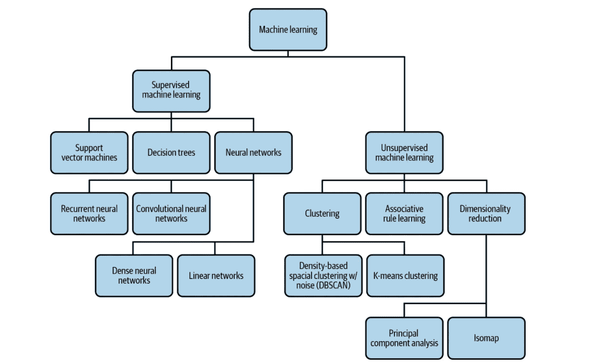
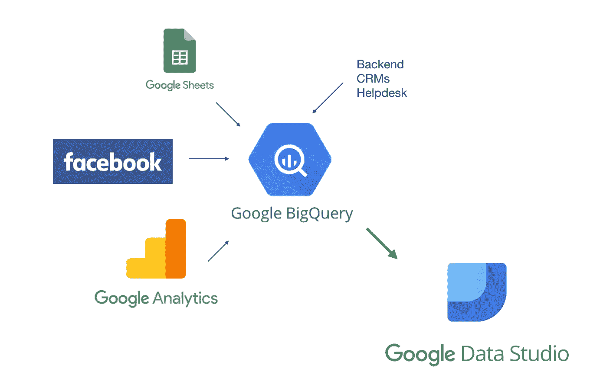
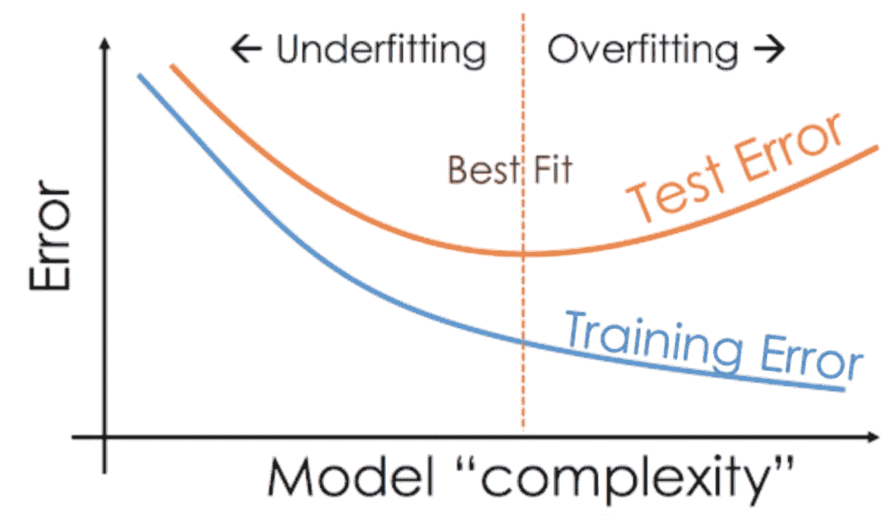
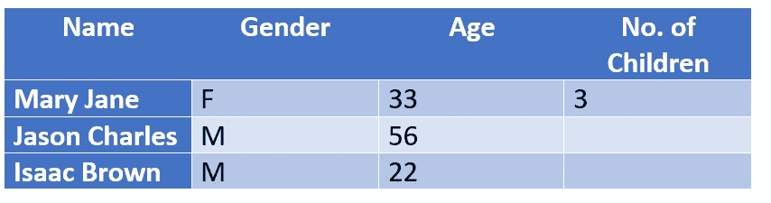
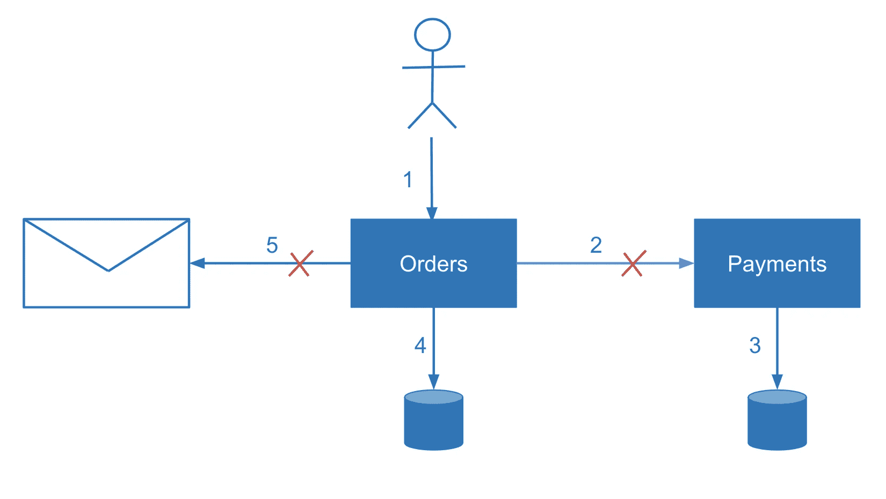
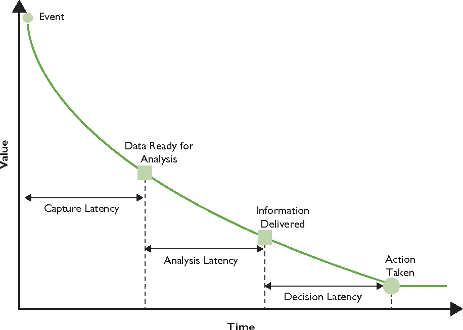
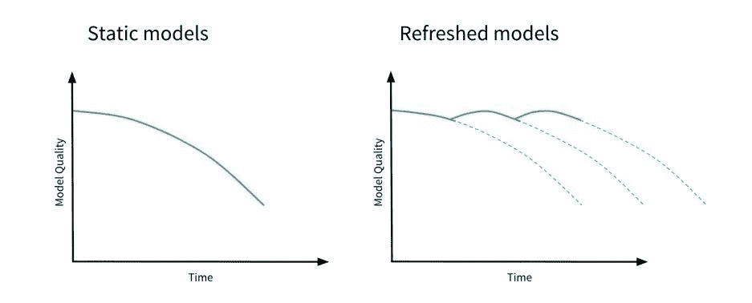

# 机器学习中的常见挑战以及如何应对它们

> 原文：<https://pub.towardsai.net/common-challenges-in-machine-learning-and-how-to-tackle-them-cc29c47c5f24?source=collection_archive---------2----------------------->

来源:Freepik 的免费图片，这个封面是利用 Freepik.com 的资源设计的

## [数据科学](https://towardsai.net/p/category/data-science)，[社论，](https://towardsai.net/p/category/editorial) [机器学习](https://towardsai.net/p/category/machine-learning)

## 这些是机器学习(ML)中最常见的挑战，以及如何应对这些挑战的简单解决方案

作者: [Saniya Parveez](https://www.linkedin.com/in/saniya-parveez-b41279157/)

 [## 加入我们吧↓ |面向人工智能成员|数据驱动的社区

### 加入人工智能，成为会员，你将不仅支持人工智能，但你将有机会…

members.towardsai.net](https://members.towardsai.net/) 

机器学习(ML)是从数据中学习建立模型的过程。它有一套多样化的算法，用数据赋予生命。然而，传统的经典 ML 方法也可以通过使用显式规则用最小的变量集来解决问题。但是，当变量数量增加时，问题就变得复杂了。不管它们是如何可视化表示的，机器学习模型都是数学函数，因此可以使用数字软件框架和软件包从零开始实现[ [1](https://www.oreilly.com/library/view/machine-learning-design/9781098115777/ch01.html) ]。

图 1:一些不同类型的机器学习。

机器学习每天变得越来越可用，一个令人兴奋的发展是机器学习模型的直接可用性，因为数据是任何机器学习问题的本质。这种数据用于模型的训练、验证和测试，并且机器学习模型的性能报告需要基于独立的测试数据而不是训练或验证测试来计算。最后，需要对数据进行拆分，以便所有三个数据集(如训练、测试和验证)都可以具有相关的统计特征。

在数据清理之后，标准机器学习工作流程中的第一个关键步骤是训练——将训练数据传递给模型以学习识别模式的方法。训练之后，接下来的步骤是测试，在测试中，我们检查模型在训练集之外的数据上的表现。这个工作流程被称为模型评估。

我们可能需要多次运行培训和评估，交付额外的功能工程，并调整模型架构。一旦模型的性能在评估阶段达到高等级，就启动该模型，以便其他人可以访问它来进行预测。

图 2:机器学习模型开发过程。

作为数据科学家，将产品团队的需求转化为模型的特征是至关重要的，因为假阴性的成本是假阳性的五倍。因此，在设计模型时，应该针对查全率和查准率对模型进行优化，以满足这一要求。平衡产品团队优化准确性和最小化模型损失的目标也是至关重要的。

# 数据和模型工具

有各种各样的产品可用，它们提供了解决数据和机器学习问题的工具。这些是一些工具:

## BigQuery

BigQuery 是一个企业数据仓库，旨在使用 SQL 快速分析大型数据集。数据集在 BigQuery 中组织数据，一个数据集可以有多个表。

图 3:大查询[ [2](https://www.business2community.com/marketing/google-bigquery-a-tutorial-for-marketers-02252216) ]。

## 大查询 ML

BigQuery ML 是一个从存储在 BigQuery 中的数据构建模型的工具。通过 BigQuery ML，我们可以使用 SQL 对我们的模型进行训练、评估和生成预测。它支持分类和回归模型，以及无监督聚类模型。还可以将之前训练的 TensorFlow 模型导入到 BigQuery ML 中进行预测。

图 4: BigQuery ML [ [3](https://twitter.com/sfeir/status/1039135212633042945) ]。

# 机器学习的挑战

构建 ML 系统的过程提供了许多影响 ML 架构设计的不同挑战。通过使用以下方法，我们可以消除对这些挑战的识别。

这些是机器学习中的一些基本挑战:

## 数据质量

机器学习模型只有经过训练和推广才是可靠的。它既不应该过分合身，也不应该不够合身。数据是任何模型可靠性的重要因素。假设模型是在有缺陷的数据集、选择不当的要素或无法使用模型准确解释总体的数据上进行训练的。在这种情况下，模型的预测将直接插补这些数据。数据应该有质量，其质量应该基于准确性、完整性、一致性和及时性。

## 数据准确性

数据准确性既属于训练数据的特征，也属于符合这些特征的重要真值标签。假设一个机器学习模型是在一个有缺陷的数据集上、在具有不适当选择的特征的数据上、或者在不能准确表示使用该模型的群体的数据上训练的。在这种情况下，模型的预测将直接反映这些数据。因此，模型要么过拟合，要么欠拟合。

图 5:欠配和过配[ [4](https://medium.com/@minions.k/underfit-and-overfit-explained-8161559b37db)

例如，训练数据集中的重复可能导致 ML 模型不准确地将更多权重分配给这些数据点。

这些是执行和维护数据质量的操作:

*   了解数据的来源以及数据收集步骤中的任何潜在错误有助于确保要素的准确性。
*   错别字分析屏幕。
*   重复条目的标识。
*   表格数据不一致性的度量。
*   分析缺失的特征。
*   识别可能影响数据质量的任何其他错误。

准确的数据标注与要素精度同样重要。因此，错误标记的训练示例会产生误导性的模型准确性。该模型仅依赖于训练数据中的地面真实标签来更新其权重并最小化损失。

例如:

假设你正在开发一个情感分析模型，你的“正面”训练样本中有 25%被错误地标注为“负面”。你的模型会对什么应该算作负面情绪有一个错误的描述，这将直接反映在它的预测中。

**数据完整性**

举个例子就很容易理解数据完整性。

图 6:不完整的数据

让我们以一个正在被训练以识别猫品种的模型为例。

你在一个大型的猫图像数据集上训练模型，得到的模型可以将这些图像分为 10 个可能的猫种类别中的 1 个，如孟加拉猫、暹罗猫等。，准确率高达 99%。

现在在生产中部署这个模型，所以你发现在上传猫的照片进行分类时，许多用户上传狗的照片，并且对模型的结果感到失望。

由于模型被训练来识别 10 种不同的猫品种，所以无论你输入什么样的模型，你都可以预见它会被归入这 10 个类别中的一个。对于一张看起来一点也不像猫的图像，它甚至可以做到这一点。如果这些数据和标签没有包含在训练数据集中，就不能说“不是猫”。

数据完整性的一个重要方面是确保训练数据应该包含每个标签的不同展示。例如，假设您正在开发一个模型来预测某个特定城市的房地产价格，但该模型仅涵盖面积大于 3000 平方英尺的房屋的训练示例。在这种情况下，你得到的模型在较小的房子上会很差。

**数据一致性**

可以在数据要素和标注中观察到数据不一致。应该有标准来帮助确保数据集之间的一致性。让我们举一个例子。

假设政府正在从温度传感器收集大气数据。如果每个传感器都被校准到不同的标准，这将遵循不准确和欺骗性的模型预测[ [1](https://www.oreilly.com/library/view/machine-learning-design/9781098115777/ch01.html) ]。该数据有以下不一致之处:

*   度量单位的不同，如英里和公里。
*   位置数据中的一个问题是，有些人可能会将完整的街道地址写成“Main Street”，而其他人可能会将其缩写成“Main St”

图 7:数据不一致[ [5](https://ebaytech.berlin/data-consistency-in-microservices-architecture-bf99ba31636f) ]。

**数据时效性**

数据的及时性属于事件发生和添加到数据库之间的延迟。

例如，对于捕获信用卡交易的数据集，从交易发生到在系统中报告它可能需要一天时间。为了处理时间表，尽可能多地记录关于特定数据点的信息是有帮助的，并确保当您将数据更改为机器学习模型的特征时，信息会显示出来。

图 8:数据的时间线。

## 数据再现性

机器学习模型具有不可或缺的随机性。在训练期间，用随机值初始化 ML 模型的权重。然后，随着模型迭代并从数据中学习，这些权重在训练期间收敛。因此，使用可比训练数据给出的相应模型代码将在训练运行中产生明显不同的结果。这种差异带来了再现性的挑战。如果你训练一个模型达到 98.1%的准确度，重复的训练运行不能保证达到相同的结果，这使得很难跨实验运行测量[ [1](https://www.oreilly.com/library/view/machine-learning-design/9781098115777/ch01.html) ]。

为了解决这种重复性的困境，通常设置模型使用的随机种子值，以保证每次运行训练时应用相同的随机性。

遵循训练 ML 模型所涉及的需要固定以确保再现性的方法:

*   使用的数据
*   分割机制用于生成用于训练和验证的数据集。
*   数据准备和模型超参数
*   应用批量大小等变量
*   学习率计划

## 数据漂移

机器学习模型主要表示输入和输出之间的静态连接，其中数据会随着时间的推移而发生显著变化。数据漂移导致很难确保机器学习模型保持相关，并且这些模型预测是使用它们的环境的准确表示。

示例:

让我们有一个模型被训练来分类新闻标题，像“政治”、“商业”和“技术”因此，如果你在 20 世纪的历史新闻文章上训练和评估你的模型，它可能不会在当前数据上表现良好。今天已知一篇标题中带有“智能手机”字样的文章，大概是关于技术的。根据历史数据训练的模型不会知道这个词。这种技术被称为数据漂移。

解决数据漂移的解决方案:

*   不断更新你的训练数据集。
*   重新训练模型。
*   修改分配给特定输入数据组的模型权重。

图 9:有数据漂移的模型。

## 规模

当接收和开发机器学习模型的数据时，数据集的大小将提供解决方案所需的工具。数据工程师的工作通常是构建可以扩展以处理数百万行数据集的数据管道。

对于模型培训，ML 工程师负责管理特定培训工作所需的基础设施。根据数据集的类型和大小，模型训练可能非常耗时且计算成本高昂，需要专门为 ML 工作负载设计的基础架构(如 GPU)。例如，图像模型通常比完全基于表格数据训练的模型需要更多的训练基础设施。

缺少缩放也会影响 L1 或 L2 正则化的效果。要素权重的大小取决于该要素值的范围，因此不同的要素会受到不同的正则化影响。通过将所有特征缩放到[–1，1]之间，我们保证不同特征的相对大小没有太大差异。

开发人员和 ML 工程师通常负责处理与模型部署和服务预测请求相关的扩展挑战。

缩放可以进一步分类:

*   线性缩放。
*   非线性变换。

# 摘要

我们已经看到，设计、构建和部署机器学习系统是机器学习工作流中的基本步骤。构建生产机器学习模型继续成为一个工程系统，利用在研究环境中建立的 ML 方法，并将它们应用于商业问题。

随着机器学习变得越来越主流，从业者必须受益于经过验证的方法来解决反复出现的问题。我们很幸运能够与 TensorFlow、Keras、BigQuery ML、TPU 和云人工智能平台团队合作，推动机器学习研究和基础设施的民主化。

一旦收集了数据集并发现了模型的要素，数据验证就是计算数据统计数据、了解方案并评估数据集以识别漂移和训练服务偏差等问题的过程。任何机器学习(ML)模型的核心都是一个数学函数，它被定义为只对特定的数据类型起作用。

类似地，现实世界的机器学习模型需要在可能无法直接插入数学函数的数据上运行。大多数现代的大规模机器学习模型，如随机森林、支持向量机、神经网络等。，处理数值。因此，如果我们的输入是数字，我们可以一致地将其传递给模型。

缩放 ML 模型是至关重要的，因为一些机器学习算法和技术容易受到数据的不同特征的相对大小的影响。例如，使用欧几里德距离作为其接近度度量的 k-means 聚类算法最终将大量依赖于具有较大幅度的特征。

**免责声明:**本文所表达的观点均为作者个人观点，不代表与作者(直接或间接)相关的任何公司的观点。这项工作并不打算成为最终产品，而是当前思想的反映，同时也是讨论和改进的催化剂。

**除非另有说明，所有图片均来自作者。**

经由[发布**走向 AI** 发布](https://towardsai.net/)

 [## 店铺↓ |走向 AI

### 发布最好的技术、科学和工程|社论→https://towardsai.net/p/editorial |订阅→…

ws.towardsai.net](https://ws.towardsai.net/shop)  [## 加入我们吧↓ |面向人工智能成员|数据驱动的社区

### 加入人工智能，成为会员，你将不仅支持人工智能，但你将有机会…

members.towardsai.net](https://members.towardsai.net/)  [## 赞助商|了解如何成为《走向人工智能》的赞助商

### 无论你是想以一种吸引读者的方式突出你的产品，吸引高度相关的小众受众，还是…

sponsors.towardsai.net](https://sponsors.towardsai.net/) 

## 进一步阅读

 [## 2021 年数据科学就业市场趋势分析

### 了解雇主对 2021 年数据科学家角色的期望。来自 3000 多份数据科学家工作的数据分析…

pub.towardsai.net](/current-data-science-job-market-trend-analysis-future-4184f03a04ca)  [## 使用机器学习的营销分析见解

### 使用数据科学通过客户细分和机器学习技术深入营销分析

pub.towardsai.net](/marketing-analytics-insights-using-machine-learning-338bb94acc14)  [## 什么是深度学习？

### 深入探讨“什么是深度学习”,同时对深度学习进行激动人心的简单介绍，如何…

pub.towardsai.net](/what-is-deep-learning-34767bb10366) 

## 参考

[1]“机器学习设计模式”。2021.奥赖利在线学习。[https://www . oreilly . com/library/view/machine-learning-design/9781098115777/ch01 . html](https://www.oreilly.com/library/view/machine-learning-design/9781098115777/ch01.html.)

[2]《Google big query:营销人员教程》。2019.商业 2 社区。[https://www . business 2 community . com/marketing/Google-big query-a-tutorial-for-markets-02252216](https://www.business2community.com/marketing/google-bigquery-a-tutorial-for-marketers-02252216)。

[3]“推特状态”。2018.斯菲尔的推特状态。【https://twitter.com/sfeir/status/1039135212633042945】T4。

[4]《欠适和过适解释》。2020.中等。[https://medium . com/@ minions . k/under fit-and-over fit-explained-8161559 b 37 db。](https://medium.com/@minions.k/underfit-and-overfit-explained-8161559b37db.)

[5]《微服务架构中的数据一致性》。2019.中等。[https://ebay tech . Berlin/data-consistency-in-micro services-architecture-BF 99 ba 31636 f。](https://ebaytech.berlin/data-consistency-in-microservices-architecture-bf99ba31636f.)