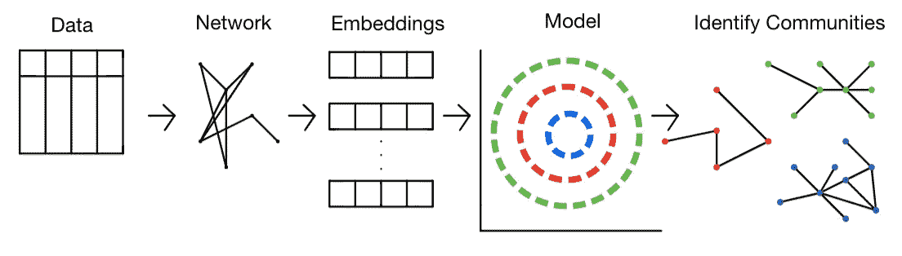
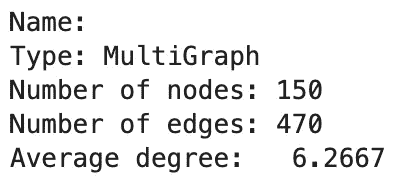
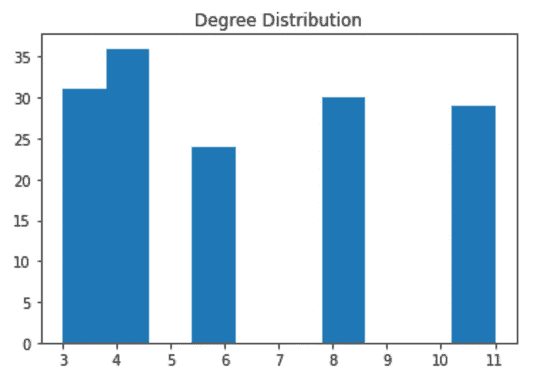
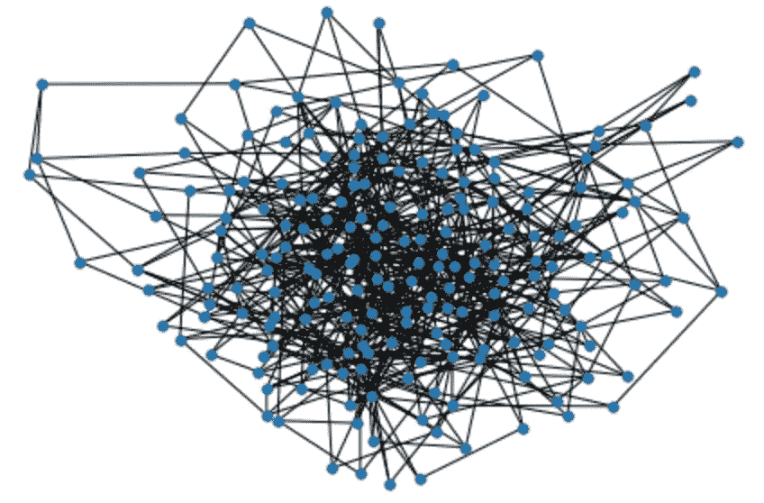
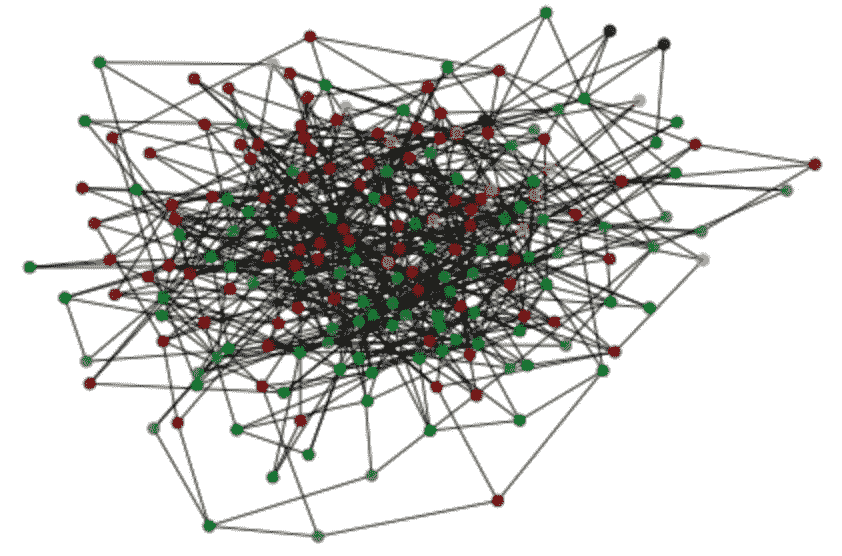

# 使用 Node2Vec 进行社区检测

> 原文：<https://pub.towardsai.net/community-detection-with-node2vec-6cd5a40c7155?source=collection_archive---------0----------------------->

## 使用 Node2Vec 和集群模型在 Python 中构建社区检测管道


图片由[约书亚·罗森-哈里斯](https://unsplash.com/@joshrh19)从 [Unsplash](https://unsplash.com/photos/KRELIShKxTM) 拍摄

本文将是一篇关于如何使用 node2vec 和集群模型识别网络中的社区的教程。下面重点介绍文章的结构:

## 目录

*   什么是社区检测？
    -社区检测&聚类
*   问题陈述
*   解决方案架构
    -需求
*   合成网络
*   应用节点 2Vec
*   应用光谱聚类
*   识别社区
*   结束语
*   资源

# 什么是社区检测？

在图论中，如果您能够根据节点的边密度对节点(可能有重叠的节点)进行分组，则网络具有社区结构。这将意味着原始网络 G1 可以被自然地分成多个子图/社区，其中社区内的边连通性将非常密集。重叠社区也是允许的，因此在形成的社区中可以有重叠节点。这意味着独立社区中的节点具有稀疏数量的边。

> *更一般的定义是基于这样的原则:如果节点对都是相同社区的成员，则它们更有可能被连接，而如果它们不共享社区，则它们不太可能被连接。
> 【1】—*[*https://en.wikipedia.org/wiki/Community_structure*](https://en.wikipedia.org/wiki/Community_structure)

直观地想到这一点，就有道理了。想想你自己在 Instagram 这样的社交网络中。你可能与许多与你感兴趣的事物相关的不同社区有着密切的联系。你可以关注与朋友、迷因、体育、动漫等相关的账户。这些分类中的每一个都可以被解释为社区，其中你作为一个用户是一个节点，边是通过将你连接到与你有相似兴趣的其他用户而生成的。因此，在你自己的社交网络中，你会有一个非常密集的社区，而与你社区之外的其他人联系很少。

有许多数学公式用于识别给定网络中的社区。算法如[卢万](https://en.wikipedia.org/wiki/Louvain_method)、[格文-纽曼](https://en.wikipedia.org/wiki/Girvan%E2%80%93Newman_algorithm)、[雅各布分数](https://en.wikipedia.org/wiki/Jaccard_index)等。所有这些都可以在网络上应用，以解决社区检测中的问题。

## 社区检测和聚类

有一个灰色区域表示社区检测和聚类之间的差异，许多人认为它们是相同的。一个区别是，社区检测是指基于网络结构生成节点组，而聚类侧重于基于与输入数据相关联的许多属性生成组。尽管我们将在本文中使用聚类模型，但我指的是更接近社区检测的方法。这是因为我们还将使用 node2vec 来生成与每个节点相关联的输入嵌入向量。Node2Vec 将是实现这一工作的秘密武器，该算法旨在为每个节点生成嵌入，同时保留图的初始结构。有关 Node2Vec 的更多信息，您可以参考这篇文章。

# 问题陈述

给定一个网络，创建一个管道，将初始网络分割成相关的社区。

# 解决方案架构

给定一些表格输入数据(我们将综合这些数据)，我们将开始创建一个网络。创建网络后，我们可以在其上运行 node2vec 来生成与每个节点相关联的节点嵌入。嵌入向量可以被传递给像[谱聚类](https://scikit-learn.org/stable/modules/generated/sklearn.cluster.SpectralClustering.html)这样的聚类算法，以将每个节点分割成社区。



具有 Node2Vec 和频谱嵌入的社区检测解决方案架构。图片由作者提供。

## 要求

```
Python=3.8.8
networkx=2.5
pandas=1.2.4
numpy=1.20.1
node2vec=0.4.4
sklearn=0.24.1
matplotlib=3.3.4
```

如果你没有安装 node2vec 包，这里的[是通过命令行安装它的库文档。](https://pypi.org/project/node2vec/)

# 创建网络

上面的脚本将生成一个随机图，供我们使用 node2vec 和后面的 spectral clustering。用户将为随机生成的网络指定他们想要的节点数量和度分布。网络将通过配置模型生成。配置模型本质上通过分配边来匹配度序列来生成随机图。请注意，由于这是随机的，因此每次生成的网络都会不同。此外，这只是一个运行 node2vec 的示例网络，仅仅因为生成的网络是一个多图并不意味着 node2vec 只能在其他多图上运行。Node2Vec 可以在有向、无向、加权、多重或常规网络上运行。当我为`n = 150`运行上面的函数时，下面是与结果图相关的统计数据。



与生成的网络相关联的统计数据。图片由作者提供



与生成的网络相关联的度分布。图片由作者提供。



创建的网络的可视化表示。图片由作者提供。

您通常不希望将网络可视化，尤其是如果网络很大的话。渲染与具有数十万条边的网络相关联的边所花费的时间和计算能力是巨大的。我这样做只是为了让读者能够直观地理解在本文后面将节点分配给社区时，它们是如何改变颜色的。

# 应用节点 2Vec

# 应用光谱聚类

对于本教程，我已经通过 sklearn 展示了如何使用[谱聚类](https://scikit-learn.org/stable/modules/generated/sklearn.cluster.SpectralClustering.html)【2】模型。这可以很容易地用其他聚类算法代替，如 [K-means](https://towardsdatascience.com/k-means-explained-10349949bd10) 、[凝聚聚类](https://scikit-learn.org/stable/modules/generated/sklearn.cluster.AgglomerativeClustering.html)等。因为我们目前正在使用合成数据来编写教程，所以我不会详细介绍社区评估或选择最佳数量的社区。聚类评估中的传统指标，如[轮廓得分](https://scikit-learn.org/stable/modules/generated/sklearn.metrics.silhouette_score.html)，肘方法等。可以很容易地应用到这个场景中。

# 识别社区

现在我们已经确定了每个节点属于哪个集群，我们可以将每个集群映射到颜色，并将颜色映射回我们的原始网络。这将允许我们根据每个节点所属的社区来查看网络。



通过颜色映射到其社区的节点。图片由作者提供。

# 结束语

概括地说，您可以在网络上使用 node2vec 构建一个社区检测管道。为此，只需在您选择的网络上应用 node2vec 算法，然后使用集群算法将节点映射到不同的集群/社区。这种方法很直观，因为 Node2Vec 的目的是在生成嵌入空间时保留网络结构。请注意，如果你通过一个不完整的网络，那么所发现的社区可能会产生误导。不完整的网络是基于部分观察创建的网络。如果没有一个包含所有观察结果的网络，从中产生的社区可能会产生误导。

这总结了如何使用 Node2Vec 在 Python 中实现社区检测管道的概述。你可以在我的 [GitHub](https://github.com/vatsal220) 上找到 [Jupyter 笔记本](https://github.com/vatsal220/medium_articles/blob/main/community_detection/detection.ipynb)中的代码，请随意跟随。

如果你想转型进入数据行业，并希望得到经验丰富的导师的指导和指引，那么你可能想看看最敏锐的头脑。Sharpest Minds 是一个导师平台，导师(他们是经验丰富的实践数据科学家、机器学习工程师、研究科学家、首席技术官等。)将有助于你的发展和学习在数据领域找到一份工作。点击这里查看。

# 资源

*   [1][https://en.wikipedia.org/wiki/Community_structure](https://en.wikipedia.org/wiki/Community_structure)
*   [2][https://sci kit-learn . org/stable/modules/generated/sk learn . cluster . spectral clustering . html](https://scikit-learn.org/stable/modules/generated/sklearn.cluster.SpectralClustering.html)

如果你喜欢读这篇文章，这里有一些我写的其他文章，你可能也会喜欢。

[](https://towardsdatascience.com/bayesian-a-b-testing-explained-344a6df88c1a) [## 贝叶斯 A/B 测试解释

towardsdatascience.com](https://towardsdatascience.com/bayesian-a-b-testing-explained-344a6df88c1a) [](https://towardsdatascience.com/comprehensive-guide-to-github-for-data-scientist-d3f71bd320da) [## 面向数据科学家的 GitHub 综合指南

### 通过 UI 和命令行为数据科学家提供的 GitHub 教程

towardsdatascience.com](https://towardsdatascience.com/comprehensive-guide-to-github-for-data-scientist-d3f71bd320da) [](https://towardsdatascience.com/active-learning-in-machine-learning-explained-777c42bd52fa) [## 机器学习中的主动学习解释

### Python 中主动学习管道的直觉和实现

towardsdatascience.com](https://towardsdatascience.com/active-learning-in-machine-learning-explained-777c42bd52fa) [](https://towardsdatascience.com/text-similarity-w-levenshtein-distance-in-python-2f7478986e75) [## Python 中带 Levenshtein 距离的文本相似度

### 用 Python 构建抄袭检测管道

towardsdatascience.com](https://towardsdatascience.com/text-similarity-w-levenshtein-distance-in-python-2f7478986e75) [](https://towardsdatascience.com/link-prediction-recommendation-engines-with-node2vec-c97c429351a8) [## 使用 Node2Vec 的链接预测推荐引擎

### 在 Python 中使用节点嵌入进行链接预测

towardsdatascience.com](https://towardsdatascience.com/link-prediction-recommendation-engines-with-node2vec-c97c429351a8) [](https://towardsdatascience.com/word2vec-explained-49c52b4ccb71) [## Word2Vec 解释道

### 解释 Word2Vec 的直观性&用 Python 实现它

towardsdatascience.com](https://towardsdatascience.com/word2vec-explained-49c52b4ccb71) [](https://towardsdatascience.com/recommendation-systems-explained-a42fc60591ed) [## 推荐系统解释

### 用 Python 解释和实现基于内容的协同过滤和混合推荐系统

towardsdatascience.com](https://towardsdatascience.com/recommendation-systems-explained-a42fc60591ed) [](https://towardsdatascience.com/text-summarization-in-python-with-jaro-winkler-and-pagerank-72d693da94e8) [## 用 Jaro-Winkler 和 PageRank 实现 Python 中的文本摘要

### 用 Jaro-Winkler 和 PageRank 构建一个文本摘要器

towardsdatascience.com](https://towardsdatascience.com/text-summarization-in-python-with-jaro-winkler-and-pagerank-72d693da94e8)