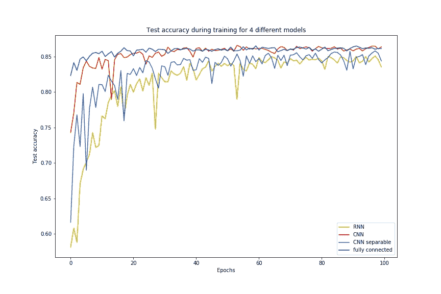

# 比较神经网络架构

> 原文：<https://pub.towardsai.net/comparing-neural-network-architectures-through-language-classifier-using-google-colab-63167c18b919?source=collection_archive---------2----------------------->

## 使用 Google Colab 比较 NN 架构| [和 AI](https://towardsai.net)

## 使用 Google Colab，通过语言分类器比较神经网络架构

在阅读了弗朗索瓦·乔莱的精彩书籍*用 Python 进行深度学习*之后，我对不同的神经网络架构以及哪一种最适合各种任务感到好奇。我已经想到用单词数据进行一些练习，所以我决定承担对写单词的语言进行分类的项目。当处理文字时，我想到的第一个方向是使用递归神经网络。Chollet 的书还建议，一系列 1D 卷积可能是合适的。最后，我发现了一篇不错的[博文](https://medium.com/coinmonks/language-prediction-using-deep-neural-networks-42eb131444a5)，它使用一个简单的全连接网络完成了类似的任务。这是在同一个项目中尝试这些优秀网络的最佳机会！我自己收集数据，用 Keras 做机器学习。完整的 Python 代码可以在我的 [Github](https://github.com/yangobeil/language-identifier) 上找到。

# 设置数据收集

项目的第一步是收集数据。我想收集不同语言的单词，以便对它们进行分类，所以我在网上搜寻文本。一个简单的策略是使用 Wikipedia Python 包在 Wikipedia 上搜索单词，并获取文章中的所有文本。我需要定义的第一个函数是 *get_words* 来收集所有的单词。

它以{language: [query1，query2，...]，…}形式的字典作为输入，该字典包含要搜索的每种语言的所有单词。对于每种语言，该函数搜索单词列表以收集文章的文本。然后，它将文本拆分成单词(在空格上),使用定义的函数对单词进行清理。然后，所有单词都被添加到一个列表中，根据输入的内容删除或保留重复的单词。输出是一个{language: [word1，word2，…]，…}形式的字典，其中所有收集到的单词都按语言进行了组织。

要定义的下一个函数是 *clean_word* 将单词转换成一种好的格式。这在 *get_words* 函数中使用。

这需要一根绳子，并按摩它，使它成为一个更加统一的形状。它首先把所有的东西都变成小写，然后去掉所有的标点符号或数字。最后，带重音的字母被不带重音的字母代替。所有这些清理并不是完全必要的，但是如果不这样做，将会导致单词的更多特征，因为我需要对所有这些不同的字符分别进行编码。

在收集和清理单词之后，下一步是定义函数 *word_to_array* 将每个单词转换成可以作为神经网络输入的格式。

这些单词被转换成从 a 到 z 的一系列字符，这些字符被一次性编码。每个单词对应一个形状为(26，max_len)的矩阵(Numpy 数组)。每一列都是编码为零向量的字符之一，在字符的位置有一个 1。所有的单词都被限制在 max_len 字符以内，所以较长的单词被删除，较短的单词在末尾包含零列。例如，单词“cat”将是一个在位置(0，2)、(1，0)和(2，19)处为 1 的零数组。

然后将这些函数合并成一个函数，从查询词的字典中创建数据。

这个函数首先使用 *get_words 搜索所有的单词。*然后使用 *word_to_array* 将所有介于 min_len 和 max_len 字符之间的字转换成数组，并将它们堆叠在一起，形成一个更大的数组(num_words，26，max_len)。还有一个为单词标签创建的数组。语言按照字符的形式进行一次性编码，并放入 shape (num_words，num_languages)数组中。

函数 *create_data* 是继续分析部分的最后一个必要步骤，但是我也创建了一些有用的函数。

这个函数的作用与 *word_to_array* 相反:它接收一个编码后的字，并将其转换回字符串。

这个函数接收完整的编码数据，并打印出每种语言有多少单词。它还打印数据中的总字数。

# 收集数据

现在一切都设置正确了，是时候实际获取数据了。我选择关注三种北美语言:英语、法语和西班牙语。我使用以下关键词进行搜索。

这些词背后的想法是找到维基百科上最大的文章，并在主题上有很好的变化。同样重要的是，每种语言要有相同数量的单词。然后，我使用这个字典的函数 *create_data* 来获取编码的单词，并将它们保存在我的计算机上。

我选择取 min_len=2 来得到很多单词但没有单个字母。我还选择了 max_len=12，因为没有太多的单词比这个长，选择一个更大的数字会导致更大的数据，因此计算时间更长。一个棘手的步骤是决定我是否想要使用副本。两种情况下的字数都有很大不同。

```
Keeping duplicates:Number of words in language  0 :  158916
Number of words in language  1 :  155235
Number of words in language  2 :  145862
Total number of words:  460013Removing duplicates:Number of words in language  0 :  19636
Number of words in language  1 :  17027
Number of words in language  2 :  18729
Total number of words:  55392
```

当使用较小的数据集时，使用神经网络进行分类的结果非常糟糕，所以我决定保留重复的数据集。更大的数据也代表了更真实的世界，模型应该更加关注最常用的词。

# 设置 Google Colab

收集完数据后，是时候用它来训练一个模型，以完成将单词分类成三种可能语言的任务了。如上所述，我决定使用各种不同的架构来比较它们在准确性和运行时间上的效率。因为我的桌面上没有 GPU，所以我用谷歌的 Colab 来运行计算。我将保存的数据上传到我的驱动器，我必须运行下面的代码来允许 Colab 访问它。

第一部分允许我上传处理数据所需的 *generate_data.py* 文件。第二部分是将 Colab 笔记本链接到我的驱动器。

完成后，我加载数据并使用 SciKit-learn 的 *train_test_split* 函数将数据分成训练集和测试集。

这里非常重要的一点是要理解，我迄今为止使用的数据格式适合 CNN 和 RNNs，但不适合完全连接的网络，因此我必须将每个单词的矩阵展平为一个数组。作为一个小细节:我还必须在 Colab 上安装维基百科模块。我选择将数据拆分，只有 1%进入测试集，因为数据太多，仍然有超过 4500 个单词。

# 神经网络训练

我决定训练四种类型的神经网络:全连接，两种卷积和递归。训练是使用 TensorFlow 后端在 Keras 上完成的。我使用检查点回调来保存在训练时测试数据上获得最佳准确性的模型。每个模型都需要一个检查点，所以用 xxx 的四个不同值重复第 7 行。

我使用的第一个模型是一个简单的全连接神经网络，有 4 个隐藏层和一个输出层，输出层有 3 个 softmax 单元，对应于 3 种语言。我尝试使用辍学层来调整训练，但它没有帮助，很可能是因为没有足够的数据量涉及过度拟合。在考虑了层和单元的数量之后，我决定使用下面的架构。

我想尝试的第二个网络是一个 RNN，它具有一个 LSTM 单位的图层和一个具有 3 个 softmax 单位的密集图层用于分类。我尝试添加第二个 LSTM，但它并没有更好。我认为这是因为我们训练的序列不够大。我发现的最好的架构如下。

接下来，我想在 CNN 上尝试一下 1D 卷积，看看它们与我更熟悉的其他模型相比如何。我基本上只是为内核一个接一个地添加了不同大小的多个 Conv1D 层。我必须指定数据是第一种格式的通道，因为默认情况下 Keras 使用最后一种格式的通道。在这种情况下，通道对应于独热编码字符。当然，我在模型中加入了通常的输出层。我试图使用流行的池层，但它没有帮助，很可能是因为数据不够大(只有 12 个字符)，所以平均/最大化区域使模型丢失有用的信息。选择了以下架构。

我使用的最终架构与之前的架构相同，但具有可分离的卷积层。Chollet 在他的书中写道，这些可以使训练更快，效果更好。

最后，我在 Google Colab 上训练了所有这些模型。

我使用了 Adam optimizer，因为由于分类问题的性质，它是作为损失函数的最频繁和最分类的交叉熵。我对所有的模型进行了 100 个时期的训练，从结果来看，似乎所有的模型都达到了一个稳定期。我使用大小为 1028 的批次，因为有很多数据，较小的批次导致训练速度较慢，结果较差。最后，我对每次训练进行计时，以便在结束时进行比较。对于完全连接的网络，请注意使用扁平化数据。

我不知道如何让 Tensorboard 在 Google Colab 上工作，所以我只是保存了模型的历史，然后离线分析它们。

# 结果

训练完所有网络并保存模型后，我们可以看看结果。

下表列出了每个模型的参数数量、运行时间以及测试集的最佳精度。

第一个观察结果是，它们都有非常接近的精度，所以我真的不能说其中一个明显比其他的更好或更差。结合运行时间来看，RNN 似乎不是最好的，因为它需要很多时间来运行，并且它的准确性最差。这可能是因为我正在研究的序列很短，而 rnn(尤其是 LSTMs)是用来模拟长序列的。具有可分离卷积的 CNN 确实比通常的 CNN 快，但是它没有给出更好的结果。这可能是因为可分离的层假设通道之间不存在依赖性，而在这里它们是相互依赖的。CNN 和全连接网络给出了非常相似的结果和运行时间，所以两者都是上帝的选择。然而，CNN 有更少的参数，所以这个模型更容易保存和使用。

这些模型的训练历史可以被绘制出来，长时间的训练似乎不会有太大的改善。



# 做预测

当然，这样做的目的是有一个模型可以预测一个单词是用哪种语言写的。该项目的最后一部分是制作一个脚本，使用经过训练的模型进行预测。

我使用 argparse 包从命令行获取输入。输入是要分类的单词，并且有选择使用哪个模型的选项。如果没有指定模型，脚本将使用最准确的模型:CNN。然后，代码将这个单词转换成一个可以给模型的数组，加载模型，并使用正确的模型预测结果。它最终打印出每种语言的概率。该代码是用三种语言为这个特定示例编写的，但是很容易修改以适应给定的数据。要使用该代码，只需在命令行中编写(简单的修改)下面一行。

```
python predict.py word -m RNN
```

查看一些结果示例来分析性能可能会很有趣。我专注于使用 CNN 模型的预测。

```
Word: banane
Francais: 95.25%, English: 1.84%, Espanol: 2.81%Word: will
Francais:  4.26%, English:  94.09%, Espanol:  1.64%Word: plane
Francais:  65.13%, English:  32.47%, Espanol:  2.4%Word: gracias
Francais:  0.0%, English:  0.02%, Espanol:  99.98%Word: class
Francais:  0.18%, English:  99.03%, Espanol:  0.79%Word: classe
Francais:  99.67%, English:  0.21%, Espanol:  0.12%
```

看起来这个模型对只存在于一种语言中的单词做得很好。有迹象表明，它理解像“plane”这样的词在法语和英语中都存在，因为两者都有不可忽略的概率。我努力尝试，但我找不到一个词，显然是错误的分类。训练数据中的大多数错误似乎都出现在出现在多种语言中的单词上。一个令人印象深刻的单词是“class(e)”,它被明确归类为不带 e 的英语和带 e 的法语。

非常感谢你阅读我的第一篇博文！我是一名试图转向数据科学的物理学家，我做了许多个人项目，我将尝试与感兴趣的人分享。让我知道你对我工作的看法:)