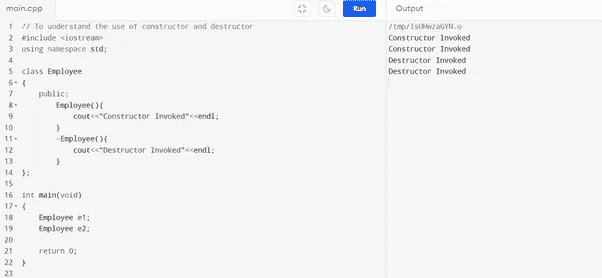
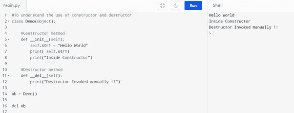
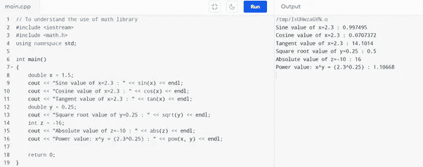
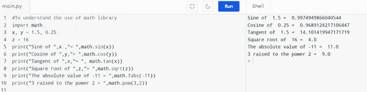
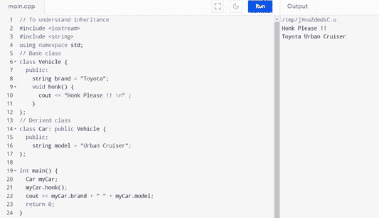
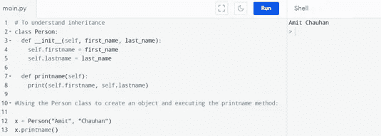
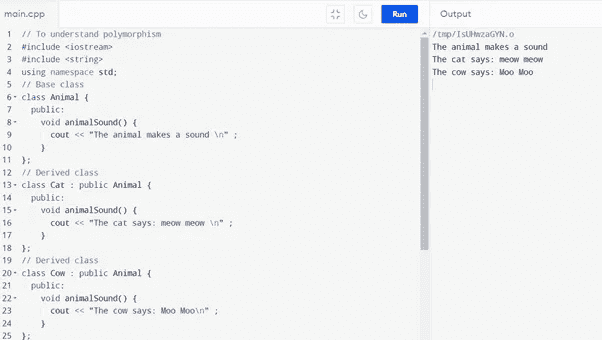
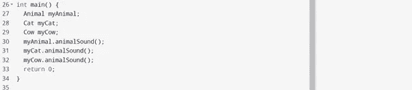
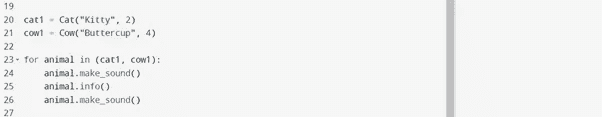

# C++和 Python 的比较及代码示例

> 原文：<https://pub.towardsai.net/comparison-of-c-and-python-with-code-examples-3242bf1bc600?source=collection_archive---------1----------------------->

## 软件编程的基本和 OOPs 概念


[Jexo](https://unsplash.com/@jexo?utm_source=medium&utm_medium=referral) 在 [Unsplash](https://unsplash.com?utm_source=medium&utm_medium=referral) 上的照片

在本文中，我们将解释 c++和 python 之间的代码概念比较。

## 涵盖的主题

```
1\. Curly Braces (Braces) vs. Indentation
2\. Input/Output
3\. Class
4\. Constructor and Destructor
5\. Function
6\. Libraries
7\. Inheritance
8\. Polymorphism
```

> ***花括号(大括号)vs 缩进***

C++中的花括号用于对语句和声明进行分组。类的内容、方法体或构造函数体、不同的条件和循环块都包含在这些大括号中。另一方面，Python 使用缩进来表示特定的代码块，其中缩进指的是一行代码开头的空格。

下面的 for 循环示例显示了两者之间的区别:

**C++代码示例**

```
// curly braces
#include <iostream>
int main() 
{
    int i;
    for (i=1; i<3; i++) 
    {
    std::cout<<"Hello World! \n";
    }
    return 0;
}#output:
Hello World!
Hello World!
```

**Python 代码示例**

```
# indentation
for i in range(1,3):
    print("Hello World\n")#output:
Hello WorldHello World
```

> ***输入/输出***

主输入/输出是在任何编程语言中都广泛使用的一些日常操作。C++以字节流(通常称为流)的形式执行输入/输出操作。cin 和 cout 是 C++中 iostream 类的两个实例，分别用于接收用户输入和打印输出。头文件 iostream 用于 C++中的程序，以使用 cin 和 cout。

另一方面，默认情况下，Python 中的任何输入都被解释为字符串。根据要求，输入必须显式转换为任何其他数据类型。例如，要将用户输入转换为 int 或 float，需要分别使用 int()和 float()方法。

以下示例显示了 C++和 Python 中的输入/输出操作:

**C++代码示例**

```
// input/output
#Include <iostream>
using namespace std;int main()
    {
    char character;
    int number;cout<<"Enter a character and an integer: ";
cin>>character>>number;cout<<"Character: "<<character<<endl;
cout<<"Number: "<<number;return 0;
    }#Output:
Enter a character and an integer: A 31
Character: A
Number: 31
```

**Python 代码示例**

```
# input/output#taking input from the user as integer
num = int(intput("Enter a number: "))
add = num + 1print(num, "+ 1 =", add)#output:
Enter a number: 150
150 + 1 = 152
```

> ***类***

类是面向对象编程的一个概念。它是一个逻辑实体，其中相似类型的对象集合形成一个类。在我们定义了一个类之后，可以创建任何数量的属于这个类的对象。对象是类型类的变量；每个对象都与创建它们的类型类的数据相关联。

以下代码块显示了用 C++和 Python 定义类的方法:

**C++代码示例**

```
// concept of class and object#include <iostream>
using namespace std;//class Room
{
    public:
      double length;
      double breadth;
      double height; double calculateArea()
          {
              return length * breadth;
          }

      double calculateVolume()
          {
              return length * breadth * height;
          }
};int main()
{
    // creating object of room class
    Room room1; // assigning values to data member's
    room1.length = 42.5;
    room.breadth = 30.8;
    room.height = 19.2; // to calculate and display the area and volume of the room
    cout<<"Area of Room= "<<room1.calculateArea()<<endl;
    cout<<"Volumeof Room= "<<room1.calculateVolume()<<endl; return 0;
}
```

Python 代码示例

```
# concept of class and objectclass person:
    "Inside the person class"
    age = 60 def greet(self):
        print("Hello")p = person()
print(p.age)p.greet()print(person.__doc__)#output:
60
Hello
Inside the person class
```

> ***构造函数和析构函数***

构造函数是在创建对象时自动调用的唯一方法。它通常用于初始化新对象的数据成员。C++中的构造函数与类名或结构同名。

析构函数的工作原理与构造函数相反，因为它破坏类的对象。它在一个类中只能定义一次，并且像构造函数一样，它是自动调用的。



c++代码的例子。作者的照片



python 代码的例子。作者的照片

[](/easy-explanation-of-c-and-python-a385d9a16fd2) [## C++和 Python 的简单讲解

### 软件开发项目的解释

pub.towardsai.net](/easy-explanation-of-c-and-python-a385d9a16fd2) 

> ***功能***

任何编程语言中的函数都是执行特定任务的一组相关语句。它有助于将整个程序分解成小的代码块，按照需求执行任务。它使程序易于管理，增加了可读性。函数被调用时，会执行函数体中的所有语句。用 C++编写函数的语法是:

```
returnType functionName (parameter1, parameter2, …) {//function body}
```

另一方面，关键字 def 标记了 Python 中函数的开始。用 Python 编写函数的语法是:

```
def function_name(parameters):#function body
```

以下示例显示了如何用 C++和 Python 编写函数:


c++代码的例子。作者的照片


python 代码的例子。作者的照片

> ***库***

在任何编程语言中，库都是包含代码束的相关模块的集合，这些代码束可以根据需要在不同的程序中多次使用。在编程语言中，模块在将整个程序分解成小部分并在需要时重用它方面起着至关重要的作用。相关模块的集合存储在库中。要使用一个模块，需要从所需的库中导入它。

以下代码片段显示了 C++和 Python 中数学库的用法:



c++代码的例子。作者的照片



python 代码的例子。作者的照片

> ***继承***

继承是一个对象自动获得其父对象的所有属性和行为的过程。通过这种方式，可以重用、扩展或修改其他类中定义的属性和行为。继承另一个类的属性的类称为派生类，是基类的特殊版本。基类是其成员被继承的类。

以下代码块显示了 C++和 Python 中的继承示例:



c++代码的例子。作者的照片



python 代码的例子。作者的照片

> ***多态性***

术语“多态性”由两个词组合而成，“poly”+“morph”，意思是多种形式。这允许人们以不同的方式执行单个操作。

函数重载是编译时多态性的一个例子，重载函数是通过匹配类型和参数数量来调用的。该信息在编译时可用；因此，编译器选择适当的函数并执行所需的任务。

下面显示了 C++和 Python 中函数重载的代码:



c++代码的例子。作者的照片



c++代码的例子。作者的照片


python 代码的例子。作者的照片



python 代码的例子。作者的照片

> ***结论***

本文给出了 c++和 python 之间的代码质量比较。软件开发代码需要各种逻辑来提高速度和性能。

我希望你喜欢这篇文章。通过我的 [LinkedIn](https://www.linkedin.com/in/data-scientist-95040a1ab/) 和 [Twitter](https://twitter.com/amitprius) 联系我。

# 推荐文章

1.[8 Python 的主动学习见解收集模块](/8-active-learning-insights-of-python-collection-module-6c9e0cc16f6b)
2。 [NumPy:图像上的线性代数](/numpy-linear-algebra-on-images-ed3180978cdb?source=friends_link&sk=d9afa4a1206971f9b1f64862f6291ac0)3。[Python 中的异常处理概念](/exception-handling-concepts-in-python-4d5116decac3?source=friends_link&sk=a0ed49d9fdeaa67925eac34ecb55ea30)
4。[熊猫:处理分类数据](/pandas-dealing-with-categorical-data-7547305582ff?source=friends_link&sk=11c6809f6623dd4f6dd74d43727297cf)
5。[超参数:机器学习中的 RandomSeachCV 和 GridSearchCV](/hyper-parameters-randomseachcv-and-gridsearchcv-in-machine-learning-b7d091cf56f4?source=friends_link&sk=cab337083fb09601114a6e466ec59689)
6。[用 Python](https://medium.com/towards-artificial-intelligence/fully-explained-linear-regression-with-python-fe2b313f32f3?source=friends_link&sk=53c91a2a51347ec2d93f8222c0e06402)
7 全面讲解了线性回归。[用 Python](https://medium.com/towards-artificial-intelligence/fully-explained-logistic-regression-with-python-f4a16413ddcd?source=friends_link&sk=528181f15a44e48ea38fdd9579241a78)
充分解释了 Logistic 回归 8。[数据分发使用 Numpy 与 Python](/data-distribution-using-numpy-with-python-3b64aae6f9d6?source=friends_link&sk=809e75802cbd25ddceb5f0f6496c9803)
9。[机器学习中的决策树 vs 随机森林](/decision-trees-vs-random-forests-in-machine-learning-be56c093b0f?source=friends_link&sk=91377248a43b62fe7aeb89a69e590860)
10。[用 Python 实现数据预处理的标准化](/standardization-in-data-preprocessing-with-python-96ae89d2f658?source=friends_link&sk=f348435582e8fbb47407e9b359787e41)