# 针对初学者的 Python 线性回归完整详细教程

> 原文：<https://pub.towardsai.net/complete-detailed-tutorial-on-linear-regression-in-python-for-beginners-f9fa3f65faca?source=collection_archive---------0----------------------->


照片由[加博尔·szűts](https://unsplash.com/@szutsi?utm_source=medium&utm_medium=referral)在 [Unsplash](https://unsplash.com?utm_source=medium&utm_medium=referral) 上拍摄

## 线性回归 Scikit-Learn 中的基本、简单和多元线性回归实现

线性回归是最基本的机器学习类型。它是基于我们在中学都学过的简单直线公式。虽然有很多其他更复杂和有效的机器学习算法，但从一开始就很好地学习线性回归仍然是一个好主意。因为很多其他流行的机器学习和深度学习算法都是建立在线性回归的基础上的。

在本文中:

1.我们将讨论线性回归是如何工作的

2.使用 Python 的 scikit-learn 库处理简单的线性回归问题

3.使用 Scikit-learn 库中的真实数据集处理多元线性回归问题。

> 如果您想了解如何在没有任何库的情况下用普通 Python 从头开始开发线性回归，请查看本页末尾的链接。

## 先决条件

你至少应该了解初级水平的 python。还有，需要了解入门级别的熊猫和 Matplotlib 库，才能入门机器学习。

## 什么是线性回归？

用简单的语言来说，线性回归描述了因变量和自变量之间的关系。它通过拟合直线来描述这种关系。这就是为什么它是线性回归。让我们用一个数据集来理解它。看看这个数据集，我们有两个变量:体重(磅)和身高(英寸)。

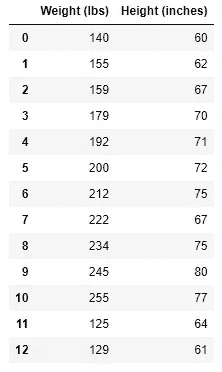

让我们把重量放在 X 轴上，把高度放在 y 轴上，把它们画出来。

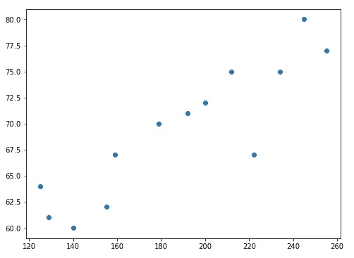

我们得到了点。然后如果我们通过这些点画一条最符合这些点的直线，如果我们有了体重信息，我们就可以预测身高。比如体重 160 lbs，我们可以简单的从这 160 个点画一条直线，从同一点到 y 轴再画一条直线，如下图所示。这样我们就可以找到大约 66 英寸的高度(英寸)。

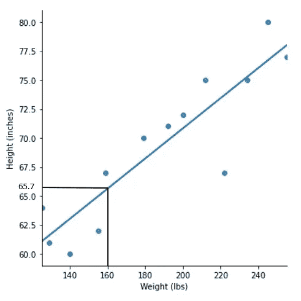

这里体重是自变量，身高是因变量。

下面是直线公式作为复习:

Y = mX + C

在哪里，

Y 是因变量(上图中高度是 Y)

X 是独立变量(上图中权重是 X)

m 是直线的斜率

c 是 Y 轴截距

线性回归的任务是找出“m”和“C ”,使直线最好地代表所有的点。所以，m 和 C 称为线性回归的训练参数。对于不同的机器学习算法，训练参数是不同的。

这是线性回归基础的视频版本:

## 线性回归的假设

1.  观察值是独立的:数据集中的观察值应该是使用有效的采样方法获得的，并且它们是相互独立的。
2.  线性相关:线性回归也需要因变量和自变量线性相关，如上图所示。如果没有，那么我们需要尝试其他的机器学习方法。

3.正态性:数据遵循正态分布。尽管如果我们有足够大的数据集，我们不再担心正态性。

## 简单线性回归示例

让我们来看一个例子。对于这个例子，我将使用 Seaborn 著名的“iris”数据集。为此，我需要首先导入 seaborn 库。然后使用 seaborn 库中的 load_dataset 函数加载 iris 数据集。

```
import seaborn as sns
iris = sns.load_dataset('iris')
iris
```

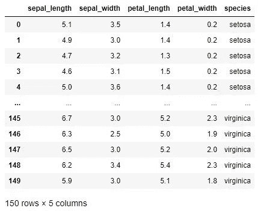

如您所见，iris 数据集中有几个变量。对于简单的线性回归，我们只需要两个变量，我将只保留花瓣长度和花瓣宽度。

```
iris = iris[['petal_length', 'petal_width']]
```

这是虹膜数据集现在的样子:

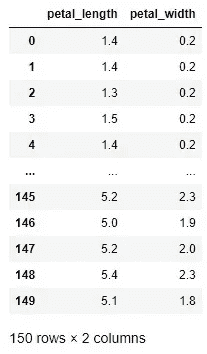

让我们把花瓣 _ 长度看作自变量，花瓣 _ 宽度看作因变量。如果我们将其与上面讨论的直线公式进行比较，花瓣长度是 X，花瓣宽度是 y。

```
X = iris['petal_length']
y = iris['petal_width']
```

在进入线性回归之前，我们应该检查我们的 X 和 y 是否线性相关。我将使用 Matplotlib 库来绘制散点图:

```
import matplotlib.pyplot as plt
plt.scatter(X, y)
plt.xlabel("petal length")
plt.ylabel("petal width")
```

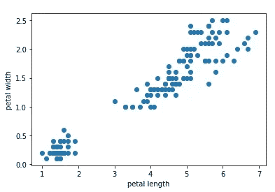

它表明变量之间的关系是线性的。

在机器学习中，我们不使用整个数据集来开发模型。我们将数据集分成两部分。一部分用于建立称为训练集的模型，另一部分用于评估称为测试数据集的模型。

保留数据集的一部分用于测试非常重要。因为我们的目标是建立一个模型，这个模型能够概括以前没有见过的数据，并且能够很好地处理这些数据。

为此，我们将使用 scikit-learn 库中的 train_test_split 方法。

```
from sklearn.model_selection import train_test_split
X_train, X_test, y_train, y_test = train_test_split(X, y, test_size = 0.4, random_state = 23)
```

这里 test_size 0.4 意味着它将保留 40%的数据用于测试目的。

random_state = 23 意味着如果我们使用相同的数据集并使用 random_state 23，它将再次重新创建相同的训练测试分割。Random_state 可以是任何其他整数。

让我们来看看 X_train:

```
X_train
```

输出:

```
77     5.0
29     1.6
92     4.0
23     1.7
128    5.6
      ... 
39     1.5
91     4.6
31     1.5
40     1.3
83     5.1
Name: petal_length, Length: 90, dtype: float64
```

如你所见，X_train 是一个一维序列。**sk learn 库中的机器学习模型以二维数据为训练特征。**所以 X 总是需要二维，y 需要一维。

所以，我们需要让 X 是二维的。这可以通过下面的简单代码来实现:

```
import numpy as np
X_train = np.array(X_train).reshape(-1, 1)
X_train
```

这是现在 X_train 的一部分:

```
array([[5\. ],
       [1.6],
       [4\. ],
       [1.7],
       [5.6],
       [4\. ],
       [4.8],
       [5.6],
       [5.1],
       [4.9],
       [1.4],
       [1.6],
       [5.6],
       [1.4],
       [1.6],
       [5.5],
       [5.1],
       [4\. ],
       [1.4],
```

我们需要以同样的方式改变 X_test:

```
X_test = np.array(X_test).reshape(-1, 1)
X_test
```

输出:

```
array([[5.4],
       [6\. ],
       [4.1],
       [1.5],
       [5\. ],
       [4.9],
       [1.7],
       [5.5],
       [1.7],
       [3.6],
       [4.7],
       [1.6],
       [5.9],
       [1.5],
       [1.5],
       [5.1],
       [4.5],
       [4.7],
       [6.1],
       [1.4],
       [5.3],
       [1.4],
       [1.6],
       [1.3],
       [5.6],
```

我们的数据准备好了。我们需要首先从 scikit-learn 库中导入线性回归模型。

```
from sklearn.linear_model import LinearRegression
```

我将把模型的实例保存在一个变量中:

```
lr = LinearRegression()
```

下一步是将训练数据拟合到线性回归模型。

```
lr.fit(X_train, y_train)
```

模型拟合完成。我们应该有训练参数 m 和 C，这里是截距 C:

```
c = lr.intercept_
c
```

输出:

```
-0.3511327422143744
```

在机器学习语言中，我们不使用术语斜率。相反，它被称为 x 的系数。这是该模型的系数:

```
m = lr.coef_
m
```

输出:

```
array([0.41684538])
```

现在我们可以用直线公式，用 X 来预测' y '，因为我们的 X 是二维的，所以输出也是二维的。我将展平输出，使其成为一维，以便向您展示:

```
Y_pred_train = m*X_train + c
Y_pred_train.flatten()
```

输出:

```
array([1.73309416, 0.31581987, 1.31624878, 0.3575044 , 1.98320139,
       1.31624878, 1.64972508, 1.98320139, 1.7747787 , 1.69140962,
       0.23245079, 0.31581987, 1.98320139, 0.23245079, 0.31581987,
       1.94151685, 1.7747787 , 1.31624878, 0.23245079, 1.35793332,
       1.85814777, 1.52467147, 2.06657046, 2.40004677, 1.44130239,
       0.19076625, 1.31624878, 1.69140962, 1.69140962, 1.31624878,
       0.27413533, 1.52467147, 1.52467147, 1.27456424, 1.73309416,
       1.64972508, 1.2328797 , 1.7747787 , 2.27499315, 2.19162408,
       0.14908171, 2.02488593, 0.8994034 , 0.27413533, 2.108255  ,
       1.64972508, 0.23245079, 1.52467147, 1.39961786, 1.81646324,
       0.19076625, 0.06571264, 1.10782609, 0.10739718, 1.60804055,
       1.39961786, 0.14908171, 2.06657046, 1.44130239, 1.52467147,
       0.31581987, 2.52510038, 1.56635601, 1.7747787 , 1.98320139,
       1.60804055, 0.27413533, 0.31581987, 1.94151685, 2.06657046,
       1.48298693, 0.19076625, 1.81646324, 1.02445701, 2.02488593,
       1.10782609, 0.19076625, 0.27413533, 0.27413533, 1.7747787 ,
       0.23245079, 0.23245079, 1.69140962, 0.23245079, 1.48298693,
       0.27413533, 1.56635601, 0.27413533, 0.19076625, 1.7747787 ])
```

这是使用我们从模型中找到的训练参数预测的输出。

但是我们不必使用训练参数和使用公式计算输出。我们可以简单地使用预测方法来实现:

```
y_pred_train1 = lr.predict(X_train)
y_pred_train1
```

输出:

```
array([1.73309416, 0.31581987, 1.31624878, 0.3575044 , 1.98320139,
       1.31624878, 1.64972508, 1.98320139, 1.7747787 , 1.69140962,
       0.23245079, 0.31581987, 1.98320139, 0.23245079, 0.31581987,
       1.94151685, 1.7747787 , 1.31624878, 0.23245079, 1.35793332,
       1.85814777, 1.52467147, 2.06657046, 2.40004677, 1.44130239,
       0.19076625, 1.31624878, 1.69140962, 1.69140962, 1.31624878,
       0.27413533, 1.52467147, 1.52467147, 1.27456424, 1.73309416,
       1.64972508, 1.2328797 , 1.7747787 , 2.27499315, 2.19162408,
       0.14908171, 2.02488593, 0.8994034 , 0.27413533, 2.108255  ,
       1.64972508, 0.23245079, 1.52467147, 1.39961786, 1.81646324,
       0.19076625, 0.06571264, 1.10782609, 0.10739718, 1.60804055,
       1.39961786, 0.14908171, 2.06657046, 1.44130239, 1.52467147,
       0.31581987, 2.52510038, 1.56635601, 1.7747787 , 1.98320139,
       1.60804055, 0.27413533, 0.31581987, 1.94151685, 2.06657046,
       1.48298693, 0.19076625, 1.81646324, 1.02445701, 2.02488593,
       1.10782609, 0.19076625, 0.27413533, 0.27413533, 1.7747787 ,
       0.23245079, 0.23245079, 1.69140962, 0.23245079, 1.48298693,
       0.27413533, 1.56635601, 0.27413533, 0.19076625, 1.7747787 ])
```

让我们检查一下预测是否正确。我们可以用可视化来检查。我将在上面的花瓣长度和花瓣宽度散点图上添加 X 和预测的 y 的线图。

```
import matplotlib.pyplot as plt
plt.scatter(X_train, y_train)
plt.plot(X_train, y_pred_train1, color ='red')
plt.xlabel("petal length")
plt.ylabel("petal width")
```

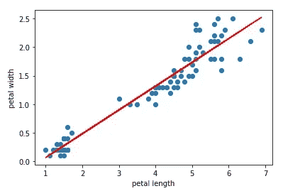

如图所示，预测的“y”非常符合这些点！但是我们使用训练数据进行预测，我们的模型是根据训练数据训练的。

我们的目标是训练该模型，以便该模型也可以处理其他数据，而不仅仅是相同的训练数据。这就是为什么我们保留测试数据来测试模型是否也能在测试数据上工作。

所以，这里我会用 X_test 来预测 y_test。

```
y_pred_test1 = lr.predict(X_test)
y_pred_test1
```

输出:

```
array([1.89983231, 2.14993954, 1.35793332, 0.27413533, 1.73309416,
       1.69140962, 0.3575044 , 1.94151685, 0.3575044 , 1.14951063,
       1.60804055, 0.31581987, 2.108255  , 0.27413533, 0.27413533,
       1.7747787 , 1.52467147, 1.60804055, 2.19162408, 0.23245079,
       1.85814777, 0.23245079, 0.31581987, 0.19076625, 1.98320139,
       0.23245079, 0.44087348, 1.64972508, 1.48298693, 1.27456424,
       0.27413533, 1.27456424, 0.19076625, 2.44173131, 0.27413533,
       0.3575044 , 1.56635601, 1.02445701, 1.39961786, 2.14993954,
       2.02488593, 0.44087348, 1.19119517, 0.23245079, 1.48298693,
       1.73309416, 1.52467147, 2.31667769, 0.27413533, 1.35793332,
       2.19162408, 1.89983231, 0.23245079, 1.98320139, 1.52467147,
       1.60804055, 2.44173131, 1.39961786, 0.23245079, 1.7747787 ])
```

我们应该检查这个预测是否也符合这些点以及训练数据:

```
import matplotlib.pyplot as plt
plt.scatter(X_test, y_test)
plt.plot(X_test, y_pred_test1, color ='red')
plt.xlabel("petal length")
plt.ylabel("petal width")
```

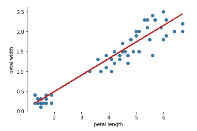

如你所见，预测的 y 与数据吻合得很好。现在，如果我们有一个花瓣长度，我们将能够使用这个模型预测花瓣宽度。预测的花瓣宽度可能与原始值不完全相同。但应该够近了。

这是简单线性回归教程的视频版本:

## 多元线性回归示例

在最后一个例子中，我们只有一个变量来预测花瓣宽度。但是在现实世界中，大部分时间我们使用几个训练特征。在这里，我们将致力于一个类似于现实世界的项目。

在这个演示中，我们将使用 Kaggle 的保险数据集。请随意从以下链接下载数据集:

[](https://www.kaggle.com/datasets/awaiskaggler/insurance-csv) [## 保险 Csv

### Kaggle 是世界上最大的数据科学社区，拥有强大的工具和资源来帮助您实现您的数据…

www.kaggle.com](https://www.kaggle.com/datasets/awaiskaggler/insurance-csv) 

在这个数据集中，我们总共有 7 列。让我们先来看看数据集:

```
import pandas as pd
df = pd.read_csv('insurance.csv')
df
```

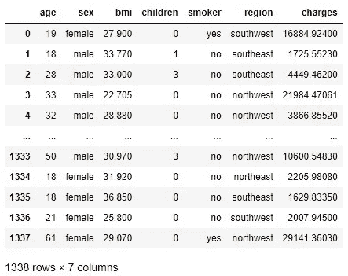

这是保险数据集，其中最后一列是费用，我们还有另外 6 列。**任务将是使用其他 6 列来预测费用。**我们称这 6 个其他列为特征或变量。

**线性回归公式是如何处理这么多特征的？**

当我们有多个特征时，直线公式 Y = mX + C 变成这样:

Y = m1X1 + m2X2 + m3X3 + …。mnXn

正如您在公式中看到的，每个特征都有其单独的系数。因此，在这个项目中，我们有 6 个特征，我们也将有 6 个系数。

我们不能像简单的线性回归那样，用 y 对 X 作图。因为我们现在有太多的变数。所以，它不再是二维的了。它有如此多的维度。

如果您查看数据集，它有几个具有字符串值的分类变量。sklearn 库中的机器学习算法无法处理字符串值。它需要数值。因此，我将把这些分类值转换成数值。

```
df['sex']  =df['sex'].astype('category')
df['sex'] = df['sex'].cat.codesdf['smoker']  =df['smoker'].astype('category')
df['smoker'] = df['smoker'].cat.codesdf['region']  =df['region'].astype('category')
df['region'] = df['region'].cat.codes
```

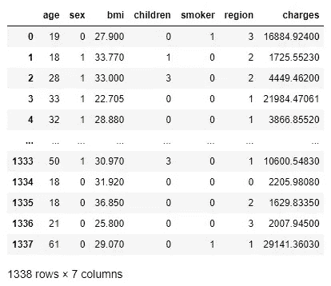

看看现在的‘df’。“性别”特征是一个分类变量，其值为“男性”或“女性”。他们现在变成了 1 或 0。其他分类变量也以同样的方式改变。

这也是检查我们是否有空值的一个好主意。因为如果数据中有空值，我们在训练模型时就会出错。

```
df.isnull().sum()
```

输出:

```
age         0
sex         0
bmi         0
children    0
smoker      0
region      0
charges     0
dtype: int64
```

我们在任何列中都没有空值。

现在将 X 和 y 分开，因为我们将使用 6 个其他变量来预测“电荷”，所以我们的 X 将是这 6 个变量的总和。从数据集中，如果我们删除“价格”列，我们将得到我们的 X:

```
X = df.drop(columns = 'charges')
X
```

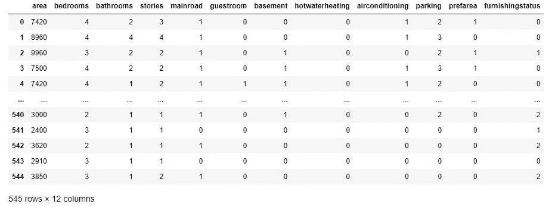

因为我们将预测“价格”，所以我们的“y”将是“价格”列。

```
y = df['charges']
```

使用 train_test_split 获取训练和测试数据:

```
from sklearn.model_selection import train_test_split
X_train, X_test, y_train, y_test = train_test_split(X, y, test_size = 0.3, random_state = 23)
```

我们之前已经导入了线性回归模型。所以，我们现在可以简单地使用它。现在，我将把线性回归模型保存在一个名为 lr_multiple 的不同变量中，并将定型数据拟合到模型中。

```
lr_multiple = LinearRegression()
lr_multiple.fit(X_train, y_train)
```

模特训练完成。现在来看看训练参数。以下是截取的内容:

```
c = lr_multiple.intercept_
c
```

输出:

```
-11827.733141795668
```

斜率或系数:

```
m = lr_multiple.coef_
m
```

输出:

```
array([  256.5772619 ,   -49.39232379,   329.02381564,   479.08499828, 23400.28378787,  -276.31576201])
```

正如我之前提到的，我们得到了 6 个系数。

让我们预测训练数据和测试数据的价格:

```
y_pred_train = lr_multiple.predict(X_train)
y_pred_test = lr_multiple.predict(X_test)
```

这次我们不打算绘图，因为我们有 6 个特征。但我会介绍另一种评价方法。那是 R2 分数。

**R2 分数表示拟合度。它告诉你你的训练特征在多大程度上可以解释标签中的差异。**该值可能介于 0 和 1 之间。r2_score 越接近 1，模型性能越好。

我们需要首先导入 r2_score，然后计算 r2_score。它采用原始“y”值和预测“y”值。由于我们对测试数据进行预测，原始值将是 y_test:

```
from sklearn.metrics import r2_score
r2_score(y_test, y_pred_test)
```

输出:

```
0.7911113876316933
```

我们的 r2 _ 评分是 0.79。所以，我们可以说这个模型相当强大。

以下是多元线性回归教程视频版的链接:

## 结论

我希望，这对你来说是个好的开始。如果您对学习如何从头开始开发线性回归和其他流行的机器学习算法更感兴趣，请随时查看此链接:

[](https://towardsdatascience.com/a-full-length-machine-learning-course-in-python-for-free-f2732954f35f) [## 免费的 Python 全长机器学习课程

### 吴恩达用 Python 写的机器学习教程

towardsdatascience.com](https://towardsdatascience.com/a-full-length-machine-learning-course-in-python-for-free-f2732954f35f) 

我希望它有帮助。

欢迎在推特上关注我，喜欢我的 T2 脸书页面。

## 更多阅读

[](https://towardsdatascience.com/complete-explanation-on-sql-joins-and-unions-with-examples-in-postgresql-cbd868fe9e95) [## 用 PostgreSQL 中的例子完整解释 SQL 连接和联合

### 所有常用的连接类型和一些有趣的类型

towardsdatascience.com](https://towardsdatascience.com/complete-explanation-on-sql-joins-and-unions-with-examples-in-postgresql-cbd868fe9e95) [](https://towardsdatascience.com/how-to-make-animated-and-racing-bar-plots-in-python-c5c7c3c648f7) [## 如何用 Python 制作动画和赛车条形图

### 完整的工作代码

towardsdatascience.com](https://towardsdatascience.com/how-to-make-animated-and-racing-bar-plots-in-python-c5c7c3c648f7) [](https://towardsdatascience.com/a-complete-guide-for-detecting-and-dealing-with-outliers-bad26b1e92b6) [## 检测和处理异常值的完整指南

### 6 种检测异常值的方法和 4 种处理异常值的方法

towardsdatascience.com](https://towardsdatascience.com/a-complete-guide-for-detecting-and-dealing-with-outliers-bad26b1e92b6) [](/an-overview-of-the-major-sql-query-clauses-and-most-commonly-used-functions-60720e2a20d7) [## SQL 查询子句和函数概述

### 可以用作 SQL 的备忘单

pub.towardsai.net](/an-overview-of-the-major-sql-query-clauses-and-most-commonly-used-functions-60720e2a20d7)