# 完整的 Git 初学者教程，带示例

> 原文：<https://pub.towardsai.net/complete-git-tutorial-for-beginners-with-examples-4ebd90e76bfc?source=collection_archive---------2----------------------->

> Git 是一个版本控制系统，它可以让我们跟踪随着时间的推移我们对文件所做的更改。使用 Git，我们可以恢复到文件的各种状态。我们可以制作文件的副本，并对该副本进行更改，然后将这些更改合并到原始副本中。我们可以使用这个官方 [**网站**](https://git-scm.com/downloads) 安装 git。

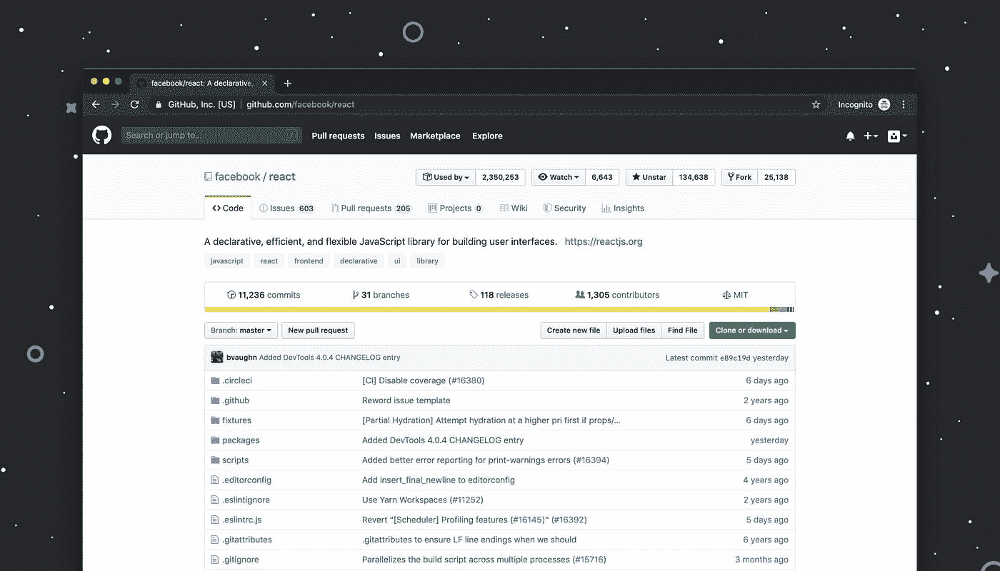

卢克·切瑟在 [Unsplash](https://unsplash.com?utm_source=medium&utm_medium=referral) 上拍摄的照片

**配置 git:** 要验证 git 安装，我们可以打开 git bash，键入 git — version 命令。这显示了安装在我们电脑上的 git 的最新版本。

```
git --version
```

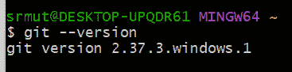

输出

我们要做的第一件事是设置我们的用户名和电子邮件地址。Git 使用这些信息来识别谁对特定文件进行了更改。要设置我们的用户名和电子邮件 id，我们可以使用以下命令-

```
git config --global user.name “Our_username”
git config --global user.email “Our_email”
```

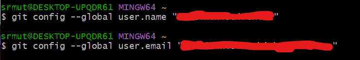

输出

这将配置我们的 Git 环境。为了检查配置是否成功，我们仍然可以使用以下命令在本地机器中检查我们的配置—

```
git config -l
```

我们还可以将凭证存储在缓存中，只是为了避免每次使用下面的命令时都给出凭证

```
git config --global credential.helper cache
```

**将现有 git repo 克隆到本地-** 我们可以使用以下命令将现有 git repo 克隆到本地机器中

```
git clone https://ourrepo
```

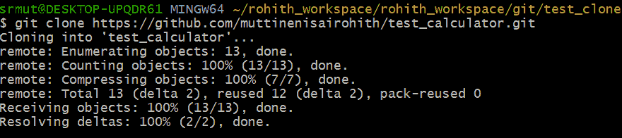

输出

**在 Git 中创建并初始化一个新项目** 创建一个新文件夹或导航到您想要创建第一个项目的文件夹。我已经使用 git bash 创建了一个文件夹 test_calculator，使用了下面的命令

```
mkdir test_calculator
cd test_calculator
```

或者，您可以通过文件资源管理器打开您喜欢的文件夹，右键单击它并选择 Git Bash Here


输出

现在，一旦文件夹准备好了，我们需要初始化项目，为此，我们需要运行 git init 命令。这将告诉 git 开始观察我们的文件，观察发生的每一个变化。

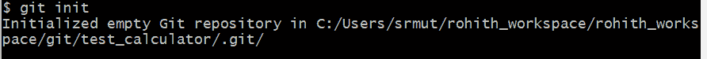

输出

现在让我们添加一小段代码到我们的文件夹中。我正在为此编写一个小的 python 程序 *calculator.py* ，其中包含一个函数，它将接受两个数字 a 和 b 作为参数并返回结果。

```
def add(a, b):
    return a+b

a = int(input())
b = int(input())
print(add(a, b))
```

现在我们已经将我们的更改添加到了文件夹中，让我们检查 git 是否已经跟踪了我们的更改。这可以使用 git status 命令来完成。

```
git status
```

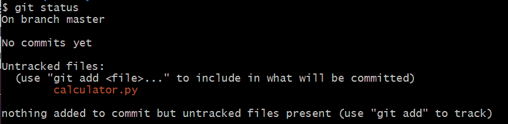

输出

我们可以看到我们的分支名称，如果我们的分支有任何过去的提交，然后任何更新/未跟踪的文件没有与 git 同步。

要添加更新的更改或未跟踪的文件，我们需要使用命令—

```
git add .
```

这将添加所有未跟踪的更改。

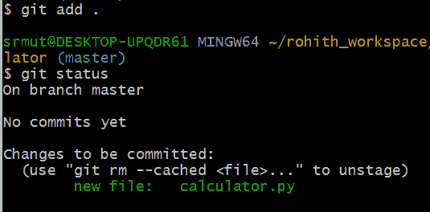

输出

现在，在执行完 git add 之后。；我们可以看到我们的变更被 git 跟踪了。我们可以看到即将发生的变化。为了提交我们的更改，我们可以使用这个命令 git commit -m "first commit "命令。

```
git commit -m “first commit”
```

-m 是消息的简写，括号内的文本是提交消息。

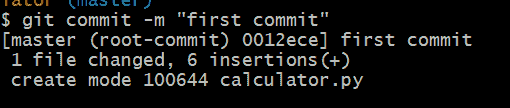

输出

现在我们的代码已经准备好并提交了。现在让我们将代码推送到回购。

为此，让我们在 GitHub 中创建一个 Repo。这可以通过登录 GitHub 并点击 Repos -> new ->输入 Repo 名称并点击 create 来完成。这是我的回购链接—[https://github.com/muttinenisairohith/test_calculator.git](https://github.com/muttinenisairohith/test_calculator.git)

稍后，我们需要在本地回购和 Github 中的远程回购之间创建一个连接。为此，我们可以使用这个命令-

```
git remote add origin https://github.com/muttinenisairohith/test_calculator.git
```

因为我们现在已经准备好了远程连接。默认情况下，git 将指向主分支，但是我想将我的更改推送到主分支，而不是主分支。为此，我们可以使用命令—

```
git branch -b main
```

现在我们已经准备好了回购和分支，让我们将修改后的代码推送到我们在回购中创建的分支。为此，我们可以使用以下命令-

```
git push -u origin main
```

这将把我们的更改推送到主分支，如果是第一次，它会要求我们登录到 Git。我们可以使用我们的电子邮件 id 和密码登录 git。

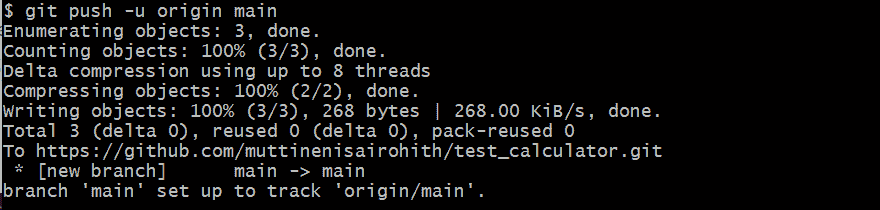

输出

**Git vs GitHub**

一般人都觉得 Git 和 Github 差不多，其实不然。如前所述，Git 是一个版本控制系统，它跟踪我们对回购协议的更改，并为我们提供各种功能，如时间旅行等。，而 Github 是 Git 存储库的在线托管服务。类似 Azure DevOps 服务，bitbucket 等。，Github 帮助我们将回购存储在他们的平台中，并允许其他开发者在任何位置同时进行贡献。

随着我们将第一个 git 项目推向 Github，进一步来看，让我们理解 Git 跟踪文件的各个阶段。

**已提交状态—** 当对文件所做的所有更改都已保存在本地存储库中时，文件处于已提交状态。处于提交阶段的文件是准备推送到远程 repo(在 GitHub 上)的文件

**已修改状态—** 处于已修改状态的文件已被修改，但尚未保存。这意味着文件的状态已经从提交状态中的先前状态改变

**暂存状态—** 处于暂存状态的文件意味着它已准备好提交。在这种状态下，所有必要的更改都已完成，因此下一步是将文件转移到提交状态。

现在继续，让我们在代码中添加一个功能减法，并再次保存它-

```
def add(a, b):
return a+b
def sub(a, b):
return a-b
a = int(input())
b = int(input())
print(add(a, b))
print(sub(a, b))
```

由于我们已经做了一些更改，现在让我们看看 git 的状态

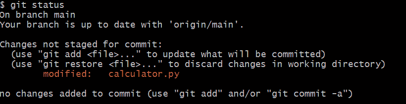

输出

如我们所见，我们的文件现在处于修改状态，因为我们没有使用 git add 将它保存到本地 repo 中。

现在让我们使用 git add 命令保存它。

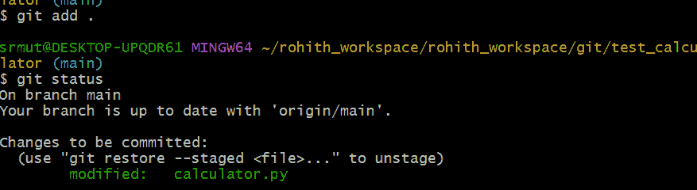

输出

我们的代码现在已经保存，并且现在处于 staged 状态，这意味着它已经准备好提交。让我们将我们的更改提交到我们的分支-

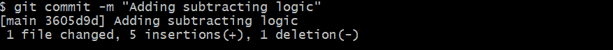

输出

然后推给我们的回购

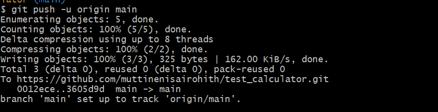

输出

一些重要的命令—

**在 git 中重命名文件:**

```
git mv oldfile newfile
```

使用这个命令，我们可以在本地 repo 中重命名文件，准备更改，然后添加并提交更改。

**删除 git 中被跟踪的文件:**

```
git rm filename
```

使用此命令，我们可以删除文件并暂存更改，然后添加并提交更改。

**Git 提交—修改:**

```
git commit --amend
```

它允许我们对最近的提交进行修改和添加更改。用 amend 修复一个本地提交是很棒的，在修复之后你可以把它推到一个共享的存储库中。但是您应该避免修改已经公开的提交。

**Git 远程**

使用 git remote，我们可以使用命令将远程存储库添加到本地存储库中

```
git add remote https://repo_here
```

我们可以使用命令查看本地存储库的所有远程存储库

```
git remote -v
```

我们可以使用以下命令获得关于远程存储库的更多信息-

```
git remote show origin
```

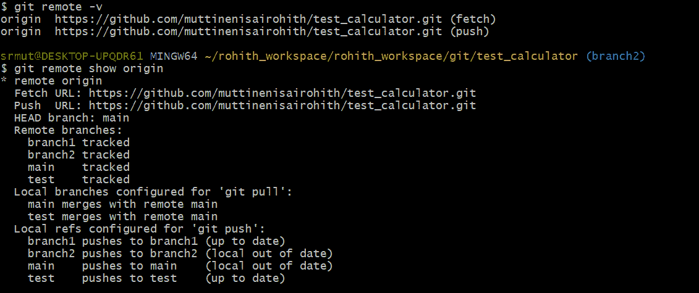

输出

我们有更多的主题要讨论，但我认为它变得冗长，所以让我们把下一个主题分成两篇子文章。你可以找到下面的链接。

关于 GitHub 分支机构的一切—

[](https://muttinenisairohith.medium.com/all-about-git-branches-and-git-pull-vs-fetch-5b961c13ead) [## 关于 Git 分支的所有内容...Git pull vs fetch

### 使用 Git 中的分支，我们可以创建我们想要处理的文件的副本，而不会弄乱原始文件…

muttinenisairohith.medium.com](https://muttinenisairohith.medium.com/all-about-git-branches-and-git-pull-vs-fetch-5b961c13ead) 

GitHub 重置、合并、隐藏、恢复和重置—

[](https://muttinenisairohith.medium.com/git-rebase-merge-and-stash-763fcf3ec060) [## Git 重置、合并、隐藏、还原和重置

### Git rebase 是 Git 中的一个高级特性，当我们处理多个分支时，它可以帮助我们。

muttinenisairohith.medium.com](https://muttinenisairohith.medium.com/git-rebase-merge-and-stash-763fcf3ec060) 

我希望这是有帮助的，因为它将帮助我在一个地方讨论所有关于 Git 的主题。

快乐学习…..敬请关注……