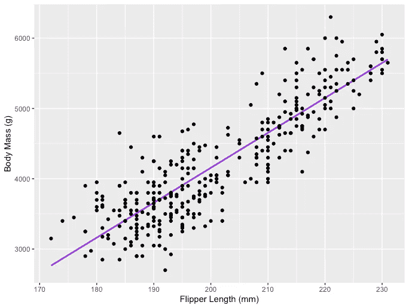
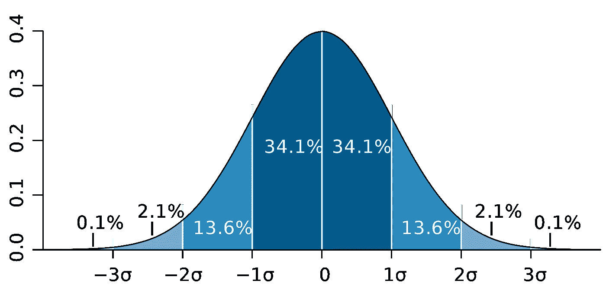

# 线性回归完全指南

> 原文：<https://pub.towardsai.net/complete-guide-to-linear-regression-86c5eddb7eda?source=collection_archive---------2----------------------->

## 关于最简单也是最流行的机器学习回归模型，你需要知道的一切


图片来源:[卡罗琳娜-格拉博斯卡](https://www.pexels.com/photo/a-jet-leaving-white-line-over-silhouetted-bare-trees-during-sunset-6608490/)

> 相关性不是因果关系。
> 
> **——肯尼斯·伍德沃**

你可以在每本统计学书籍中读到的第一件事是，相关性不是因果关系。然而，这也是许多学生一旦看到他们的数据并开始寻找关于它的见解时首先忘记的事情。线性回归是最常用和最流行的机器学习或统计模型之一，用于检测一组预测因素和响应变量之间的**因果**关系。

```
**- Linear Regression Model Assumtions
- Checking Linear Regression Assumtions
- Ordinary Least Squares (OLS)
- OLS Estimates Properties (Bias, Consistency, Efficiency)
- Confidence Interval and Margin of Error
- Hypothesis testing
- Statistical significance testing
- Type I & Type II Errors
- Statistical tests (Student's t-test, F-test)
- Model Performance (Type I, Type II error, R-Squared, Adjusted R-Squared)
- Python Implementation**
```

当一个变量对另一个变量有直接影响时，变量之间就存在因果关系。当两个变量之间的关系是线性时，那么线性回归是一种统计方法，可以帮助建模一个变量中单位变化的影响，**对另一个变量的值， ***对因变量*** 。**

**因变量常被称为 ***反应变量*** 或 ***解释变量****，而自变量常被称为 ***回归变量*** 或 ***解释变量*** 。当线性回归模型基于单个自变量时，则该模型称为 ***简单线性回归*** ，当模型基于多个自变量时，则称为 ***多元线性回归*。**简单的线性回归可以用下面的表达式来描述:***

****

**其中 **Y** 为因变量， **X** 为作为数据一部分的自变量， **β0** 为未知常数的截距， **β1** 为变量 X 对应的斜率或参数，也是未知常数。最后， **u** 是模型在估计 Y 值时产生的误差项。**

**线性回归背后的主要思想是通过一组配对的(X，Y)数据，找到最拟合的直线，*回归线。线性回归应用的一个例子是模拟*鳍状肢长度*对企鹅*体重*的影响，如下图所示。***

****

**图片来源:作者**

**具有三个独立变量的多元线性回归可由以下表达式描述:**

****

# **线性回归模型假设**

**线性回归机器学习方法做出以下假设，需要满足这些假设才能获得可靠的预测结果:**

****A1:线性**假设模型的参数是线性的。**

****A2:** **随机** **样本**假设样本中的所有观测值都是随机选取的。**

****A3:外生性**假设独立变量与误差项不相关。**

****A4:同方差**假设所有误差项的方差为常数。**

****A5:没有完美的多重共线性**假设没有一个自变量是恒定的，自变量之间没有精确的线性关系。**

# **普通最小二乘法(OLS)**

**普通最小二乘法(OLS)是一种估计线性回归模型中β0 和β1 等未知参数的方法。该模型基于 ***最小二乘*** 原理，即使观察到的因变量与其由自变量的线性函数预测的值之差的平方和最小化，通常称为*。因变量 Y 的实际值和预测值之间的差异被称为 ***残差*** ，OLS 所做的是最小化残差平方和。这个优化问题导致了下面对未知参数β0 和β1 的 OLS 估计，也称为 ***系数估计*** 。***

****

**一旦简单线性回归模型的这些参数被估计，响应变量的 ***拟合值*** 可被计算如下:**

****

## **标准误差**

*****残差*** 或估计误差项可以确定如下:**

****

**记住误差项和残差之间的区别很重要。误差项永远不会被观察到，而残差是从数据中计算出来的。OLS 估计每个观测值的误差项，但不是实际的误差项。因此，真正的误差方差仍然未知。此外，这些估计受抽样不确定性的影响。这意味着我们将永远无法从经验应用的样本数据中确定这些参数的准确估计值和真实值。但是我们可以通过计算 ***样本*** ***残差方差*** 来估计，使用残差如下。**

****

**样本残差方差的这种估计有助于估计估计参数的方差，通常表示如下:**

****

**这个方差项的平方根被称为**估计的标准误差**，这是评估参数估计的准确性的关键部分。它用于计算测试统计和置信区间。标准误差可以表示如下:**

****

> **记住误差项和残差之间的区别很重要。误差项永远不会被观察到，而残差是从数据中计算出来的。**

# **参数属性**

> **在满足 OLS 准则 A1 — A5 的假设下，系数β0 和β1 的 OLS 估计量为**蓝色**和**一致**。**
> 
> ****高斯-马尔可夫定理****

**这个定理突出了 OLS 估计的性质，其中术语*代表 ***最佳线性无偏估计量*** 。***

## **偏见**

**估计量的**偏差**是其期望值和被估计参数的真实值之间的差值，可以表示如下:**

****

**当我们声明估计量是 ***无偏的*** 时，我们的意思是偏倚等于零，这就暗示了估计量的期望值等于真实参数值，即:**

****

**无偏性不能保证任何特定样本的估计值等于或接近β。它的意思是，如果一个*重复地从总体中抽取随机样本，然后每次都计算估计值，那么这些估计值的平均值将等于或非常接近β。***

## ***效率***

***高斯-马尔科夫定理中的术语 ***【最佳 *** 与估计量的方差有关，称为 ***效率*** *。*一个参数可以有多个估计量，但是方差最小的那个称为有效**。*****

## **一致性**

**术语一致性与术语 ***样本量*** 和 ***收敛*** 密切相关。如果当样本量变得很大时，估计量收敛于真实参数，则称该估计量是一致的，即:**

****

> **在满足 OLS 准则 A1 — A5 的假设下，系数β0 和β1 的 OLS 估计是蓝色且相合的。**
> 
> **高斯-马尔可夫定理**

**所有这些性质都适用于 OLS 估计，正如高斯-马尔可夫定理所总结的那样。换句话说，OLS 估计具有最小的方差，它们是无偏的，参数是线性的，并且是一致的。这些性质可以通过使用先前的 OLS 假设在数学上得到证明。**

# **置信区间和误差幅度**

**置信区间是包含具有某种预先指定概率的真实总体参数的范围，称为实验的 ***置信水平*** ，它是利用样本结果和 ***误差幅度*** 得到的。**

## **误差幅度**

**误差幅度是样本结果之间的差异，基于如果使用整个人口的结果。**

## **可信度**

**置信水平描述了实验结果的确定性水平。例如，95%的置信水平意味着，如果一个人重复进行相同的实验 100 次，那么这 100 次试验中的 95 次将导致类似的结果。请注意，置信水平是在实验开始之前定义的，因为它会影响实验结束时的误差幅度。**

## **OLS 估计的置信区间**

**如前所述，简单线性回归的 OLS 估计(截距β0 和斜率β1 的估计)会受到采样不确定性的影响。但是，我们可以为这些参数构造 CI 的，它将包含所有样本中 95%的这些参数的真值。也就是说，β的 95%置信区间可以解释如下:**

*   **置信区间是假设检验不能被拒绝到 5%水平的一组值。**
*   **置信区间有 95%的机会包含β的真值。**

**OLS 估计值的 95%置信区间可构建如下:**

****

**其基于参数估计、该估计的标准误差以及表示对应于 5%拒绝规则的误差容限的值 1.96。这个值是使用[正态分布表](https://www.google.com/url?sa=i&url=https%3A%2F%2Ffreakonometrics.hypotheses.org%2F9404&psig=AOvVaw2IcJrhGrWbt9504WTCWBwW&ust=1618940099743000&source=images&cd=vfe&ved=0CAIQjRxqFwoTCOjR4v7rivACFQAAAAAdAAAAABAI)确定的，这将在本文后面讨论。同时，下图说明了 95% CI 的概念:**

****

**图片来源:[维基百科](https://en.wikipedia.org/wiki/Standard_deviation#/media/File:Standard_deviation_diagram.svg)**

**请注意，置信区间也取决于样本大小，因为它是使用基于样本大小的标准误差计算的。**

> **置信水平是在实验开始之前定义的，因为它会影响实验结束时的误差幅度有多大。**

# **统计假设检验**

**检验统计学中的假设是检验实验或调查结果的一种方法，以确定这些结果有多大意义。基本上，一个是通过计算结果偶然发生的几率来测试获得的结果是否有效。如果是信，那么结果不可靠，实验也不可靠。假设检验是 ***统计推断*** 的一部分。**

## **无效假设和替代假设**

**首先，你需要确定你想要测试的论题，然后你需要制定 ***零假设*** 和 ***替代假设*。**测试可能有两种结果，根据统计结果，您可以拒绝或接受所述假设。根据经验，统计学家倾向于将假设的版本或表述放在需要拒绝的无效假设下*、*，而可接受的和期望的版本放在替代假设下*。***

## **统计显著性**

**让我们看看前面提到的例子，线性回归模型被用来调查企鹅的*鳍长*，自变量，是否对*体重*因变量有影响。我们可以用下面的统计表达式来建立这个模型:**

****

**然后，一旦估计了系数的 OLS 估计，我们可以制定以下无效和替代假设来测试鳍状肢长度是否对身体质量具有 ***统计显著性*** 影响:**

****

**其中 H0 和 H1 分别代表零假设和替代假设。拒绝零假设将意味着*鳍状肢长度*增加一个单位对*身体质量*有直接影响。假设β1 的参数估计值描述了自变量*脚蹼长度*对因变量*身体质量的影响。*这个假设可以重新表述如下:**

****

**其中 H0 陈述β1 的参数估计等于 0，即*鳍长*对*体质量*的影响 ***在统计上不显著，*** 而H0 陈述β1 的参数估计不等于 0，暗示*鳍长*对*体质量*的影响 ***在统计上显著*** *。***

## **第一类和第二类错误**

**在进行统计假设检验时，需要考虑两种概念性错误:第一类错误和第二类错误。当零假设被错误地拒绝时，出现类型 I 错误，而当零假设没有被错误地拒绝时，出现类型 II 错误。混淆矩阵有助于清楚地形象化这两类错误的严重性。**

> **根据经验，统计学家倾向于将假设的版本放在需要拒绝的零假设下，而可接受的和期望的版本则放在另一个假设下。**

# **统计测试**

**一旦陈述了无效假设和替代假设，并定义了测试假设，下一步就是确定哪个统计测试是合适的，并计算***测试统计量*** 。通过将测试统计量与 ***临界值*进行比较，可以确定是否拒绝空值。**该比较显示观察到的测试统计值是否比定义的临界值更极端，它可能有两种结果:**

*   **检验统计量比临界值更极端→可以拒绝零假设。**
*   **检验统计量没有临界值那么极端→不能拒绝零假设。**

**临界值基于预先指定的 ***显著性水平* α** (通常选择等于 5%)和检验统计遵循的概率分布类型。临界值将该概率分布曲线下的面积分为 ***拒绝区域*** 和 ***非拒绝区域*** 。有许多统计测试用来测试各种假设。统计检验的例子有[学生 t 检验](https://en.wikipedia.org/wiki/Student%27s_t-test)、 [F 检验](https://en.wikipedia.org/wiki/F-test)、[卡方检验](https://en.wikipedia.org/wiki/Chi-squared_test)、[德宾-豪斯曼-吴内生性检验](https://www.stata.com/support/faqs/statistics/durbin-wu-hausman-test/)和 W [海特异方差检验](https://en.wikipedia.org/wiki/White_test#:~:text=In%20statistics%2C%20the%20White%20test,by%20Halbert%20White%20in%201980.)。在本文中，我们将研究其中的两个统计测试。**

> **当零假设被错误地拒绝时，出现类型 I 错误，而当零假设没有被错误地拒绝时，出现类型 II 错误。**

## **“学生”t 检验**

**最简单也是最受欢迎的统计测试之一是学生的 t 检验。其可用于测试各种假设，尤其是在处理主要关注领域是寻找单变量**的统计显著效果的证据的假设时。*t 检验的检验统计量遵循 [***学生的 t 分布***](https://en.wikipedia.org/wiki/Student%27s_t-distribution) ，可确定如下:***

****

**其中，指定器中的 h0 是参数估计值的测试值。因此，t 检验统计量等于参数估计值减去假设值除以系数估计值的标准误差。在早先陈述的假设中，我们想测试鳍状肢的长度是否对体重有统计学上的显著影响。该测试可以使用 t-测试来执行，并且在这种情况下，h0 等于 0，因为斜率估计值是针对值 0 来测试的。**

**t 检验有两个版本:一个 ***双边 t 检验*** 和一个 ***单边 t 检验*** 。你是需要前一个版本的测试还是后一个版本的测试，完全取决于你想要测试的假设。**

**双边或 ***双尾 t 检验*** 可在假设检验无效和替代假设下的*等于*与*不等于*关系时使用，类似于以下示例:**

****

**双边 t 检验有两个拒绝区域*，如下图所示:***

******

***图片来源: [*Hartmann，k .，Krois，j .，Waske，b .(2018):SOGA 电子学习项目:统计和地理空间数据分析。柏林自由大学地球科学系*](https://www.geo.fu-berlin.de/en/v/soga/Basics-of-statistics/Hypothesis-Tests/Introduction-to-Hypothesis-Testing/Critical-Value-and-the-p-Value-Approach/index.html)***

***在这个版本的 t-检验中，如果计算的 t-统计量太小或太大，则拒绝空值。***

******

***这里，根据样本大小和选定的显著性水平，将测试统计数据与临界值进行比较。为了确定分界点的精确值，可以使用双边 t 分布表。***

***当假设在零假设和备选假设下测试*正/负*对*负/正*关系时，可以使用单侧或**单尾 t 检验** ，类似于以下示例:***

****

**单侧 t 检验有一个 ***单个*** ***拒绝区域，*** 和依赖在假设侧，拒绝区域要么在左侧，要么在右侧，如下图所示:**

****

**图片来源: [*Hartmann，k .，Krois，j .，Waske，b .(2018):SOGA 电子学习项目:统计和地理空间数据分析。柏林自由大学地球科学系*](https://www.geo.fu-berlin.de/en/v/soga/Basics-of-statistics/Hypothesis-Tests/Introduction-to-Hypothesis-Testing/Critical-Value-and-the-p-Value-Approach/index.html)**

**在这个版本的 t 检验中，如果计算出的 t 统计值小于/大于临界值，则拒绝空值。**

****

## **f 检验**

**f 检验是另一种非常流行的统计检验，常用于检验假设检验****多个变量的联合统计显著性*** *。*当您想要测试多个自变量是否对因变量有显著的统计影响时，就是这种情况。下面是一个可以使用 f 检验进行检验的统计假设示例:***

****

**其中零表示对应于这些系数的三个变量在统计上联合不显著，而备选项表示这三个变量在统计上联合显著。f 检验的检验统计量遵循 [F 分布](https://en.wikipedia.org/wiki/F-distribution)，可确定如下:**

****

**其中，SSRunrestricted 是 ***受限* *模型的****残差平方和*** ，**** *是同一模型，从数据中排除了在空值*，*下声明为无关紧要的目标变量，SSRunrestricted 是****，**** **【T35 q 代表在空值下联合检验显著性的变量数量，N 是样本大小，k 是无限制模型中的变量总数。 运行 OLS 回归后，在参数估计值旁边提供 SSR 值，这同样适用于 F 统计量。以下是 MLR 模型输出的示例，其中标记了 SSR 和 F 统计值。*****

****

**图片来源:[股票和 Whatson](https://www.uio.no/studier/emner/sv/oekonomi/ECON4150/v18/lecture7_ols_multiple_regressors_hypothesis_tests.pdf)**

**f 检验有**一个单一剔除区域**，如下图所示:**

****

**图片来源: [*密歇根大学*](https://www.statisticshowto.com/probability-and-statistics/f-statistic-value-test/)**

**如果计算出的 F 统计量大于临界值，则可以拒绝零，这表明独立变量在统计上是联合显著的。拒绝规则可以表示如下:**

****

## **p 值**

**另一种快速确定是拒绝还是支持零假设的方法是使用 ***p 值*** 。p 值是零发生条件下的概率。换句话说，假设零假设为真，p 值是观察到至少与检验统计量一样极端的结果的概率。p 值越小，反对零假设的证据越强，表明它可以被拒绝。**

**对 *p* 值的解释取决于所选的显著性水平。通常，1%、5%或 10%的显著性水平用于解释 p 值。因此，这些检验统计的 p 值可以用来检验相同的假设，而不是使用 t-检验和 F-检验。**

**下图显示了具有两个独立变量的 OLS 回归的样本输出。在此表中，t 检验的 p 值(测试 *class_size* 变量参数估计的统计显著性)和 F 检验的 p 值(测试 *class_size、*和 *el_pct* 变量参数估计的联合统计显著性)带有下划线。**

****

**图片来源:[股票和 Whatson](https://www.uio.no/studier/emner/sv/oekonomi/ECON4150/v18/lecture7_ols_multiple_regressors_hypothesis_tests.pdf)**

**对应于 *class_size* 变量的 p 值为 0.011，当将该值与 1%或 0.01、5%或 0.05、10%或 0.1 的显著性水平进行比较时，可以得出以下结论:**

*   **0.011 > 0.01 →在 1%的显著性水平上不能拒绝 t 检验的空值**
*   **0.011 < 0.05 → Null of the t-test can be rejected at 5% significance level**
*   **0.011 < 0.10 →Null of the t-test can be rejected at 10% significance level**

**So, this p-value suggests that the coefficient of the *class_size* 变量在 5%和 10%的显著性水平上具有统计显著性。对应于 f 检验的 p 值是 0.0000，并且由于 0 小于所有三个截止值；0.01，0.05，0.10，我们可以得出结论，在所有三种情况下都可以拒绝 f 检验的零。这表明 *class_size* 和 *el_pct* 变量的系数在 1%、5%和 10%的显著性水平上共同具有统计显著性。**

# **Python 实现**

```
**def runOLS(Y,X):# OLS esyimation Y = Xb + e --> beta_hat = (X'X)^-1(X'Y)
   beta_hat = np.dot(np.linalg.inv(np.dot(np.transpose(X), X)), np.dot(np.transpose(X), Y))# OLS prediction
   Y_hat = np.dot(X,beta_hat)
   residuals = Y-Y_hat
   RSS = np.sum(np.square(residuals))
   sigma_squared_hat = RSS/(N-2)
   TSS = np.sum(np.square(Y-np.repeat(Y.mean(),len(Y))))
   MSE = sigma_squared_hat
   RMSE = np.sqrt(MSE)
   R_squared = (TSS-RSS)/TSS# Standard error of estimates:square root of estimate's variance
   var_beta_hat = np.linalg.inv(np.dot(np.transpose(X),X))*sigma_squared_hat

   SE = []
   t_stats = []
   p_values = []
   CI_s = []

   for i in range(len(beta)):
       #standard errors
       SE_i = np.sqrt(var_beta_hat[i,i])
       SE.append(np.round(SE_i,3))#t-statistics
        t_stat = np.round(beta_hat[i,0]/SE_i,3)
        t_stats.append(t_stat)#p-value of t-stat p[|t_stat| >= t-treshhold two sided] 
        p_value = t.sf(np.abs(t_stat),N-2) * 2
        p_values.append(np.round(p_value,3))#Confidence intervals = beta_hat -+ margin_of_error
        t_critical = t.ppf(q =1-0.05/2, df = N-2)
        margin_of_error = t_critical*SE_i
        CI = [np.round(beta_hat[i,0]-margin_of_error,3), np.round(beta_hat[i,0]+margin_of_error,3)]
        CI_s.append(CI)return(beta_hat, SE, t_stats, p_values,CI_s, 
               MSE, RMSE, R_squared)**
```

# **如果你喜欢这篇文章，这里有一些你可能喜欢的其他文章:**

**[](https://tatev-aslanyan.medium.com/data-sampling-methods-in-python-a4400628ea1b) [## Python 中的数据采样方法

### 使用不同的数据采样技术创建 Python 中的随机样本的现成代码

tatev-aslanyan.medium.com](https://tatev-aslanyan.medium.com/data-sampling-methods-in-python-a4400628ea1b) [](https://towardsdatascience.com/fundamentals-of-statistics-for-data-scientists-and-data-analysts-69d93a05aae7) [## 数据科学家和数据分析师的统计学基础

### 数据科学或数据分析之旅的关键统计概念

towardsdatascience.com](https://towardsdatascience.com/fundamentals-of-statistics-for-data-scientists-and-data-analysts-69d93a05aae7) [](https://towardsdatascience.com/simple-and-complet-guide-to-a-b-testing-c34154d0ce5a) [## 简单完整的 A/B 测试指南

### 为您的数据科学实验进行端到端 A/B 测试，面向非技术和技术专家，提供示例和…

towardsdatascience.com](https://towardsdatascience.com/simple-and-complet-guide-to-a-b-testing-c34154d0ce5a) [](https://towardsdatascience.com/monte-carlo-simulation-and-variants-with-python-43e3e7c59e1f) [## 蒙特卡罗模拟和 Python 变种

### 蒙特卡洛模拟指南，必须了解 Python 实现的统计抽样技术

towardsdatascience.com](https://towardsdatascience.com/monte-carlo-simulation-and-variants-with-python-43e3e7c59e1f) 

# 调查:完美的数据科学课程对你来说是什么样的？

*你是否也注意到，作为数据科学家，我们很难浏览多个博客和课程，即使在这种情况下，也没有一个地方涵盖所有主题。所以，我愿意为您打造这个* ***【一站式数据科学店】*** *课程。*

*为了为您定制本课程，我很想了解您的意见，以了解“完美的数据科学课程对您来说是什么样的？”。*

*因此，我想请您回答几个问题来完成这个* [***简短调查***](https://docs.google.com/forms/d/e/1FAIpQLSeRxugd3ACiD1wsC8H3y8Y29L4sk2fdysw1lxzGNedL5sPqUw/viewform)**，一旦课程开始，您将是第一个收到通知的人。也请* [***与你认为会对此课程感兴趣的人分享***](https://docs.google.com/forms/d/e/1FAIpQLSeRxugd3ACiD1wsC8H3y8Y29L4sk2fdysw1lxzGNedL5sPqUw/viewform) *？**

*预先感谢您，非常感谢您的参与！*

****为调查链接:*** [***点击此处***](https://docs.google.com/forms/d/e/1FAIpQLSeRxugd3ACiD1wsC8H3y8Y29L4sk2fdysw1lxzGNedL5sPqUw/viewform)*

****感谢阅读****

**我鼓励你* [***加入 Medium today***](https://tatev-aslanyan.medium.com/membership) *以拥有* *完整访问所有跨媒体发布的伟大锁定内容，并在我的 feed 上发布关于各种数据科学、机器学习和深度学习主题的内容。**

**关注我* [***中型***](https://medium.com/@tatev-aslanyan)**阅读更多关于各种数据科学和数据分析主题的文章。更多机器学习的动手应用，数学和统计概念查看我的*[***Github***](https://github.com/TatevKaren)**账号。
我欢迎反馈，可以联系*[***LinkedIn***](https://www.linkedin.com/in/tatev-karen-aslanyan/)*。****

*****快乐学习！*******