# 熊猫数据框架完整指南及实时使用案例

> 原文：<https://pub.towardsai.net/complete-guide-to-pandas-dataframe-with-real-time-use-case-c576d3e20fb3?source=collection_archive---------0----------------------->

> 在我的 Pyspark 系列——读者对 Pyspark 数据框架和 Pyspark RDD 最感兴趣——之后，我收到了一些建议和请求，要求我在 Pandas 数据框架上写作，这样人们就可以在 Pyspark 和 Pandas 之间进行比较，而不是在消费方面，而是在语法方面。所以今天在这篇文章中，我们将使用泰坦尼克号数据集集中讨论熊猫数据框架的功能。

***熊猫*参考面板数据/ Python 数据分析。一般来说，Pandas 是一个用于处理数据集的 python 库。**

熊猫中的 ***DataFrame*** 是一个二维的数据结构或者是一个有行和列的表格。DataFrames 提供了创建、分析、清理、浏览和操作数据的功能。


资料来源:pandas.pydata.org

**安装:**

```
pip install pandas
```

**进口熊猫:**

```
import pandas as pd
print(pd.__version__)
```

如果 Pandas 安装成功，这将打印 Pandas 版本。

**创建数据帧:**

创建一个空的数据框架—

```
df=pd.DataFrame()
df.head(5) # prints first 5 rows in DataFrame
```

从字典中创建数据帧—

```
employees = {'Name':['chandu','rohith','puppy'],'Age':[26,24,29],'salary':[180000,130000,240000]}df = pd.DataFrame(employees)
df.head()
```

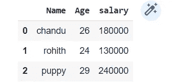

来源:产出

从列表的列表中创建数据帧—

```
employees = [['chandu',26,180000], ['rohith', 24, 130000],['puppy', 29 ,240000]]df = pd.DataFrame(employees, columns=["Name","Age","Salary"])
df.head()
```


来源:产出

从 CSV 文件导入数据这里提到[](https://github.com/muttinenisairohith/Encoding-Categorical-Data/blob/e59a04b303662effb037981fb47211450973c2a0/data/titanic_train.csv)****。****

```
df = pd.read_csv("/content/titanic_train.csv")df.head(5)
```

**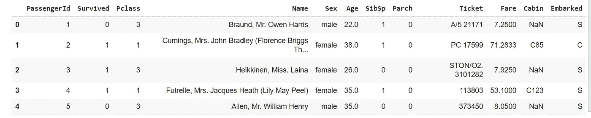**

**来源:数据来自泰坦尼克号数据集**

**如上图所示， ***df.head(n)*** 将返回 DataFrame 的前 n 行，而 ***df.tail(n)*** 将返回 DataFrame 的后 n 行。**

```
print(df.shape)  #prints the shape of DataFrame - rows * columnsprint(df.columns)  #returns the column names
```

**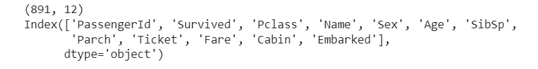**

**来源:产出**

****value_counts()—** 返回特定列中的唯一值及其计数。**

```
df["Embarked"].value_counts()
```

**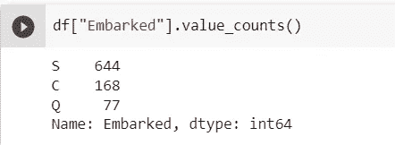**

**来源:产出**

****df.describe() —** 获取数据帧中所有数字列的信息**

```
df.describe()
```

**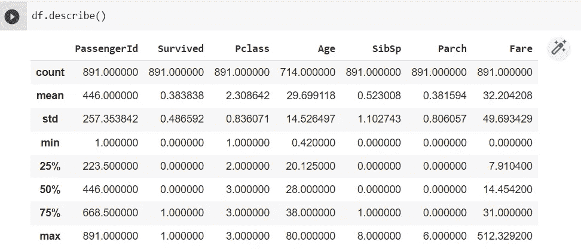**

**来源:产出**

****df.info() —** 返回 DataFrame 中所有列的计数和数据类型**

```
df.info()
```

**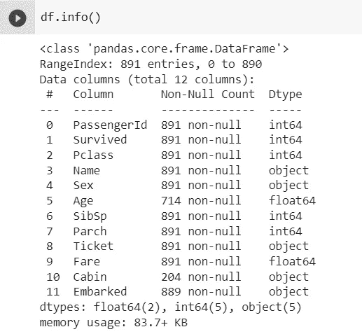**

**来源:产出**

**如上所述，有年龄和客舱计数小于 891，所以在这些列中可能会有丢失的值。我们还可以看到数据帧中列的数据类型。**

****处理缺失值****

**获取缺失值的计数—**

```
df.isnull().sum()
```

**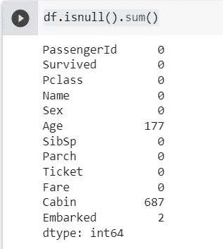**

**来源:产出**

**如上所示，列“年龄”、“客舱”和“已上船”缺少值。**

**得到缺失值的百分比—**

```
df.isnull().sum() / df.shape[0] * 100
```

**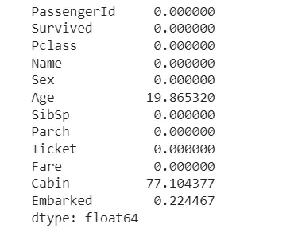**

**来源:产出**

**如我们所见，Cabin 的缺失值百分比超过 75%,所以让我们删除该列。**

```
df=df.drop(['Cabin'],axis=1)
```

**上述命令用于从 DataFrame 中删除某些列。**

****输入缺失值****

**让我们用平均值来估算年龄栏中缺失的值。**

```
df['Age'].fillna(df['Age'].mean(),inplace=True)
```

**并通过模式值来估算装载列中的缺失值。**

```
df['Embarked'].fillna(df['Embarked'].mode().item(),inplace=True)
```

**在上面的例子中。item()在我们处理字符串列时使用。我想所有丢失的值都被处理了，让我们检查一下—**

**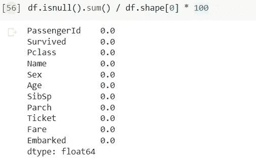**

**来源:产出**

****重命名列****

```
df=df.rename(columns={'Sex':'Gender','Name':'Full Name'})
df.head()
```

**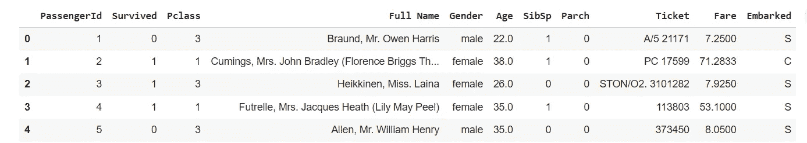**

**来源:产出**

****添加/修改栏目****

```
df['last_name']=df['Full Name'].apply(lambda x: x.split(',')[0])df['first_name']=df['Full Name'].apply(lambda x: ' '.join(x.split(',')[1:]))df.head(5)
```

**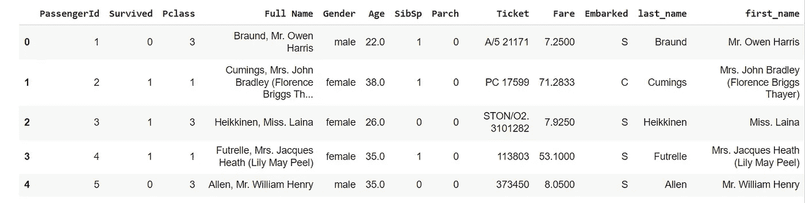**

**来源:产出**

****添加行—** 我们使用 *df.append()* 方法来添加行**

```
row=dict({'Age':24,'Full Name':'Rohith','Survived':'Y'})df=df.append(row,ignore_index=True)df.tail()
```

**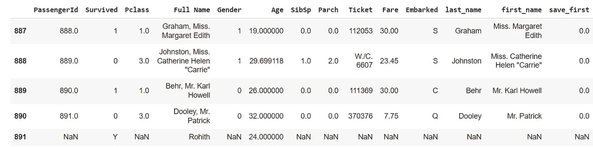**

**来源:产出**

**创建一个新行，并为没有值的列初始化 NaN 值**

**使用 loc()方法:**

```
df.loc[len(df.index)]=row
df.tail()
```

****删除行****

**使用 df.index()方法—**

```
df=df.drop(df.index[-1],axis=0) *# Deletes last row*
df.head()
```

****编码列****

**对于大多数机器学习算法，我们应该有数字数据，而不是字符串格式的数据。所以编码数据是必须的操作。**

```
df['Gender']=df['Gender'].map({"male":'0',"female":"1"})df.head(5)
```

**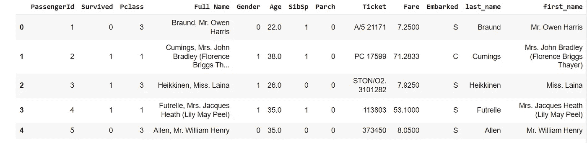**

**来源:产出**

**如果我们使用上面的方法，这个过程对于所有的列都变得非常繁忙，因此有许多方法可以用来编码数据帧，例如 LabelEncoder、OneHotEncoder 和 MultiColumnLabelEncoder。它们在下面的文章中有清楚的解释—**

**[](https://blog.devgenius.io/encoding-methods-to-encode-categorical-data-in-machine-learning-717b5509933c) [## 机器学习中分类数据的编码方法

### 在机器学习领域，在进行建模之前，数据准备是一项强制性任务。有…

blog.devgenius.io](https://blog.devgenius.io/encoding-methods-to-encode-categorical-data-in-machine-learning-717b5509933c) 

**过滤数据**

仅在年龄大于 25 时选择数据。

```
df[df["Age"]> 25].head(5)
```

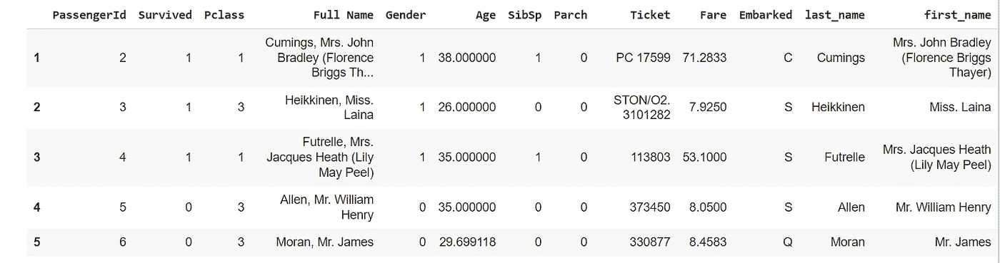

来源:产出

同样我们可以使用>，< and == operations.

```
df[(df["Age"]< 25) & (df["Gender"]=="1")].head(5)
```

selecting data when Age is less than 25 and Gender is 1\. In the above way, we can also filter multiple columns.

**apply()函数**:

假设 15 岁以下，60 岁以上的人要先被救。让我们使用 *apply()* 函数创建一个 *save_first* 列。

```
def save_first(age):
    if age<15:
        return 1
    elif age>=15 and age<60:
        return 0
    elif age>=60:
        return 1df['save_first']=df['Age'].apply(lambda x: save_first(x))
```

**选择特定的列和行:**

```
df_1 = df[['Age','Survived','Gender']]df_1.head()
```

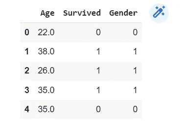

来源:产出

使用**。iloc() —** 它使用数字索引返回数据帧中的特定行和列

```
df_2 = df.iloc[0:100,:]df_2.head()
```

返回 DataFrame 中的前 100 行和所有列

```
df_2 = df.iloc[0:100, [0,1,2]]df_2.head()
```

返回数据帧中的前 100 行和前 3 列

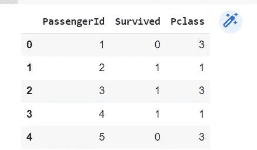

来源:产出

**。loc()** 功能—类似于。iloc()，但是它使用列名而不是数字索引。

```
df_2 = df.loc[0:100, ['Age','Survived','Gender']]df_2.head()
```

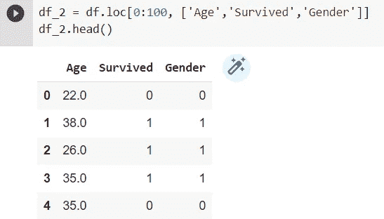

来源:产出

**排序**

我们可以使用***sort _ values*()**方法在 DataFrame 中进行排序操作。

```
df=df.sort_values(by=['Age'],ascending=False)df.head()
```

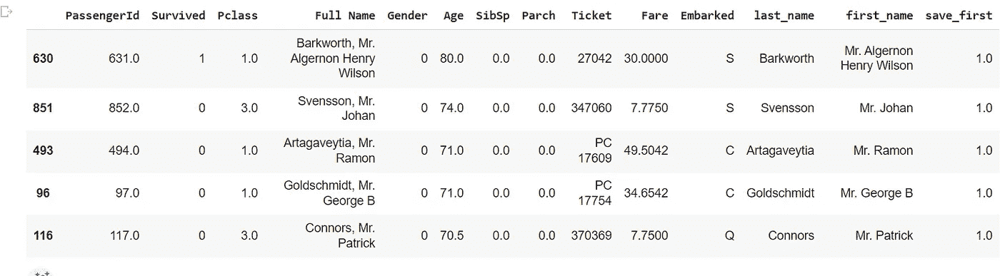

来源:产出

我们也可以使用多列——首先按第一列排序，然后按第二列排序。

```
df=df.sort_values(by=['Age', 'Survived'],ascending=False)df[15:20]
```

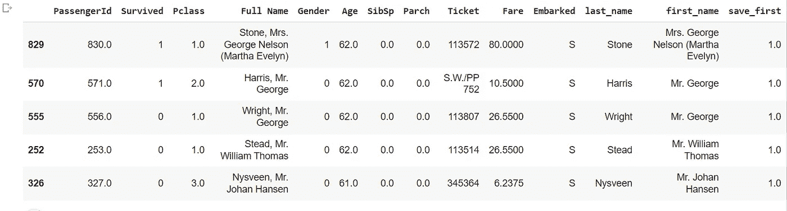

来源:产出

**加入**

Join 只不过是基于特定的列组合多个数据帧。

让我们执行 5 种类型的连接——交叉、内部、左侧、右侧和外部

***交叉连接*** *—* 也称为笛卡尔连接，返回每个表中行的所有组合。

```
cross_join = pd.merge( df1 , df2 ,how='cross')
```

***内部连接*** *—* 只返回那些在两个数据帧中都有匹配值的行。

```
inner_join = pd.merge( df1 , df2 ,how='inner', on='column_name')
```

***左连接*** *—* 返回第一个数据帧的所有行，如果没有匹配的值，则返回第二个数据帧的空值

```
left_join = pd.merge( df1 , df2 ,how='left', on='column_name')
```

***右连接*** *—* 返回第二个数据帧的所有行。如果没有匹配的值，那么它为第一个数据帧返回空值

```
right_join = pd.merge( df1 , df2 ,how='right', on='column_name')
```

***外部连接*** *—* 返回第一个和第二个数据帧的所有行。如果第一个数据帧中没有匹配，第二个数据帧中的值将为空，反之亦然

```
outer_join = pd.merge( df1 , df2 ,how='outer', on='column_name')
```

**GroupBy()**

此方法用于根据几列对数据帧进行分组。

```
groups = df.groupby(['Survived'])groups.get_group(1)
```

get_group()方法用于获取属于某个组的数据。

GroupBy()通常与 mean()、min()、max()等数学函数一起使用。,

```
groups['Age'].mean()
```

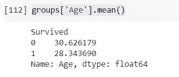

来源:产出

```
groups['Age'].count()
```

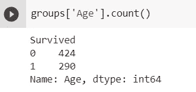

来源:产出

```
groups['Age'].min()
groups['Age'].max()
```

使用**。**函数 agg()

```
import numpy as npgroup_agg =df.groupby(['Survived']).agg({'Age':lambda x: np.mean(x)})group_agg.head()
```

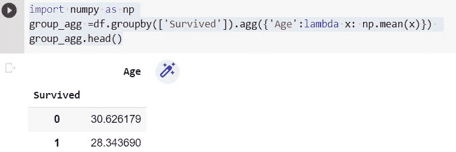

来源:产出

所以我想我已经涵盖了与熊猫数据框架相关的大部分基本概念。

快乐编码…**