# 数据操作或数据转换技术的完整列表

> 原文：<https://pub.towardsai.net/complete-list-of-data-manipulation-or-data-transformation-techniques-e1f693508083?source=collection_archive---------1----------------------->

## [数据分析](https://towardsai.net/p/category/data-analysis)

## 数据转换库标准化指南

数据操作是数据科学家的必备知识。适当的学习最少需要一年，再多几年才能掌握。然而，关于数据操作最困难的事情之一是，在互联网上你找不到一个合适的指南来连接所有的点，并给你一个如何处理它的明确指导。

在本指南中，我将尽可能多地列出我收集到的数据操作技术。因为我可能研究了更多的技术，如果你想让我添加内容，请随意评论这篇文章。

数据处理标志。来源:[https://www . front point consulting . com/solution-delivery/data-transformation](https://www.frontpointconsulting.com/solution-delivery/data-transformation)

# 我的第 100 篇！！！

一个小小的中断为了感谢所有鼓励我继续写作并在需要的时候继续努力的我的追随者和读者，没有你们所有人，我不可能在去年取得成功:

一个美丽的自制徽章来庆祝这个时刻！

你们都支持我，我能做的最起码的事情就是努力为你们提供我能写的最好的内容。

## 数据操作的替代名称

不幸的是，数据操作还有其他似乎是同义词的定义。数据操作的其他名称可以是:

*   数据转换
*   数据处理

虽然数据处理，如果我理解正确的话，是一个可能还包括额外的形式化过程如数据清洗的过程。这取决于不同的解释。

## 为什么要标准化数据操作

通过拥有一个适当的数据操作技术列表，您可以实现一个重要的目标:标准化数据操作库。例如，通过使用 python，您有了一个可以学习的库的好选择。熊猫和星火是最重要的两个。但是问题来了，我应该如何研究它们？

如果你必须学习这些库的全部语法，你可能会浪费很大一部分时间，首先，因为它们是通过对象组织的，其次，因为你不会真正知道你在学习什么。你需要一个适当的层次结构来理解方法是如何被分类的。通过按功能用途对所有东西进行分类，您实际上可以比较您现在已经标准化的所有数据操作库。

这样做的实际目的是让你了解如何学习和组织一个数据操作库，例如 **pandas** 或 **Spark** 。事实上，这些库虽然非常有用，但却是出了名的难学。如果有更清晰的指南，这个障碍可能会变得容易一些。

# 数据处理技术

请记住，这是关于如何执行操作的高级指南。我希望为您提供数据操作的主要部分，其中每一部分都需要额外的深化，独立的文章，甚至书籍，如果内容变得太多。

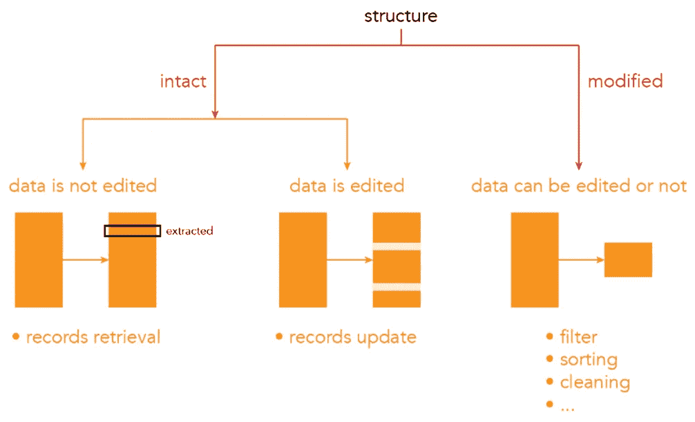

我自己对数据操作技术进行分类的框架

1.  记录检索
2.  记录更新
3.  过滤
4.  整理
5.  聚合
6.  清洁
7.  转换
8.  加入
9.  读写文件

## 记录检索

记录检索包括从数据中提取信息，可能是范围之间的一些值(例如，第 1 行和第 3 行之间的所有值)，甚至是孤立的值(例如，第 1 行和第 1 列中的值)。在库的上下文中，它不仅仅限于数据集中的数据，还可能包括元数据。提取行、列的名称，索引仍然算作记录检索。我想概述一下，更高级的方法，如提取标准差等见解，可以放在不同的部分，如特征工程部分。

## 记录更新

记录更新是所有以改变数据集的值为目标的函数。因为专用函数可能太多了，因为有许多方法可以实现这个目标，所以我将这个类别限制为简单的数据值编辑。例如，更改数据中的列名、单个值或一系列值，添加新列，都算作记录更新方法。处理数据的高级方法，例如，将滚动窗口统计用于技术分析目的，或将去噪算法应用于时间序列，将在专门的章节中介绍。

## 过滤

我们可以按照复杂程度的顺序列出数据操作中最常用的函数。

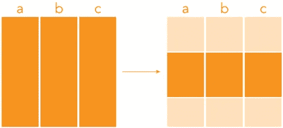

过滤方法的一个简单例子

*   布尔过滤器

检索数据集中的值的最常见的函数是布尔过滤函数(您可能知道它在 SQL 中的位置)。这些函数允许您提取与某个条件相对应的数据集中的所有值。例如，在您的数据集中，有一列范围在 1 到 100 之间的数字。您只想选择编号大于 20 的行。这就对了，过滤功能非常适合这种用途。您可以只有一个条件，也可以有多个条件。

*   正则表达式

Regex(正则表达式)是一种在字符级选择和过滤字符串的方法。例如，我们可能希望选择 1 亿行中第二个字母是字母 **a 或 b** 的所有单词。通过输入一些遵循正则表达式规则的特殊字符，您将能够做出任何您需要的选择。有各种各样的正则表达式可以被开发来只与特定的工具一起工作。

## 整理

排序函数用于更改数据集中数据的顺序。

*   orderby

这些函数可能非常简单，orderby 可能是最简单的例子。如果将它们应用于数据集，它们只需按升序或降序对列进行排序。

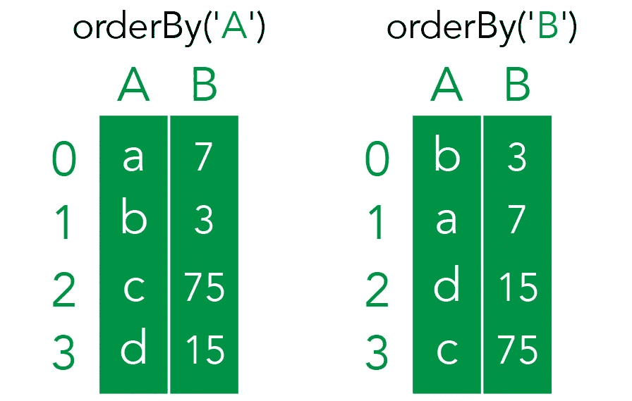

按升序排序的两列示例

考虑到您所处理的数据并不局限于一个数据集(那么，当然，我们并不局限于使用数据集操作库，但我们也包括硬核编码技术)。例如，排列数组(列表，如果你正在使用 python)的顺序是一种非常常见的做法，特别是如果你正在学习编码面试)。有太多的排序算法可用于此目的，它们不仅能够提供不同的输出，而且性能也不同，因为一些算法比其他算法更有效。

## 聚合方法

聚合方法是非常强大的工具，允许对数据执行高级更改。在所有数据集库中，有几个常见的聚合算法需要详细解释:

*   分组依据

Groupby 可能是使用最多的聚合算法之一。它允许基于一个或多个键对数据进行分组，然后使用聚合函数将数据集**转换为唯一值**。

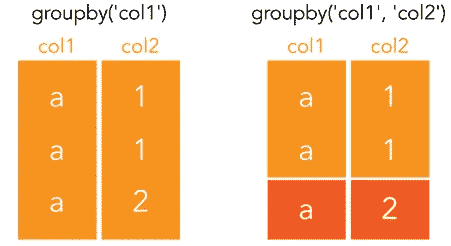

groupby 示例:在第一个数据集中，我们可以对集合[1，1，2]应用函数，而在第二个 groupby 中，我们可以对两个不同的集合[1，1]和[2]应用函数。最后，每个 groupby 只有一个值。

*   分组集合

分组集是 groupby 的不同组合的集合。我们可以在 Spark 和 SQL 中找到这个算法来节省时间。

初始数据集

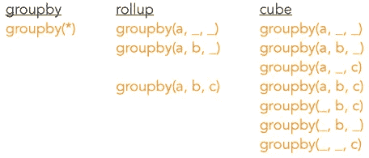

groupby 的可能组合

*   滚动窗口统计

这种算法应用于一个时间序列，可以生成一个新的时间序列。第一个时间序列的值按任意数量分组，然后聚合函数返回一个值。这种算法的应用主要是在技术分析和原始时间序列是股票。移动平均线是技术分析中使用的算法集合，它可以根据股票数据创建新的时间序列，根据我们的输入来近似股票的运动。它也被用来做购买和出售的决定。

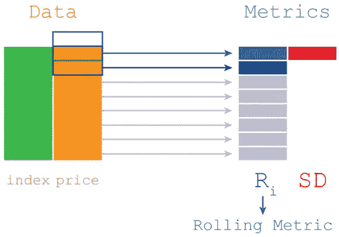

股票收益率的滚动窗口统计的一个例子，需要计算两个值

*   绕轴旋转

透视是重新排列数据的一种方式。此方法利用 groupby 算法将数据按列和范围进行排序。数据透视表在几乎所有转换库中都可用，但是，它们也可以在非常简单的软件中找到，如 Microsft Excel。

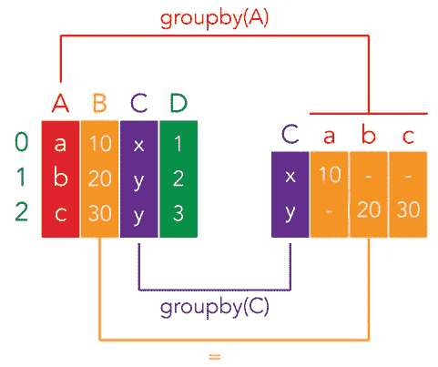

在这个例子中，我们可以决定哪些数据重新排列成列，哪些数据重新排列成行。对于我们决定重新排列的(初始数据集的)每一列，我们应用 groupby 算法。

## 转换

我所说的转换是指对某些数据应用某种算法。通常，这是通过将算法应用于整个列来实现的。

*   应用

最常用的算法是 apply，它对同一列中的所有值应用相同的转换，每个数据操作库都有不同的算法。

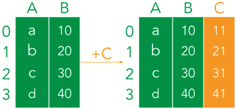

在这个例子中，我们对列 B 应用了一个转换:我们给每个值加 1，得到列 C

为了防止操作数据时丢失数据(这可能会在处理大数据时导致巨大的问题)，数据操作软件不直接编辑原始数据(至少像 Spark 这样的标准软件)，而是跟踪每个转换并在必要时执行它们。

通过编辑原始数据，这是一个非常糟糕的做法，万一你犯了一个错误，或者计划改变，你将需要从头开始重新开始转换的过程。如果您认为将原始数据集放在手中(只需要一行代码)就能解决问题，如果每次转换都要等待 30 分钟，那么您就能理解为什么我们更喜欢保留原始数据不动。

有几种基本转换可以应用于不同的数据类型，下面是最常见的几种:

*   激增

该算法只能应用于数组，其工作原理是提取每个值并将其放入一列。

*   水平爆炸

这个方法实际上没有名字，但是我遇到过几次这个问题，所以我在笔记中把它归类在这个名字下，以便弄清楚。因为该算法不存在，所以我们可以使用一种变通方法，将数组转换为新的数据帧，并在旧的数据帧上执行连接。

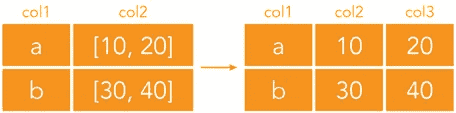

*   变平

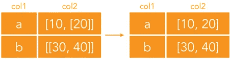

Flatten 不从数组中提取数据，而是删除数组的嵌套结构。

*   使分离

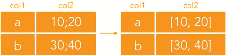

Split 可以被认为是 explode 的反义词:我们可以直接从字符串创建数组。

当我们想要执行编辑时，转换也可以应用于字符串，或者当我们想要进行新的计算(例如提取 KPI)时，转换也可以应用于数字。

## 清洁

数据清理可能是在数据过滤之后改进数据的最简单的技术。它包括处理数据集中的空值或 NaN 值，删除它们或用其他值替换它们。

空值在我们的数据中很常见，尤其是如果数据集是手动创建的，可能是通过调查或表单收集。在通过不再工作的传感器收集数据的数据集中，空值也很常见。

如果可能的话，尽量减少数据集中空值的数量总是一个好的做法，因为这可能会导致大量数据被删除。有时，我们甚至可以使用高级方法来估算 NaN 值，而不是删除整行数据。这在时间序列中非常常见，我们使用一种称为插值的方法，但我们也可以利用 ML 分类模型对横截面数据进行同样的处理。

*   德罗普纳

Dropna 只是删除所有包含空值的行。当然，我们可以使用参数，决定只对某些列而不是所有列应用算法。

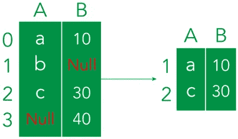

dropna 算法的示例

*   菲尔娜

Fillna 的工作原理是用我们决定的其他值替换空值。

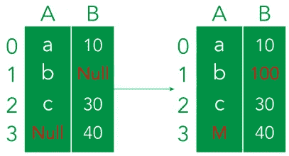

fillna 算法示例

估计如何自己替换空值的更高级的算法不是 fillna 的一部分，而是需要特征工程方法。

*   删除重复项

可以想象，这个简单的算法扫描数据集中的重复值，并删除相同的行。去重是一个简单的概念。每当我们的数据集中有相同的行(或者甚至是单列)时，我们可能想要删除它们。一个常见的应用是黄页，在那里你永远不会想找到重复的。有时，如果我们对重复项的考虑不限于所有列中具有相同值的样本，我们可以简单地将该算法应用于较少数量的列。

## 连接

连接用于将不同的数据集合并在一起。它们也是每个数据转换库的基础。预计将在熊猫基础知识和火花测试中测试这些知识。要执行连接，**您需要两个数据集，每个数据集有一行，至少有一些公共值**。

为了执行连接，我们关注每个数据集的一列。该列中的元素称为键。但是，连接数据集有不同的方式:

*   联盟

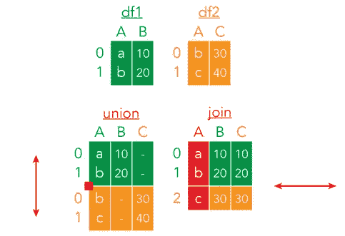

Union 扩展数据集的行，join 用于通过合并数据集来扩展其长度

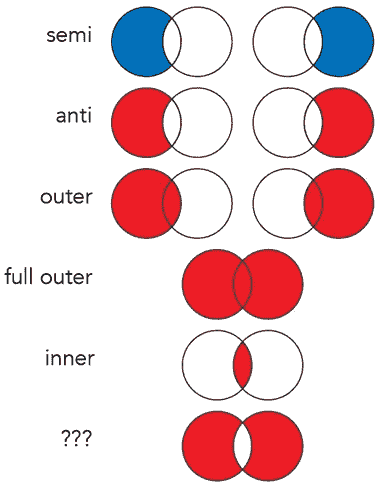

所有可能的连接组合

*   内部连接

使用内部连接，我们只维护两个数据集中共享的键。

*   左连接/左外连接

对于左连接，我们只维护左数据集中的键。

*   右连接/右外部连接

对于右连接，我们只维护右数据集中的键。

*   完全外部连接

使用外部连接，我们维护两个数据集中的键。

*   半连接
*   反联接
*   自然连接
*   交叉连接

## 读写文件

我不知道将这一部分添加到数据处理技术中是否合适。然而，读写文件是所有数据操作库中的关键方法。它们允许您将文件加载到数据中，还允许您将数据的最终编辑导出到工作环境之外。

## 特征工程

特征工程是一套分析方法，但也包括转换，是用于生产机器学习模型的技术。因为有大量可用的方法，我写了一篇文章，列出了我能找到的所有技术。