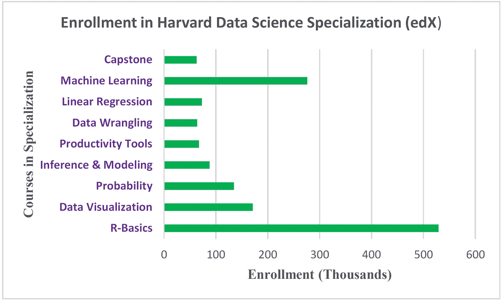
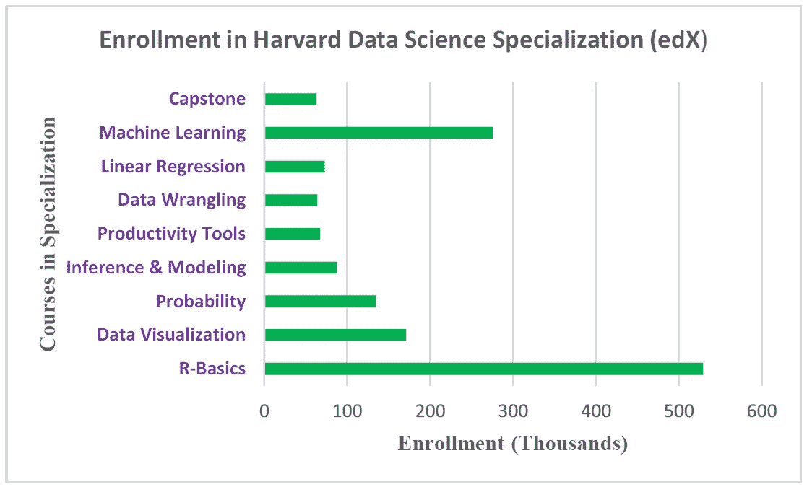
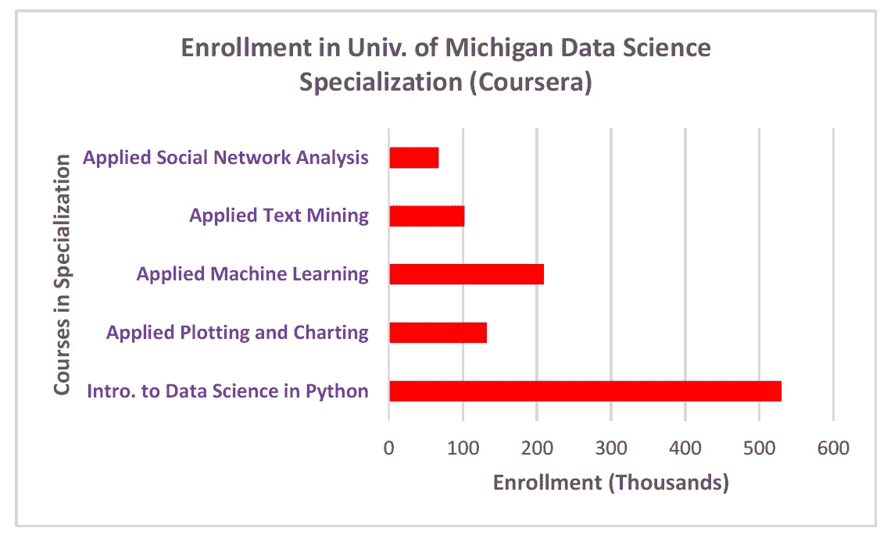

# MOOC 数据科学专业的完成率非常低

> 原文：<https://pub.towardsai.net/completion-rate-for-mooc-data-science-specializations-is-very-low-83ae8e8ebadd?source=collection_archive---------0----------------------->

哈佛数据科学专业的注册(数据来源:edX)。Benjamin O. Tayo 的图片

## [数据科学](https://towardsai.net/p/category/data-science)，[教育](https://towardsai.net/p/category/education)

## MOOC 数据科学专业的完成率不到 15%

## 一.导言

数据科学、机器学习和分析被认为是最热门的职业道路。行业、学术界和政府对熟练数据科学从业者的需求正在快速增长。因此，正在进行的“*数据热潮*”吸引了众多具有不同背景的专业人士，如物理、数学、统计、经济和工程等。数据科学家的就业前景非常乐观。IBM 预测，到 2020 年，对数据科学家的需求将飙升 28%。

对数据科学从业者不断增长的需求导致了大规模开放在线课程(MOOC)的激增。最受欢迎的 MOOC 提供商包括:

a)**EDX**:[https://www.edx.org/](https://www.edx.org/)

b)**Coursera**:[https://www.coursera.org/](https://www.coursera.org/)

c) **数据营**:[https://www.datacamp.com/](https://www.datacamp.com/)

https://www.udemy.com/的乌德米 :

e) **乌达城**:[https://www.udacity.com/](https://www.udacity.com/)

琳达:[https://www.lynda.com/](https://www.lynda.com/)

由于 MOOC 越来越受欢迎，每个数据科学野心家应该问自己的自然问题是: ***数据科学 MOOC 专业化的完成率是多少？***

为了回答这个问题，让我们来看两个重要的案例研究，这两个案例研究是关于两个顶级数据科学专业的。

## 二。MOOC 数据科学专业的完成率

在这一部分，我们将考察两个受欢迎的 MOOC 数据科学专业的课程完成率。

## II.1 [数据科学专业证书(HarvardX，通过 edX)](https://www.edx.org/professional-certificate/harvardx-data-science)

包括以下课程，全部使用 R 教授(您可以免费旁听课程或购买认证证书):

1.  数据科学:R 基础；
2.  数据科学:可视化；
3.  数据科学:概率；
4.  数据科学:推理和建模；
5.  数据科学:生产力工具；
6.  数据科学:扯皮；
7.  数据科学:线性回归；
8.  数据科学:机器学习；
9.  数据科学:顶点

**下面的图 1** 显示了已经注册该专业课程的总人数。

**图一。**哈佛数据科学专业招生(数据来源:edX)。Benjamin O. Tayo 的图片

我们从**图 1** 中观察到，专业中不同课程的注册人数并不一致。如果我们将毕业率定义为最后一门课程(顶点课程)注册总人数与第一门课程(基础课程)注册总人数之比，则得出的毕业率为 12%。这里使用的完成率的定义是合理的，因为大多数数据科学专业课程的设计方式是课程必须按顺序进行。这意味着注册该专业的学生必须先完成课程 1，然后才能继续学习课程 2。

我们还从**图 1** 中观察到，就注册人数而言，R 基础知识和机器学习是专业内的两门顶级课程。

**II.2** [**应用数据科学与 Python 专业化(密歇根大学，通过 Coursera)**](https://www.coursera.org/specializations/data-science-python)

包括以下课程，全部使用 python 教授(您可以免费旁听大多数课程，有些课程需要购买认证证书):

1.  Python 中的数据科学导论；
2.  应用 Python 绘图、制图和数据表示；
3.  Python 中的应用机器学习；
4.  Python 中文本挖掘的应用:
5.  Python 中的应用社会网络分析。

**下面的图 2** 显示了已经注册该专业课程的总人数。

**图二。**密歇根大学数据科学专业招生(数据来源:Coursera)。Benjamin O. Tayo 的图片

我们从**图 2** 中观察到，专业中不同课程的招生情况并不一致。如果我们将完成率定义为最后一门课程(应用社交网络分析)的总注册人数与第一门课程(Python 中的数据科学导论)的注册人数之比，则完成率为 13%。

我们还从**图 2** 中观察到，Python 中的数据科学导论和应用机器学习是注册人数最多的两门专业课程。

从上面的两个案例研究中，我们观察到数据科学 MOOC 专业的完成率是一致的，并且保持在不到 15%的低水平。完成率低可能意味着注册该专业的个人要么在某个时候灰心丧气，干脆放弃，要么可能是因为个人可能只对特定专业的特定课程感兴趣，这意味着他们对完成整个专业不感兴趣。

## 三。如何在数据科学专业中取得成功

正如我们已经检查过的，大多数数据科学 MOOC 专业的完成率非常低(不到 15%)。如果您正在考虑数据科学专业，这里有一些提示可以帮助您保持专注并完成整个专业。

1.  你需要决心和耐心。在线自学数据科学可能相当具有挑战性。然而，只要有坚定的决心、努力的工作和耐心，你就能把事情做到底。
2.  与其他专业的学生建立联系。通过积极参与网上论坛，你可以和你的同学分享想法。这将有助于提供一种参与课堂的方式，这是在线课程的一个主要挑战。
3.  努力工作，无所畏惧。有了强烈的职业道德，即使事情看起来很有挑战性，你也会坚持工作。把阅读所有学习资料和完成所有每周作业作为你的目标。

## 四。总结和结论

总之，我们考察了数据科学 MOOC 专业化的完成率。通过两个案例研究，我们发现大多数在线 MOOC 数据科学专业的完成率仍然低于 15%。如果你是数据科学的追求者，目前正在考虑这些 MOOC 专业，不要让低完成率让你气馁。通过努力、耐心和决心，你可以达到完成所有专业课程的目标。

## 其他数据科学/机器学习资源

[数据科学需要多少数学知识？](https://medium.com/towards-artificial-intelligence/how-much-math-do-i-need-in-data-science-d05d83f8cb19)

[数据科学课程](https://medium.com/towards-artificial-intelligence/data-science-curriculum-bf3bb6805576)

[进入数据科学的 5 个最佳学位](https://towardsdatascience.com/5-best-degrees-for-getting-into-data-science-c3eb067883b1)

[数据科学的理论基础——我应该关心还是仅仅关注实践技能？](https://towardsdatascience.com/theoretical-foundations-of-data-science-should-i-care-or-simply-focus-on-hands-on-skills-c53fb0caba66)

[机器学习项目规划](https://towardsdatascience.com/machine-learning-project-planning-71bdb3a44349)

[如何组织你的数据科学项目](https://towardsdatascience.com/how-to-organize-your-data-science-project-dd6599cf000a)

[大型数据科学项目的生产力工具](https://medium.com/towards-artificial-intelligence/productivity-tools-for-large-scale-data-science-projects-64810dfbb971)

[数据科学作品集比简历更有价值](https://towardsdatascience.com/a-data-science-portfolio-is-more-valuable-than-a-resume-2d031d6ce518)

***如有疑问，请发邮件给我***:benjaminobi@gmail.com