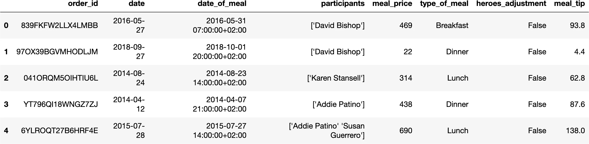
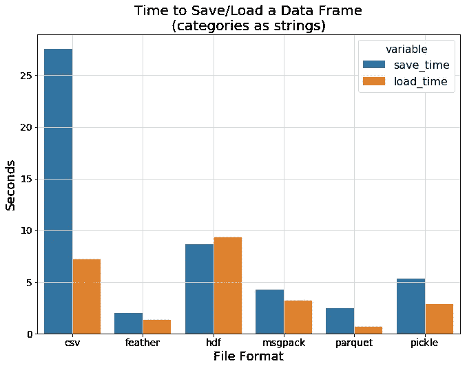

# 优化你的熊猫代码的综合指南

> 原文：<https://pub.towardsai.net/comprehensive-guide-to-optimize-your-pandas-code-62980f8c0e64?source=collection_archive---------0----------------------->

## [数据科学](https://towardsai.net/p/category/data-science)

## 熊猫的实用优化


来源: [Reddit](https://www.reddit.com/r/funny/comments/7umfdz/darth_panda/)

在本指南中，我将向您展示一些最常见的陷阱，这些陷阱会导致原本非常好的 Pandas 代码对于任何时间敏感的应用程序来说都太慢，并通过一组提示和技巧来避免它们。

让我们提醒自己，除了可爱的动物，熊猫是什么🐼。这是一个广泛用于数据分析和操作的库，它将所有数据加载到 RAM 中。

在本文中，我将使用包含餐饮发票的数据集(一百万行)📉。

```
df = load_dataset()
df.head()
```



# 为什么是性能🤨

*   **快比慢好-** 因为没有人喜欢等待自己的代码被执行🐇。
*   **内存效率好-** 因为“内存不足”异常很吓人。💾
*   省钱是很棒的- 通过使用功率较小的机器，我们可以降低成本💸。
*   **硬件只能带你走这么远-** 硬件性能是有限的💻。

好了，现在我已经“说服”你我们应该关心性能，我想解决的下一个问题是什么时候我们应该优化我们的代码。
剧透提醒令人惊讶的答案是:“不总是。”


[https://www.pinterest.ie/pin/764415736723944164/](https://www.pinterest.ie/pin/764415736723944164/)

# 何时优化⏰

因为程序可读性是我们的首要任务，因为我们的目标是让程序员的生活更轻松，我们应该只在需要的时候优化我们的代码，换句话说"**所有的优化都是不成熟的，除非"**:

*   **程序不符合要求-** 对用户来说是否太慢，或者是否占用太多内存🚔。
*   **程序执行影响开发进度-** 如果程序运行缓慢，那么它将影响开发人员的生产力，这将使每个功能的开发时间变得更长👷。

由于优化我们的代码可能很耗时，我们应该只重构有问题的部分。

这可以通过分析我们的程序来识别瓶颈来实现。因为这是一个很大的话题，所以我不会深究细节，并且**将使用下面的分析器**:

*   `%time-`单个语句的执行时间⌛.
*   `%timeit-`像时间一样，但为了更精确而重复⌛.
*   `%memit-`衡量单个语句的内存使用情况💾。
*   `%mprun-`使用逐行内存分析器运行代码💾。

除了找到需要重构的代码部分，我们还希望重构本身是安全的。像**每一个重构任务一样，你希望有相同的行为并返回相同的结果**。实现这一点的最好方法是确保代码经过了良好的测试。

我要解决的下一个问题是，“有可能优化我们的 python 代码吗？Python 是一种动态语言，缺乏大量编译优化”。

# 可能吗？🦾

人们倾向于认为问题出在 python 领域，对此我们无能为力。


[https://www . Reddit . com/r/programmer humor/comments/9 cdj 7 z/nah _ dude _ I _ dont _ think _ python _ is _ slow _ my _ app _ runs/](https://www.reddit.com/r/ProgrammerHumor/comments/9cdj7z/nah_dude_i_dont_think_python_is_slow_my_app_runs/)

但是，事实并非如此，本文旨在展示如何优化 pandas 代码。

接下来，我们将解决这个百万美元的问题，“**我们如何优化我们的熊猫代码？”**。

# 怎么👀

*重要提示:*每种技术都有一个图标，指示它是否应该提高性能⌛和/或内存占用💾。

我将列出我今天要讲的技巧。

*   用你需要的💾⌛
*   不要多此一举，⌛💾
*   避免⌛循环
*   选择正确的类型💾⌛
*   熊猫使用⌛💾
*   编译代码⌛
*   通用 Python 优化⌛💾
*   熊猫替代品⌛💾

在我开始之前，重要的是要说明所有这些优化都依赖于数据集的特征。例如，对于小型数据集，其中一些优化可能是不相关的。

# 用你需要的🧑

*   **只加载需要的列-** 删除我们在数据分析/操作中不使用的所有列可以节省大量内存。
*   **只加载需要的行-** 删除我们在数据分析/操作中不使用的所有行可以节省大量内存和执行时间。

虽然这看起来很基本，但它会产生巨大的影响，人们似乎忽略了这一点。你应该像这个可爱的家伙一样，只使用你需要的东西。


[https://knowyourmeme.com/photos/1092618-image-macros](https://knowyourmeme.com/photos/1092618-image-macros)

# 不要多此一举。🎡

*   **庞大的生态系统-** 相关的包和教程层出不穷。大概已经有人做了你要找的事情。
*   **使用现有的解决方案-** 现在有很多成熟的包，使用它们会导致更少的错误和更优化的代码(它们是用高度优化的 C/Fortran 编写的，只有 python 绑定)。

例如，你应该使用 [scipy](https://www.scipy.org/) 或 skit [-learn](https://scikit-learn.org/stable/) 实现，而不是自己实现。


[https://imgflip.com/i/1px0z1](https://imgflip.com/i/1px0z1)

# 避免♾循环

Pandas 是为向量操作而设计的。矢量化是对整个数组执行操作的过程，**这使得循环效率低下**。

## 错误的选择😈

pandas 中的一个新手错误将是通过使用错误或常规循环来循环所有行。

在下面的代码片段中，我们通过从餐费本身减去小费来计算原始餐费(不含小费)。

```
def iterrows_original_meal_price(df):
    for i, row in df.iterrows():
        row["orig_meal_price"] = row["meal_price"] - row["meal_tip"]
    return df%%timeit -r 1 -n 1
iterrows_original_meal_price(df)35min 13s ± 0 ns per loop (mean ± std. dev. of 1 run, 1 loop each)
```

正如你所看到的，执行时间大约是 35 分钟，**确实令人不满。**但是不要担心，正如我所说的，使用 iterrows 是一个新手的错误，我在这里向您展示一个更好的方法。

## 更好的选择🤵

幸运的是，有一种更好的方法，使用 apply。应用接受任何在数据帧上应用转换/聚合的用户定义函数(迭代)。

```
def calc_orig_meal_price(row):
    return row['meal_price'] - row['meal_tip']def apply_original_meal_price(df):
    df["orig_meal_price"] = df.apply(calc_orig_meal_price, axis=1)
    return df%%timeit 
apply_original_meal_price(df)22.5 s ± 170 ms per loop (mean ± std. dev. of 7 runs, 1 loop each)
```

正如我们所看到的，这里的性能提升是疯狂的，而不是 35 分钟，同样的程序花了我们 21 秒，这是好得多。我很乐意接受执行时间比 iterrows⌛.快 100 倍
所以教训是 **Iterrows 是纯粹的恶**😈。

但我们能做的只有这些吗？难道不能让同样简单的代码速度极快吗？这是可以做到的，现在我将向你们展示最好的方法，也就是矢量化。

## 最佳选择👼

提醒一下，矢量化是对整个阵列执行操作的过程。Pandas/NumPy/SciPy 包含了大量的矢量化函数，从数学运算到聚合，或者用 np.vectorize 创建新的函数。

矢量化效果更好的原因是现代计算机处理器包含:

*   SISD(单指令，单数据):这是处理 Python for 循环的结构——每一个指令，每一个数据元素，每一个时刻，为了产生一个结果。这种方法的优点在于它很灵活——您可以对数据执行任何操作。缺点是它不是处理大量数据的最佳选择。
*   SIMD(单指令，多数据):这是如何处理 NumPy 和 Pandas 矢量化的结构——每一时刻每任意数量的数据元素一条指令，以便产生多个结果。当代的 CPU 在其每个内核中都有一个处理 SIMD 运算的组件，允许并行处理。

在下面的代码片段中，我们将从整个*餐费价格*列中减去整个*餐费小费*列。

```
def vectorized_original_meal_price(df):
    df["orig_meal_price"] = df["meal_price"] - df["meal_tip"] 
    return df%%timeit 
vectorized_original_meal_price(df)2.46 ms ± 18.1 µs per loop (mean ± std. dev. of 7 runs, 100 loops each)
```

**这太疯狂了。**我们可以马上看到矢量化功能的好处。我们到了 2.5 毫秒。还有 10 万左右。**与应用方法** ⌛.相比，执行时间 **提高了 8000 倍所以教训是**矢量化运算规则**😇。**

有一个很棒的演讲展示了如何向量化你的函数，你可以在这里找到。

# 选择正确的类型🌈

我将展示选择正确类型的动机。这将大大减少我们的内存占用🏆。

首先，我要创建一个数组，反复以 5000 这个数字 1 结尾。

```
ones = np.ones(shape=5000)
onesarray([1., 1., 1., ..., 1., 1., 1.])
```

然后，我将使用不同的类型进行造型，并展示一个简单的类型更改是如何极大地改变内存占用的。

```
types = ['object', 'float64', 'int64', 'int16', 'int8', 'bool']
df = pd.DataFrame({t: ones.astype(t) for t in types})
df.memory_usage(index=False, deep=True)object        160000
float64        40000
int64          40000
int16          10000
int8            5000
bool            5000
dtype: int64
```

正如你所看到的，选择正确的类型可以给我们带来 80 倍的内存改进，这是相当疯狂的。**我希望清楚列的类型影响内存占用。**

现在，我们已经了解了优化数据集类型的动机，让我们看看整个数据集的内存占用，以及它是如何逐列分布的🌈。

```
df.memory_usage(deep=True).sum()478844140df.memory_usage(deep=True)Index                 8002720
order_id             73024820
date                 67022780
date_of_meal         82027880
participants         84977580
meal_price           36012240
type_of_meal         63688760
heroes_adjustment    32076480
meal_tip             32010880
dtype: int64
```

因此，很明显，我们应该瞄准具有相同功能的最低内存占用的类型。我将描述支持的类型。

## 支持的类型🌈

*   **int** —整数。
*   **float** —浮点数。
*   **布尔型** —布尔型真值和假值。
*   **对象** —字符串或混合类型。
*   [**字符串**](https://pandas.pydata.org/pandas-docs/stable/user_guide/text.html) —字符串(1.0.0 版本新增)。
*   [**字符串【py arrow】**](https://pythonspeed.com/articles/pandas-string-dtype-memory/)—字符串(1.3 版本新增)。
*   **日期时间** —日期和时间值。
*   **时间增量** —两个日期时间之间的时间差。
*   [**类别**](https://pandas.pydata.org/pandas-docs/stable/user_guide/categorical.html) —存储在高效内存查找中的有限值列表。当相同的元素反复出现时，这是很好的(0.23 版本中的新功能)。
*   [**稀疏类型**](https://pandas.pydata.org/docs/user_guide/sparse.html) —当数组的大部分包含空值时，稀疏类型是好的(0.24.0 版本中的新功能)。
*   [**可空整数**](https://pandas.pydata.org/docs/user_guide/integer_na.html) **/** [**可空布尔**](https://pandas.pydata.org/docs/user_guide/boolean.html) —当元素为整数/布尔且包含空值时，可空类型是好的。这是因为 NaN 是一个浮点型，它强制将整个数组转换为浮点型，因此具有更大的内存占用(0.24.0 版中的新功能)。

由于熊猫使用 NumPy 数组作为它们的后端结构，`int` s 和`float` s 可以被区分为更高效的内存类型，如`int8`、`int16`、`int32`、`int64`、`unit8`、`uint16`、`uint32,`和`uint64`以及`float32`和`float64`。

如果这还不够，你可以使用扩展数组来使用自定义类型，尽管优化需要大量的努力和技能🦸🏼🦸‍♀️.
如果您选择这样做，您可以使用:

*   [自己的类型](https://www.youtube.com/watch?v=xx7H5EkzQH0)。
*   开源类型，如用于 IP 类对象的 [cyberpandas](https://github.com/ContinuumIO/cyberpandas) 和用于空间类对象的 [geopandas](https://github.com/geopandas/geopandas) 。

## 我们优化类型的选择🌈

*   加载特定类型的数据帧(最佳方式)。
*   使用类型方法。
*   使用带有向下转换参数的 to_x 方法。

```
df = df.astype({'order_id': 'category',
                'date': 'category',
                'date_of_meal': 'category',
                'participants': 'category',
                'meal_price': 'int16',
                'type_of_meal': 'category',
                'heroes_adjustment': 'bool',
                'meal_tip': 'float32'})df.memory_usage(deep=True).sum()36999962
```

**这太疯狂了，**我们可以看到选择正确类型的好处让我们达到了 3.7 兆字节，这比简单类型的内存提高了**12 倍。**

不仅如此，我们还可以改进一些数学方法的执行，如均值/求和/众数/最小值/等优化🧮.

```
%%timeit
df["meal_price_with_tip"].astype(object).mean()96 ms ± 499 µs per loop (mean ± std. dev. of 7 runs, 10 loops each)%%timeit
df["meal_price_with_tip"].astype(float).mean()4.27 ms ± 34.9 µs per loop (mean ± std. dev. of 7 runs, 100 loops each)
```

同样，我们可以看到选择正确类型的好处，它让我们从 96 毫秒减少到 4.3 毫秒，与简单类型的⌛.相比，执行时间**提高了**20 倍****


【https://knowyourmeme.com/photos/549339-rule-34 

# 熊猫用法🐼

1.  **Concat vs Append ➕ —** 每次追加都会创建一个新的 DataFrame 对象，因此多次追加会变得低效，应该使用 Concat，对于一些更改，追加可能会更快。
2.  **排序优化📟—** pandas sort 对于应该使用哪种算法有一个额外的参数，同样使用 GPU，PyTorch/Tensorflow 排序可能会更快:

```
%%timeit
df.sort_values(["meal_price_with_tip", "meal_tip", "type_of_meal"], kind='quicksort')147 ms ± 1.43 ms per loop (mean ± std. dev. of 7 runs, 10 loops each)%%timeit
df.sort_values(["meal_price_with_tip", "meal_tip", "type_of_meal"], kind='mergesort')147 ms ± 876 µs per loop (mean ± std. dev. of 7 runs, 10 loops each)%%timeit
df.sort_values(["meal_price_with_tip", "meal_tip", "type_of_meal"], kind='heapsort')147 ms ± 1.51 ms per loop (mean ± std. dev. of 7 runs, 10 loops each)
```

**3)大块🍰—** 将大型数据集分割成较小的部分将允许我们处理大型数据集(比内存大得多)，只要组块之间没有太多的交互。

```
def proccess_file(huge_file_path, chunksize = 10 ** 6):
    for chunk in pd.read_csv(path, chunksize=chunksize):
        process(chunk)
```

**4)分组优化👩‍👩‍👧:**

*   早期过滤
*   自定义功能很慢
*   尽可能提取自定义功能的逻辑
*   [避免按多个类别分组](https://github.com/pandas-dev/pandas/issues/24333)
*   考虑使用 [DuckDB](https://duckdb.org/) 。

**5)合并优化🔍:**

*   早期筛选/聚合
*   半连接
*   [加入索引](https://stackoverflow.com/questions/53645882/pandas-merging-101)
*   考虑使用 [DuckDB](https://duckdb.org/) 。

**6)数据帧序列化🏋—** 各种文件格式有不同的优势，包括保存和加载时间。



[https://towards data science . com/the-best-format-to-save-pandas-data-414 DCA 023 e0d](https://towardsdatascience.com/the-best-format-to-save-pandas-data-414dca023e0d)

**7)查询/评估🧬**

*   如果安装，使用 [numexpr](https://pypi.org/project/numexpr/) 和[瓶颈](https://github.com/pydata/bottleneck)。
*   缩短执行时间—预期行为速度提高了 2 倍👍。
*   提高内存——NumPy 为每个中间步骤分配内存，通过使用 numexpr，它计算相同的表达式，而不需要分配完整的中间数组👍。
*   并非所有操作都受支持👎

```
%%timeit
df[df.type_of_meal=="Breakfast"]103 ms ± 348 µs per loop (mean ± std. dev. of 7 runs, 10 loops each)%%timeit
df.query("type_of_meal=='Breakfast'")82.4 ms ± 223 µs per loop (mean ± std. dev. of 7 runs, 10 loops each)
```

**挺酷的，% 20 性能 Improvement⌛.
重要注意事项，**pandas API 指示仅对中等规模或更大规模的数据集(超过 10，000 行，因为传统方法对于较小的阵列🧞.更快)使用查询/评估

# 编译代码🤯

由于其动态性，纯 Python 的代码做一些操作非常慢。这是因为操作序列不能像其他语言如 C 和 Fortran 那样被编译成高效的机器代码。

为了展示性能提升，我将创建一个名为`pure_python_foo`的纯 python 方法，它累加所有的数字，直到一个给定的数字。

```
def pure_python_foo(N):
    accumulator = 0
    for i in range(N):
        accumulator = accumulator + i
    return accumulator%%timeit
df.meal_price_with_tip.map(foo)17.9 s ± 25.7 ms per loop (mean ± std. dev. of 7 runs, 1 loop each
```

正如我们可以这个简单的方法需要 18 秒来运行，这是**根本无法接受的。幸运的是，有各种各样的尝试添加一些编译魔法来解决这个弱点🧙:**

*   **Cython** —将 Python 代码转换为兼容的 C 代码:
    ——从纯 Python 代码加速到 50 倍👍。
    -学习曲线👎。
    -由于单独的编译步骤**，需要额外的工作来集成到代码中👎**。
    -由于独立的编译步骤**，运行时没有编译开销👍**。
*   **Numba** —将 Python 代码转换为快速 LLVM 字节码:
    —与纯 Python 相比，速度提高了 200 倍👍。
    -简单——简单地给一个方法添加一个装饰器👍。
    -高度可配置👍。
    -大多是数字👎。
    -调试业务逻辑很容易，因为我们只需移除装饰器，然后我们就可以像调试常规 python 代码一样调试它**👍**。

这些是 Cython 和 Numba 的例子:

```
%%cython
def cython_foo(long N):
    cdef long accumulator
    accumulator = 0 cdef long i
    for i in range(N):
        accumulator += i return accumulator%%timeit
df.meal_price_with_tip.map(cython_foo)365 ms ± 2 ms per loop (mean ± std. dev. of 7 runs, 1 loop each)@jit(nopython=True)
def numba_foo(N):
    accumulator = 0
    for i in range(N):
        accumulator = accumulator + i
    return accumulator%%timeit
df.meal_price_with_tip.map(numba_foo)414 ms ± 596 µs per loop (mean ± std. dev. of 7 runs, 1 loop each)
```

**如你所见，使用 Cython 我们获得了 49 倍的性能提升，使用 Numba** ⌛.我们获得了 43 倍的性能提升

作为一个通用的经验法则，您应该首先尝试矢量化方法，如果不够的话，再尝试 Numba，然后才是 Cython。

# 常规 Python 优化🐍

由于我们在编写 pandas 代码时使用 python 方法，了解常规的 python 优化可以带来很好的改进。

由于这是一个很大的话题，我将只给出一些技术的概述，更多技术请阅读“[高性能 Python 书籍”](https://www.amazon.com/gp/product/1449361595/ref=as_li_qf_asin_il_tl?ie=UTF8&tag=eyaltrabelsi-20&creative=9325&linkCode=as2&creativeASIN=1449361595&linkId=536e0e2afc034dfabd2eb1b881b06049)📖。

## 贮藏🏎

*   避免不必要的工作/计算。
*   [更快的代码](https://medium.com/fintechexplained/advanced-python-how-to-implement-caching-in-python-application-9d0a4136b845)

## 发电机

*   生成器是简单的函数，一次返回一组可迭代的项目。
*   [可以大幅减少内存占用](https://medium.com/@chetaniam/optimize-python-code-with-generators-aef839996ee4)[。](https://medium.com/@chetaniam/optimize-python-code-with-generators-aef839996ee4)

## 中间变量👩‍👩‍👧‍👧

*   中间计算
*   两个对象的内存占用
*   更智能的变量分配

```
def another_foo(data):
    return data * 2def foo(data):
    return data + 10%reload_ext memory_profilerdef load_data():
    return np.ones((2 ** 30), dtype=np.uint8)%%memit
def proccess():
    data = load_data()
    return another_foo(foo(data))proccess()peak memory: 8106.62 MiB, increment: 3042.64 MiB%%memit
def proccess():
    data = load_data()
    data = foo(data)
    data = another_foo(data)
    return dataproccess()peak memory: 7102.64 MiB, increment: 2038.66 MiB
```

## 并发性和并行性🎸🎺🎻🎷

*   Pandas 方法使用单一过程。
*   CPU 受限可以从并行性而不是顺序执行中获益。
*   IO 绑定可以受益于并发性，无论是多线程还是异步执行。

# 熊猫替代品🐨🐻

如果所有这些技术都不能满足您的需求，您可能应该使用不同的 Dataframe API:

*   [cudf](https://www.youtube.com/watch?v=lV7rtDW94do) —一个支持 GPU 的 DataFrame API。
*   [py spark](http://spark.apache.org/docs/latest/api/python/index.html)—Apache spark 的 python 绑定。
*   [modin](https://www.youtube.com/watch?v=-HjLd_3ahCw)—Dask 或 ray 上的抽象，用于在多台机器上并行化 pandas。
*   只需更改一行代码，就可以在所有 CPU 上并行执行 pandas 操作。
*   [Polars](https://www.pola.rs/)—Rust 中实现的 DataFrame API。

就像生活中的所有事情一样，没有免费的午餐🥢。每一种都有其局限性，在你选择其中一种之前，你应该做足功课并[理解](https://www.youtube.com/watch?v=YpFACw3g0AY&list=WL&index=4&ab_channel=BigThingsConference) [权衡](https://towardsdatascience.com/pandas-is-not-enough-a-comprehensive-guide-to-alternative-data-wrangling-solutions-a4730ba8d0e4)。

# 临终遗言

在本文中，我们回顾了一些最常见的陷阱，这些陷阱可能导致原本非常好的 Pandas 代码对于任何时间敏感的应用程序来说都太慢，并通过一组提示和技巧来避免它们。

由于题目的范围，有许多东西我都简要地涉及了。出于这个原因，如果你想多走一步，我在最后添加了额外的资源。

我希望我能够分享我对这个迷人的话题的热情，并且你会发现它是有用的，并且我一如既往地欢迎任何建设性的反馈。

# 额外资源📚

*   [矢量化思维模式📖](https://www.youtube.com/watch?v=EEUXKG97YRw)
*   [Numpy](https://numpy.org/doc/stable/reference/index.html) / [熊猫](https://pandas.pydata.org/pandas-docs/stable/index.html) / [Scipy](https://docs.scipy.org/doc/scipy/reference/special.html) 矢量化方法📖
*   🛠的 Numba 工作室
*   [赛森工作室](https://www.youtube.com/watch?v=FepqwPI6U80) 🛠
*   Numba VS C++ ⚖
*   [赛森 VS C](https://notes-on-cython.readthedocs.io/en/latest/std_dev.html) ⚖
*   [序列化时间](https://towardsdatascience.com/the-best-format-to-save-pandas-data-414dca023e0d)📖
*   [组块](https://pandas.pydata.org/docs/user_guide/scale.html)📖
*   [熊猫替代品](https://www.youtube.com/watch?v=RRtqIagk93k)📖
*   [缓存](https://medium.com/datadriveninvestor/all-things-caching-use-cases-benefits-strategies-choosing-a-caching-technology-exploring-fa6c1f2e93aa)📖
*   [中间变量](https://pythonspeed.com/articles/function-calls-prevent-garbage-collection/)📖
*   [高性能 Python 书籍](https://amzn.to/38CKsuU)📖