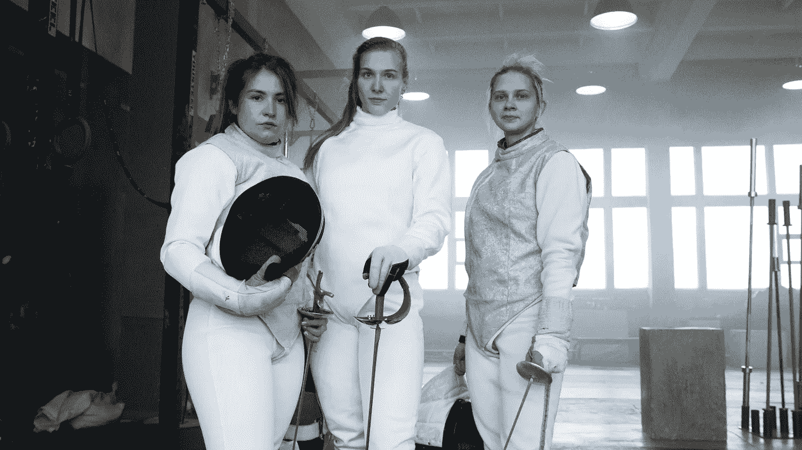

# 计算机科学 vs .数据科学，让我们一劳永逸地解决它

> 原文：<https://pub.towardsai.net/computer-science-vs-data-science-lets-settle-it-once-and-for-all-ebb15324200d?source=collection_archive---------3----------------------->

## 阐明这两个领域的相同点和不同点

来自 Pexels 的 Andrea Piacquadio

# **计算机科学的 3 个基本定义:**

1.  计算机科学是对计算机如何工作以及人们如何使用它们的研究。
2.  电脑是我们用来帮助我们做事的工具。有时候我们用它们来做一些我们自己很难做的事情，比如把很多数字加起来或者记住一些东西。有时我们用它们做有趣的事情，比如玩游戏或听音乐。从事计算机工作的人被称为计算机科学家。
3.  计算机科学是对计算机及其应用和工作原理的研究。

# **计算机科学本科层次定义:**

在计算领域，计算机科学是对构成实现计算系统基础的理论、实验和工程[1]的研究。此外，计算机科学作为一个跨学科领域，通过结合数学、工程和科学，集成了算法和编程语言理论的研究。最后，通过遍历信息安全领域，计算机科学还处理信息的管理和保护。

计算机科学领域包括许多子领域和专业，如人工智能、数据库系统、软件工程、人机交互、网络、编程语言和计算理论。

由来自 Pexels 的 [Pixabay](https://www.pexels.com/@pixabay/)

# **从更专业的角度来说，这是我对计算机科学的定义:**

科学和实用的计算方法及其应用。计算机科学涉及对系统化过程(或算法)的可行性、结构、表达和机械化的系统研究，这些过程是信息的获取、表示、处理、存储、交流和访问的基础[2]。

**算法是一组定义明确的有限指令[3]，用于执行特定任务，在给定初始状态的情况下，将通过一系列定义明确的连续状态，最终终止于最终状态[4]** 。

从一个状态到下一个状态的转换不一定是确定的；一些被称为随机化算法的算法包含随机输入。

# **数据科学的 4 个基本定义:**

1.对数据的研究。它包括收集、清理和分析数据，所有这些都是为了帮助我们理解数据是什么以及如何用它来解决问题。

2.收集和分析数据的研究。数据科学家使用数据来寻找可用于决策的模式和见解。

3.从数据中获取信息的方法。有时候这些数据以数字的形式出现，比如一个房间里有多少人，有时候这些数据以图片的形式出现，比如一张人脸的照片。数据科学是一种使用计算机来帮助我们理解这些数据并基于这些数据进行预测的方法。

4.将数据转化为信息以解决问题的过程。

由来自 Pexels 的 [Pixabay](https://www.pexels.com/@pixabay/)

# **数据科学本科层次定义:**

使用科学方法、工具和技术从数据中提取知识和见解的研究。这些方法可能涉及处理大型复杂数据集，使用统计和机器学习方法来揭示模式和关系，以及应用特定领域的知识来解释和交流发现。

# **从更专业的角度来说，这是我对数据科学的定义:**

数据科学是计算机科学、统计学和领域专业知识的交叉，为数据收集、管理、分析和展示技术的研究和应用提供信息。

通过[从 Pexels 收回媒体](https://www.pexels.com/@recalmedia/)

# **数据科学和计算机科学的 10 大区别:**

1.计算机科学是对计算机及其设计的研究，而数据科学是从数据中提取洞察力的研究。

2.计算机科学侧重于计算的理论方面，而数据科学侧重于计算的实际应用。

3.计算机科学研究计算机的硬件和软件，而数据科学研究这些计算机处理的数据。

**4。计算机科学的目标是建立高效可靠的系统，而数据科学的目标是从数据中提取有用的信息。**

5.计算机科学在很大程度上依赖于数学概念，而数据科学更依赖于统计学和概率。

6.计算机科学更侧重于算法的设计。相比之下，数据科学更专注于数据分析(尽管人们可能会发现自己在数据科学领域花费了整个职业生涯，从零开始为机器学习和自然语言处理用例构建新的算法。)

7.计算机科学更关注计算效率，而数据科学更关注结果的准确性。

8.计算机科学处理抽象问题，而数据科学处理具体问题。

9.计算机科学可以更理论化，而数据科学可以更应用化。

10.计算机科学是关于计算机的，而数据科学是关于数据的。

通过[从像素运行 4 个 FFWPU](https://www.pexels.com/@runffwpu/)

# **数据科学和计算机科学的 9 个更多技术差异:**

1.计算机科学是对计算机及其设计的研究，而数据科学是从数据中提取意义的研究。

**2。计算机科学侧重于计算机的硬件和软件，而数据科学侧重于数据的分析和解释。**

3.计算机科学处理基于理论的计算基础，而数据科学处理数据的实际应用。

4.计算机科学处理算法的设计和实现，而数据科学处理数据的统计分析。

5.计算机科学处理算法的复杂性，而数据科学处理数据的复杂性。

6.计算机科学研究计算理论，而数据科学研究数据分析。

7.计算机科学是一门数学科学，而数据科学是一个跨学科领域。

8.计算机科学处理问题的形式分析，而数据科学处理经验数据分析。

9.计算机科学是一个理论性更强的领域，而数据科学是一个应用性更强的领域。

关于两者之间的相似性，数据科学和计算机科学都涉及处理和分析数据，使用算法和软件工程原理，经常使用类似的工具和编程语言，涉及建模和模拟，并需要批判性思维和解决问题的技能。

来自 Pexels 的茱莉亚·拉尔森

# 以下是计算机科学和数据科学之间的 21 个相似之处:

1.他们处理大量的数据。

2.使用 DevOps 提高开发速度。

3.他们需要分析和解释数据的能力。

**4。他们需要了解和使用算法的背景知识。**

5.他们需要开发新方法和技术的技能。

6.有效的沟通技巧。

7.在团队中有效工作的期望。

8.创造性思维能够解决经常出现的太抽象的问题。

9.化抽象为简单的逻辑推理技巧。

10.他们使用算法来分析数据并做出预测。

11.他们用统计学来理解数据。

来自 Pexels 的 Artem Podrez

12.使用数据挖掘来发现数据中的模式。

13.使用分布式计算并行处理数据。

14.使用机器学习来发现数据中隐藏的模式。

15.应用人工智能技术从数据中做出预测。

16.利用大数据寻找相关性和趋势。

17.使用数据可视化来理解数据。

18.使用云计算来存储和分析数据。

19.使用并行计算来加速计算。

20.NoSQL 存储和查询大数据，SQL 查询数据库。

21.这两个学科都主要使用 Python 来分析数据。

未来将是人工智能和机器学习这两个领域的更紧密融合，特别是后者在计算机科学中变得越来越重要。此外，云将继续成为计算机科学研究和开发的主要焦点。我认为这两个领域之间的重要交集将是网络安全、大数据和物联网。我认为网络安全将会成为计算机科学专业人士更加关注的问题；他们必须了解大数据和万维网日益增长的复杂性，以便在网络安全领域实施。

如果您有任何编辑/修改建议或关于进一步扩展此主题的建议，请考虑与我分享您的想法。

# 另外，请考虑订阅我的每周简讯:

 [## 周日报告#1

### 设计思维与 AI 的共生关系设计思维能向 AI 揭示什么，AI 又能如何拥抱…

pventures.substack.com](https://pventures.substack.com/) 

*参考文献:*

*[1]。计算机科学-赛格维基。*[*https://wiki.seg.org/wiki/Computer_science*](https://wiki.seg.org/wiki/Computer_science)

*【2】。计算机科学系-谷歌。*[*https://sites.google.com/view/mcadepartment/about*](https://sites.google.com/view/mcadepartment/about)

*【3】。1a.docx —活动 1:算法是定义明确的有限集。*[*https://www.coursehero.com/file/147309063/1adocx/*](https://www.coursehero.com/file/147309063/1adocx/)

*【4】。模块 I . doc——算法的设计与分析。*[*https://www.coursehero.com/file/101343115/Module-Idoc/*](https://www.coursehero.com/file/101343115/Module-Idoc/)