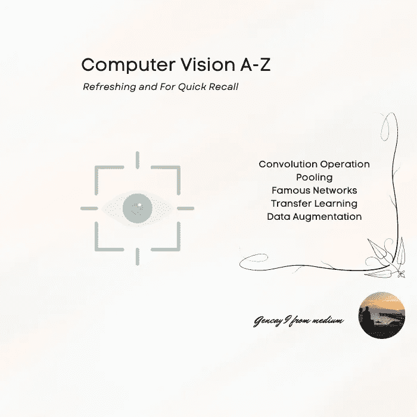
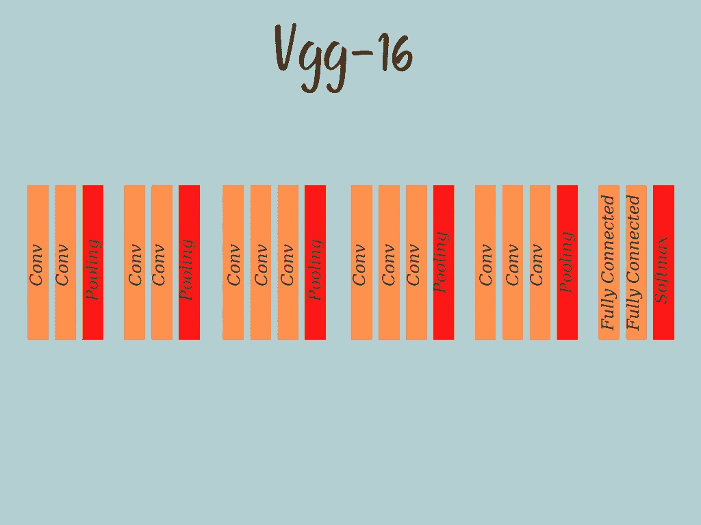

# 计算机视觉 A-Z 简要解释了第 1 部分

> 原文：<https://pub.towardsai.net/computer-vision-a-z-briefly-explained-part-1-7523128c1fb5?source=collection_archive---------3----------------------->

## 提神和快速回忆



作者图片

# 介绍

***计算机视觉*** 是 ***人工智能*** 的一个领域，其中计算机试图从图片&视频中收集信息，简单来说就是视觉样本。当然， ***编程*** 这些观念都很重要。但是在 ***编程*** 之前，深入覆盖定义背后的逻辑是必不可少的。

无论你是职业生涯的开端，还是你所在领域的前辈，阅读这些术语都会对你有所帮助。

在短短的 7 分钟内，你将深入了解整个 ***计算机视觉*** 术语，有时还会用到数学函数、图表和现实生活中的例子。

现在，让我们开始我们的 ***计算机视觉之旅。***

```
**Content Table**· [**Introduction**](#09e8)
· [Padding](#7963)
**·** [**Convolution Operation**](#0f35)  ∘ [Valid Convolution](#b1d3)
  ∘ [Same Convolution](#3898)
  ∘ [Strided Convolution](#0566)
**·** [**Pooling**](#6c22)  ∘ [Average Pooling](#e470)
  ∘ [Max Pooling](#82e8) 
**·** [**Famous Networks**](#ca94)  ∘ [LeNet-5](#bda9)
  ∘ [Layer Structure](#ab04)
  ∘ [AlexNet](#0fa1)
  ∘ [Structure](#2de6)
  ∘ [VGG-16](#5b3d)
  ∘ [Inception Network](#7d2f)
**·** [**Transfer Learning**](#976d) **·** [**Data Augmentation**](#df48)· [**Conclusion**](#1d16)
```

# 填料

向图像添加一个或多个层，以防止图像尺寸缩小。

# 卷积运算

以特殊方式将图片的数字变换形式与预定义的数组相乘。

## 有效卷积

卷积运算后，输入的大小将根据滤波器大小而改变。

## 相同卷积

填充操作之后，输出大小将与输入大小相同。

## 步进卷积

当我们在乘法运算中使用移动盒子时，它的步长将是 2 而不是 1。

# 联营

目的是减少输入图像。

## 平均池

通过平均进行汇集操作。

## 最大池化

使合并操作区间计算相关数的最大值。

# 著名网络

## LeNet-5

> **LeNet** 是 LeCun 等人在 1998 年提出的卷积神经网络结构[1]。一般来说，LeNet 指的是 LeNet-5，是一个简单的卷积神经网络。

## 层状结构

*   ***第一层——卷积层***
*   ***第二层-平均汇集层***
*   ***第三层-第二卷积层***
*   ***第四层——平均汇集层***
*   ***第五层——全连接卷积层***
*   ***第六层——全连接卷积层***
*   ***输出层——全连接 Softmax 输出层***

## AlexNet

> AlexNet 是一种卷积神经网络(CNN)架构的名称，由 Alex Krizhevsky 与 Ilya Sutskever 和 Geoffrey Hinton 合作设计，后者是 Krizhevsky 的博士顾问。

## 结构

*   ***第一层——卷积层***
*   ***第二层-第二卷积层***
*   ***第三层——第三卷积层***
*   ***第四层——第四卷积层***
*   ***第五层-第五卷积层***
*   ***第六层——全连通卷积层***
*   ***第七层-第二全连通卷积层***
*   ***八层——第三层全连通***
*   ***输出层-全连接 Softmax 输出层***

## VGG-16

> V GG Net 是牛津大学视觉几何小组(VGG)的 Simonyan 和 Zisserman 在 2014 年发明的一种预训练卷积神经网络(CNN)的名称。



图片由作者提供- Vgg-16 结构

## 初始网络


Christophe Hautier 在 [Unsplash](https://unsplash.com?utm_source=medium&utm_medium=referral) 上拍摄的照片

如果您无法决定要执行哪个卷积运算或池层，请执行所有操作，并将它们堆叠在一起，而不是执行其中一项。

如果你的问题是计算性的，那么使用瓶颈层。

# 迁移学习


[Toa Heftiba](https://unsplash.com/@heftiba?utm_source=medium&utm_medium=referral) 在 [Unsplash](https://unsplash.com?utm_source=medium&utm_medium=referral) 上拍摄的照片

找另一个卷积深度学习网络，它用定义另一个问题，用预定义的 softmax 算法改变最后一层，这个算法是专门为你的例子定义的。假设在算法的最后，你有 4 到 5 个不同的东西要分类，然后完成你的代码。那会给你一个很好的结果。

# 数据扩充


汤米·邦德在 [Unsplash](https://unsplash.com?utm_source=medium&utm_medium=referral) 上的照片

这项技术用于提高计算机视觉系统的性能。

这种技术只是以不同的方式(镜像、裁剪、旋转、颜色偏移)复制您的数据，并将该数据添加到您的数据集中，并提高您的算法性能。

# 结论

感谢您到目前为止阅读我的文章。

即使在计算机视觉中存在许多其他术语，正如我一直做的那样，我将把其他术语留给那篇文章的第二部分。

可以看一下那篇关于[机器学习](/machine-learning-a-z-briefly-explained-4ff86bd81e3a)、[统计](/statistics-for-machine-learning-a-z-66a82fbf2622)、[线性代数](https://medium.datadriveninvestor.com/linear-algebra-a-z-for-machine-learning-68dadcd0b757)、[分类](https://medium.com/mlearning-ai/classification-a-z-briefly-explained-25ca811ab4e4)、[深度学习](https://medium.com/towards-artificial-intelligence/deep-learning-a-z-briefly-explained-9026028f1281)、[和回归](/regression-a-z-briefly-explained-618e5d5c89f8)的结构化文章。

感谢您到目前为止阅读我的文章。

***如果你也想在将来收到关于那类文章的电子邮件，并阅读&下载免费备忘单，请在此订阅我的电子邮件列表*** [***。***](https://gencay.ck.page/)

一般来说，我尽量每周发两封电子邮件。

***如果你还不是 Medium 的一员，渴望通过阅读来学习，这里是我推荐的*** [***链接。*T34**](https://medium.com/@geencay/membership)

> “机器学习是人类需要做出的最后一项发明。”
> 
> 尼克·博斯特罗姆