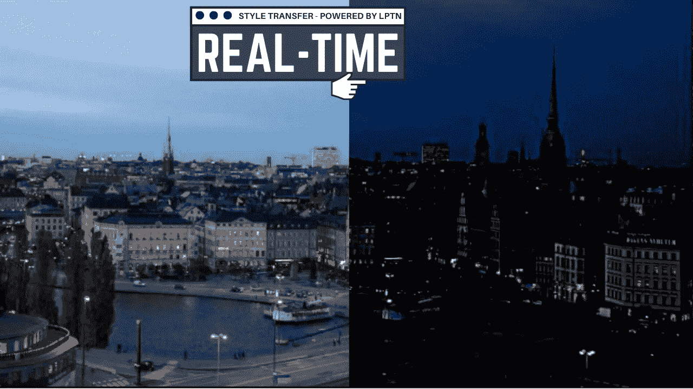
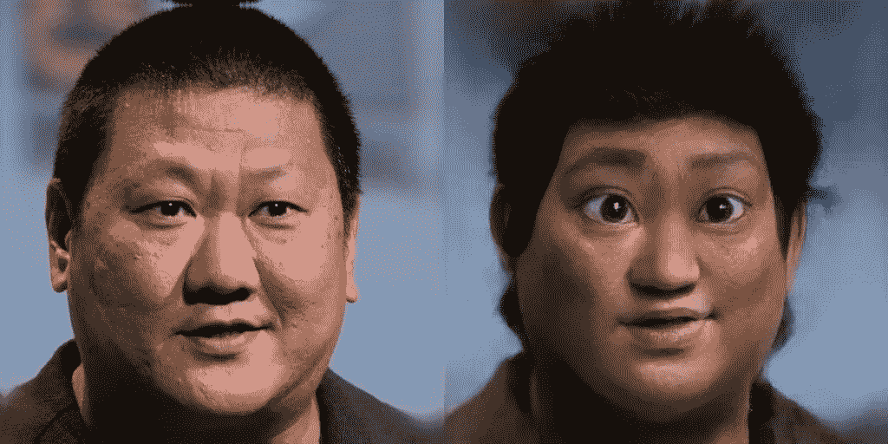
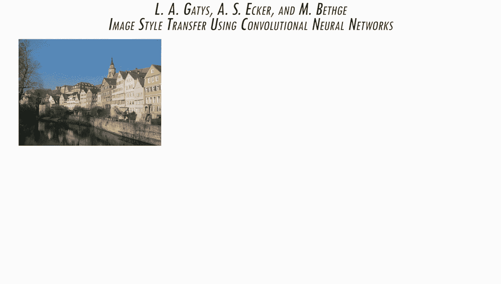
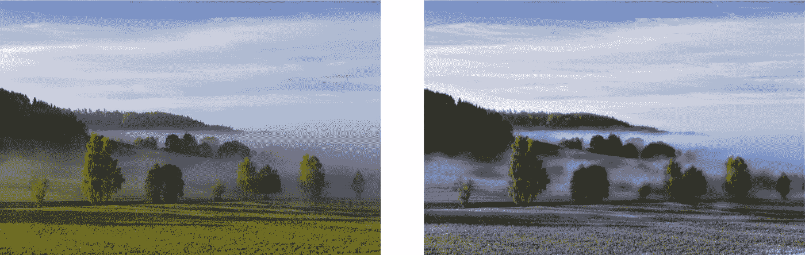
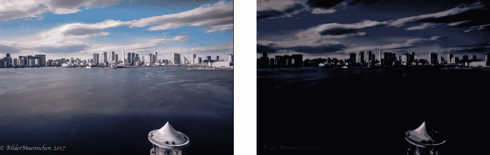
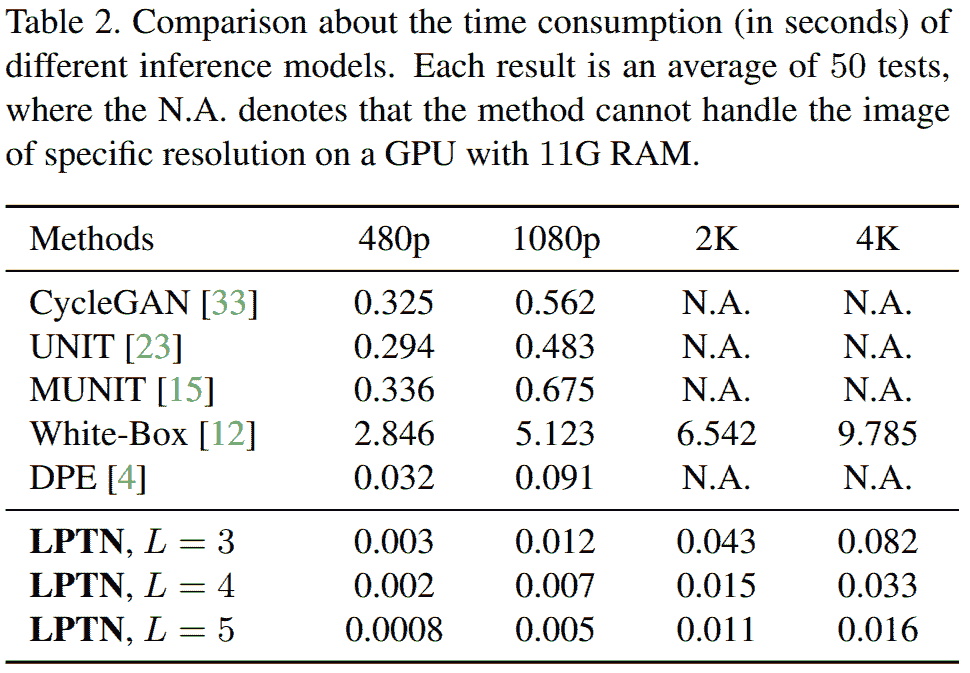
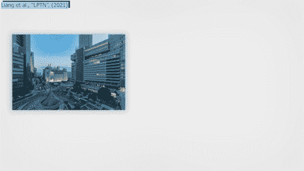
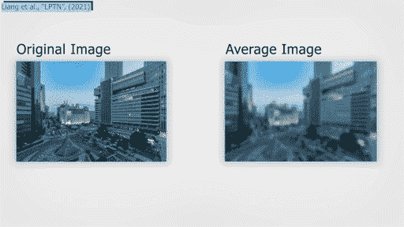
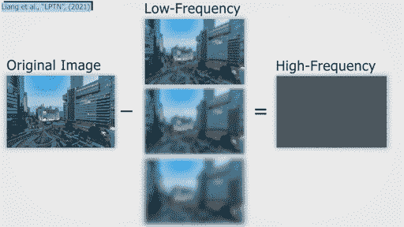
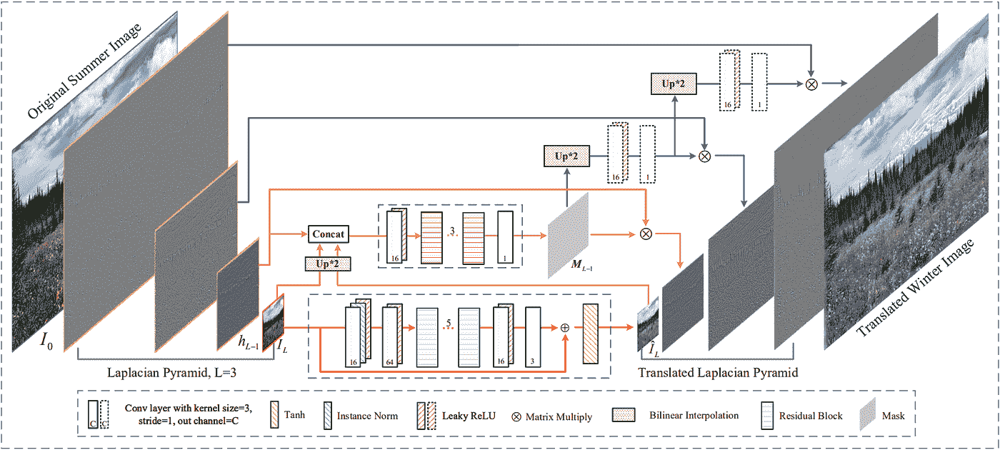

# 实时高分辨率真实感图像翻译

> 原文：<https://pub.towardsai.net/computer-vision-fe47a52e76a5?source=collection_archive---------1----------------------->

## [计算机视觉](https://towardsai.net/p/category/computer-vision)

使用这种基于机器学习的新方法，实时将任何风格应用到您的 4K 图像中！

> *原载于*[*louisbouchard . ai*](https://www.louisbouchard.ai/4k-image-translation-in-real-time/)*，前两天看了我的博客***！**

*你们都看过这种把一个人的脸“卡通化”成动漫角色的图片。*

**

*你们中的许多人一定见过像这样的其他类型的图像变换，其中图像被改变以遵循某个艺术家的风格。*

**

*风格转移示例*

*在这里，一个更具挑战性的任务可能是这样的，一幅图像被转换成一天中的另一个季节或时间。*

***

论文的结果。(上)夏至冬翻译和(下)昼至夜翻译。梁等，2021* 

*你还没有看到的是产生这些结果所需要的时间和产生的图片的实际分辨率。这篇新论文对此完全透明，因为它正是针对这个问题。事实上，与大多数方法相比，他们可以翻译高清 4K 图像，而且是实时完成的。在这项工作中，他们展示了他们在季节翻译、昼夜翻译和照片润饰方面的成果，这些你已经在上面看到了。这项任务也被称为“图像到图像的翻译”，你在这里看到的所有结果都是在 4K 制作的。当然，这里的图像是从他们的论文中截取的，所以这里看起来可能没有那么高质量。如果你不相信，请看看[他们的论文](https://export.arxiv.org/pdf/2105.09188.pdf)或者试试[他们的](https://github.com/csjliang/LPTN)代码！*

*这些是这篇论文最惊人的结果:*

**

*在这里，你可以看到他们的技术称为 LPTN，代表拉普拉斯金字塔翻译网络。看看 LPTN 花了多少时间来制作图像翻译，而大多数方法甚至做不到这一点，因为这种定义量对计算要求太高。是的，这是以秒为单位的。他们可以使用一个普通的 GPU 在不到十分之一秒的时间内翻译 4K 图像。在 480p 图像翻译上，它比所有这些方法都要快！而且没错，不是 8 倍快，而是平均 80 倍快！但这怎么可能呢？他们怎么能如此高效，却仍然能产生惊人的高质量的结果呢？*

*这是通过优化以下事实来实现的:与图像风格相关的照明和颜色处理包含在图像的低频分量中。*

*

低频与高频图像* 

*而当将图像转换成另一种风格时，我们希望保留的内容细节可以在高频分量上自适应地细化。这就是有趣的地方。这两个组件可以分成两个任务，由 GPU 同时执行。事实上，他们将图像分成低分辨率和高分辨率分量，使用网络来处理图像的低频或风格的信息，并呈现将这种处理的风格与细化的高频分量合并的最终图像，高频分量是图像的细节，但由较小的子网络进行调整以适应新的风格。从而避免了在整个网络中处理高分辨率分量时不可避免的大量计算消耗。这是一个由来已久的研究领域，通过一种叫做拉普拉斯金字塔的流行技术实现。这种拉普拉斯金字塔方法的主要思想是将图像分解成高频和低频部分，然后进行重建。*

**

*首先，我们生成初始图像的平均值，使其模糊并去除高频成分。*

*

平均过程。* 

*这是通过使用一个内核来完成的，该内核遍历整个图像，将一批批像素四舍五入在一起。例如，如果他们采用一个 3 乘 3 的内核，它将遍历整个图像，对 3 乘 3 的补丁进行平均，删除所有唯一值。他们基本上是通过柔化边缘来模糊图像。*

*

低频与高频图像* 

*然后，保存该模糊图像和初始图像之间的差异，以在算法结束时用于重新引入细节，这些细节是高频分量。这重复三次，越来越大的平均核产生越来越小的图像低频版本，具有越来越少的高频细节。*

*如果你还记得的话，这些图像的低频版本包含了图像中颜色和光照的信息。事实上，它们基本上只是我们图像的模糊低质量版本，这就是为什么该模型如此高效的原因。这很方便，因为它们是图像的较小版本，这正是我们在将图像转换成另一种样式时试图改变的信息。*

*

输入图像变换步骤。* 

*意味着使用这些低频版本比直接使用整个图像的计算效率要高得多，但它们也专注于图像中我们想要改变的信息，这就是为什么结果如此之大。*

**

*全 LPTN 网络。梁等，2021*

*这种低质量版本的图像可以使用编码器-解码器轻松转换，就像我们之前提到的任何其他图像转换技术一样，但由于它是在低质量图像和小得多的图像上完成的，因此处理速度会快很多。最好的事情是，结果的质量仅取决于最初保存的作为输入发送的图像的高频版本，其不在整个网络中被处理。该高频信息在处理结束时简单地与低频图像合并，以改善细节。基本上，它快得多，因为研究人员将图像的信息分成两部分:低频一般信息和详细的高频信息。然后，他们只发送图像中有利于计算的部分，这正是我们想要转换的，图像的模糊、低质量的总体风格，或者换句话说:低频信息。然后，仅对图像的高频部分进行快速和直接的变换，以调整它们的大小，并将它们与模糊的新风格化图像合并，通过在图片的所有边缘添加细节来改善结果。*

*瞧！您只需要很少的时间和计算能力就可以得到结果。这太棒了，如果你想尝试的话，代码是公开的，这总是很酷！*

*感谢您的阅读！*

# *观看视频*

*来我们的 [**Discord 社区与我们聊天:** **一起学习 AI**](https://discord.gg/learnaitogether)和*分享你的项目、论文、最佳课程、寻找 Kaggle 队友等等！**

*如果你喜欢我的工作，并想与人工智能保持同步，你绝对应该关注我的其他社交媒体账户( [LinkedIn](https://www.linkedin.com/in/whats-ai/) ， [Twitter](https://twitter.com/Whats_AI) )，并订阅我的每周人工智能 [**简讯**](http://eepurl.com/huGLT5) ！*

## *支持我:*

*   *支持我的最好方式是成为这个网站的成员，或者如果你喜欢视频格式，在[**YouTube**](https://www.youtube.com/channel/UCUzGQrN-lyyc0BWTYoJM_Sg)**上订阅我的频道。***
*   ***在经济上支持我在 [**Patreon**](https://www.patreon.com/whatsai) **的工作。*****
*   ***跟随我在这里的媒介。***

## ***参考***

*   ***梁，解，曾，惠，张，雷，(2021)，“高分辨率真实感图像实时翻译:拉普拉斯金字塔翻译网络”，[，](https://export.arxiv.org/pdf/2105.09188.pdf)***
*   ***代号:【https://github.com/csjliang/LPTN ***