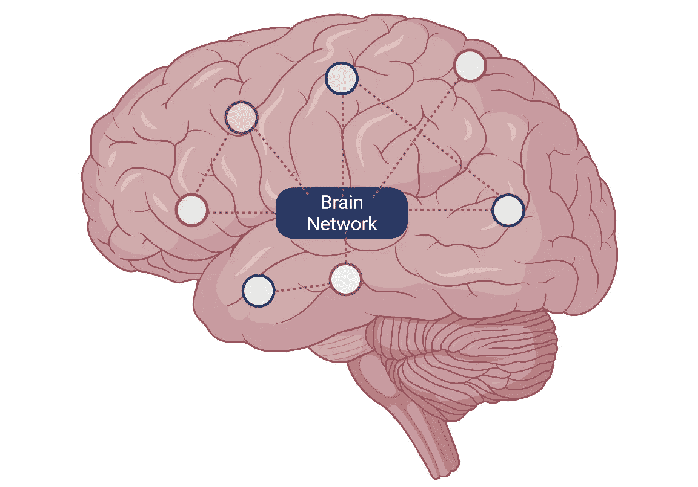
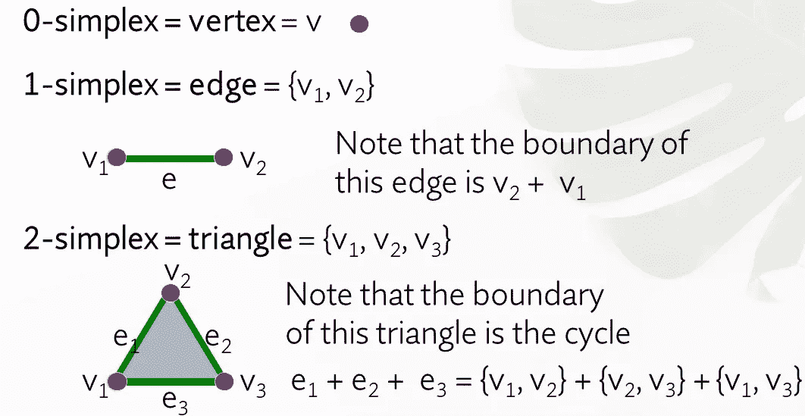
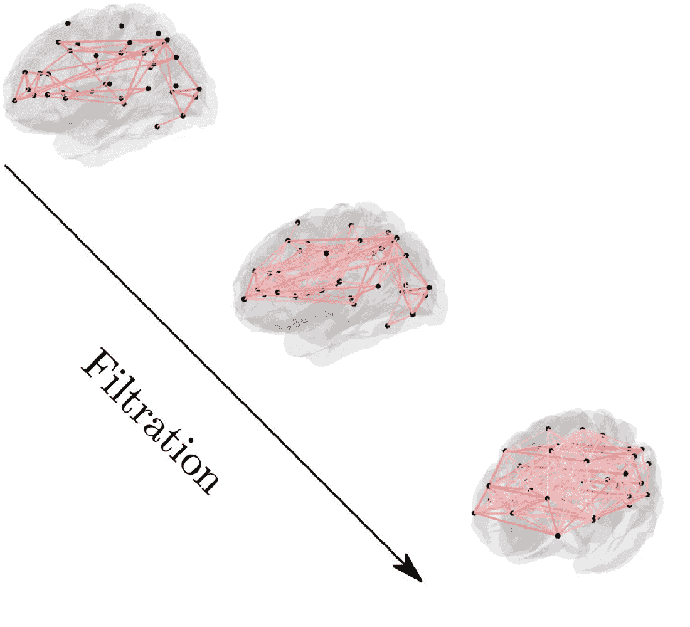
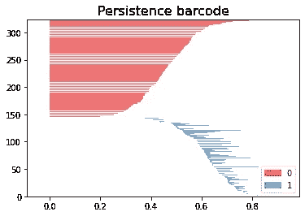
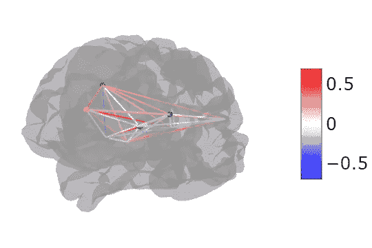
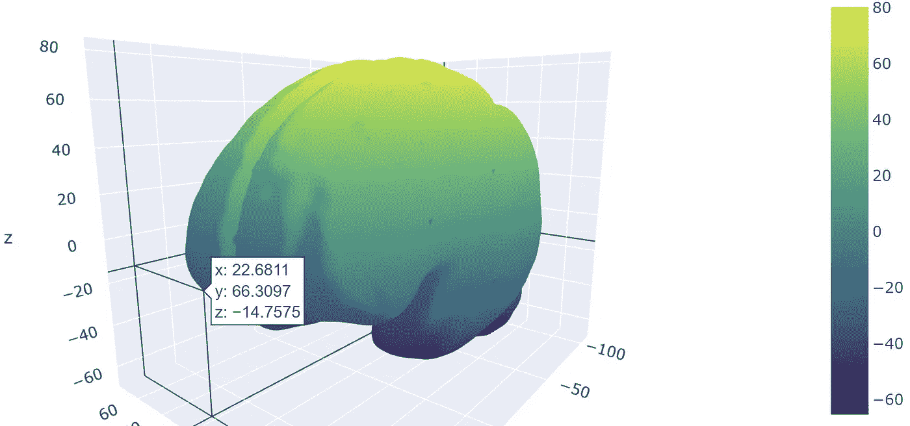
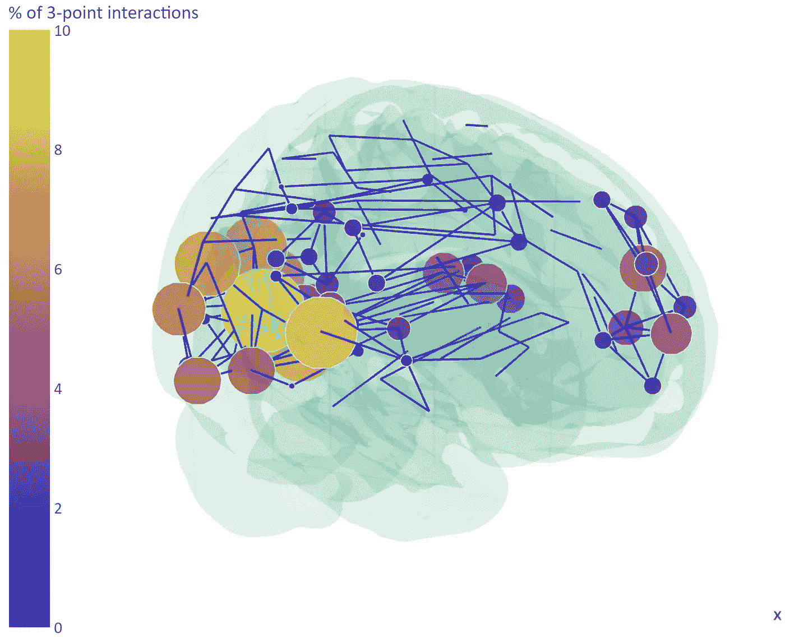

# 大脑拓扑数据分析的计算和可视化

> 原文：<https://pub.towardsai.net/computing-and-visualizing-brain-topological-data-analysis-511635158ae2?source=collection_archive---------1----------------------->

超越大脑连通性的成对网络分析


演职员表:来自 www.pexels.com 的龟背竹

**古迪帕德瓦**是一些印度少数民族庆祝传统新年(尽管是在春天)的节日。它也是一个由 [INRIA](https://www.inria.fr/en) 单元开发的用于计算拓扑和拓扑数据分析(TDA)的开源[库](https://gudhi.inria.fr/)(实际上 GUDHI 是更高维度中*几何理解*的首字母缩写，最后 3 个字母交换为 *)* 。它提供了几种算法来构造多种类型的单纯复形，以及表示它们的数据结构。它是用 C++编写的，通过 Cython 用 Python 包装。鉴于自然界中许多类型的数据和结构中互连图的性质，这种表示方式正引起越来越多的兴趣。TDA 是二十世纪初从应用代数拓扑和计算几何中出现的一个新领域。为了理解为什么这在计算神经科学中很重要，我们首先需要修正什么是*连接体。*

连接体是大脑的图形/网络表示，其中一个节点是大脑区域，边是结构连接的表示或大脑活动的相关性强度。我们在第一种情况下谈论*结构连接体*，在后一种情况下谈论*功能连接体*。



大脑连接体。来源:图片由作者用 Biorender 创建。

成千上万的研究人员已经使用这种表示法来提取生物标记或研究大脑的内在方面。

它允许识别本地网络的差异或使用将网络的重要方面总结为[隔离和整合](https://www.sciencedirect.com/science/article/abs/pii/S105381190901074X?via%3Dihub)的指标。然而，为了捕捉区域(节点)之间的高阶相互作用，我们需要从成对的网络度量转移到单纯的复合体。

单纯复形是由点、线段、三角形及其 n 维对应物组成的集合。0-单形是顶点，1-单形是连接 2 个节点的边，2-单形是三角形，以此类推。



单纯复元素。来源:图片由作者提供。

# 持久同源性

持久同调是一种在各种空间分辨率下计算空间(在网络的离散情况下)拓扑属性的技术。为了确定是否有同源类通过几次过滤“持续存在”,持续同源记录了在过滤过程中进化的单纯复合物中循环的出现。



大脑网络的过滤示例

更正式地说，这是通过条形码(持久性图)可视化的。这是带有 Gudhi 的持久性条形码的结果:



用 Gudhi 生成的图像。来源:图片由作者提供。

假设我们已经以邻接矩阵的形式加载了大脑连接体，这是获得上图的代码:

```
import gudhi
import numpy as np
matrix = np.genfromtxt(‘Connectome.txt’)
mattop = 1 — matrix# Computing and plotting barcode
rips_complex = gudhi.RipsComplex(distance_matrix=mattop, max_edge_length=1)
simplex_tree = rips_complex.create_simplex_tree(max_dimension=2)
diag = simplex_tree.persistence()
gudhi.plot_persistence_barcode(diag, legend=True, max_intervals=0)
```

使用 Gudhi 的一个重要步骤是，在相关矩阵(来自功能连接)或纤维束连接强度(来自结构连接)的情况下，我们需要将一切转换为距离。

其他拓扑度量是贝蒂数、欧拉特征和曲率。贝蒂数 *β* 统计给定单纯复形中的 *k* 维洞的数量。而欧拉特征由表达式 V-E+F(顶点数和面数减去边数)给出，考虑了多面体的单纯复形拓扑。

```
from gudhi import PeriodicCubicalComplex as pcc 
cc = pcc(dimensions=[3],  top_dimensional_cells= [0, 1, 0],  periodic_dimensions=[True]) 
bettival = cc.betti_numbers()
```

# 大脑 TDA 可视化

获得 TDA 度量的图形度量是有用的。然而，将这些值直接可视化(可能覆盖在大脑网格上)肯定更有帮助。

一般来说，从事大脑连通性工作的人使用基于 Matlab 的可视化工具，如 [BrainNetViewer](https://www.nitrc.org/projects/bnv/#:~:text=BrainNet%20Viewer%20is%20a%20brain,%2C%20easy%2C%20and%20flexible%20way.) 、 [Brainnetome Toolkit](http://www.brainnetome.org/) ，以及其他基于 VTK 或 [MRTRIX](https://mrtrix.readthedocs.io/en/latest/quantitative_structural_connectivity/connectome_tool.html) 的可视化工具。

最近， [Nilearn](https://nilearn.github.io/stable/index.html) visualizer 和 [Plotly](https://plotly.com/) 为基础的可视化有了很大的改进。Plotly 是一个 Python 框架，提供绘图、分析和统计。它旨在集成到 web 应用程序中，例如通过使用相关工具 [Dash](https://plotly.com/dash/) 。Nilearn 是一个专注于脑成像的统计 Python 库。我个人发现 Nilearn 的默认玻璃大脑可视化在美学上确实没有吸引力，但 *view_connectome* 函数反而在某种程度上令人满意。以下是假设您以 3D 形式加载节点坐标(例如，来自大脑图谱)和矩阵形式的连接性值的结果。我从来没有深入研究过，但我相信这种可视化是用在类似 Plotly 的东西下面。

```
import pandas as pd
from nilearn import plotting# Brain atlas centroids
coords = pd.read_csv("coords.txt", header=None)
# Adjacency matrix (brain connectivity)
connectome = pd.read_csv("Conn_mat.txt", header=None)
plotting.view_connectome(connectome.values, coords.values, linewidth=5.0, node_size=5.0)
```



从上面的代码中学习输出。来源:图片由作者提供。

或者，使用 Plotly 可以加载网格，然后将 3D 图形作为散点图覆盖:

```
import meshio
import plotly.graph_objs as go
from IPython.display import SVG, displaypath_brainobj = "brain.stl"
mesh_data = meshio.read(path_brainobj)fig = go.Figure()
fig.add_trace(go.Mesh3d(x=mesh_data.points[:,0],y=mesh_data.points[:, 1], z=mesh_data.points[:, 2], i=mesh_data.cells[0].data[:, 0], j=mesh_data.cells[0].data[:, 1], k=mesh_data.cells[0].data[:, 2],intensity=mesh_data.points[:, 2], colorscale='Viridis'))fig.show()
```



上面代码的 Plotly 输出。来源:图片由作者提供。

有了这些工具，我们现在就可以从单纯复合体中绘制成对连通性度量和高阶特征了。Plotly 还可以同时绘制多个元素。每个元素称为一个“痕迹”。例如，一个轨迹可以是大脑网格，另一个轨迹可以是对集团的参与(作为散点图，给出来自图谱的区域的质心)，另一个轨迹可以是单纯形的边。

```
#Brain mesh from file
brain_trace =go.Mesh3d(x=mesh_data.points[:,0],y=mesh_data.points[:, 1],z=mesh_data.points[:, 2],i=mesh_data.cells[0].data[:, 0],j=mesh_data.cells[0].data[:, 1],k=mesh_data.cells[0].data[:, 2],opacity=0.1,hoverinfo=None,showlegend = True, name ='Brain Shell' ) # sizec : clique participation per region
# x,y,z : centroids coordinate of region from an atlas
trace1 = go.Scatter3d(x=x, y=y, z=z, text=areas, mode='markers', marker=dict(sizemode='diameter', symbol='circle', showscale=True,opacity=0.85,size=10*sizec, color=colorV, colorscale=plasma,cauto=value, cmin=0, cmax=5), hoverinfo='skip',showlegend=True)# Simplex edgesfor edge in Graph.edges():
  Xed += [pos3d[edge[0]][0],pos3d[edge[1]][0], None]
  Yed += [pos3d[edge[0]][1],pos3d[edge[1]][1], None]
  Zed += [pos3d[edge[0]][2],pos3d[edge[1]][2], None]trace2 = go.Scatter3d(x=Xed, y=Yed, z=Zed, mode='lines', line=dict(color='black', width=2), hoverinfo='none', showlegend=False, opacity=0.3)data = [brain_trace, trace1, trace2]
go.Figure(data=data)
```



从上面的代码 Plotly 图形。来源:图片由作者提供。

# 结论

TDA 是分析数据和创建新的生物标记的进一步工具，因为它们捕捉节点之间更高级别的相互作用。很难说这些是真的有用还是多余。过去一直假设大部分[脑网络测度可以归结为程度分析，剩下的大多是摆设](https://www.nature.com/articles/ncomms13812)。

从可视化的角度来看。直接为网络神经科学打造的工具，大概比 Plotly 更友好。鉴于人们对使用机器学习工具(如 Scikit-learn、Scikit-TDA、Gudhi、Tensorflow 等)的兴趣越来越大，如果提供编码技能，像 Nilearn 或 Plotly 这样的集成可视化也将非常有用。

# 如果你想连接


[@ Dr _ Alex _ 克里米](https://twitter.com/Dr_Alex_Crimi)


[@阿列克里米博士](https://www.instagram.com/dr.alecrimi/)


亚历山德罗·克里米——YouTube


[亚历克斯·亚乌·克里米](https://www.facebook.com/alexyawcrimi)