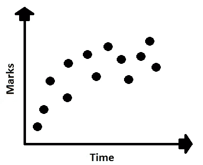
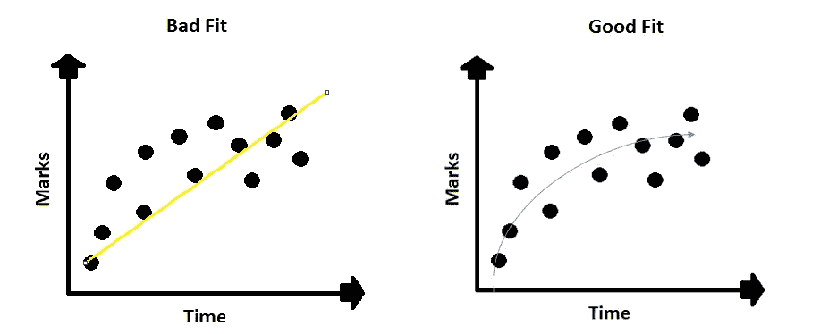
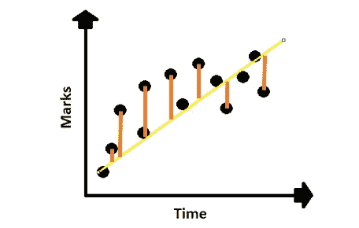
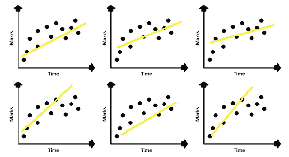

# 数据集中偏差和方差的概念

> 原文：<https://pub.towardsai.net/concepts-of-bias-and-variance-in-dataset-aa119ccd2118?source=collection_archive---------4----------------------->

## [机器学习](https://towardsai.net/p/category/machine-learning)，[统计](https://towardsai.net/p/category/statistics)

## 对数据科学中使用的定义有基本的理解

由[约书亚·赫内](https://unsplash.com/@mrthetrain?utm_source=medium&utm_medium=referral)在 [Unsplash](https://unsplash.com?utm_source=medium&utm_medium=referral) 拍摄的照片

现在的数据科学有志芽都是直接用模型和算法，不知道那么多概念。本文背后的主要思想是获得数据科学中的一些基本概念。

在对我们的算法建模之前，我们需要了解我们的数据是什么样子的。它不应该是欠拟合，过度拟合，以便我们可以减少一个良好的拟合残留。

对于机器学习模型，数据集需要分为训练集和测试集。

我们有关于时间和标记的数据，它们之间的关系如下所示。

数据集的数据点

## ***偏置***

当我们用一条非常适合的线进行预测时，它会通过遍历数据点来生成一条预测线，如图所示。对于我们的数据，该线试图拟合具有最小 RMS 值的最佳位置，即均方根。下图显示了黄线是拟合良好的线，预测线和数据点之间的差异是残差值。我们计算剩余值的总和，并对它们求平方，这样负值就不会平衡正值。为了获得最佳拟合线，我们需要最小化误差，即平方值之和应该最小。但是如果我们看到直线不是最佳拟合线，而是良好拟合的曲线。

不适合和适合的观点。作者照片

预测值和实际值之间的残差

拟合线是试图达到最佳拟合。

## ***差异***

另一方面，方差也被认为是坏的模型拟合。当数据分为训练集和测试集时，训练集的低偏差对于好的模型来说是不够的。我们还需要用测试集来检查最佳拟合，有时它并没有给出最佳拟合。训练数据和测试数据之间的差异称为方差。

## **结论:**

训练数据可以给出对训练集的最佳拟合或真实拟合的低偏差，并给出测试集中的高可变性。因此，在我们的模型中，它可能是过度拟合的。

良好模型—低偏差和低方差

欠拟合—高偏差和低方差

过拟合—低偏差和高方差

我希望你喜欢这篇文章。通过我的 [LinkedIn](https://www.linkedin.com/in/data-scientist-95040a1ab/) 和 [twitter](https://twitter.com/amitprius) 联系我。

# 推荐文章

1.[Python 最有用的 15 个 NumPy 方法](/15-most-usable-numpy-methods-with-python-4d20eb93e149?sk=911d2bebf042b148be8f366b907af158)
2。 [NumPy:图像上的线性代数](/numpy-linear-algebra-on-images-ed3180978cdb?source=friends_link&sk=d9afa4a1206971f9b1f64862f6291ac0)
3。[Python 中的异常处理概念](/exception-handling-concepts-in-python-4d5116decac3?source=friends_link&sk=a0ed49d9fdeaa67925eac34ecb55ea30)
4。[熊猫:处理分类数据](/pandas-dealing-with-categorical-data-7547305582ff?source=friends_link&sk=11c6809f6623dd4f6dd74d43727297cf)
5。[超参数:机器学习中的 RandomSeachCV 和 GridSearchCV](/hyper-parameters-randomseachcv-and-gridsearchcv-in-machine-learning-b7d091cf56f4?source=friends_link&sk=cab337083fb09601114a6e466ec59689)
6。[用 Python 充分解释了线性回归](https://medium.com/towards-artificial-intelligence/fully-explained-linear-regression-with-python-fe2b313f32f3?source=friends_link&sk=53c91a2a51347ec2d93f8222c0e06402)
7。[用 Python](https://medium.com/towards-artificial-intelligence/fully-explained-logistic-regression-with-python-f4a16413ddcd?source=friends_link&sk=528181f15a44e48ea38fdd9579241a78)
充分解释了 Logistic 回归 8。[使用 Numpy 与 Python](/data-distribution-using-numpy-with-python-3b64aae6f9d6?source=friends_link&sk=809e75802cbd25ddceb5f0f6496c9803)
9 进行数据分发。[Python 中 40 个最疯狂可用的方法](https://medium.com/pythoneers/40-most-insanely-usable-methods-in-python-a983c78f5bfd?sk=07df9058ea3e8c2fce4318a73cd8fce9)
10。[Python 中最常用的 20 种熊猫快捷方式](https://medium.com/pythoneers/20-most-usable-pandas-shortcut-methods-in-python-c9bc065ce11e?sk=1faf673d0cdfb46234975cbdeed12beb)