# 条件概率和贝叶斯定理浅释

> 原文：<https://pub.towardsai.net/conditional-probability-and-bayes-theorem-simply-explained-788a6361f333?source=collection_archive---------0----------------------->

## 条件概率和贝叶斯定理的简单直观的解释。

埃尔佩佩在 [Unsplash](https://unsplash.com?utm_source=medium&utm_medium=referral) 上拍摄的照片

# 介绍

条件概率和贝叶斯定理是统计学中的基本概念，即使是外行也听说过。贝叶斯定理还产生了统计学的一个独立分支，即 [**贝叶斯推断**](https://en.wikipedia.org/wiki/Bayesian_inference) 。

在数据科学中，我们主要是在一个 [**频繁主义者**](https://en.wikipedia.org/wiki/Frequentist_inference) 的世界中交易和工作，所以在我看来，我们并没有完全意识到贝叶斯原理。

在我的下一组文章中，我希望涵盖贝叶斯统计中的一些主题，以进一步加深我的理解，并以可理解的格式传达它！

在本帖中，我们将涉及贝叶斯统计中的两个核心思想:**条件概率**和**贝叶斯定理**。

# 边缘概率

第一步是定义 [**边际概率**](https://en.wikipedia.org/wiki/Marginal_distribution) **。**我发现它往往过于复杂，而实际上这是一个非常简单的概念。

边际概率是大多数人说/指概率时的意思。它只是某个事件发生的概率。比如硬币上翻转一个头像的边际概率， ***P(H)*** ，简单来说就是 **0.5** :

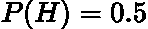

作者在 LaTeX 中生成的方程。

从一副牌中抽出一张钻石， ***P(D)*** 的边际概率是 **0.25** :

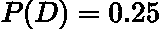

作者在 LaTeX 中生成的方程。

真的就这么简单！

# 联合概率

再进一步，翻两个头的概率是多少？这被称为 [**联合概率**](https://en.wikipedia.org/wiki/Joint_probability_distribution) ，因为它将两个事件连接在一起。

要解决这个问题，我们可以只列出抛两个硬币时可能出现的结果:***【H，H}、{H，T}、{T，H}、{T，T}*** 。所以翻两个头的概率是 **0.25** :

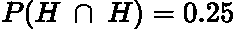

作者在 LaTeX 中生成的方程。

其中 **∩** 为交集符号，本质上翻译为‘and’。所以，上面的等式是在问正面和正面都为真的概率是多少。

> 在这种情况下，联合概率等于两个边际概率的乘积，因为两个事件(掷硬币)是独立的(一个掷硬币的效果不影响另一个掷硬币的结果)。

另一个重要的性质是联合概率是可交换的，这意味着:

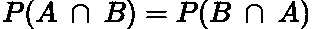

作者在 LaTeX 中生成的方程。

这在我们推导贝叶斯定理的时候会很有用！

# 条件概率

[**条件概率**](https://en.wikipedia.org/wiki/Conditional_probability) 是我们确定‘给定’某种条件/事件发生的概率。一个例子可以更好地解释这一点:

假设 我们选择了一张红色的牌，从一副牌中挑选 3 颗钻石的概率是多少？

好吧，选到方块 3 的概率，***【P(3D)***，是:

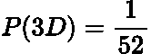

作者在 LaTeX 中生成的方程。

而选择红卡的概率， ***P(R)，*** 为:

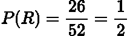

作者在 LaTeX 中生成的方程。

因此，假设我们有一张红牌，***【P(3D | R)***，选择 3 张方块的概率是:

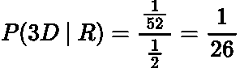

作者在 LaTeX 中生成的方程。

另一种思考方式是:给定所有的红卡，选择 3 方块的几率有多大？我们基本上有一个子集的数据，我们从中选择 3 颗钻石。

两个事件 ***A*** 和 ***B*** 的官方数学定义是:

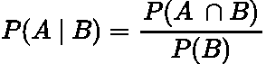

作者在 LaTeX 中生成的方程。

所以，在我们的例子中我们有 ***P(A) = P(3D)*** 和 ***P(B) = P(R)*** 。可以看到，通过将这些概率代入上述等式，我们得到了上述 ***1/26*** 的概率。

# 贝叶斯定理

重新排列我们得到的条件概率方程:

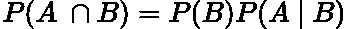

作者在 LaTeX 中生成的方程。

然后再次代入条件公式(记住联合分布是可交换的):

作者在 LaTeX 中生成的方程。

然后重新排列:

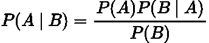

作者在 LaTeX 中生成的方程。

也就是[**贝叶斯定理**](https://en.wikipedia.org/wiki/Bayes%27_theorem) **！**

这个定理可以分解如下:

*   ***【P(A)***被称为**先验**，这是我们在观察我们的数据之前所相信的概率。这是这一事件的边际概率。
*   ***P(B)*** 是观察到**数据/事件自行**的概率。这是这一事件的边际概率。它有时被称为**归一化常数。**
*   ***P(B| A)*** 是给定我们‘相信’的东西的概率，也就是所谓的**可能性。**
*   ***P(A | B)*** 是 [**后验**](https://en.wikipedia.org/wiki/Posterior_probability) 也就是我们观察我们的数据后，我们‘相信’的概率。

这现在看起来有点武断，但是我们将通过一个例子来使这个理论更加具体。

# 全概率定律

我们要讨论的最后一个公式是[**全概率定律**](https://en.wikipedia.org/wiki/Law_of_total_probability) **y:**

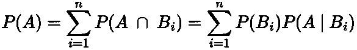

作者在 LaTeX 中生成的方程。

人们可以用两种不同的方式来考虑这个总和:

*   所有重叠区域的总和 ***A*** 覆盖 ***B*** 。
*   ***A*** 对 ***B*** 的加权平均值

这里链接了一个很棒的 [Stat 交换线程](https://math.stackexchange.com/questions/1125413/law-of-total-probability-explanation)惊人地解释了这个公式的直觉！

# 例子

现在，我们将通过一个示例问题来了解贝叶斯定理的应用！

假设我有两副牌:一副是普通牌， ***D_1*** ，另一副是只有红色牌(方块和红心)的牌， ***D_2*** 。

我随机选择一副牌，抽出方块 3(***3D***)。这张方块 3 来自普通牌组( ***D_1*** )的概率有多大？

让我们从陈述随机选择第 1 张牌、 ***P(D_1)*** 或第 2 张牌、 ***P(D_2)的先验概率开始。*** 这个就是简单的 50–50，因为它是随机的:

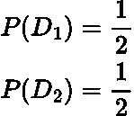

作者在 LaTeX 中生成的方程。

现在让我们来计算可能性:

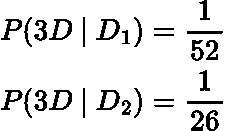

作者在 LaTeX 中生成的方程。

第二副牌只有红色的牌，因此只有 26 张牌，方块 3 是其中之一。

然后，我们利用全概率定律计算观察到方块 3 的概率:

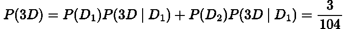

作者在 LaTeX 中生成的方程。

使用贝叶斯定理将这些结合在一起:

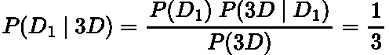

作者在 LaTeX 中生成的方程。

也就是从第一副牌中抽出方块 3 的概率！

> 直觉上，这种概率是合理的，因为我们从第二副牌中选择方块 3 的可能性是第一副牌的两倍。

# 结论

在本文中，我们逐步了解了条件概率和贝叶斯定理的概念:

*   边际概率是事件刚刚发生的概率
*   联合概率是两个事件发生的概率
*   条件概率是一个事件发生的概率，假设另一个事件已经发生
*   贝叶斯定理是条件概率公式的一个替代版本，其中我们有一些先验信息来计算事件的条件概率。

# 和我联系！

*   要在媒体上阅读无限的故事，请务必在此注册！T3*💜*
*   [*当我在这里发布注册邮件通知时，可以获得更新！*](/subscribe/@egorhowell) 😀
*   [*领英*](https://www.linkedin.com/in/egor-howell-092a721b3/) 👔
*   [*推特*](https://twitter.com/EgorHowell) 🖊
*   [*github*](https://github.com/egorhowell)*🖥*
*   ***🏅***

> ***(所有表情符号由 [OpenMoji](https://openmoji.org/) 设计——开源表情符号和图标项目。许可证: [CC BY-SA 4.0](https://creativecommons.org/licenses/by-sa/4.0/#)***