# 条件故事生成—第 1 部分

> 原文：<https://pub.towardsai.net/conditional-story-generation-part-1-6a5a16a63744?source=collection_archive---------2----------------------->

## [自然语言处理](https://towardsai.net/p/category/nlp)

## ***帮助故事作者用文字生成***

图片由[安民](https://www.pexels.com/it-it/@minan1398?utm_content=attributionCopyText&utm_medium=referral&utm_source=pexels)从[像素](https://www.pexels.com/it-it/foto/arte-attrezzatura-business-classico-1448709/?utm_content=attributionCopyText&utm_medium=referral&utm_source=pexels)

自然语言处理(NLP)是一个非常复杂的领域，由两个主要分支组成:自然语言理解(NLU)和自然语言生成(NLG)。如果我们在谈论一个学习英语的孩子，我们会简单地称他们为阅读和写作。在 NLP 工作是一个令人兴奋的时刻:2017 年推出的变形金刚模型极大地提高了性能，今年早些时候发布的看似全能的[GPT-3 带来了一波](https://www.lesswrong.com/posts/6Hee7w2paEzHsD6mn/collection-of-gpt-3-results)[兴奋](https://www.forbes.com/sites/bernardmarr/2020/10/05/what-is-gpt-3-and-why-is-it-revolutionizing-artificial-intelligence/?sh=8af7b5e481ad)。我们稍后会详细讨论这些。

首先，一个简单但有力的认识:写作并不容易。作者经常陷入寻找单词的完美组合的困境，一遍又一遍地阅读同一个句子，直到单词本身不再有意义；或者只是用尽了想法，像机关枪一样写作，直到有些东西卡住了，留下我们盯着空白的纸，好像我们突然忘记了我们想说的话，想知道一分钟前文字是如何如此毫不费力地流动的。

像[语法](https://www.grammarly.com/)这样的软件负责语法方面；我们希望帮助创作努力，从已经写好的无数故事中提供灵感，给出提示，帮助作者的想法发展成一个美丽的故事。

> “我们应该互相讲述故事”~尼尔·盖曼

为了开发真正有用的东西，我们首先必须研究、学习和理解写一个故事意味着什么以及它需要什么。我写这篇文章是为了与您分享我们到目前为止学到的东西，帮助其他有兴趣跟随我们脚步的人，并为那些有兴趣在自然语言生成和故事写作的浩瀚海洋中导航而不迷失方向的人提供一个起点。

要查看我们在相关主题上所做的工作，通过个性化插图帮助儿童书籍变得更加身临其境，请查看我们之前的文章。

# **自然语言生成简史:从 n-grams 到变形金刚**

*(尽管我尽了最大努力让它对读者友好，但这部分有点技术性——如果你不关心它是如何工作的，或者想先看看结果，可以直接跳到最后的“魔法在行动”部分)*

一个模型是如何生成文本的？一个模型必须先经过*训练*，而要训练，需要大量的例子(语料库)来学习。支持无监督训练的模型常用的语料库有 [BookCorpus](https://yknzhu.wixsite.com/mbweb) (由 16 种不同流派的 11038 本未出版书籍组成的数据集)、维基百科的文章，以及来自 web 的 web crawls 如 [CommonCrawl](https://commoncrawl.org/) 。即使拥有巨大的计算能力，也需要几天甚至几周的时间来学习单词之间的相关性，即概率的统计分布，这些概率将单词联系在一起并赋予它们整体意义。最重要的是，最终算法的“推理”将基于给定的文本，因此仔细选择它非常重要，因为在两个不同的文本语料库上训练的相同模型最终会给出非常不同的结果。但是，我们不要急于求成，看看我们是如何做到这一点的。

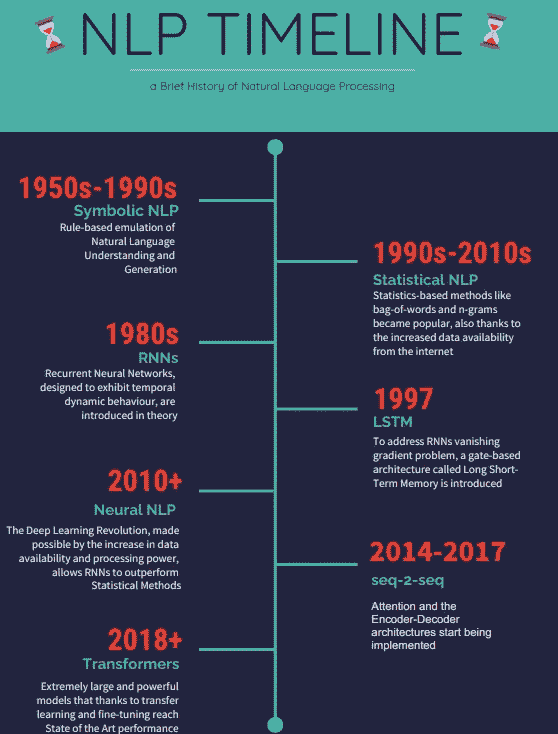

来自[venengage](https://infograph.venngage.com)的模板

## **统计模型**

NLP 的一个最简单的方法，称为词袋，利用每个词的出现次数作为文本分类和其他任务的特征。然而，单词出现的次数并不保留其他相关信息，例如每个单词在句子中的位置及其与其他单词的关系。因此，它不适合文本生成。

N 元模型解决了这个问题:我们不是计算单词的出现次数，而是计算 N 个连续单词的出现次数。一旦 N-gram 被计数，生成文本只是一个简单的统计问题:给定文本中最新的 N-1 个单词，下一个最有可能是什么？这可以反复应用，直到一个完整的句子、段落或一本书完成。为 N 选择一个较高的数字会产生一个更精确的模型，但也更有可能只是在语料库的文本中复制别人写的东西。

> **n-grams 示例**
> 
> ***句子:*** *【你好媒体读者】*
> 
> ***1-克:*** *(你好)，(中等)，(读者)*
> 
> ***2-克:*** *(你好，中等)，(中等，读者)*

选择下面的单词可以通过贪婪的方式(总是选择最有可能的一个)或通过抽样(根据概率分布在最有可能的单词中进行选择)。为了生成一个句子，我们可以迭代地使用这些方法中的一种，但是它经常给出次优的结果，因为最好的句子可能不仅仅是一系列最好的单词。理想情况下，我们会尝试每一种可能的单词组合，并找到最好的一个，但这并不省时。一个很好的中间解决方案是波束搜索:同时探索最有希望的路径中的多条路径(用户可以选择数量)，只有在句子结束时，得分最高的路径才会被选择，从而避免局部最小值。

这最后一种方法似乎特别有助于向人类作家呈现不同的可能性:要么提出他以前没有考虑过的新想法，要么建议用其他方式来表达他已经写好的东西。

## **深度学习模型:RNNs**

过去十年的深度学习革命使得使用基于神经网络的模型成为可能，能够学习比 n-gram 更复杂的单词之间的依赖关系。

早在 20 世纪 80 年代，人们发明了“简单的”[递归神经网络](https://en.wikipedia.org/wiki/Recurrent_neural_network)(程序员可能会认为它们是“for”循环神经网络)来处理文本并“记住”单词之间的依赖关系。然而，还需要 30 年才能有足够的数据和计算能力来超越统计方法。它们存在几个局限性:梯度(反向传播的基础，深度学习的核心)在长句和文档中消失或爆炸，使训练非常不稳定。

为了解决这个问题，1997 年引入了[长短期记忆](https://en.wikipedia.org/wiki/Long_short-term_memory)(以及门控循环单元)，这是一种特殊类型的 rnn，由于记忆门，它可以防止梯度消失问题，但仍然不能真正用于迁移学习(复制其他人在另一项任务中训练的模型的一部分，节省了无数的训练时间和资源)，需要为每个任务标记和专门设计的数据集。

LSTMs 是 [Seq-2-Seq](https://en.wikipedia.org/wiki/Seq2seq) 模型使用的编码器-解码器架构的基础，最初是为机器翻译开发的，它接受整个句子，并在“解码”和选择输出之前对其进行“编码”，从而产生更连贯和更明显的结果。

[注意力机制](https://medium.com/analytics-vidhya/https-medium-com-understanding-attention-mechanism-natural-language-processing-9744ab6aed6a)也被发明出来，给模型一种方法来识别输入句子的哪些部分是最相关和相互依赖的。

## **深度学习模型:变形金刚**

基于编码器-解码器架构和[注意力](https://arxiv.org/abs/1706.03762)(通常是[多头注意力](https://blogs.oracle.com/datascience/multi-head-self-attention-in-nlp)，并行运行几次注意力)，变形金刚于 2017 年问世:一个不使用 RNNs 的递归顺序处理，而是使用[位置编码](https://kazemnejad.com/blog/transformer_architecture_positional_encoding/)的模型，以“推理”每个单词的位置，并计算注意力的相关性分数(单词彼此之间的关联程度)，非常自然地将自己借给[并行化](https://en.wikipedia.org/wiki/Parallel_computing)(这意味着可以训练具有数百亿参数的模型，如变形金刚[更深入的解释可以在这里](https://www.youtube.com/watch?v=S27pHKBEp30)找到。

Transformers 的主要优势是更容易训练，并且与迁移学习非常兼容，而 LSTMs 在处理非常长或无限长的文本序列时，或者出于某种原因，您无法在大型语料库上进行预先训练时，仍然具有优势。

## **替代方法:GANs 和 VAEs**

生成对抗网络(GANs)和变分自动编码器(VAEs)在自动生成图像方面取得了巨大的成功，那么为什么它们在自然语言生成中没有得到普遍应用呢？从 RNNs 创建 GANs 提出了一个技术问题，该问题与生成的单词的选择的不可微性有关，并且因此不可能通过网络反向传播梯度，这使得很难训练它们。已经找到了这个问题的不同解决方案，例如利用 Gumbel-Softmax 近似或 [SeqGAN](https://arxiv.org/abs/1609.05473) ，利用基于随机策略的强化学习模型作为生成器，具有不同程度的成功。

虽然值得一提，但 gan 很少用于文本生成，因为它们给出的结果比变形金刚更差([这里有一个更深入的解释](https://www.reddit.com/r/MachineLearning/comments/40ldq6/generative_adversarial_networks_for_text/)为什么由它们的发明者伊恩·古德菲勒写)，所以我们不再赘述它们。

## **写故事的诸多挑战**

无数的课程教授有抱负的艺术家如何为一本书、一部电影或一场演出写一个有效的情节:要产生一个像样的结果，需要专业知识和想象力，这是自然语言生成领域的终极挑战。

一个故事有一个情节，人物，一个场景，一种基调，一种风格，冲突和解决方案。它应该让读者感到熟悉，同时又是新的和创新的；教动；启发和娱乐，同时也是迷人的。作为一个社会，我们庆祝的大多数人都是伟大的故事讲述者:从 JK 罗琳到史蒂芬斯皮尔伯格，从莎士比亚到华特·迪士尼，电影院和图书馆当然充满了这样的典范。但在不太明显的背景下也可以找到例子:营销就是讲故事，甚至像史蒂夫·乔布斯和埃隆·马斯克这样的科技企业家也拥有分享他们愿景的罕见能力，通过讲述一个关于科技和我们未来的故事来激励我们。

> **“营销不再是你做的东西，而是你讲的故事”**[**~赛斯·戈丁**](https://www.sethgodin.com/)

到目前为止，NLG 算法甚至连自己写短篇小说都很困难:它们难以理解时间和因果关系(并非巧合，在测试新的 NLP 模型时会评估这些关系)以及长期一致性(尽管《变形金刚》基于注意力的架构有助于这一点)。

为了解决这些挑战，已经提出了许多解决方案，并取得了不同程度的成功，其中包括: [RL 生成的骨架](https://arxiv.org/abs/1808.06945)来构建故事；[一个分层生成框架](https://arxiv.org/abs/1805.04833)，首先规划一个故事情节，然后基于此生成一个故事；[众包剧情图](https://www.cc.gatech.edu/~riedl/pubs/aaai13.pdf)和[以人物为中心的方法](https://ojs.aaai.org/index.php/AAAI/article/view/5536/5392)。

尽管这些模型目前有许多局限性，但我们相信，如果利用好它们的建议，以及上千本书籍和不同体裁的知识，它们会对人类作家有很大帮助。让我们专注于帮助那些在写作瓶颈中挣扎的人，要么是因为缺乏想法，要么是因为他想不出一种方式来表达他们想要的方式，并深化 NLG 的这一领域。

## **条件文本生成**

[有条件的文本生成](https://arxiv.org/pdf/1909.03409)指的是从一个语境出发并适应它而生成新文本的任务:它的语气、作者、目标、情绪、常识以及其他类似的外部因素。这意味着将大多数更高级、更有创造性的任务留给人类(我们将在下一节中看到一些例子)，但也增加了必须生成更个性化和逻辑关联的内容以达到和谐的人机交互的复杂性。

## **微调的重要性**

我们之前提到过，一个模型需要大量的例子，文本语料库来学习，那么我们如何在没有过多例子的情况下教会它一种特定的风格呢？

这就是微调发挥作用的地方:在一个新的、精选的语料库上快速重新训练一个已经预先训练好的模型，以专注于一项特定的任务。该模型已经学会了如何从更大的语料库中写作，现在调整自己的统计表示，足以产生更符合预期输出的结果。

文本的选择是至关重要的，因为不同的材料会导致非常不同的风格，我们不希望一个现代时代的故事听起来像是莎士比亚写的(见下面的例子，基于[这篇 Huggingface 文章](https://huggingface.co/blog/how-to-generate)和[这篇 Max Woolf 的博客文章](https://minimaxir.com/2019/09/howto-gpt2/))。

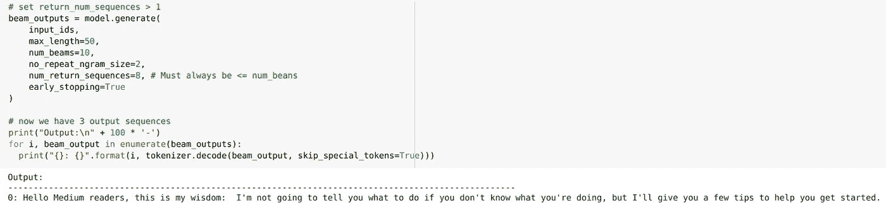

从正常的 GPT-2 模型生成的文本，带有 incipit“你好，中等读者，这是我的智慧:“(它有点小，但它是这样写的:“如果你不知道你在做什么，我不会告诉你怎么做，但我会给你一些提示来帮助你开始”)

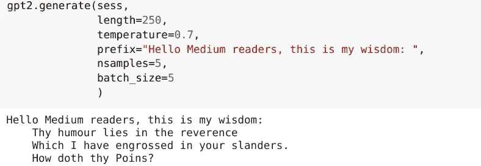

由 GPT-2 生成的文本与之前一样根据莎士比亚的作品进行了微调

如果作者有足够的材料用于自己的创作，也许可以根据他自己的风格对模型进行微调，使建议与所写的其他内容更加合拍(个性化文本生成)。替代方法可以是:根据故事的背景(例如，故事发生的时代)、主题(主题感知文本生成)或作者想要传达的情绪(情感故事生成)来微调模型。

# 魔法在行动

传说斯蒂芬·金写下一句简短却有力的句子时只有 22 岁:

> "黑衣男子穿过沙漠逃跑，持枪歹徒紧随其后."

这是一个史诗冒险的开始，一个跨越 3000 页，八卷，作者 30 多年努力的故事，被称为[黑暗之塔](https://en.wikipedia.org/wiki/The_Dark_Tower_(series))。

但是，如果金有一段时间没能写下第一句话之后的任何东西，因此决定继续前进，写点别的东西，那该怎么办呢？有多少伟大的故事想法被草草写在一张纸上，却没有机会发展成更多的东西，因为作者不知道如何继续，如何将它们培育成一个完整的故事？

这就是我们的项目出现的原因:闲聊够了，让我们看看我们已经用一些最近的算法实现了什么，以及有什么比著名的黑暗塔 incipit 更好的句子来开始？

*(完全披露:所有的例子都是经过精心挑选的，但我向你保证，生成的例子中有一半以上是有效的)*

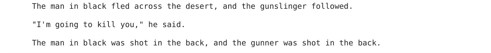

剧情转折！谁开枪打了他们？他们死了吗？新人是实际主角吗？

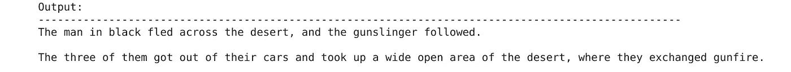

也许这本书不是以幻想世界为背景，而追逐是由汽车来完成的？为什么不呢？

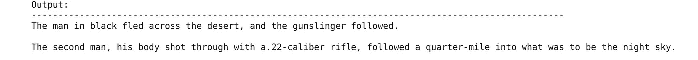

第二个人是谁？尽管中枪了，他还活着吗？

正如我们所看到的，这个模型利用了现代世界的环境，因为大多数书都是在那里发生的。让我们根据莎士比亚的作品进行微调，看看莎士比亚的风格是否更适合我们心目中的故事类型:

哇，太好了！色系家伙的想法让我想起了[落水狗](https://en.wikipedia.org/wiki/Reservoir_Dogs)。

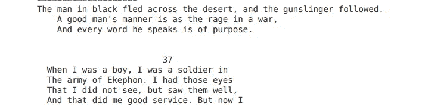

第二句和第三句是真正的黑暗塔风格。后面是倒叙，有何不可？

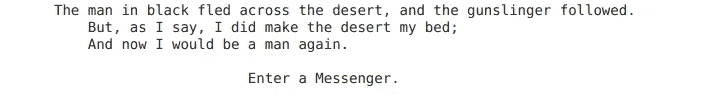

这个有点神秘，但它有正确的精神。

当然，你可以选择哪些想法你想保留，哪些不符合你的想法。让我们看另一个例子，即使是一个相当简单的开端，也可以有许多不同的方向:我决定写一个名叫亨利的国王的垮台(“亨利曾经是一个伟大的国王，直到……”)并寻找一些灵感:

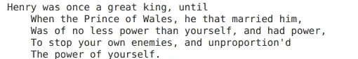

一个政治阴谋！是的:一个国王，一个王子，婚姻和战争，它可以工作。

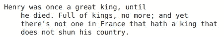

“他死了”可能是一个有点乏味的解释，但关于国王死亡和国家回避的情节有潜力。

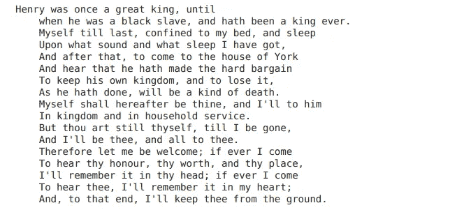

这里隐藏了一些东西，国王对奴隶的情节，虽然有点乱。

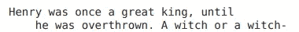

一个女巫！或者是女巫！更像幻想，与之前的方向不同

只需要一分钟就可以产生无数的可能性来汲取灵感，我们希望我们的工作将有助于提供重新点燃你的创造力之火的火花！

# **第一部分结束**

变形金刚和新模型的引入比以往任何时候都更强大，这为帮助作家的新工具的开发提供了完美的温床。在本文中，我们简要回顾了 NLP 模型的历史、我们的目标、条件文本生成领域与实现它的关系，以及一些例子。我们希望到目前为止你喜欢这次旅行。更多即将推出！

*感谢您的阅读！*

## 关于 Digitiamo

Digitiamo 是一家来自意大利的初创公司，专注于使用人工智能来帮助公司管理和利用他们的知识。要了解更多信息，[请访问我们的](https://www.digitiamo.com/)。

## 关于作者

[*法比奥·丘萨诺*](https://medium.com/u/56f43ec01c1e?source=post_page-----576ed5f7988b--------------------------------) *是*[*Digitiamo*](https://www.digitiamo.com/)*的数据科学负责人；* [*弗朗西斯科·福马加利*](https://medium.com/u/ec9f76d504e0?source=post_page-----576ed5f7988b--------------------------------) *是一名正在实习的有抱负的数据科学家。*