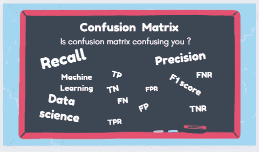
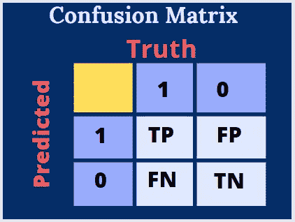
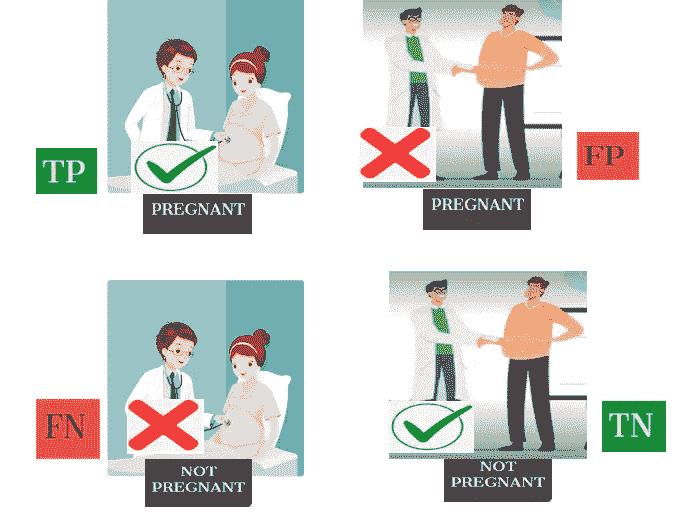
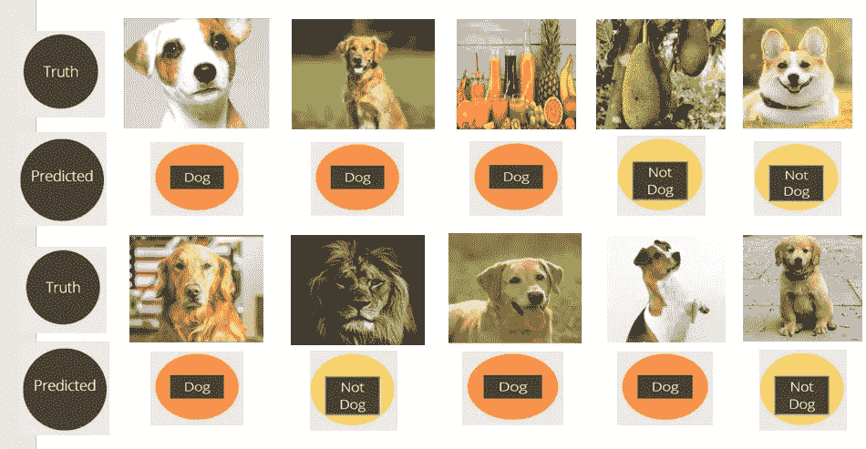
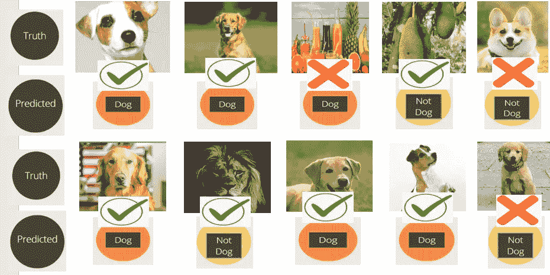
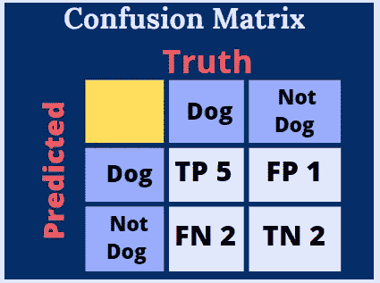
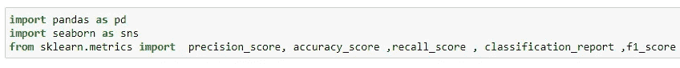
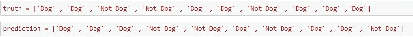
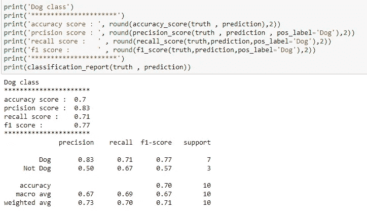
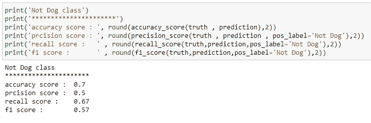

# 混淆矩阵到无混淆矩阵只需 5 分钟

> 原文：<https://pub.towardsai.net/confusion-matrix-179b9c758b55?source=collection_archive---------0----------------------->

> 什么是混淆矩阵精确度、回忆、准确度、F1 分数、FPR、FNR、TPR、TNR？

图片来自 Unsplash 由 [Siora Photography](https://unsplash.com/@siora18) 上传

作者图片

> 在您的数据科学职业生涯的开始，混淆矩阵会非常混乱，我们会有很多问题，比如，什么时候使用精度？何时使用召回？在哪些情况下可以使用精确度？所以，我会试着在这篇博客中回答这些问题。

# 什么是混淆矩阵？

混淆矩阵是一种以矩阵形式总结预测结果和实际值的方法，用于衡量分类问题的性能。

这里我们用正(P)或负(N)来表示预测，用真(T)或假(F)来表示真值。

将真实值和预测值一起表示，我们得到真阳性(TP)、真阴性(TN)、假阳性(FP)和假阴性(FN)。

作者图片-混淆矩阵

那么什么是 TP，TN，FP，FN 呢？在这里，我们将考虑一个怀孕测试的例子，其中一个真正的孕妇和一个胖子咨询医生，测试结果在下图中给出。

作者图片-混淆矩阵

 [## 用 Python 编写复杂模式的简单方法，仅需 4 分钟。

### 用 python 编写复杂模式程序的简单方法

medium.com](https://medium.com/@gowthamsr37/pattern-programming-in-python-23d5af04211e) 

**TP(真阳性)**:女子怀孕，预测为怀孕。这里 P 代表正预测，T 表示我们的预测实际上是真的。

**FP(假阳性)**:预测一个胖子怀孕，其实是假的。这里 P 表示正预测，F 表示我们的预测其实是假的。这也被称为**I 型错误。**

**FN(假阴性)**:实际怀孕的女性被预测为未怀孕。这里 N 代表负预测，F 表示我们的预测其实是假的。这也称为**类型 II 错误。**

**TN(真阴性)**:预测一个胖子没有怀孕。这里 N 表示负预测，T 表示我们的预测实际上是真的。

在混淆矩阵中，对角线元素(TP 和 TN)总是代表正确的分类，对角线以外的元素代表不正确的分类。

 [## 一个完整的基于端到端机器学习的推荐项目

### 基于协同过滤和流行度过滤的机器学习推荐方案

pub.towardsai.net](/step-by-step-approach-to-building-a-recommendation-system-a65be5a54045) 

**精度:**

准确度= (TP+TN)/(TP+FP+FN+TN)准确度给出正确分类的百分比。如果我们有 100 个观察值，并且我们的模型正确分类了 80 个观察值，那么准确率将是 80%。不能仅仅用准确性来决定我们的模型是好是坏。因为我们的数据有 900 个正类和 100 个负类，如果我们的模型预测所有的观察结果都是正的，那么该模型将被认为是 90%准确的，这不是一件好事，所以我们也使用以下指标。

**精度:**

Precision = TP/(TP+FP)在所有的正面预测中，有多少实际上是正面的？精确总是集中在积极的预测上。精确度也称为**阳性预测值**。每当假阳性结果很重要时，我们就使用 precision。

例如:垃圾邮件检测。当不是垃圾邮件的邮件被预测为垃圾邮件时，就会出现误报，用户会丢失重要信息。

**回忆:**

Recall = TP/(TP+FN)在所有实际真值中，有多少被正确预测为正？召回也称为**灵敏度**或**真阳性率(TPR)** 。回忆总是集中在实际的积极方面。每当假阴性结果很重要时，我们就使用回忆。

Eg1:在 COVID 测试中，如果一个有 COVID 的人被预测为阴性，那么这个错误就是假阴性。所以，这个人将不会得到 COVID 治疗，而且，他也有可能传播疾病。

在火警系统中，我们可以使用召回，因为假阴性警报比假阳性警报更危险。

**F1 得分:**

F1 得分= 2 *精度*召回/(精度+召回)。这是精确度和回忆之间的调和平均值，当我们实际上不知道在我们的问题中是 FP 重要还是 FN 重要时，我们可以使用 f1 分数。

**其他指标:**

真负率(TNR) = TN/(TN+FP)

假阳性率(FPR) = FP/(FP+TN)

假阴性率(FNR)= FN(FN+TP)

**狗狗分类模型:**

现在让我们看一个例子，并了解如何在实践中应用上述指标。让我们考虑我们正在制作一个模型来将图像分成两类中的一类，**狗**或**不是狗**。

图片由作者-狗分类

上面的图像是我们模型的输入，目的是分类成狗或者不是狗。

现在让我们看看我们的模型所做的预测。

图片由作者-狗分类

我们的模型结果是**狗预测:6** 和**不是狗预测:4，**我们需要评估这些预测。

图片由作者-狗分类

在 6 个狗的预测中，有 5 个实际上是正确的，在 4 个非狗的预测中，有 2 个实际上是正确的。

现在让我们看看如何在混淆矩阵中表示上述结果，并计算准确度、精确度、召回率和 f1 分数。

作者图片-混淆矩阵

**精度=**(TP+TN)/(TP+TN+FP+FN)**=(5+2)/(5+2+1+2)= 0.7**

****精度** = TP/(TP+FP) = 5/(5+1) = 0.83**

****回忆** = TP/(TP+FN) = 5/(5+2) = 0.71**

****F1 得分**= 2 *精度*召回率/(精度+召回率)=2*0.83*0.71/(0.83+0.71) = 0.77**

**请注意，我们还可以计算 Not Dog 类的精度、召回率和 f1 分数，现在让我们看看如何使用 python 中的 sklearn 为同一个示例计算上述指标。**

****************

**现在你应该对混淆矩阵没有混淆了。此外，如果你已经很好地理解了上述概念，那么请评论更多精确优于回忆的例子，反之亦然。**

** [## 任何可能出错的事情都会出错。

### 我们在日常生活中遇到的一些墨菲定律列表

medium.com](https://medium.com/@gowthamsr37/anything-that-can-go-wrong-will-go-wrong-2eb8b119c50f) 

想了解回归度量的知识吗？下面是博客

 [## 回归度量

### 有哪些不同的回归指标？R2 分数会变成 0 吗？R2 分数什么时候会变成负数？什么是…

medium.com](https://medium.com/@gowthamsr37/regression-metrics-6690815bb51f) 

如果你想知道什么是特征缩放？什么时候使用标准化？何时使用规范化？请阅读下面的博客。

 [## 其特点是使用缩放技术——标准化与规范化。

### 特征缩放是强制性的吗？什么时候使用标准化？何时使用规范化？会发生什么……

medium.com](https://medium.com/@gowthamsr37/which-feature-scaling-technique-to-use-standardization-vs-normalization-9dcf8eafdf8c) 

如果你想知道如何分析 IPL 数据，那么请阅读下面的博客。

 [## 维拉特·科利 vs 科尔·拉胡尔

### Virat Kohli 还是最好的击球手吗？KL Rahul 是否正在超越 Virat Kohli？谁在过去 5 年中有更好的数字…

medium.com](https://medium.com/@gowthamsr37/virat-kohli-vs-kl-rahul-42473d6b0369) 

你可以在 [LinkedIn](https://www.linkedin.com/in/gowtham-s-r-78120a127/) 上联系我**