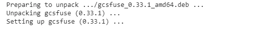
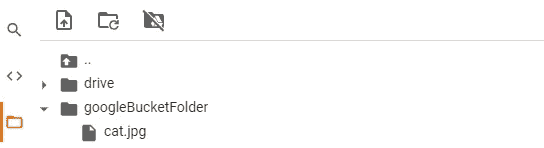

# 使用 gcsfuse 将 Colab 连接到 GCS 桶

> 原文：<https://pub.towardsai.net/connect-colab-to-gcs-bucket-using-gcsfuse-29f4f844d074?source=collection_archive---------4----------------------->

## 云计算


由 [Kelvin Ang](https://unsplash.com/@kelvin1987?utm_source=medium&utm_medium=referral) 在 [Unsplash](https://unsplash.com?utm_source=medium&utm_medium=referral) 上拍摄的照片

# 目录

[简介](#cf6d)
[步骤 1:标识自己](#5cb7)
[步骤 2:安装 gcsfuse](#8378)
[步骤 3:将 Colab 连接到 GCS Bucket](#3280)
[步骤 4:将文件复制到你的 VM](#1dc7)
[资源](#4613)

# 介绍

当您想要将数据集下载到 Google Colab 虚拟机时，您通常使用放置在 Google Drive 上的数据。但是如果你的数据集比较大(超过 15 Gb)，有更多的人想一天下载几次呢？免费的 G-Drive 对磁盘容量和日常数据传输都有限制。在这种情况下，值得借助[、免费等级或信用点](https://cloud.google.com/free/docs/gcp-free-tier#free-tier-usage-limits)在谷歌云平台上创建一个桶。

问题仍然是，如何轻松地将谷歌云存储桶连接到 Colab 虚拟机？提议的解决方案基于使用由 Google 直接开发的 [gcsfuse](https://github.com/GoogleCloudPlatform/gcsfuse) 适配器。由于这个简单的解决方案，即使是通过特定的 gmail 访问数据的第三方也能够将您的数据集下载到 Colab。

本文末尾包含一个带有代码的 Colab 笔记本。

# 第一步:表明自己的身份

```
from google.colab import auth
auth.authenticate_user()
```

以下命令会将您重定向到 Google Cloud SDK 权限面板，并要求您提供连接到特定 gmail 帐户的所有服务的凭据。


这个过程看起来与通过授权连接到 g 盘是一样的，所以让我们深入研究一下。

# **第二步:安装 gcsfuse**

```
!echo "deb http://packages.cloud.google.com/apt gcsfuse-bionic main" > /etc/apt/sources.list.d/gcsfuse.list
!curl https://packages.cloud.google.com/apt/doc/apt-key.gpg | apt-key add -
!apt -qq update
!apt -qq install gcsfuse
```

下面的命令集做一些事情:

1.  添加 gcsfuse 分发 URL 作为包源，并导入其公钥
2.  更新可用软件包列表
3.  安装 gcsfuse



gscfuse 安装输出

如果您的控制台的输出与上面显示的类似，请转到下一步。

# 步骤 3:将 Colab 连接到 GCS 桶

```
!mkdir googleBucketFolder
!gcsfuse --implicit-dirs colab-connect-bucket googleBucketFolder
```

现在你只需在你的虚拟机上创建一个`googleBucketFolder`并调用带有`--implicit-dirs`标志的`gcsfuse`来确保来自`colab-connect-bucket`的所有文件夹和文件在 Colab 的文件浏览器中可见。



Colab 的文件浏览器视图

# 步骤 4:将文件复制到您的虚拟机

```
!gsutil cp /content/googleBucketFolder/cat.jpg .
```

现在，你可以从你的桶中复制(或解压)文件，享受一只美妙的猫🐈(或 30gb 以上的数据集🤖)在你的可乐上。

维奥拉。


照片由[拉米兹·德达科维奇](https://unsplash.com/@ramche?utm_source=medium&utm_medium=referral)在 [Unsplash](https://unsplash.com?utm_source=medium&utm_medium=referral) 拍摄

# 资源

[Colab 笔记本](https://colab.research.google.com/github/maciej-zieniewicz/gcsfuse-for-colab/blob/main/google_storage.ipynb)