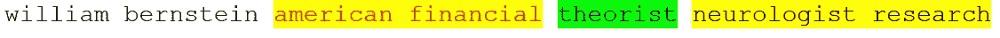
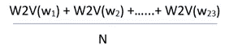
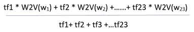
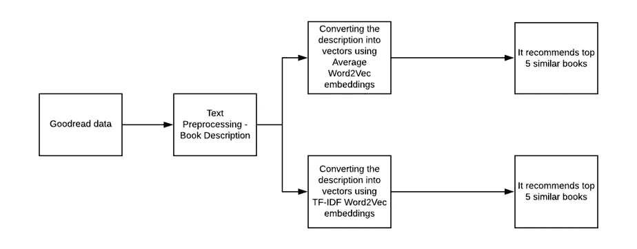
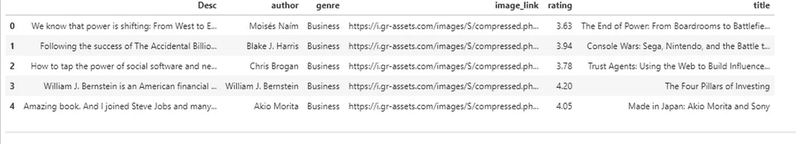
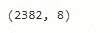

# 基于内容的词嵌入推荐系统

> 原文：<https://pub.towardsai.net/content-based-recommendation-system-using-word-embeddings-c1c15de1ef95?source=collection_archive---------1----------------------->


图片归功于[thewordpoint.com](https://thewordpoint.com/)

## [机器学习](https://towardsai.net/p/category/machine-learning)

## 平均 Word2Vec 和 TF-IDF Word2Vec

[在我之前的文章](https://towardsdatascience.com/building-a-content-based-book-recommendation-engine-9fd4d57a4da)中，我写了一个基于内容的推荐引擎，它使用 TF-IDF 来处理 Goodreads 数据。在本文中，我使用相同的 Goodreads 数据，并使用 word2vec 构建推荐引擎。

和上一篇一样，我准备用同样的图书描述来推荐图书。我们使用的算法总是很难处理原始文本数据，它只能理解数字形式的数据。为了让它明白，我们需要将原始文本转换成数字。这可以在 NLP 的帮助下通过将原始文本转换成向量来实现。

在之前的推荐引擎中，我使用 TF-IDF 将原始文本转换为向量。然而，它没有捕获语义，并且给出了稀疏矩阵。NLP 领域的研究和突破正以前所未有的速度发展。神经网络架构因理解单词表示而闻名，这也被称为单词嵌入。

单词嵌入特征创建密集的低维特征，而 TF-IDF 创建稀疏的高维特征。它也很好地抓住了语义。

其中一个重大突破是 Google 在 2013 年推出的 word2vec 嵌入。使用嵌入 Word2vec 在很多方面都优于 TF-IDF。NLP 的另一个转折点是 2017 年推出的变压器网络。继多项研究、BERT(变压器的双向编码器表示法)之后，引入了许多其他被认为是 NLP 中最先进的算法。

本文探讨了如何使用 **average Word2Vec** 和 **TF-IDF Word2Vec** 构建推荐引擎。我将在下一篇文章中探讨如何使用 BERT 嵌入。

# Word2Vec 是什么？

Word2Vec 是一个简单的神经网络模型，只有一个隐藏层。它预测句子或语料库中每个单词的相邻单词。我们需要得到由模型的隐藏层学习的权重，并且同样可以用作单词嵌入。

让我们看看下面的句子是如何工作的:



根据以上内容，我们假设单词“理论家”是我们的输入单词。它有一个大小为 2 的上下文窗口。这意味着我们只将输入单词两侧的两个相邻单词视为相邻单词。

现在，任务是逐个挑选邻近的单词(上下文窗口中的单词)，并找到词汇表中每个单词是所选邻近单词的概率。在这里，上下文窗口可以根据我们的要求进行更改。

Word2Vec 有两种模型架构变体 1)连续词包(CBoW)和 SkipGram。互联网上充斥着大量关于 Word2Vec 的文章，因此我没有详细解释。关于 Word2Vec 的更多细节，请查看此处的。

> 简单来说，Word2Vec 取单词，给出 D 维空间的向量。

请注意，Word2Vec 提供了低维(50–500)和稠密(不是稀疏的，大多数值是非零的)的单词嵌入。这个推荐引擎我用了 300 维向量。正如我上面提到的，Word2Vec 善于捕捉语义含义和关系。

训练我们自己的单词嵌入是昂贵的过程，并且还需要大的数据集。我没有一个大的数据集，因为我丢弃了 Goodreads 的数据，这些数据只与类型有关:商业和烹饪。使用 Google 预先训练的单词嵌入，这些单词嵌入是在大型语料库(如维基百科、新闻文章等)上训练的。

预先训练的嵌入有助于获得你想要的单词的向量。它是一个大型的键-值对集合，其中键是词汇表中的单词，值是它们对应的单词向量。

在我们的问题中，我们需要将书籍描述转换成一个向量，并找出这些向量之间的相似性来推荐书籍。每本书的描述都是一个*句子或单词序列。*我试过平均 Word2vec 和 TF-IDF Word2Vec 等两种方法。

# 平均 Word2Vec

让我们在数据集中举一些随机描述的例子

书名:*投资的四大支柱*

```
Book Description:william bernstein american financial theorist neurologist research field modern portfolio theory research financial books individual investors wish manage equity field lives portland oregon
```

好了，怎么把上面的描述转换成向量呢？如你所知，word2vec 取单词，给出一个 d 维向量。首先，我们需要将句子分割成单词，并找到句子中每个单词的向量表示。

上面的例子有 23 个单词。让我们用 w1，w2，w3，w4 …w23 来表示这些单词。(w1 =威廉，w2 =伯恩斯坦……w23 =俄勒冈州)。计算所有 23 个单词的 Word2Vec。

然后，对所有向量求和，并除以描述中的总字数(n)。它可以表示为 v1，计算如下



平均 word2vec

这里，向量是 d 维的(使用 300 维)

N =描述 1 中的字数(总计:23)

v1 =图书描述 1 的矢量表示。

这是我们计算平均 word2vec 的方法。同样，其他书籍的描述也可以转换成向量。我用 Python 实现了同样的功能，下面给出了代码片段。

# TF-IDF Word2Vec

TF-IDF 是一个术语频率-逆文档频率。它有助于计算给定单词相对于文档和语料库中其他单词的重要性。它计算两个量，TF 和 IDF。将两者结合将得到 TF-IDF 分数。对 TF-IDF 如何工作的详细解释超出了本文的范围，因为互联网上充斥着许多文章。请点击此处查看更多关于 TF-IDF 的详细信息。

我们来看看 TF-IDF Word2Vec 的工作原理，

考虑相同的描述示例

```
Book Description:william bernstein american financial theorist neurologist research field modern portfolio theory research financial books individual investors wish manage equity field lives portland oregon
```

同样，描述有 23 个单词。让我们用 w1，w2，w3，w4 …w23 来表示这些单词。(w1 =威廉，w2 =伯恩斯坦……..w23 =俄勒冈州)。

## 计算 TF-IDF Word2Vec 的步骤:

1.  为上面描述中的每个单词计算 TF-IDF 向量。让我们称 TF-IDF 向量为 tf1，tf2，tf3…tf23。请注意 TF-IDF 向量不会给出 d 维向量。
2.  计算描述中每个单词的单词 2Vec
3.  将每个单词的 TF-IDF 分数和 Word2Vec 向量表示相乘，总和相同。
4.  然后，将总和除以 TF-IDF 向量之和。它可以被称为 v1，并写成如下形式



tf-idf word2vec

v1 =图书描述 1 的矢量表示。这是计算 TF-IDF Word2Vec 的方法。同样，我们可以将其他描述转换成向量。我用 Python 实现了同样的功能，下面给出了代码片段。

# 基于内容的推荐系统

基于内容的推荐系统通过获取书籍的相似性来向用户推荐书籍。这个推荐系统根据图书描述推荐图书。它根据书籍的描述来识别它们之间的相似性。它还会考虑用户以前的图书历史，以便推荐类似的图书。

例如:如果用户喜欢西德尼·谢尔顿的小说“告诉我你的梦”，那么推荐系统推荐用户阅读西德尼·谢尔顿的其他小说，或者推荐体裁为“非小说”的小说。(西德尼·谢尔顿小说属于非小说类)。

我们需要找到与给定书籍相似的书籍，然后向用户推荐这些相似的书籍。如何发现给定的书是相似还是不相似？使用相似性度量来找到相同的结果。在我们的推荐系统中使用了 ***余弦相似度*** 来推荐书籍。有关相似性度量的更多详细信息，请参考此[文章](https://dataaspirant.com/2015/04/11/five-most-popular-similarity-measures-implementation-in-python/)。

正如我上面提到的，我们使用 goodreads.com 的数据，没有用户阅读历史。因此，我不能使用协作推荐引擎。



# 数据

我从 goodreads.com 那里搜集了有关商业、非小说和烹饪类型的书籍细节。

## 密码

## 输出



该数据由 2382 条记录组成。它有两种类型，1)商业(1185 项记录)2)非小说(1197 项记录)。此外，它还包括书名、描述、作者姓名、评级和图书图片链接。

# 文本预处理

清理图书描述并将清理后的描述存储在一个名为“cleaned”的新变量中

# 推荐引擎

使用平均 Word2Vec 和 TF-IDF Word2Vec 单词嵌入构建两个推荐引擎。

# 平均 Word2Vec

将描述拆分成单词并存储在一个名为“语料库”的列表中，用于训练我们的 word2vec 模型

用 Google 预训练的 Word2Vec 模型训练我们的语料库。

创建了一个名为 vectors 的函数，用于生成平均 Word2Vec 嵌入，并将其存储为一个名为“word _ embeddings”的列表。代码遵循我在上面的 word2vec 解释中所写的步骤。

## 使用平均 Word2Vec 的前 5 项建议

让我们推荐丹·布朗的书《达芬奇密码》

该模型基于书籍描述中存在的相似性来推荐其他丹·布朗的书籍。

让我们推荐阿加莎·克里斯蒂的书《罗杰·艾克罗伊德谋杀案》

这本书属于悬疑惊悚类，推荐一种类似的小说。

# 构建 TF-IDF Word2Vec 模型

代码解释了我在上面提到的 TF-IDF Word2Vec 模型过程中的相同步骤。我使用的是同一个语料库，只是在单词嵌入上有所变化

## 构建 TF-IDF 模型

## 构建 TF-IDF Word2Vec 嵌入

## 使用 TF-IDF Word2Vec 的前 5 项建议

让我们推荐丹·布朗的书*《达芬奇密码》*

我们可以看到，该模型推荐夏洛克家园小说和输出不同于平均 word2vec。

让我们推荐阿加莎·克里斯蒂的《罗杰·艾克罗伊德谋杀案》

同样，它推荐不同于一般的 word2vec。但它给出了一个类似阿加莎克里斯蒂的小说。

似乎 TF-IDF Word2Vec 给出了比一般 Word2Vec 更强有力的推荐。本文只探讨如何使用平均 Word2Vec 和 TF-IDF Word2Vec 构建推荐引擎。没有比较这两个模型的结果。我使用的数据非常少，而且当我们处理更大的数据集时，结果肯定会改变。此外，我们可以使用 Fast Text(来自脸书)和 Glove(来自斯坦福)预先训练的单词嵌入来代替 Google one。

真实世界的推荐系统更加强大和先进。A/B 测试用于评估推荐引擎，业务领域在评估和挑选最佳推荐引擎中也起着重要作用。

在我的下一篇文章中，我将展示如何使用 BERT 嵌入来构建相同类型的推荐引擎。你可以在我的 [GitHub repo](https://github.com/sdhilip200/Content-Based-Recommendation---Good-Reads-data) 中找到完整的代码和数据。

感谢阅读。请继续学习，并关注更多内容！