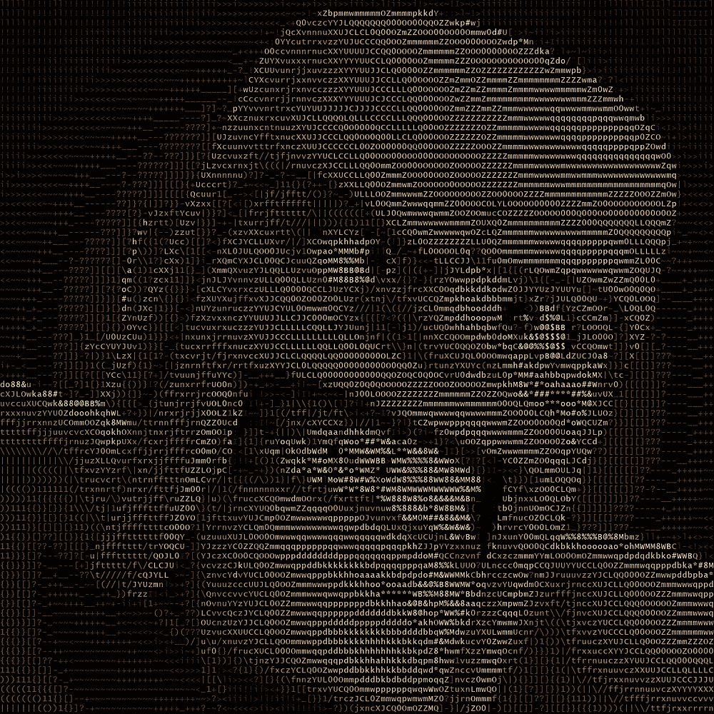

# 使用 Python 将图像转换为 ASCII 艺术图像

> 原文：<https://pub.towardsai.net/convert-images-to-ascii-art-images-using-python-90261de03c53?source=collection_archive---------0----------------------->

## [编程](https://towardsai.net/p/category/programming)

## 在本文中，我们将使用 Python 在不到 35 行代码内将任何给定的图像转换为艺术的 ASCII 彩色图像。



左边是原始图像，右边是最终的 ASCII 图像

这个项目会给你一个坚实的基础，让你理解图像的结构，并以一种有趣的方式来玩它！！那么，我们开始吧。

另外查看一下这篇文章出在 [***自动电影审查系统***](https://towardsdatascience.com/automatic-movie-review-system-using-sentimental-analysis-for-positive-or-negative-review-1667ea3041d4) :-

[](https://towardsdatascience.com/automatic-movie-review-system-using-sentimental-analysis-for-positive-or-negative-review-1667ea3041d4) [## 使用正面或负面评论的情感分析的自动电影评论系统

### 在本文中，我们将使用机器学习对 IMDB 网站上的评论进行情感分析…

towardsdatascience.com](https://towardsdatascience.com/automatic-movie-review-system-using-sentimental-analysis-for-positive-or-negative-review-1667ea3041d4) 

**所需依赖关系:**

你必须在你的系统上安装 python 和***pillow***python 包。你可以简单地用 ***pip 安装*** 的 ***枕头*** 。首先我会解释所有的步骤，然后我们将继续代码片段。

**步骤:-**

*   从提供的路径打开图像。
*   缩放图像，否则将生成非常大的输出图像。
*   将图像转换成灰度图像。
*   从字符列表中获取每个像素的相关字符(根据像素值，从列表中选择字符，即“_”代表低密度)。
*   现在，该字符通过 ImageDraw 函数打印在给定大小的新画布上(在函数本身中，您可以选择颜色为 RGB 或 B&W)。
*   保存新生成的图像，就大功告成了！！！

## **代码:**

```
**from** PIL **import** Image,ImageDraw,ImageFont
**import** math
```

首先导入这些库

```
image = Image.open("InputImage.jpg")
scaleFac = 0.8
charWidth = 10
charHeight = 18
w,h = image.size
image = image.resize((int(scaleFac*w),int(scaleFac*h*(charWidth/charHeight))),Image.NEAREST)
w,h = image.size
pixels = image.load()
```

这里，首先加载图像，然后选择缩放因子(0.1–1)，并决定最终输出图像中每个 ASCII 字符的大小，然后获取图像的宽度和高度，并调整图像的大小。这样做是非常重要的，否则将使用更多的计算能力，输出图像将太大。

```
font = ImageFont.truetype(**'C:\\Windows\\Fonts\\lucon.ttf'**,15)
outputImage = Image.new(**'RGB'**,(charWidth*w,charHeight*h),color=(0,0,0))
draw = ImageDraw.Draw(outputImage)
```

现在 ASCII 字符的字体已经确定。我使用了 windows 的内置字体。然后，使用 Image 函数创建一个黑色的画布“outputImage ”,并创建 ImageDraw 对象以在画布上嵌入 ASCII 字符。

```
**def** getSomeChar(h):
    chars  = **"$@B%8&WM#*oahkbdpqwmZO0QLCJUYXzcvunxrjft/\|()1{}[]?-                          _+~<>i!lI;:,\"^`'. "**[::-1]
    charArr = list(chars)
    l = len(charArr)
    mul = l/256
    **return** charArr[math.floor(h*mul)]
```

这个函数 **getSomeChar** 将获取像素值作为一个参数，范围在 0-256 之间，它从 chars 列表中返回相应的 ASCII 字符。如果愿意，您可以创建自己 char 列表。

```
**for** i **in** range(h):
    **for** j **in** range(w):
        r,g,b = pixels[j,i]
        grey = int((r/3+g/3+b/3))
        pixels[j,i] = (grey,grey,grey)
        draw.text((j*charWidth,i*charHeight),getSomeChar(grey),
        font=font,fill = (r,g,b))
```

这是最重要的工作完成的地方。我们循环通过每个像素和收集的 RGB 分量，它们的平均值给出了灰度像素值。现在，在 draw.text 中，它将嵌入字符的位置作为第一个参数，将使用 **getSomeChar** 函数选择的字符本身作为第二个参数，将我们之前选择的字体作为第三个参数，将颜色填充作为第四个参数。

```
outputImage.save(**"name_for_output.png"**)
```

然后只保存图像…..并共享生成的艺术图像。

您可以使用字体大小、字体样式、缩放因子、画布背景和字符列表。

这是我的第一个博客…所以请让我知道你们喜不喜欢。建议是最受欢迎的。