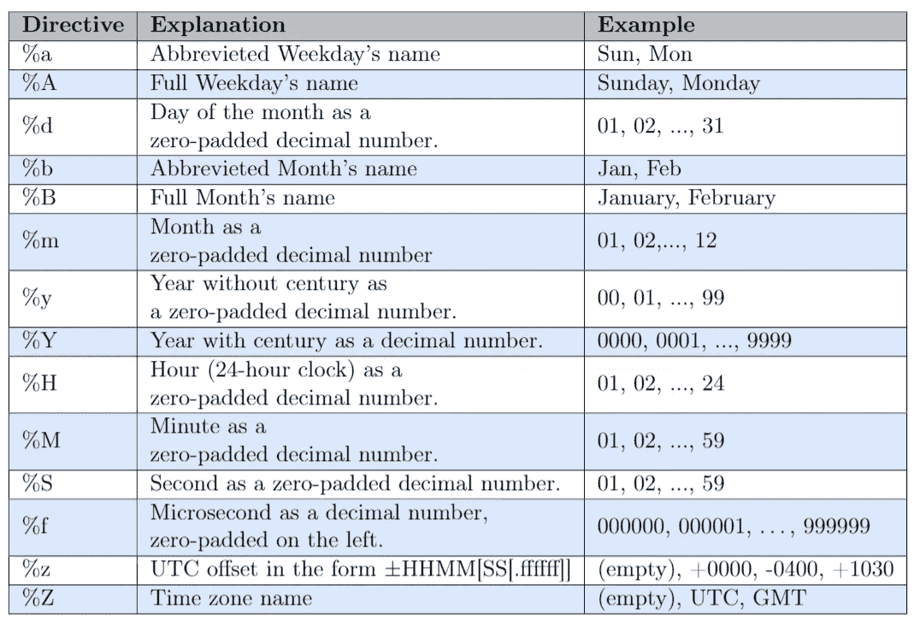
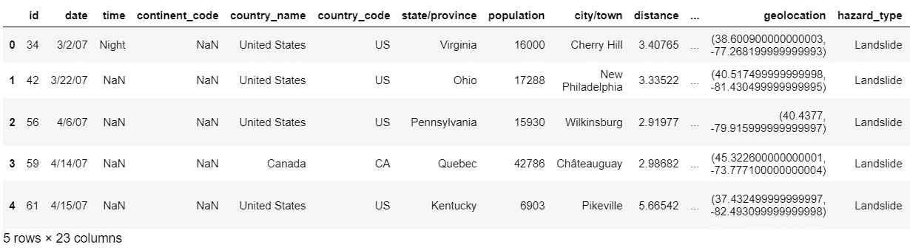
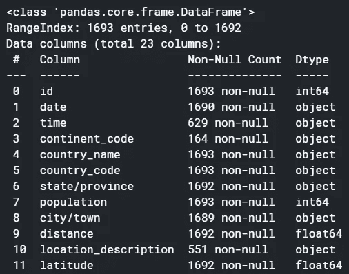
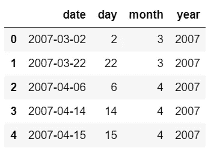

# 在 Python 中将字符串转换为日期时间格式

> 原文：<https://pub.towardsai.net/converting-strings-to-datetime-in-python-fb767394b125?source=collection_archive---------2----------------------->

## [编程](https://towardsai.net/p/category/programming)


[鲁道夫·巴雷托](https://unsplash.com/@rodolfobarreto)在 [Unsplash](https://unsplash.com/) 上的照片

首次分析数据集时，在 Python 中处理日期和时间并不是自动的。有许多需要考虑的特征，例如年、月、日、小时、分钟、秒，还有更复杂的特征，例如持续时间、工作日、时区。为此，我将讨论一个 Python 模块，它处理这种类型的信息:[**datetime**](https://docs.python.org/3/library/datetime.html#tzinfo-objects)**【1】。**

**数据集通常将日期表示为字符串，您需要将它们转换为日期时间格式，以便处理时间序列数据。在本教程中，我将用一些例子来解释这个库，以便于理解如何处理这些数据。**

****内容:****

1.  **[**日期时间类**](#07a5)**
2.  **[**将字符串转换成日期时间对象**](#b4d5)**
3.  **[**从日期时间对象中提取特征**](#ba2f)**
4.  **[**转换日期字符串列**](#ffa2)**
5.  **[**从日期中提取特征**](#0fb2)**

# **1.日期时间类**

**有六种不同的 datetime 类来处理日期和时间的不同方面:**

*   ****日期→** 允许工作用**年** *、* **月**、 **日** *。***
*   ****时间→** 允许操作某一天的信息，**小时**，**分钟**，**秒**，**微秒**和 **tzinfo** 。**
*   ****日期时间→** 将日期和时间结合在一起。所以，属性是**年** *，* **月** *，* **日，小时**，**分钟**，**秒**，**微秒**和 **tzinfo** 。**
*   ****timedelta →** 持续时间，表示两个日期、时间或日期时间之间的差异。**
*   ****tzinfo →** 类为**时区信息对象****
*   ****timezone →** 类，它实现了作为 UTC 固定偏移量的 **tzinfo** 抽象基类。**

# **2.**将字符串转换成日期时间对象****

**返回对应于字符串的日期时间的最常用函数称为 **strptime** 。它需要字符串和字符串的相应日期格式作为参数。**

> **datetime.strptime( *日期字符串*，*格式*)**

**我们可以用各种例子来研究这个函数是如何工作的:**

**结果:**

```
2021-05-01 00:00:002021-05-01 00:00:002020-12-31 00:00:002020-12-31 23:55:55
```

**导入 datatime 后，我们将字符串传递给函数 strptime()。格式由**指令**如%d 和**特殊字符**(空格、逗号、点、…)组成。**

**现在我将展示更复杂的例子:**

**结果:**

```
2007-01-01 00:14:24
2007-01-01 00:14:24.055000
2007-01-01T00:14:24.055+01002007-01-01T00:14:24.055+0100  #string modified 
2007-01-01 00:14:24.055000+01:00
```

**下表显示了用于控制显式格式字符串的最相关的指令。**

****

**最相关的指令。要了解该表的完整视图，请查看[https://docs . python . org/3/library/datetime . html # datetime-objects](https://docs.python.org/3/library/datetime.html#datetime-objects)**

**在不删除“:”的情况下识别 UTC 偏移量的一个更简单的方法是使用模块 [**解析器**](https://dateutil.readthedocs.io/en/stable/parser.html)**【2】**中的函数**解析**。******

**结果:**

```
datetime.datetime(2005, 1, 3, 2, 25, tzinfo=tzoffset(None, 3600))
```

**它能够在不指定字符串格式的情况下解析字符串。**

# **3.从日期时间对象中提取要素**

**更复杂的特性可以很容易地从 datetime 对象中提取出来。为了做到这一点，我们可以使用 **dir** 方法，该方法返回对象所有有效属性的列表。当库没有被完整地文档化或者你想更快地编码时，这是非常有效的。让我们使用最后一个例子，其中变量 d 也是一个日期时间对象。**

**结果:**

```
['__add__',...'astimezone',  'combine',  'ctime',  'date',  'day',  'dst',  'fold',  'fromordinal',  'fromtimestamp',  'hour',  'isocalendar',  'isoformat',  'isoweekday',  'max',  'microsecond',  'min',  'minute',  'month',  'now',  'replace',  'resolution',  'second',  'strftime',  'strptime',  'time',  'timestamp',  'timetuple',  'timetz',  'today',  'toordinal',  'tzinfo',  'tzname',  'utcfromtimestamp',  'utcnow',  'utcoffset',  'utctimetuple',  'weekday',  'year']
```

**可以提取许多信息，例如年、月、日、小时、分钟、秒和微秒:**

**结果:**

```
2005 
1 
3 
2 
25 
0 
0 
tzoffset(None, 3600)
```

**可以使用模块 datetime 的函数提取其他类型的信息:**

**结果:**

```
0
1 
(2005, 1, 1)
```

**函数 **weekday** 以整数形式返回一周中的某一天，值从 0 到 6，而在**中，函数 isoweekday** 的值从 1 到 7。函数 **isocalendar** 返回由三个元素组成的元组:年、周和工作日。在图书馆日期时间中还有许多其他函数可以使用，你只需要查看官方网页。**

# ****4。转换日期字符串列****

**让我们在真实数据集中应用我们所学的知识。我们将从 Kaggle 获取一个数据集，名为[降雨后滑坡，2007–2016](https://www.kaggle.com/nasa/landslide-events)。它包含了 2007 年至 2016 年间发生的山体滑坡的信息。因此，让我们使用函数 read_csv 从 pandas 库导入数据集。**

****

**我们可以对数据集有一个大概的了解。为了获得数据帧的摘要，让我们使用函数 info():**

****

**日期列是一个字符串，表示为“对象”，我们需要将其转换为 **datetime** 格式:**

****

**所以，现在我们终于有了格式正确的列日期。**

# **5.从列日期中提取特征**

**为了用模型进行预测，列日期没有用，我们更喜欢数值。出于这个原因，我将创建三个新变量，它们将包含日、月和年。**

****

**我们也可以推导出一周前的日期。可以通过对日期列和一个 **timedelta** 函数求差来提取这个日期，在这个函数中，我们指定要减去的天数:**

****

**一旦我们提取了所有时态信息，我们就可以删除日期列:**

**恭喜你！预处理日期时间对象的第一步终于完成了。**

# **进一步的想法:**

**这些是我在处理包含日期列的数据集时采取的步骤。当你没有基础知识的时候，开始的时候似乎有点困难。我希望本教程能帮助你更快地理解它，并对库 **datetime** 充满信心。正如您所观察到的，在最后一步中，我没有使用来自模块解析器的函数 **parse** ，这应该更容易使用，但同时，它并不适用于所有类型的日期。所以在这种情况下，最好应用 **strptime** 函数。谢谢你阅读它。祝您愉快！**

****参考文献:****

**[1][https://docs.python.org/3/library/datetime.html](https://docs.python.org/3/library/datetime.html)**

**[https://dateutil.readthedocs.io/en/stable/parser.html](https://dateutil.readthedocs.io/en/stable/parser.html)**

**你喜欢我的文章吗？ [***成为会员***](https://eugenia-anello.medium.com/membership) ***每天无限获取数据科学新帖！这是一种间接的支持我的方式，不会给你带来任何额外的费用。如果您已经是会员，*** [***订阅***](https://eugenia-anello.medium.com/subscribe) ***每当我发布新的数据科学和 python 指南时，您都可以收到电子邮件！*****