# 凸性和詹森不等式(以及 AM-GM 不等式)

> 原文：<https://pub.towardsai.net/convexity-and-jensens-inequality-and-the-am-gm-inequality-7593348b9954?source=collection_archive---------1----------------------->

## [数学](https://towardsai.net/p/category/mathematics)

# 介绍

在这篇(相对)较短的文章中，我们将讨论极其有用的[詹森不等式](https://en.wikipedia.org/wiki/Jensen%27s_inequality)，该不等式以丹麦数学家[约翰·延森](https://en.wikipedia.org/wiki/Johan_Jensen_(mathematician))命名。

Jensen 不等式可以看作是定义实值凸函数的不等式的推广。作为一个提醒，一个功能

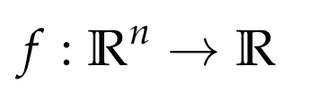

是凸的，如果

直观地说，这意味着如果你绘制函数 f 的图形，并选取图形的两个点并用一条线将它们连接起来，那么这条线位于函数的图形上方，如下图中的一个示例所示。

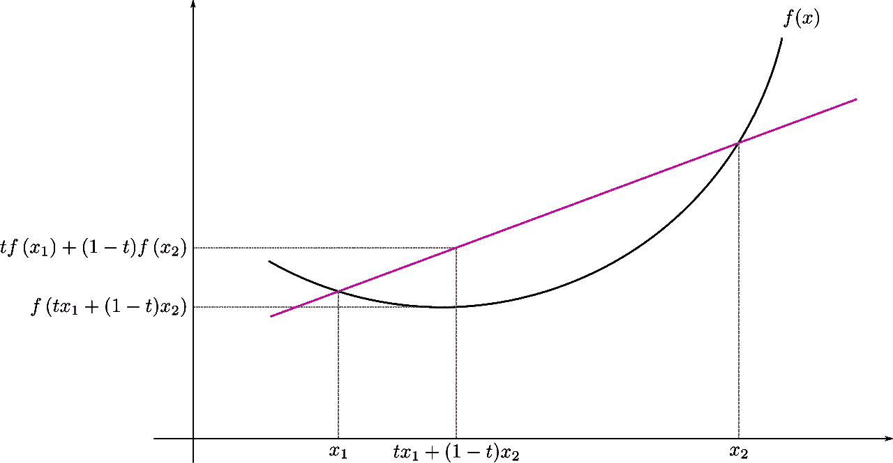

凸函数 f 的图形【来源:[https://en.wikipedia.org/wiki/Jensen%27s_inequality】](https://en.wikipedia.org/wiki/Jensen%27s_inequality)

詹森不等式概括了这个图当多个点(甚至无穷多个！)都有涉及。表述不等式的一个简洁的方法是使用概率的语言。这是因为点的[凸组合](https://en.wikipedia.org/wiki/Convex_combination)可以被视为这些点上的概率分布。例如，在上面的凸性定义中，我们考虑两点的加权和

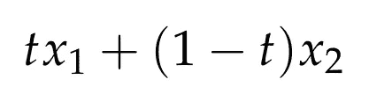

这可以被认为是这两个点上的概率分布，其中第一个点以概率 *t* 被选择，第二个点以概率 *1-t* 被选择。

## 詹森不等式

如果 *X* 是随机变量而 *f* 是凸函数，那么

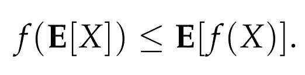

*注意:如果 f 是凹的，那么不等式在反方向成立。*

# 证据草图

在这一节中，我们简要地讨论一下证明。可以证明的最简单的不等式形式是有限形式，其中涉及有限数量的点。更具体地说，我们可以通过对数量为 *n* 的点使用归纳法证明，给定一个凸函数 *f* 和任意 *n* 个点

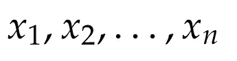

以及相应的非负 *t* 值

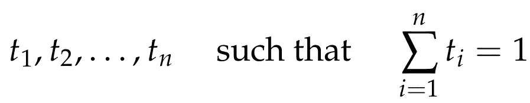

我们有

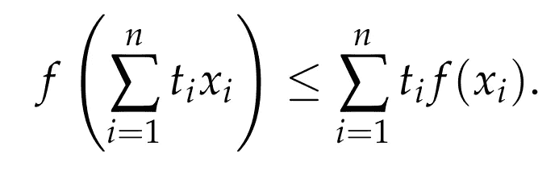

归纳的基本情况是对于 *n = 2* ，并且对应于凸性的定义。然后，归纳步骤是从 *n* 移动到 *n+1* 点。这很容易做到，如下所示。由于我们有 *n+1* 个点，这意味着它们的所有*t*-值都是严格正的，并且总计为 *1* 。我们考虑第一个*到第 n 个*点(通过任意给它们分配一个顺序)，我们设置

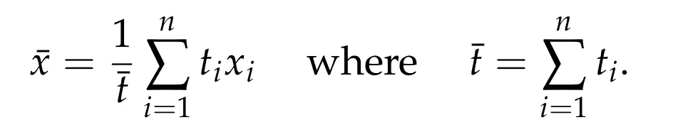

因为

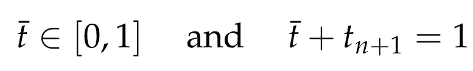

我们应用凸性的定义，并且通过在第一个 *n 个*点上使用归纳假设，我们得到

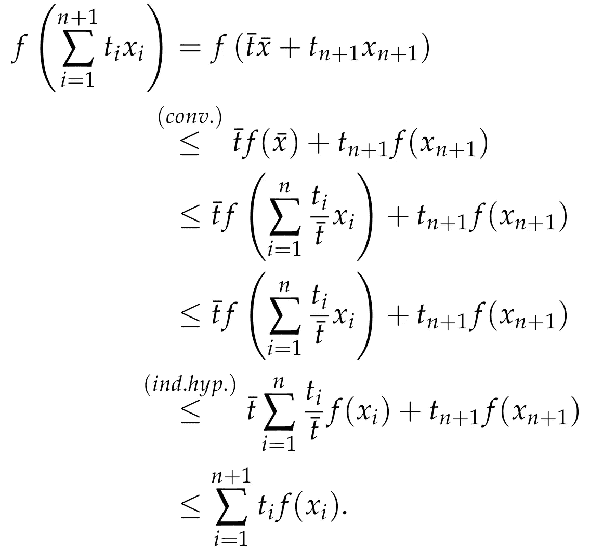

归纳证明现在完成了。为了推广到我们陈述不等式的更一般的概率环境，我们必须使用一些分析性的论证，这些论证更具技术性，我们可以跳过。感兴趣的读者可以进一步阅读维基百科中关于詹森不等式的条目(可以在[这里](https://en.wikipedia.org/wiki/Jensen%27s_inequality)找到)，或者看看网上广泛可用的多个来源。

如上所述，当处理凹函数时，这个不等式在相反的方向成立。人们可以在凹函数的上下文中模仿上述论点，以便验证这确实是这样的情况；我们鼓励读者找出细节。

# 应用:AM-GM 不等式的证明

在这里，我们给出另一个非常有用的不等式的非常简短的证明，即所谓的算术和几何平均的不等式，简称 AM-GM 不等式。AM-GM 不等式可以表述如下。

让

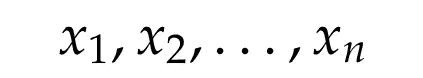

是正实数。然后，我们总是有

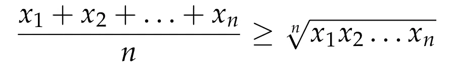

只有在以下情况下平等才成立

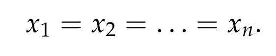

为了证明上述不等式，我们将使用詹森不等式，并且特别地，我们将把它应用到一个凹(并且不是凸！)功能。如上所述，当 *f* 是凹的时，不等式在相反的方向成立。我们使用的凹函数是众所周知的对数函数

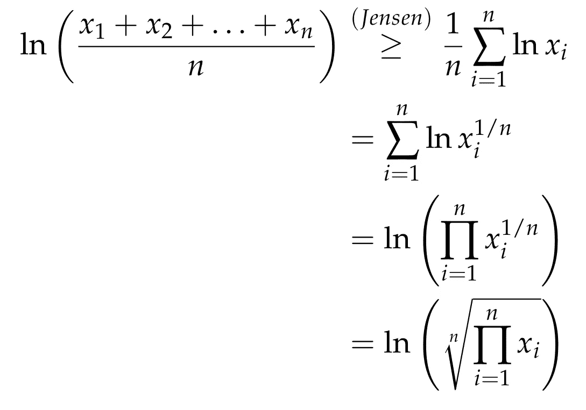

这里我们使用了对数的标准属性(更多细节见[这里的](https://en.wikipedia.org/wiki/Logarithm))*。*现在利用指数函数是递增函数的事实，我们将它应用到所获得的不等式的两边，我们得到

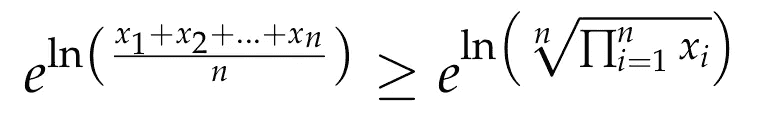

这意味着 AM-GM 不平等。我们完了！

# 结论

在本文中，我们讨论了著名的并广泛适用的詹森不等式。记住这个不等式总是好的，因为它描述了凸函数的基本性质，而凸函数几乎随处可见！作为一个额外的收获，我们看到这个不等式也可以应用于凹函数，通过反转不等式的方向，并利用这一点，我们得到了另一个非常有用的不等式，AM-GM 不等式的一个非常简短的证明。

## 来源

*   [https://en.wikipedia.org/wiki/Jensen%27s_inequality](https://en.wikipedia.org/wiki/Jensen%27s_inequality)
*   [https://en . Wikipedia . org/wiki/Inequality _ of _ 算术 _and_geometric_means](https://en.wikipedia.org/wiki/Inequality_of_arithmetic_and_geometric_means)