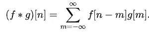
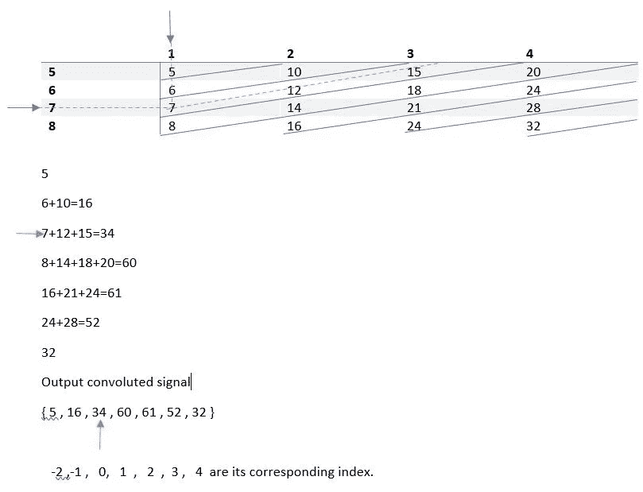
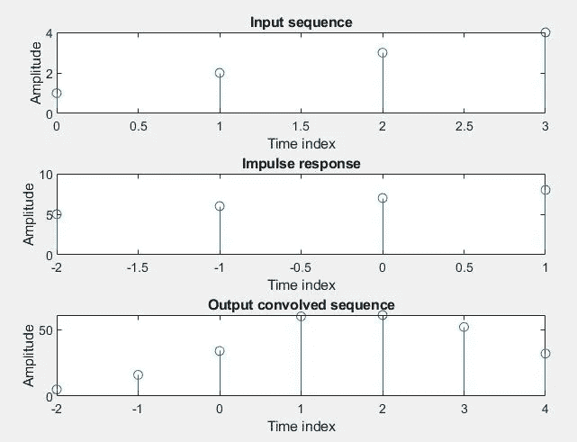
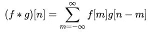
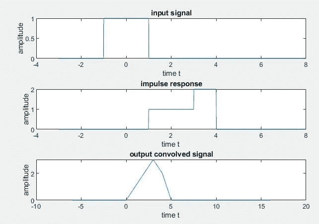
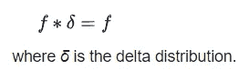
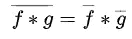
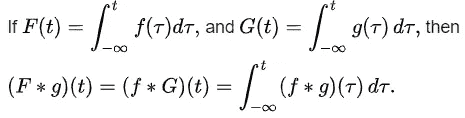

# 一维信号的卷积

> 原文：<https://pub.towardsai.net/convolution-of-signals-in-1-dimension-a2b4791055db?source=collection_archive---------2----------------------->

## 数学

## 卷积是在科学、工程和数学中找到其应用的最有用的算子之一

**卷积**是对两个[函数](https://en.wikipedia.org/wiki/Function_(mathematics)) ( *f* 和 *g* )的[数学运算](https://en.wikipedia.org/wiki/Operation_(mathematics))，产生第三个函数，表示一个函数的形状如何被另一个函数修改。

## 离散时间信号的卷积



来源:[https://en.wikipedia.org/wiki/Convolution](https://en.wikipedia.org/wiki/Convolution)

求离散时间信号卷积的简单方法如下所示

输入序列 x[n] = {1，2，3，4}，其索引为{0，1，2，3}

脉冲响应 h[n] = {5，6，7，8}，其指数为{-2，-1，0，1}

蓝色箭头表示 x[n]和 h[n]的第 0 个索引位置。红色指针指示输出卷积索引的第零个索引位置。我们可以构造一个表格，如下所示。将 ***x*** 和 ***h*** 的元素相乘，如图所示，对角相加。



显示相关索引的索引位置的表格

```
>> clc;  % clears the command window
>> clear all; % clears all the variables in the workspace
>> close all; % closes all the figure window
```

接受用户的输入

```
>> % x[n] is the input discrete signal.
>> x=input('Enter the input sequence x =');
>> nx=input('Enter the index of the input sequence nx=');
>> % h[n] is the impulse response of the system.
>>h=input('Enter the impulse response of the system,second sequence h=');
>> nh=input('Enter the index of the second sequence nh=');
```

命令窗口中的输出，

```
Enter the input sequence x =[1 2 3 4]
Enter the index of the input sequence nx=[0 1 2 3]
Enter the impulse response of the system,second sequence h=[5 6 7 8]
Enter the index of the second sequence nh=[-2 -1 0 1]
```

计算卷积信号的指数，

```
>> % Index of the convolved signal
>> n=min(nx)+min(nh):max(nx)+max(nh);
```

盘旋

```
>> y=conv(x,h);
```

显示

```
>> disp('The convolved signal is:');
>> y
>> disp('The index of convolved sequence is:');
>> n
```

命令窗口中的输出，

```
>> The convolved signal is:y =5    16    34    60    61    52    32>> The index of convolved sequence is:n =-2    -1     0     1     2     3     4
```

让我们想象一下这些信号。

```
>> subplot(311);
>> stem(nx,x);
>> subplot(312);
>> stem(nh,h);
>> subplot(313);
>> stem(n,y);
```



可视化卷积信号

你可以在 Github 上找到代码。

## 连续时间信号的卷积



来源:[https://en.wikipedia.org/wiki/Convolution](https://en.wikipedia.org/wiki/Convolution)

```
>> clc;
>> clear all;
>> close all;
>> t=-3:0.01:8;
>> x=(t>=-1 & t<=1); % pulse that exists for t>=-1 and t<=1
>> subplot(311);
>> plot(t,x);
>> h1=(t>=1 & t<=3); % pulse that exists for t>=1 & t<=3
>> h2=(t>3 & t<=4); % pulse that exists for t>3 & t<=4
>> h=h1+(2*h2);
>> subplot(312);
>> plot(t,h);
>> y=convn(x,h);
>> y=y/100;
>> t1=2*min(t):0.01:2*max(t);
>> subplot(313);
>> plot(t1,y);
```



可视化连续信号

你可以在 [Github](https://github.com/sinchubhat/Signals-and-Controls-lab-4th-sem-/blob/master/ConvIntegral1.m) 上找到代码。

## 卷积的性质

卷积是一种线性运算符，具有以下特性。

*   **交换性**

x[n] * h[n] = h[n] * x[n](离散时间)

x(t) * h(t) = h(t) * x(t)(在连续时间内)

*   **关联属性**

x[n]*(h1[n]* H2[n])=(x[n]* h1[n])* H2[n](在离散时间内)

x(t)*(h1(t)* H2(t))=(x(t)* h1(t))* H2(t)(在离散时间内)

*   **分配性**

x[n]*(h1[n]+H2[n])=(x[n]* h1[n])+(x[n]* H2[n])(在离散时间内)

x(t)*(h1(t)+H2(t))=(x(t)* h1(t))+(x(t)* H2(t))(在离散时间内)

*   **与标量乘法的关联性**

a(f * g) = (af) * g

对于任何实数(或复数)a

*   **乘法恒等式**



*   **复共轭**



*   **与微分的关系**


*   **与一体化的关系**



## 应用程序

卷积在许多领域都有应用，包括数字图像处理、数字信号处理、光学、神经网络、数字数据处理、统计学、工程学、概率论、声学等等。

## 参考

*   信号与系统，奥本海姆和威尔斯基，第二版。
*   [https://en.wikipedia.org/wiki/Convolution](https://en.wikipedia.org/wiki/Convolution)