# Python 卷积神经网络(CNN)教程

> 原文：<https://pub.towardsai.net/convolutional-neural-networks-cnns-tutorial-with-python-417c29f0403f?source=collection_archive---------0----------------------->


来源: [Pixabay](https://pixabay.com/photos/neural-networks-brain-5321301/)

## [深度学习](https://towardsai.net/p/category/machine-learning/deep-learning)、[编辑](https://towardsai.net/p/category/editorial)、[编程](https://towardsai.net/p/category/programming)

## 关于使用 Python 的卷积神经网络(CNN)的深入教程

最后更新，2021 年 1 月 8 日

**作者:**萨妮娅·帕维斯，[罗伯托·伊里翁多](https://mktg.best/vguzs)

[](https://members.towardsai.net/) [## 加入我们吧↓ |面向人工智能成员|数据驱动的社区

### 加入人工智能，成为会员，你将不仅支持人工智能，但你将有机会…

members.towardsai.net](https://members.towardsai.net/) 

**本教程的代码可在**[**Github**](https://github.com/towardsai/tutorials/tree/master/convolutional-neural-networks-python)**上获得，其完整实现也可在**[**Google Colab**](https://colab.research.google.com/drive/1OLBEe0LwK9DcyzInOSDBmPp_Z5udLyqI?usp=sharing)**上获得。**

## 目录

1.  [简介](#124c)
2.  [网络架构](#e8a2)
3.  [卷积](#a889)
4.  [卷积层](#5f95)
5.  [汇集层/子采样层](#d143)
6.  [跨步](#9deb)
7.  [全连接层](#78ff)
8.  [非线性层](#48df)
9.  [卷积神经网络的 Python 实现](#c55c)
10.  [CNN 的超参数](#14b9)
11.  [CNN 中的正则化方法](#0703)
12.  [结论](#d39a)
13.  [资源](#c6be)
14.  [参考文献](#ee0b)

> 📚查看我们对[最佳机器学习书籍](https://towardsai.net/p/machine-learning/best-machine-learning-books-free-and-paid-ml-book-recommendations-40c9ab30b0c)的编辑推荐。📚

# 介绍

[**Yann le Cun**](http://yann.lecun.com/)**和 [**Yoshua Bengio**](https://yoshuabengio.org/) 于 1995 年推出卷积神经网络[ [1](https://www.researchgate.net/profile/Yann_Lecun/publication/2453996_Convolutional_Networks_for_Images_Speech_and_Time-Series/links/0deec519dfa2325502000000.pdf) ]，也称为卷积网络或 CNN。CNN 是一种特殊的多层神经网络[ [2](https://doi.org/10.3390/sym12050803) ]，以明显的网格状拓扑结构处理数据。它的网络基础基于一种叫做**卷积**的数学运算。从根本上说， [**机器学习**](https://mld.ai/mldcmu) 算法使用矩阵乘法，但相比之下，CNN 至少在一层中使用卷积来代替矩阵乘法——卷积是一种特殊的线性运算。**

**卷积神经网络(CNN)无疑是最受欢迎的深度学习架构。它们的应用无处不在，包括图像和视频识别、图像分析、推荐系统、自然语言处理、计算接口、金融时间序列以及其他一些应用。**

**生物学发现激发了具有以下标准能力的神经网络的发展:**

****输入→权重→逻辑功能→输出****

**关于 CNN 的基本事实:**

*   **CNN 是由视觉皮层中的局部敏感和方向选择性神经细胞的发现在神经生物学上驱动的。**
*   **它们是一个多层神经网络。**
*   **它们隐含地提取相关特征。**
*   **它们是一个前馈网络，可以从图像中提取拓扑特征。**
*   **它们通过最少的预处理直接从像素图像中识别视觉模式。**
*   **它们惊人地强大，因为它们可以很容易地识别具有极端可变性的模式。例如手写。**
*   **用一种反向传播算法来训练 CNN。**
*   **CNN 在视觉皮层中具有神经元细胞，构成了 CNN 背后的基础，并监视特定的特征。**

## **为什么需要 CNN？**

**对于图像识别和其他应用，CNN 有几个优点，例如:**

*   **使用 CNN 的检测对于像由于相机镜头、不同照明条件、不同姿势、部分遮挡的存在、水平和垂直移动等引起的形状变化这样的失真是鲁棒的。**
*   **它需要更少的内存来处理和执行。**
*   **很直白，适合训练。通过使用 CNN，我们可以显著减少参数的数量。因此，培训时间也相应减少。**

## **卷积神经网络的类型**

**以下是一些不同类型的 CNN:**

*   ****1D CNN →** 在这种情况下，内核向一个方向移动。1D CNN 的输入和输出数据是二维的。1D CNN 主要用于时间序列。**
*   ****2D CNN →** 在 2D CNN 的领导下，内核向两个方向移动。2D CNN 的输入和输出数据是三维的。我们通常在图像数据问题上使用这个。**
*   ****3D CNN →** 这里，内核向三个方向移动。3D CNN 的输入和输出数据是四维的。工程师在 3D 图像上使用 3D CNNs，如磁共振成像、CT 扫描和其他复杂应用的 DICOM 图像。**

# **网络体系结构**

**CNN 架构由不同层的堆叠开发，这些层通过可微分函数将输入音量转换成输出音量。通常使用几种不同类型的层。**

**下面是 CNN 中不同层的堆栈:**

*   **卷积层**
*   **汇集层**
*   **全连接层**

**总之，完整 CNN 层的例子:**

****

**图 1:一个全卷积神经网络(CNN)架构的例子。**

**CNN 的完整架构:**

****

**图 2:CNN 架构的完整概述。**

****

**图 3:卷积神经网络如何表现|来源:分解它:关于机器学习的问答[ [5](https://www.google.com/about/main/machine-learning-qa/) ]**

****图像处理**是对一幅图像进行操作以获得增强图像或从中提取一些关键信息的过程。有三种不同的方法来执行图像处理:**

*   **直方图处理。**
*   **转换函数。**
*   **卷积。**

# **盘旋**

**卷积是对名为 **f** 和 **g** 的两个函数的数学计算，给出第三个函数 **(f * g)** 。第三个函数揭示了一个函数的形状是如何被另一个函数修改的。它的数学方程式如下:**

**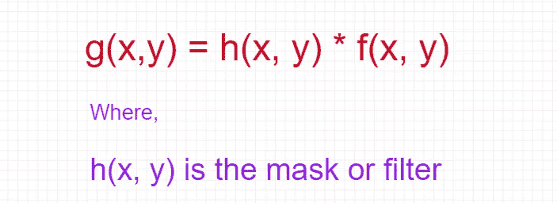**

**图 4:卷积方程。**

**在了解卷积的概念之前，有必要了解遮罩或滤镜的概念。**

**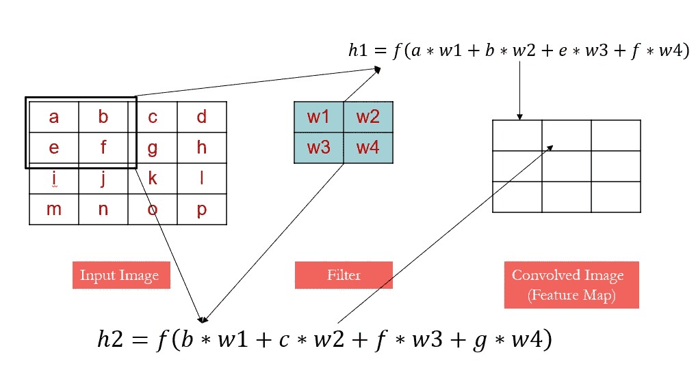**

**图 5:卷积方程。**

## ****遮罩或滤镜****

**掩码是一个小矩阵，其值称为权重。一个二维矩阵表示它。它也被称为过滤。它有趣的一点是应该是奇数。否则很难找到面膜的 mid。**

**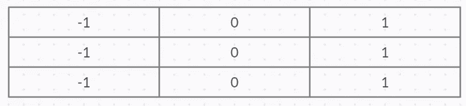**

**图 6:一个数组的掩码。**

**下面是数组中掩码的代码示例:**

```
import numpy as np
import numpy.ma as maoriginal_array = np.array([1, 2, 3, -1, 5])original_array
```

**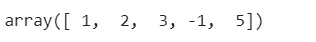**

**图 7:原始数组。**

**创建原始数组的掩码:**

```
masked = ma.masked_array(original_array, mask=[0, 0, 0, 1, 0])masked
```

**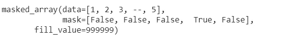**

**图 8:原始数组的掩码。**

## ****为什么卷积在 CNN 中很重要？****

**CNN 中的**卷积**循环至关重要，因为它可以在以下情况下处理图像:**

*   **模糊**
*   **磨刀**
*   **边缘检测**
*   **噪声降低**

## ****卷积是如何执行的？****

**执行卷积的步骤如下:**

*   **水平和垂直翻转遮罩仅一次。**
*   **将遮罩滑动到图像上。**
*   **将相似的元素相乘，然后相加。**
*   **重复上述所有步骤，直到计算出图像的所有值[ [8](https://www.tutorialspoint.com/dip/concept_of_convolution.htm) ]。**

**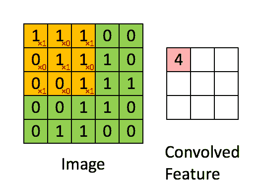**

**图 9:卷积特征或激活图或特征图。**

**按照上述步骤:**

**面具下方:**

**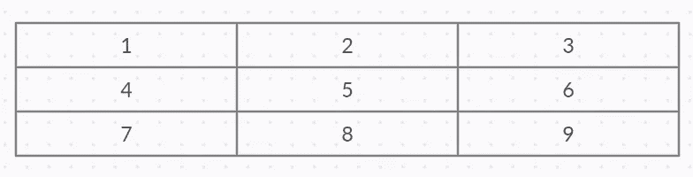**

**图 10:掩模阵列。**

**水平翻转→**

****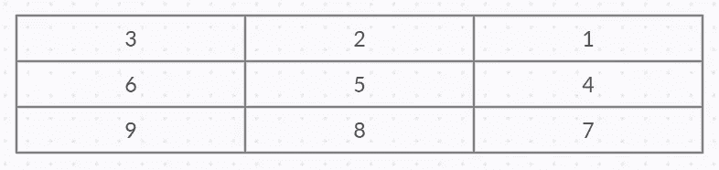****

****图 11:水平翻转蒙版。****

****垂直翻转→****

******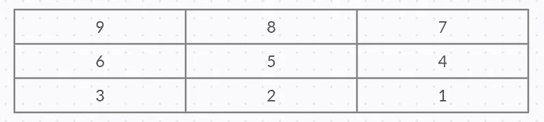******

******图 12:垂直翻转遮罩。******

******让我们来看看下面这张图片的尺寸:******

******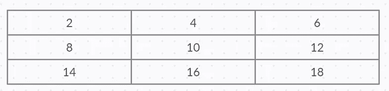******

******图 13:图像的尺寸。******

******现在，为了**计算卷积**,请遵循以下步骤:******

*   ****将遮罩的核心放在图像的每个部分。****
*   ****将类似的元素相乘并相加****
*   ****最后，将结果粘贴到蒙版中心所在的图像元素上。****

****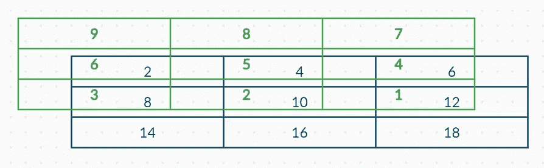****

****图 14:图像上的遮罩。****

****从图 14 中可以看出:****

*   ****绿色框是遮罩，框中的绿色值是遮罩的值****
*   ****蓝框及其值与图像相关****

******现在，计算图像的第一个像素↓******

****px1 = (5 * 2) + (4 *4) + (1* 0)****

****px1 = 10+ 16+16+10****

****px1 = 52****

****图像第一个像素的结果是 52。因此，根据结果，我们遵循以下步骤:****

*   ****将值 52 放在原始图像的第一个索引处。****
*   ****对图像的每个像素重复此步骤。****

# ****卷积层****

****CNN 是具有一些卷积层和一些其他层的神经网络。卷积层有几个执行卷积运算的滤波器。卷积层应用于二维输入，由于其出色的图像分类工作性能而非常著名。它们基于一个小核 **k** 与一个二维输入的离散卷积，这个输入可以是另一个卷积层的输出。卷积层是 CNN [ [9](https://en.wikipedia.org/wiki/Convolutional_neural_network) ]的核心构件。****

****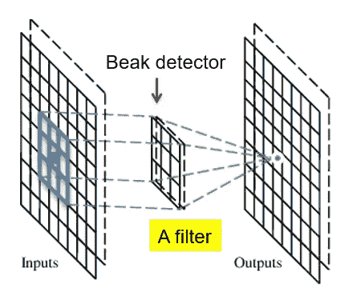****

****图 15:带滤波器的卷积层。****

****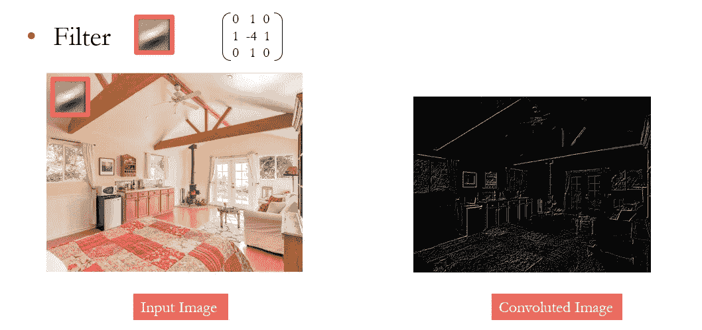****

****图 16:卷积层。****

****卷积在所有空间位置上共享相同的参数；然而，传统的矩阵乘法不共享任何参数。****

****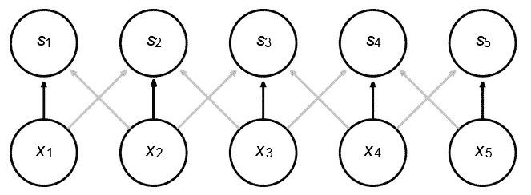****

****图 17:卷积共享相同参数。****

****在 Keras 中构建卷积图层:****

```
**from keras.models import Sequential
from keras.layers.convolutional import Conv2Dmodel = Sequential()model.add(Conv2D(32, (3, 3), input_shape=(32, 32, 3), padding='same', activation='relu'))**
```

****以上代码实现的解释:****

*   ****输出将有 **32** 特征地图。****
*   ****内核大小将会是 3x3。****
*   ****输入形状为三通道的 **32x32** 。****
*   ******填充=相同**。这意味着输入需要相同维度的输出。****
*   ****激活指定激活功能。****

****接下来，使用不同的参数值构建一个卷积层，如下所示:****

```
**model.add(Conv2D(32, (3, 3), activation='relu', padding='valid')**
```

****所以，从上面卷积层的代码来看:****

*   ****内核=3X3****
*   ******padding=valid:** 这意味着输出维度可以采用任何形式[ [10](https://github.com/sagar448/Keras-Convolutional-Neural-Network-Python) ]。****

# ****汇集层/子采样层****

****基本上，池层用于降低图像的维度。它还用于使用多个过滤器检测图像中的边缘、眼睛、鼻子、角落等。它的功能是减少参数的数量，也减少网络中的空间大小。有两种方法可以实现池化:****

*   ******Max Pooling** :表示矩形邻域内的最大输出。****
*   ******平均池**:表示一个矩形邻域的平均输出。****

****最常用的池是最大池和平均池。图像的空间尺寸减小了，因为它给出了更少的像素和更少的特征或参数用于进一步的计算。****

****因此，池层有两个重要目的:****

*   ****随着网络从一个卷积图层移动到下一个卷积图层，要素地图的空间大小不断减小，从而减少了参数的数量。****
*   ****弃牌时逐步识别基本特征(这在最大池中比在平均池中更真实)。****

****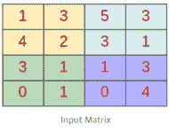****

****图 18:池层中的输入和输出矩阵。****

****上图显示了一个最大池，带有一个步幅为 2 的 2X2 过滤器。****

****最大池和平均池的描述如下:****

****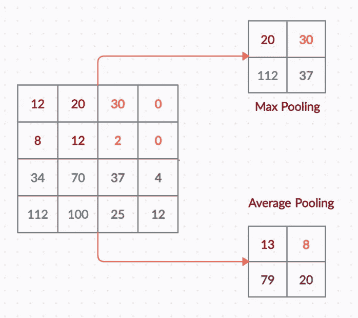****

****图 19:最大池和平均池。****

****在 Keras 中实现最大池层，如下所示:****

```
**model.add(MaxPooling2D(pool_size=(2, 2)))**
```

****这里，内核大小= 2 x 2****

****对像素进行二次采样不会改变对象，因此池化可以对像素进行二次采样以使图像变小。****

****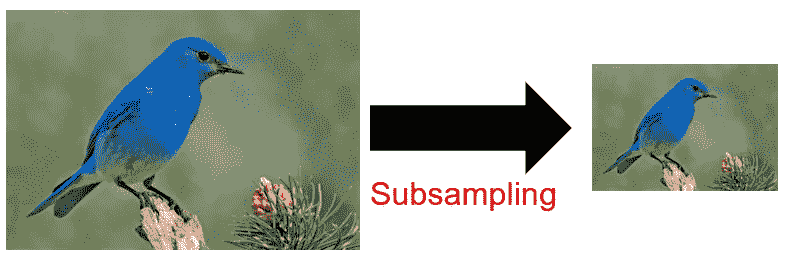****

****图 20:按池进行二次抽样。****

# ****进展****

****它是神经网络中的一个组件，主要修改视频和图像的运动。步幅是一个与填充配合使用的参数。例如，如果步幅设置为 1，我们一次移动一个像素或单位。类似地，如果步幅设置为 2，我们移动 2 个单位像素或单位。****

****本质上，步幅是卷积滤波器经过的像素数量，就像滑动窗口一样，在它刚刚覆盖的所有像素的加权平均值上移动。旧的加权平均值成为下一图层中的要素地图中的一个像素。下一个加权平均值来自一个新的像素集合，它形成了后续图层中的特征图中的下一个像素。****

****下面是一个 stride 的动画演示:****

******1**的步幅:****

****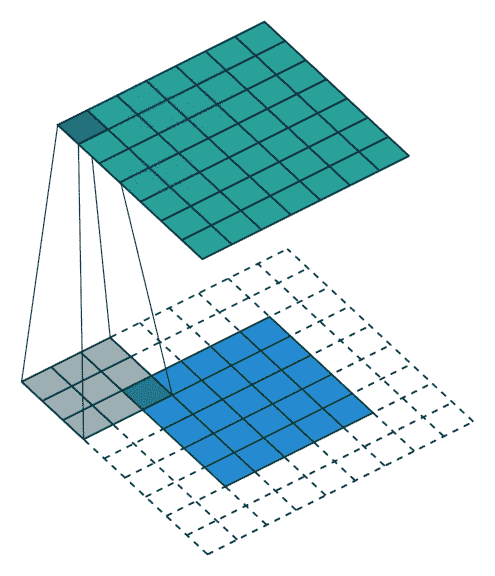****

****图 21:1 的步幅。****

******2 的步幅:******

********

****图 22:2 的步幅。****

****图 22 中的 stride 动画简单地解释了:****

> *****卷积神经网络中的 Stride 稀释了在图像上水平和垂直扫描特征时可以跳过的步骤。*****

****在 CNN 中，大步从一个网络层到另一个网络层。因此，有两种选择，要么减小数据大小，要么保持数据大小不变。因此，填充和步幅都会影响数据大小。填充在 stride 中是必不可少的，因为如果没有填充，下一层将减少数据大小。****

****当使用 stride 时，它从左上角的 filer 开始，计算第一个节点的值，当它将节点移动两个单位时，当过滤器延伸到图像之外时，它继续，创建一个空间。**因此，填充用于填充大步行走产生的空隙**。****

****让我们取一个内核为 **3X3** 的 **5X5** 的输入层如下:****

****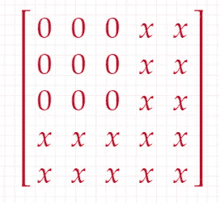****

****图 23: 5x5 输入层。****

****应用 1:****

****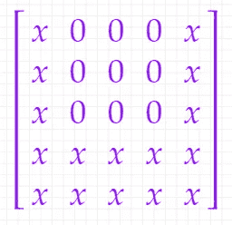****

****图 24:步幅为 1。****

****应用步幅 2:****

****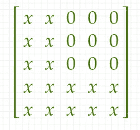****

****图 25:步幅为 2。****

****假设我们应用步幅 3，同时仍然查看 5x5 输入，会发生什么情况？****

****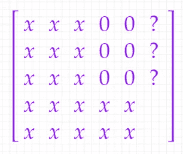****

****图 26:应用步幅 3。****

****因此，这里需要填充。对于整个输入，添加的填充数据的宽度等于内核宽度减一，或者高度等于内核高度减一(如果它在上面和下面),以便内核可以查看最边缘，如图 27 所示:****

****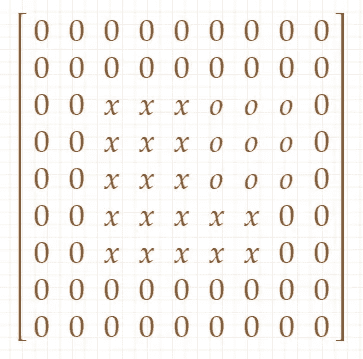****

****图 27:带衬垫的步幅。****

****因此，从上面的图示来看:****

****没有填充意味着下一层的数据大小将减少。同时，引入足够的衬垫将保持尺寸不变。此外，它以更大的步长限制了卷积运算中两个后续点积的重叠。这意味着激活中的每个输出值将更加独立于相邻值。****

# ****全连接层****

****这一层是决定最终预测的所有输入和权重的总和，代表最后一个池层的输出。顾名思义，完全连接使第一层中的每个节点都连接到第二层中的节点。基于由先前层[ [11](https://www.aidevnepal.co/nepali-handwritten-character-recognition-using-cnn/) ]提取的特征执行分类。它将一层中的每个神经元连接到另一层中的每个神经元。****

****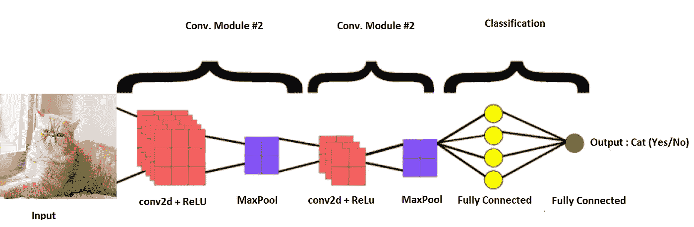****

****图 28:一个完全连接的层。****

****CNN 可以分为两类**:******

*   ******特征抽出******
*   ******分类******

******全连接层的主要职责是做分类。它与 softmax 或 sigmoid 激活单元一起用于结果。******

# ******非线性层******

******应用于最后一层的激活函数与其他层非常不同。用于 multiclass 的激活是 softmax 函数，该函数以 0 和 1 的概率(总和为 1)归一化完全连接的层。******

******通常，Softmax 仅用于输出层，用于需要将输入分类为多个类别的神经网络。通常的神经网络，尤其是 CNN，依赖于非线性“触发”函数来发出信号，明确识别每个隐藏层上的可能特征。******

******为了有效地实现这个非线性层，CNN 使用下面的函数:******

*   ******校正线性单位******
*   ******连续触发功能******

******带有非线性函数“Relu”的 Keras 代码如下:******

```
****model.add(Dense(512, activation='relu'))****
```

******这里有 512 个隐藏单元。******

******Keras 代码如下，带有非线性函数“Softmax”:******

```
****model.add(Dense(10, activation='softmax'))****
```

# ******卷积神经网络的 Python 实现******

******针对 CNN 的 Keras CNNs 层代码实现:******

******导入所有必需的库******

```
****import numpy as npimport pandas as pdfrom keras.optimizers import SGDfrom keras.datasets import cifar10from keras.models import Sequentialfrom keras.utils import np_utils as utilsfrom keras.layers import Dropout, Dense, Flattenfrom keras.layers.convolutional import Conv2D, MaxPooling2D****
```

******加载 Cifar01 数据:******

```
****(X, y), (X_test, y_test) = cifar10.load_data()****
```

******显示测试数据集******

```
****X_test****
```

******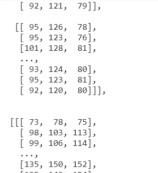******

******图 29: Cifar01。******

******标准化数据:******

```
****X, X_test = X.astype('float32')/255.0, X_test.astype('float32')/255.0****
```

******转换为分类:******

```
****y, y_test = utils.to_categorical(y, 10), u.to_categorical(y_test, 10)****
```

******初始化模型:******

```
****model = Sequential()****
```

******使用以下参数添加卷积层:******

*   ******特征图= 32******
*   ******内核大小= 3x3******
*   ******输入形状= 32x32******
*   ******通道= 3******
*   ******Padding = 3 →表示输出的维度与输入的维度相同。******

```
****model.add(Conv2D(32, (3, 3), input_shape=(32, 32, 3), padding='same', activation='relu'))****
```

******添加辍学率:******

```
****model.add(Dropout(0.2))****
```

******添加另一个 CNN 图层，填充=有效。******

******padding = valid →这意味着输出维度可以采用任何形式。******

```
****model.add(Conv2D(32, (3, 3), activation='relu', padding='valid'))****
```

******添加最大池层。******

```
****model.add(MaxPooling2D(pool_size=(2, 2)))****
```

******扁平化数据:******

******在 CNN 中，重要的是在将数据输入到输出或密集层之前将其展平。******

```
****model.add(Flatten())****
```

******添加密集层:******

```
****model.add(Dense(512, activation='relu'))****
```

******这里，隐藏单元的数量是 521。******

******添加辍学:******

```
****model.add(Dropout(0.3))****
```

******添加输出密集图层:******

```
****model.add(Dense(10, activation='softmax'))****
```

******编译模型:******

```
****model.compile(loss='categorical_crossentropy',              optimizer=SGD(momentum=0.5, decay=0.0004), metrics=['accuracy'])****
```

******用 25 个时期拟合算法:******

```
****model.fit(X, y, validation_data=(X_test, y_test), epochs=25,          batch_size=512)****
```

******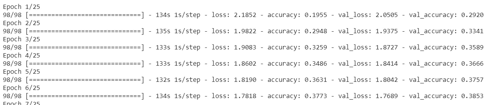******

******图 30:CNN 的训练。******

******检查准确性:******

```
****print("Accuracy: &2.f%%" %(model.evaluate(X_test, y_test)[1]*100))****
```

# ******CNN 的超参数******

******超参数对于控制学习过程非常重要。它在管理网络结构(如隐藏单元的数量)的训练之前应用。优化时应在 intelligence 中保留以下内容:******

# ******最大池形状******

******在最大池中，在矩阵中选择最大值。矩阵的大小可以是 **2x2** 或 **3x3** 。典型值为 **2x2** 。巨大的输入量可能会保证 **4x4** 在较低的层中形成池。因此，选择更大的形状将显著降低信号的维度，并可能导致过多的信息损失。******

****代码示例:****

```
**model.add(MaxPooling1D(pool_size=2))**
```

# ****过滤器形状****

****在给定的数据集中找到合适的粒度级别而不过度拟合是至关重要的。****

****代码示例:****

```
**model.add(Conv1D(filters=32, kernel_size=3, padding='same', activation='relu'))**
```

# ****过滤器数量****

****应仔细选择过滤器的数量，因为特征图的数量直接控制容量，并取决于可用示例的数量和任务复杂性[ [9](https://en.wikipedia.org/wiki/Convolutional_neural_network) ]。****

****代码示例:****

```
**model.add(Conv1D(filters=32, kernel_size=3, padding='same', activation='relu'))**
```

# ****细胞神经网络的正则化方法****

****正则化是一种包含额外信息以解决不规则问题或停止过度拟合的方法。CNN 也使用正则化来处理所有这些问题。以下是 CNN 使用的不同类型的正则化技术:****

*   ****经验主义的****
*   ****明确的****

****经验正则化的不同类别:****

*   ****拒绝传统社会的人****
*   ****下拉连接****
*   ****随机汇集****

****层中丢失的代码实现:****

```
**model.add(Dropout(0.2))**
```

****不同类别的显式正则化:****

*   ****提前停止****
*   ****重量衰减****
*   ****参数数量****
*   ****最大范数约束****

# ****提前停止****

****过拟合是机器学习和深度学习中常见的问题。有几种方法可以避免这类问题，早期停止是其中之一。它会提前停止这个过程。****

****代码片段实现:****

```
**from keras.callbacks import EarlyStoppingearlystop = EarlyStopping(monitor = 'val_loss', min_delta = 0, patience = 3, verbose = 1, restore_best_weights = True)**
```

****以上代码的解释:****

*   ******监控:**监控数值。即 val_loss****
*   ******min_delta:** 为监控值。例如，如果 min_delta = 1，则意味着如果监控值的绝对变化小于 1 [ [12](https://www.kdnuggets.com/2019/08/keras-callbacks-explained-three-minutes.html) ]，则训练过程将停止。****
*   ******耐心:**如果经过一定次数的历元仍无改善，将停止训练。****
*   ******restore_best_weights:** 如果它的值设置为 true，那么它会在停止后保持最佳权重。****

# ****结论****

****卷积神经网络是一种特殊的多层神经网络，主要用于提取特征。它们通过非常简单的处理直接从像素图像中识别视觉模式。****

****CNN 使用称为**卷积**和**汇集**的两种操作来将图像缩减为其基本特征，并使用这些特征来理解和适当地分类图像[ [6](https://kgptalkie.com/2d-cnn-in-tensorflow-2-0-on-cifar-10-object-recognition-in-images/) ]。****

****CNN 的另一个好处是，与具有相同数量隐藏单元的全连接网络相比，它们更容易训练，参数更少。****

****卷积神经网络(CNN)被用于各种领域，如医疗保健，诊断肺炎、糖尿病和乳腺癌等疾病，自动驾驶汽车，监视监控等[ [7](https://theappsolutions.com/blog/development/convolutional-neural-networks/) ]。****

******免责声明:**本文表达的观点仅代表作者个人观点，不代表卡内基梅隆大学或其他(直接或间接)与作者相关的公司的观点。这些文章并不打算成为最终产品，而是当前思想的反映，同时也是讨论和改进的催化剂。****

******除非另有说明，所有图片均来自作者。******

****通过[向 AI](https://towardsai.net/) 发布****

# ****资源****

****[Github 库](https://github.com/towardsai/tutorials/tree/master/convolutional-neural-networks-python)。****

****[Google colab 实现](https://colab.research.google.com/drive/1OLBEe0LwK9DcyzInOSDBmPp_Z5udLyqI?usp=sharing)。****

# ****参考****

****[1]图像、语音和时间序列的卷积网络，Yann Lecun，Yoshua Bengio，[https://www . research gate . net/profile/Yann _ le Cun/publication/2453996 _ Convolutional _ Networks _ for _ Images _ Speech _ and _ Time-Series/links/0 deec 519 DFA 232550200000 . pdf](https://www.researchgate.net/profile/Yann_Lecun/publication/2453996_Convolutional_Networks_for_Images_Speech_and_Time-Series/links/0deec519dfa2325502000000.pdf)****

****[2]基于中医哲学和深度学习的体质分类，李永辉，Muhammad Saqlain Aslam *，杨凯琳，高忠安，和 Shin-You Teng，[https://doi.org/10.3390/sym12050803](https://doi.org/10.3390/sym12050803)****

****[3]卷积神经网络，维基百科，[https://en.wikipedia.org/wiki/Convolutional_neural_network](https://en.wikipedia.org/wiki/Convolutional_neural_network)****

****[4]神经网络的主要类型及其应用—教程，普拉蒂克·舒克拉，罗伯特·伊里翁多，[https://toward sai . net/p/machine-learning/Main-Types-of-Neural-Networks-and-Its-Applications—教程-734480d7ec8e](https://towardsai.net/p/machine-learning/main-types-of-neural-networks-and-its-applications-tutorial-734480d7ec8e)****

****[5]分解一下:关于机器学习的问答，谷歌，【https://www.google.com/about/main/machine-learning-qa/ ****

****[6]2D CNN in tensor flow 2.0 on CIFAR-10—图像中的物体识别，KGP 有声，[https://kgptalkie . com/2d-CNN-in-tensor flow-2-0-on-CIFAR-10-Object-Recognition-in-Images/](https://kgptalkie.com/2d-cnn-in-tensorflow-2-0-on-cifar-10-object-recognition-in-images/)****

****[7]卷积神经网络的商业应用，App Solutions，[https://theapp Solutions . com/blog/development/convolutionary-Neural-Networks/](https://theappsolutions.com/blog/development/convolutional-neural-networks/)****

****[8]卷积的概念，TutorialsPoint，[https://www . TutorialsPoint . com/dip/Concept _ of _ Convolution . htm](https://www.tutorialspoint.com/dip/concept_of_convolution.htm)****

****[9]卷积神经网络，维基百科，[https://en.wikipedia.org/wiki/Convolutional_neural_network](https://en.wikipedia.org/wiki/Convolutional_neural_network)****

****[10] Keras 卷积神经网络与 Python，Sagar Jaiswal，Github，[https://Github . com/Sagar 448/Keras-convolutionary-Neural-Network-Python](https://github.com/sagar448/Keras-Convolutional-Neural-Network-Python)****

****[11]使用 CNN 的尼泊尔语手写字符识别，AI DEV Nepal，[https://www . aidev Nepal . co/Nepali-handled-Character-Recognition-using-CNN/](https://www.aidevnepal.co/nepali-handwritten-character-recognition-using-cnn/)****

****[12] Keras 回调三分钟讲解，Andre Duong，KDnuggets，[https://www . kdnugges . com/2019/08/Keras-Callbacks-Explained-Three-Minutes . html](https://www.kdnuggets.com/2019/08/keras-callbacks-explained-three-minutes.html)****

****[13]，，邢克罗，，窦，“利用深度学习对计算机断层图像上的肺结节进行分类”，*《医疗保健工程杂志》*，第 2017 卷，文章 ID 8314740，7 页，2017。https://doi.org/10.1155/2017/8314740****