# 虚拟卷积神经网络

> 原文：<https://pub.towardsai.net/convolutional-neural-networks-for-dummies-afd7166cd9e?source=collection_archive---------1----------------------->

## [深度学习](https://towardsai.net/p/category/machine-learning/deep-learning)，[计算机视觉](https://towardsai.net/p/category/computer-vision)

## 卷积神经网络完美指南

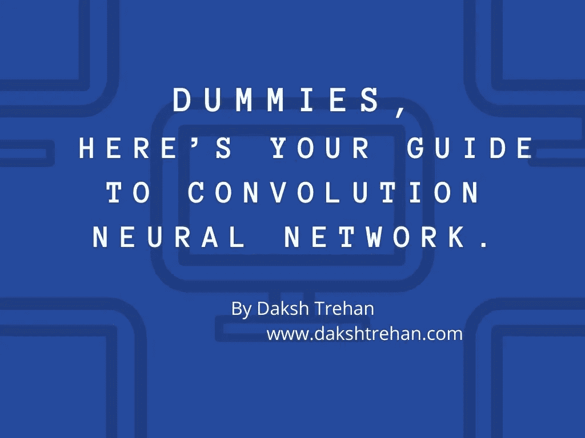

你的社交媒体手柄上会弹出一个通知，说有人上传了一张可能有你的照片。

嘣！怎么发生的？

照片由 [Patrick Fore](https://unsplash.com/@patrickian4?utm_source=medium&utm_medium=referral) 在 [Unsplash](https://unsplash.com?utm_source=medium&utm_medium=referral) 上拍摄

这就是**图像分类的神奇之处。**

**卷积神经网络(CNN)** 隶属于[**深度学习**](https://medium.com/towards-artificial-intelligence/diving-deep-into-deep-learning-f34497c18f11) **。**它们被用于涉及计算机视觉的操作中。如今，由于人工智能的范围正在极大地扩大，我们可以很容易地找到我们周围的卷积运算。这些技术发挥着重要作用，从*脸书自动标记、面部解锁、OCR 到无人驾驶汽车。*

图像分类获取输入(在这种情况下为图像),并在深度学习算法(即 CNN)的帮助下输出该输入属于特定类别的类别/概率。

# 为什么是 CNN？

根据[通用逼近定理](https://en.wikipedia.org/wiki/Universal_approximation_theorem)，[深度神经网络](https://medium.com/towards-artificial-intelligence/diving-deep-into-deep-learning-f34497c18f11)是强大的函数逼近器。并且最好，这些可以使用 [**反向传播**](https://medium.com/towards-artificial-intelligence/diving-deep-into-deep-learning-f34497c18f11) 来提高它们的精度。

但是由于使用了如此多的参数，深度神经网络通常对过拟合非常敏感，甚至会因为长链而导致**梯度消失**问题。另外，[深度神经网络](https://medium.com/towards-artificial-intelligence/diving-deep-into-deep-learning-f34497c18f11)无法处理图像中的*平移、旋转、光照*等变化。

因此，为了解决这个问题，我们开发了一种深度学习算法:**卷积神经网络**。

# 图像分类

## 人类如何观察一幅图像？

我们已经掌握了大脑快速判断物体的能力。

现在，它是如何发生的？

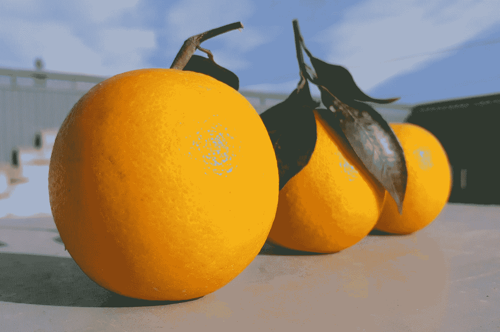

照片由 [Unsplash](https://unsplash.com?utm_source=medium&utm_medium=referral) 上的 [Saifullah Munqad](https://unsplash.com/@saifmunqad?utm_source=medium&utm_medium=referral) 拍摄

我们的大脑会将物体的某些特征联系起来。举个例子，给你一个橘子和一个橙色的球。两者是相同的，但大脑仍然可以准确地区分它们，因为我们已经训练它，球的表面可能是光滑的，但橙子的表面有点粗糙。

多年来，我们训练我们的大脑来精确区分物体。CNN 背后的想法也是如此，即训练我们的模型从图像中学习特征。

## 计算机如何观察图像？

当我们观察一幅图像时，我们会仔细观察各个方面，比如物体的边缘，物体的颜色，因为我们从小就被训练这样做。

但是，当我们将图像输入到模型中时，对它来说，它只不过是矩阵的集合。

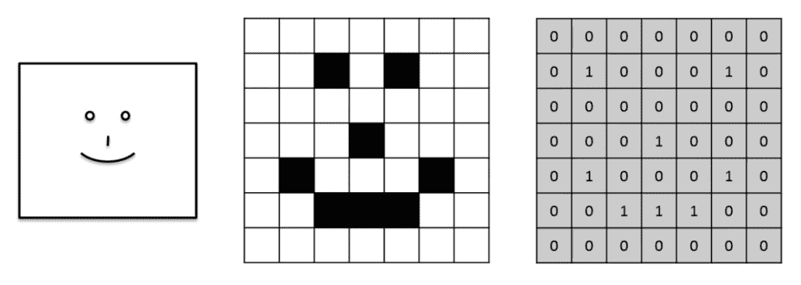

对于我们的模型，图像是像素矩阵。如果我们传递彩色图像，它将是一个三维数组，RGB 通道的范围从 0 到 255。如果我们传递黑白图像，那么我们将得到一个二进制值的 2D 数组。

因此，当我们谈论分类时，我们希望我们的模型能够准确地定义这些变化，这样，我们得到的输出就尽可能地细微。

**对于每一个特征，我们都有一个不同的矩阵来代表它的特征。**

# CNN 是如何运作的？

CNN 的基本管道如下:

*   输入图像。
*   执行卷积运算以获得激活图。
*   应用池层使我们的模型健壮。
*   [激活功能(主要是 ReLu)](https://medium.com/analytics-vidhya/activation-functions-explained-8690ea7bdec9) 用于避免非线性。
*   将最后的输出展平成一个线性向量。
*   该向量被传递给完全连接的[人工神经网络。](https://medium.com/towards-artificial-intelligence/diving-deep-into-deep-learning-f34497c18f11)
*   全连通层将为我们所追求的每个类提供一个概率。
*   重复该过程以获得定义良好的训练权重和特征检测器。

## 卷积层

卷积滤波器从图像中清除特征，即它试图从图像中学习。它计算滤镜值和图像像素值之间的点积，以形成卷积层。

每次执行反向传播时，滤波器矩阵中的值都会更新。然而，滤波器矩阵的维数由程序员明确确定。

卷积运算

应用于 3D 输入的每个滤波器将给出 2D 输出，并且通过组合所有这些 2D 输出，我们得到 3D 最终输出。

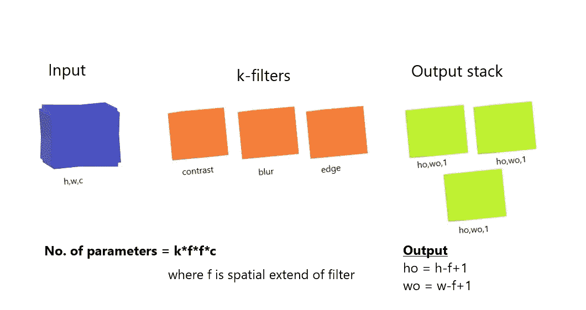

> 过滤器的数量越多，我们的模型学习的特征数量就越多。

当我们使用卷积滤波器时，输出图像的维数从(h，w，c)降低到(h-f+1，w-f+1，c ),这是显而易见的，因为我们不能将核保持在角落，因为它会跨越输入边界。

为了保留输出图像的尺寸，我们使用 ***填充，*** 在填充中，我们对每个通道添加零。

> **内核越大，需要的填充就越大。**

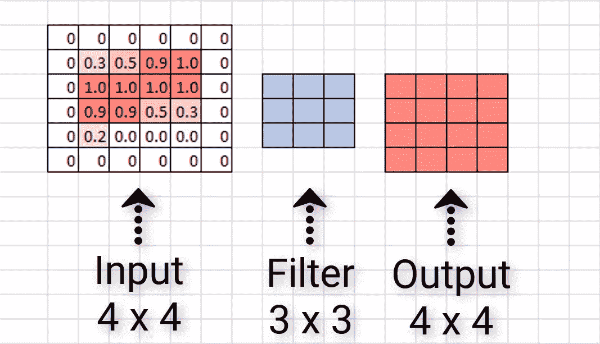

填充，[源](https://deeplizard.com/images/zero%20padding%20example%202.PNG)

除了填充，我们经常使用*。在卷积中，为了得到激活图，我们通常向下或向旁边跳过一个像素，但是如果我们希望跳过自定义数量像素，我们可以使用 stride。*

*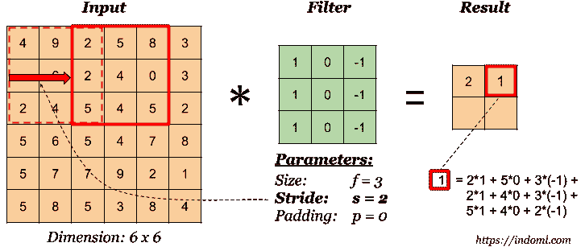*

*步幅，[来源](https://indoml.com/2018/03/07/student-notes-convolutional-neural-networks-cnn-introduction/)*

> ***步幅越大，输出维度越小。***

*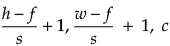*

*跨步后输出*

*如果我们同时执行步幅和填充，输出尺寸将是:-*

*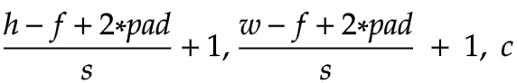*

*步幅和填充后的输出*

## *汇集层*

*为了创建我们的模型更健壮和更有特色的检测器，CNN 用 max summary 替换输出，以缩减数据大小和处理时间。这允许程序员区分具有较高影响的特性。*

*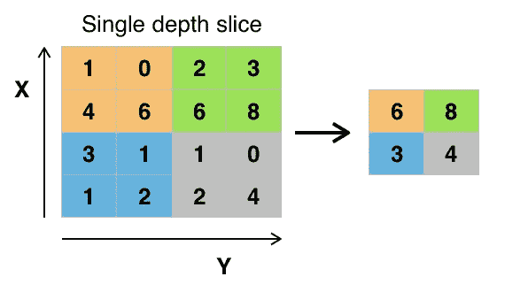*

*最大池化，[来源](https://en.wikipedia.org/wiki/File:Max_pooling.png)*

*最大池有两个**超参数**:步幅和大小。跨距将决定要跳过的值的数量，大小将决定每个跳过的值池的面积。*

## *[激活功能(ReLU 和乙状结肠)](https://medium.com/analytics-vidhya/activation-functions-explained-8690ea7bdec9)*

*在应用卷积和池化操作之后，激活函数被引入以适合值 x>0 的非线性，并且如果不满足条件，则返回 0。*

*这种方法对于解决梯度递减问题是有效的。在 [ReLU 激活功能后，非常小的重量将保持为 0。](https://medium.com/analytics-vidhya/activation-functions-explained-8690ea7bdec9)*

## *全连接层*

*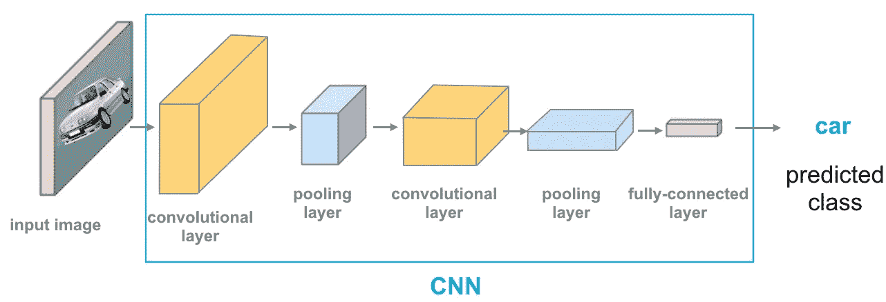*

*CNN 架构，[来源](https://cezannec.github.io/assets/cnn_intro/CNN_ex.png)*

*至此，我们准备在我们的卷积神经网络中增加一个 [**人工神经网络**](https://medium.com/towards-artificial-intelligence/diving-deep-into-deep-learning-f34497c18f11) 。*

*这是最后一层，我们将输入展平特征输出到一个列向量。最后，我们将把最终的平坦化输出提供给 softmax activation 函数，该函数将为每个类分配一个概率。前一层中的每个节点都连接到最后一层，并表示要输出哪个不同的标签。*

*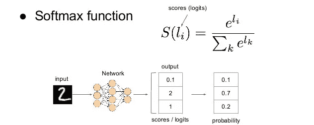*

*[最终输出，来源](https://www.google.com/url?sa=i&url=https%3A%2F%2Fwww.slideshare.net%2Fxavigiro%2Floss-functions-dlai-d4l2-2017-upc-deep-learning-for-artificial-intelligence&psig=AOvVaw0FZB6DYmtxvMPBtJZFPmfR&ust=1595314362126000&source=images&cd=vfe&ved=0CAIQjRxqFwoTCNDgv6Kf2-oCFQAAAAAdAAAAABAJ)*

# *CNN 如何执行[反向传播](https://medium.com/towards-artificial-intelligence/diving-deep-into-deep-learning-f34497c18f11)？*

*我们使用[反向传播](https://medium.com/towards-artificial-intelligence/diving-deep-into-deep-learning-f34497c18f11)来使我们的模型学习更好的权重和偏差，以帮助优化模型的性能。这是一个帮助我们的网络更好地学习的递归过程。*

*假设，您有两个输出类，一个用于猫，另一个用于狗。猫的神经元是确定的，当一些特定的特征如“胡须”、“猫虹膜”、“小而轻的身体”被识别出来时，它们就会被触发。*

*通过大量的迭代，猫神经元知道当某些特征被激活时，图像就是一只猫。*

**

*照片由 [Manja Vitolic](https://unsplash.com/@madhatterzone?utm_source=medium&utm_medium=referral) 在 [Unsplash](https://unsplash.com?utm_source=medium&utm_medium=referral) 上拍摄*

*类似地，当一些特征如“大湿鼻子”、“耷拉的耳朵”、“沉重的身体”被触发时，狗的神经元是活跃的。*

**

*Victor Grabarczyk 在 [Unsplash](https://unsplash.com?utm_source=medium&utm_medium=referral) 上拍摄的照片*

*随着我们的模型的进展，它被递归地训练，现在我们可以期望它们区分不同类的相关和重要特征，从而为那些特征提供更大的权重，以便那些特征可以对我们的输出产生显著的影响。*

# *让 CNN 变得更好*

*可悲的是，CNN 并不完美，如果没有以适当的方式监督，它经常免于过度拟合。*

*尽管如此，它的一些问题可以通过讨论解决:*

## *数据集相对较小*

***数据集小时，容易过拟合**。例如，如果你只显示黑狗是狗，那么下一次它不会识别白狗是狗，因为对于我们的模型，狗只能是黑色的(这显然是错误的和种族主义的！)*

*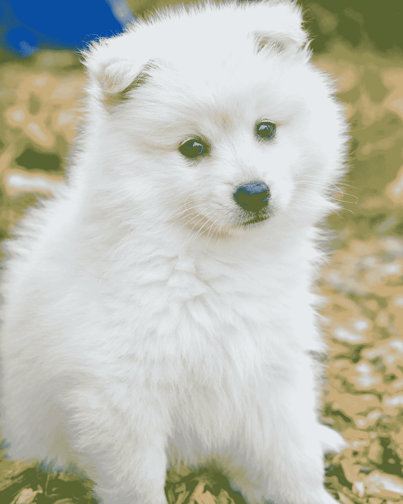*

*由[克里斯蒂娜·安妮·科斯特洛](https://unsplash.com/@lightupphotos?utm_source=medium&utm_medium=referral)在 [Unsplash](https://unsplash.com?utm_source=medium&utm_medium=referral) 上拍摄的照片*

*因此，在这种情况下，人为地增加训练样本的多样性和数量是可取的。一种方法是添加图像增强并创建新的变体。这些包括转换图像和创建尺寸变化，如*缩放、裁剪、翻转、移动、*等。*

*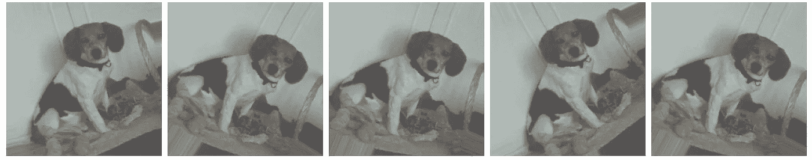*

*图像增强，[来源](https://miro.medium.com/max/2880/1*segSp7W8dCZO779m_Cs6Dg.png)*

## *过度记忆*

*我们拥有的层次越多，学到的特征就越多，这促进了记忆，抑制了概括。你训练你的模型越多，它就越有可能变得过于专业化。*

*如果我们可以通过删除一些隐藏层和每层的神经元来降低复杂性，这是可以避免的。这种技术被称为**辍学。***

*这个想法是在每个时期丢弃一些随机神经元，最终结果将是所有输出的平均值。*

**

*带压差的标准 NN v/s NN，[来源](https://www.researchgate.net/profile/Giorgio_Roffo/publication/317277576/figure/fig27/AS:500357438029828@1496305917435/4-An-illustration-of-the-dropout-mechanism-within-the-proposed-CNN-a-Shows-a.png)。*

*没有参与计算功能的神经元，它们的权重不会使用反向传播来更新。*

# *结论*

*希望这篇文章能帮助你以最好的方式理解卷积神经网络，并帮助你实际使用它。*

*请留下你的建议和反馈。就像你一样，我也在学习如何成为一名更好的数据科学家和工程师。请帮助我改进，以便我可以在后续的文章发布中更好地帮助您。*

*一如既往，非常感谢您的阅读，如果您觉得这篇文章有用，请分享！*

*请随意连接:*

> **LinkedIn ~*[【https://www.linkedin.com/in/dakshtrehan/】T21](https://www.linkedin.com/in/dakshtrehan/)*
> 
> **insta gram ~*[*https://www.instagram.com/_daksh_trehan_/*](https://www.instagram.com/_daksh_trehan_/)*
> 
> **Github ~*[https://github.com/dakshtrehan](https://github.com/dakshtrehan)*

*关注更多机器学习/深度学习博客。*

> **中等~*[*https://medium.com/@dakshtrehan*](https://medium.com/@dakshtrehan)*

# *想了解更多？*

*[利用深度学习检测新冠肺炎](https://towardsdatascience.com/detecting-covid-19-using-deep-learning-262956b6f981)*

*[无法逃脱的人工智能算法:抖音](https://towardsdatascience.com/the-inescapable-ai-algorithm-tiktok-ad4c6fd981b8)*

*[深入钻研深度学习](https://medium.com/towards-artificial-intelligence/diving-deep-into-deep-learning-f34497c18f11)*

*[使用机器学习的卡通化内部指南](https://medium.com/towards-artificial-intelligence/an-insiders-guide-to-cartoonization-using-machine-learning-ce3648adfe8)*

*你为什么要为乔治·弗洛伊德的谋杀和德里的骚乱负责？*

*[为什么选择随机森林而不是决策树](https://medium.com/towards-artificial-intelligence/why-choose-random-forest-and-not-decision-trees-a28278daa5d)*

*[聚类:是什么？什么时候用？](https://medium.com/@dakshtrehan/clustering-what-it-is-when-to-use-it-a612bbe95881)*

*[从 k 个最近邻居开始你的 ML 旅程](https://medium.com/@dakshtrehan/start-off-your-ml-journey-with-k-nearest-neighbors-f72a122f428)*

*[朴素贝叶斯解释了](https://medium.com/swlh/things-you-never-knew-about-naive-bayes-eb84b6ee039a)*

*[激活功能说明](https://medium.com/analytics-vidhya/activation-functions-explained-8690ea7bdec9)*

*[参数优化说明](https://towardsdatascience.com/parameters-optimization-explained-876561853de0)*

*[梯度下降解释](https://towardsdatascience.com/gradient-descent-explained-9b953fc0d2c)*

*[逻辑回归解释](https://towardsdatascience.com/logistic-regression-explained-ef1d816ea85a)*

*[线性回归解释](https://medium.com/towards-artificial-intelligence/linear-regression-explained-f5cc85ae2c5c)*

*[确定最适合您的 ML 模型](https://medium.com/datadriveninvestor/determining-perfect-fit-for-your-ml-model-339459eef670)*

> **干杯！**